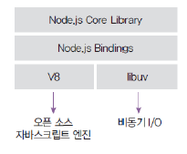
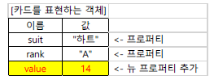

# Node.js

## 정의

- 공식홈페이지 설명
  - 크롬 V8 자바스크립트 엔진으로 빌드된 자바스크립트 런타임
  - 이벤트 기반, 논블로킹 I/O 모델을 사용해 가볍고 효율적
  - Node.js의 패키지 생태계인 npm은 세계에서 가장 큰 오픈 소스 라이브러리 생태계
- 노드는 서버의 역할도 수행할 수 있는 자바스크립트 런타임

## 런타임

- 노드 : 자바스크립트가 런타임
  - 런타임 : 특정 언어로 만든 프로그램들을 실행할 수 있게 해주는 가상 머신의 상태
    - 노드는 자바스크립트로 만든 프로그램들을 실행할 수 있게 해줌
  - 다른 런타임 : 웹브라우저
- 노드 이전에 다양한 자바스크립트 런타임을 만들기 위한 시도가 있었으나 속도 문제로 실패

## 내부 구조

- 2008년 V8 엔진 출시, 2009년 노드 프로젝트 시작

- V8과 libuv를 내부적으로 포함

  - V8 엔진 : 오픈 소스 자바스크립트 엔진 :arrow_forward: 속도 문제 개선

  - libuv : 이벤트 기반, 논블로킹 I/O 모델을 구현한 라이브러리

    

## 함수 선언문으로 함수 정의하기

- 함수는 function 키워드를 사용해 정의
- 반환값은 return 키워드 이용

~~~js
function fact(n) {
    if (n<=1) return n;
    return n*fact(n-1);
}
~~~

## 객체 생성법

### 리터럴 이용

- { ... }

  ~~~js
  var p1 = {x:1, y:1};
  ~~~

  ~~~js
  var card2 = {suit:"하트", rank:"A"};
  
  console.log(card2.suit); // 하트
  
  card2.value = 14;
  console.log(card2); // {suit:"하트", rank:"A", value: 14}
  ~~~

  

- 실행 중에 프로퍼티를 자유롭게 추가하거나, 삭제 가능

  - delete 연산자 사용

    ~~~js
    delete card2.rank;
    console.log(card2); // {suit:"하트", value:14}
    ~~~

- 프로퍼티 확인하기

  - in 연산자 사용(true / false 반환)

    ~~~js
    var card = {suit:"하트", rank:"A"};
    console.log("suit" in card); // true
    console.log("color" in card); // false
    ~~~

### new 연산자 이용

- 자바스크립트에는 클래스가 없다

  - 생성자 함수로 선언 후 new 연산자로 객체 생성

  ~~~js
  function Card(suit, rank) {
      this.suit = suit;
      this.rank = rank;
  }
  
  var card1 = new Card("하트","A");
  ~~~

## DOM을 사용해 이벤트 처리기 등록

- DOM(Document Object Model)은 자바스크립트 등의 프로그램이 
  **HTML 요소를 조작**할 수 있게 하는 인터페이스
- 전형적인 방법
  - window.onload 를 사용해 HTML **문서를 다 읽어들인** 후 2)와 3)을 실행
  - **document.getElementById() 메서드를** 사용해 
    특정 id속성 값을 가진 HTML요소의 객체를 가져온다
  - 요소 **객체의 이벤트 처리기 프로퍼티**에 이벤트 처리기로 동작할 **함수를 등록**한다

~~~js
<!DOCTYPE html>
<html>
<head>
    <meta charset="UTF-8">
    <title>시각을 콘솔에 표시하기</title>
	
</head>
<body>
	<input type = "button" value = "click" id = "button">
</body>
</html>
~~~

## innerHTML 프로퍼티로 읽고 쓰기

- 요소객체의 innerHTML 프로퍼티
  - 해당 HTML 요소의 내용을 가리킴
  - 해당 요소의 내용을 읽거나 쓸 수 있음