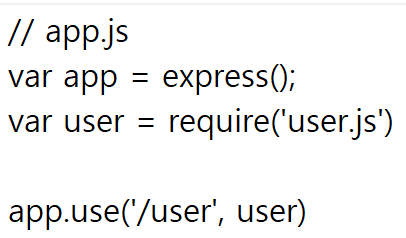
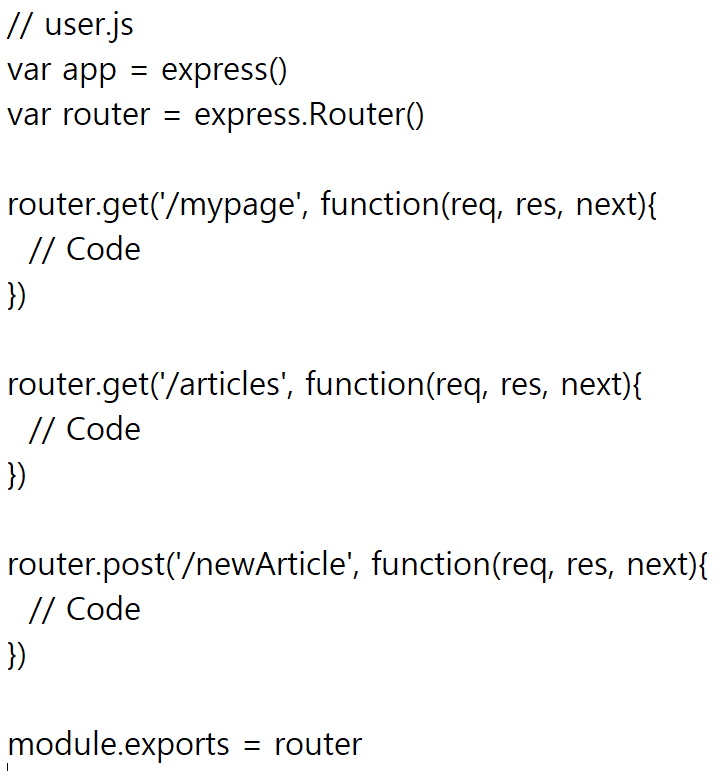

## Express 미들웨어

- 익스프레스 프레임워크의 장점 중 하나
- Middleware
  - 이름처럼 요청에 대한 응답 과정 중간에 껴서 어떠한 동작을 해주는 프로그램
  - 익스프레스는 요청이 들어올 때 그에 따른 응답을 보내주는데, 응답을 보내기 전에 미들웨어가 지정한 동작을 수행함
- 예) Morgan Compression, Session, Body-parser 등

### 유형

- Error Handling
  - 에러 처리를 담당하는 미들웨어
  - 반드시 네개의 인자를 매개변수로 받아 이 미들웨어가 에러를 담당하는 미들웨어라는 것을 식별해야함
- Third-Party
  - 기본적으로 주어지는 Built-in middleware 외에 추가로 설치하여 사용해야하는 미들웨어

#### Application-Level

- request가 발생될 때마다 실행
  - `app.use()`
  - `app.METHOD() - HTTP method`
- 사용 선언시 기본적으로 해당 미들웨어가 미들웨어 스택에 쌓임
- request가 들어올 때마다 이 스택을 통과하면서 request에 관한 처리를 하고 response

~~~javascript
// 어떤 request가 들어와도 작동
app.use(function(req, res, next) {
    console.log('Time: ', Date.now())
    next()
})

// /index를 통해 들어오는 요청에 대해서만 작동
app.use('/index', function(req, res, next) {
    /*
    	Code
    */
})
~~~

- Path 지정 가능

#### Router-Level

- 동작방식은 Applicatoin과 같음, 하지만 라우터 단위로 묶어 넣고 express.Router() 객체 사용하는 차이점
- 사용시 Path별 요청에 따른 동작 방식을 모듈화하여 관리할 수 있음

- /user/mypage의 path로 GET 요청이 들어올 시 user라는 라우터 미들웨어가 처리

  - 안의 내용을 보면 router.get('/myage')에서 처리를 해주는 것

  - path별로 처리해줄 미들웨어를 모듈화하여 관리할 수 있음

    

    

#### 미들웨어 만들기

- 요청(req), 응답(res)
- 요청-응답 주기 중 그 다음의 미들웨어 함수에 대한 액세스 권한을 가짐
- 그 다음의 미들웨어 함수는 일반적으로 next라는 이름의 변수로 표시
- 수행할 수 있는 태스크
  - 모든 코드 실행
  - 요청 및 응답 오브젝트에 대한 변경
  - 요청-응답 주기를 종료
  - 스택 내의 다음 미들웨어 호출

~~~js
app.get('/', function(req, res, next) {
    next();
})

app.listen(3000);
~~~

