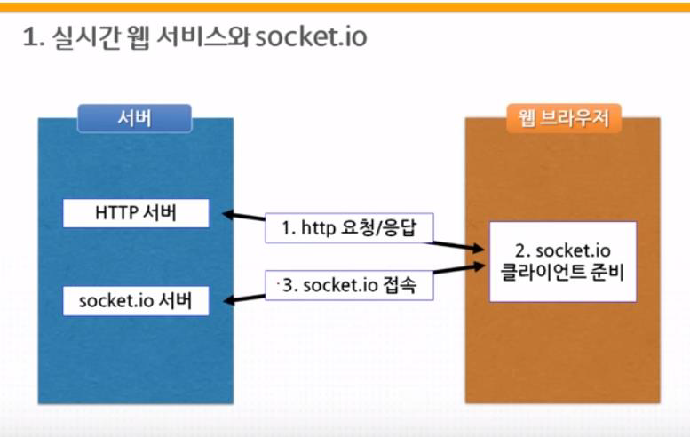

### FS

- `require`

  ~~~js
  var http = require('http');
  var fs = require('fs');
  var url = require('url');
  var qs = require('querystring');
  var template = require('./lib/template.js');
  var path = require('path');
  var sanitizeHtml = require('sanitize-html');
  ~~~

- `http.createServer`

  ~~~js
  var app = http.createServer(function(request,response){
      var _url = request.url;
      var queryData = url.parse(_url, true).query;
      var pathname = url.parse(_url, true).pathname;
      if(pathname === '/'){
        if(queryData.id === undefined){
          fs.readdir('./data', function(error, filelist){
            var title = 'Welcome';
            var description = 'Hello, Node.js';
            var list = template.list(filelist);
            var html = template.HTML(title, list,
              `<h2>${title}</h2>${description}`,
              `<a href="/create">create</a>`
            );
            response.writeHead(200);
            response.end(html);
          });
        } else {
          fs.readdir('./data', function(error, filelist){
            var filteredId = path.parse(queryData.id).base;
            fs.readFile(`data/${filteredId}`, 'utf8', 
                        				function(err, description){
              var title = queryData.id;
              var sanitizedTitle = sanitizeHtml(title);
              var sanitizedDescription = sanitizeHtml(description, {
                allowedTags:['h1']
              });
              var list = template.list(filelist);
              var html = template.HTML(sanitizedTitle, list,
                `<h2>${sanitizedTitle}</h2>${sanitizedDescription}`,
                ` <a href="/create">create</a>
                  <a href="/update?id=${sanitizedTitle}">update</a>
                  <form action="delete_process" method="post">
                    <input type="hidden" name="id" 															value="${sanitizedTitle}">
                    <input type="submit" value="delete">
                  </form>`
              );
              response.writeHead(200);
              response.end(html);
            });
          });
        }
      }
  ~~~

- `create` + `create_process`

  ~~~js
  else if(pathname === '/create'){
        fs.readdir('./data', function(error, filelist){
          var title = 'WEB - create';
          var list = template.list(filelist);
          var html = template.HTML(title, list, `
            <form action="/create_process" method="post">
              
<input type="text" name="title" placeholder="title">				

              

                <textarea name="description" 														placeholder="description"></textarea>
              

              

                <input type="submit">
              

            </form>
          `, '');
          response.writeHead(200);
          response.end(html);
        });
      } else if(pathname === '/create_process'){
        var body = '';
        request.on('data', function(data){
            body = body + data;
        });
        request.on('end', function(){
            var post = qs.parse(body);
            var title = post.title;
            var description = post.description;
            fs.writeFile(`data/${title}`, description, 'utf8', 															function(err){
              response.writeHead(302, {Location: `/?id=${title}`});
              response.end();
            })
        });
      }
  ~~~

- `update` + `update_process`

  ~~~js
  else if(pathname === '/update'){
        fs.readdir('./data', function(error, filelist){
          var filteredId = path.parse(queryData.id).base;
          fs.readFile(`data/${filteredId}`, 'utf8', function(err, description){
            var title = queryData.id;
            var list = template.list(filelist);
            var html = template.HTML(title, list,
              `
              <form action="/update_process" method="post">
                <input type="hidden" name="id" value="${title}">
                
<input type="text" name="title" placeholder="title" 
  										value="${title}">

                

                  <textarea name="description" 
  			placeholder="description">${description}</textarea>
                

                

                  <input type="submit">
                

              </form>
              `,
              `<a href="/create">create</a> <a href="/update?
  										id=${title}">update</a>`
            );
            response.writeHead(200);
            response.end(html);
          });
        });
      } else if(pathname === '/update_process'){
        var body = '';
        request.on('data', function(data){
            body = body + data;
        });
        request.on('end', function(){
            var post = qs.parse(body);
            var id = post.id;
            var title = post.title;
            var description = post.description;
            fs.rename(`data/${id}`, `data/${title}`, function(error){
              fs.writeFile(`data/${title}`, description, 'utf8', 
                           							function(err){
                response.writeHead(302, {Location: `/?id=${title}`});
                response.end();
              })
            });
        });
      }
  ~~~

- `delete_process`

  ~~~js
  else if(pathname === '/delete_process'){
        var body = '';
        request.on('data', function(data){
            body = body + data;
        });
        request.on('end', function(){
            var post = qs.parse(body);
            var id = post.id;
            var filteredId = path.parse(id).base;
            fs.unlink(`data/${filteredId}`, function(error){
              response.writeHead(302, {Location: `/`});
              response.end();
            })
        });
      } else {
        response.writeHead(404);
        response.end('Not found');
      }
  ~~~

- `template.js`

  ~~~js
  module.exports = {
    HTML:function(title, list, body, control){
      return `
      <!doctype html>
      <html>
      <head>
        <title>WEB1 - ${title}</title>
        <meta charset="utf-8">
      </head>
      <body>
        <h1><a href="/">WEB</a></h1>
        ${list}
        ${control}
        ${body}
      </body>
      </html>
      `;
    },list:function(filelist){
      var list = '<ul>';
      var i = 0;
      while(i < filelist.length){
        list = list + `<li><a href="/?id=${filelist[i]}">${filelist[i]}</a></li>`;
        i = i + 1;
      }
      list = list+'</ul>';
      return list;
    }
  }
  ~~~

### MySQL

- `require` + `createConnection`

  ~~~js
  var http = require('http');
  var fs = require('fs');
  var url = require('url');
  var qs = require('querystring');
  var template = require('./lib/template.js');
  var path = require('path');
  var sanitizeHtml = require('sanitize-html');
  var mysql = require('mysql');
  var pw = require('./pw.js');
  
  var db = mysql.createConnection({
    host : 'localhost',
    user : 'root',
    password : pw.pw,
    database : 'opentutorials'
  });
  db.connect();
  ~~~

- `http.createServer`

  ~~~js
  var app = http.createServer(function(request,response){
      var _url = request.url;
      var queryData = url.parse(_url, true).query;
      var pathname = url.parse(_url, true).pathname;
      if(pathname === '/'){
        if(queryData.id === undefined){
          var title = 'Welcome';
          var description = 'Hello, Node.js';
          db.query('SELECT * FROM topic', function(error, topics) {
            var list = template.list(topics);
            var html = template.HTML(title, list,
              `<h2>${title}</h2>${description}`, `<a href = "/create">create</a>`);
            response.writeHead(200);
            response.end(html);
          })
        } else {
          db.query(`SELECT * FROM topic`, function(error, topics) {
            if (error) {
              throw error;
            }
  
            db.query(`SELECT * FROM topic LEFT JOIN author ON (topic.author_id = author.id)
                                WHERE topic.id = ${queryData.id}`, function(error2, topic) {
              if (error2) {
                throw error2;
              }
              var title = topic[0].title;
              var description = topic[0].description;
              var list = template.list(topics);
              var html = template.HTML(title, list,
                `<h2>${title}</h2>${description}
                    by ${topic[0].name}`,
                ` <a href="/create">create</a>
                  <a href="/update?id=${queryData.id}">update</a>
                  <form action="delete_process" method="post">
                    <input type="hidden" name="id" value="${queryData.id}">
                    <input type="submit" value="delete">
                  </form>`);
              response.writeHead(200);
              response.end(html);
            })
          })
        }
      }
  ~~~

- `create` + `create_process`

  ~~~js
  else if(pathname === '/create'){
        db.query(`SELECT * FROM topic`, function(error, topics) {
          db.query(`SELECT * FROM author`, function(error2, authors) {
            if (error) {
              throw error;
            }
            var title = 'Create';
            var list = template.list(topics);
            var html = template.HTML(title, list, `
              <form action="/create_process" method="post">
                
<input type="text" name="title" placeholder="title">

                

                  <textarea name="description" placeholder="description"></textarea>
                

                

                  ${template.authorSelect(authors)}
                

                

                  <input type="submit">
                

              </form>
            `, '');
            response.writeHead(200);
            response.end(html);
          })
        })
      } else if(pathname === '/create_process'){
        var body = '';
        request.on('data', function(data){
            body = body + data;
        });
        request.on('end', function(){
            var post = qs.parse(body);
            db.query(`INSERT INTO topic (title, description, created, author_id)
                    VALUES(?,?, NOW(),?)`, [post.title, post.description, post.author],
                    function(error2, result) {
              if (error2) {
                throw error2;
              }
              response.writeHead(302, {Location:`/?id=${result.insertId}`})
              response.end()
            })
        });
      }
  ~~~

- `update` + `update_process`

  ~~~js
  else if(pathname === '/update'){
          db.query(`SELECT * FROM topic`, function(error, topics) {
            db.query(`SELECT * FROM topic WHERE id = ${queryData.id}`, function (error2, topic) {
              var list = template.list(topics);
              var html = template.HTML(topic[0].title, list,
                `
                <form action="/update_process" method="post">
                  <input type="hidden" name="id" value="${topic[0].id}">
                  
<input type="text" name="title" placeholder="title" value="${topic[0].title}">

                  

                    <textarea name="description" placeholder="description">${topic[0].description}</textarea>
                  

                  

                    <input type="submit">
                  

                </form>
                `,
                `<a href="/create">create</a> <a href="/update?id=${topic[0].id}">update</a>`
              );
              response.writeHead(200);
              response.end(html);
            })
  
          })
      } else if(pathname === '/update_process'){
        var body = '';
        request.on('data', function(data){
            body = body + data;
        });
        request.on('end', function(){
            var post = qs.parse(body);
            db.query(`UPDATE topic SET title = ?, description = ? WHERE id = ?`,
              [post.title, post.description, post.id], function(error, result) {
              if (error) {
                throw error;
              }
              response.writeHead(302, {Location: `/?id=${post.id}`});
              response.end();
            })
        });
      }
  ~~~

- `delete_process`

  ~~~js
  else if(pathname === '/delete_process'){
        var body = '';
        request.on('data', function(data){
            body = body + data;
        });
        request.on('end', function(){
            var post = qs.parse(body);
            db.query(`DELETE FROM topic WHERE id = ${post.id}`, 
                     							function(error, result) {
              if (error) {
                throw error;
              }
              response.writeHead(302, {Location: `/`});
              response.end();
            })
        });
      } else {
        response.writeHead(404);
        response.end('Not found');
      }
  });
  ~~~

- `template.js`

  ~~~js
  module.exports = {
    HTML:function(title, list, body, control){
      return `
      <!doctype html>
      <html>
      <head>
        <title>WEB1 - ${title}</title>
        <meta charset="utf-8">
      </head>
      <body>
        <h1><a href="/">WEB</a></h1>
        ${list}
        ${control}
        ${body}
      </body>
      </html>
      `;
    },
    list:function(filelist){
      var list = '<ul>';
      var i = 0;
      while(i < filelist.length){
        list = list + `<li><a href="/?id=${filelist[i].id}">${filelist[i].title}</a></li>`;
        i = i + 1;
      }
      list = list+'</ul>';
      return list;
    },
    authorSelect:function(authors) {
      var tag='';
      tag += '<select name="author">'
      for (var i=0;i<authors.length;i++) {
        tag += `<option value="${authors[i].id}">${authors[i].name}</option>`
      }
      tag += '</select>'
  
      return tag
    }
  }
  ~~~

### Express

- `main.js`

  ~~~js
  var fs = require('fs');
  var template = require('./lib/template.js');
  var express = require('express');
  var bodyParser = require('body-parser');
  var compression = require('compression');
  var topicRouter = require('./routes/topic.js');
  var indexRouter = require('./routes/index.js');
  
  const app = express()
  
  app.use(express.static('public'));
  app.use(bodyParser.urlencoded({extended: false}))
  app.use(compression());
  
  app.get('*', function(req, res, next) {
    fs.readdir('./data', function(error, filelist) {
      req.list = filelist;
      next();
    })
  })
  
  app.use('/', indexRouter)
  app.use('/topic', topicRouter)
  
  app.use(function(req, res, next) {
      res.status(404).send('Sorry cant find that!');
  });
  
  app.use(function(err, req, res, next) {
    console.error(err.stack)
    res.status(500).send('Something broke!')
  })
  
  app.listen(3000, () => console.log('Example app listening on port 3000!'))
  ~~~

- `index.js`

  ~~~js
  var express = require('express');
  var template = require('../lib/template.js');
  var fs = require('fs');
  
  var router = express.Router();
  
  router.get('/', function(req, res) {
    var title = 'Welcome';
    var description = 'Hello, Node.js';
    var list = template.list(req.list);
    var html = template.HTML(title, list,
      `<h2>${title}</h2>${description}`,
      `<a href="/topic/create">create</a>
        `
    );
  
    res.send(html);
  });
  
  module.exports = router
  ~~~

- `topic.js`

  ~~~js
  var express = require('express');
  var fs = require('fs');
  var template = require('../lib/template.js');
  var sanitizeHtml = require('sanitize-html');
  var path = require('path');
  
  var router = express.Router();
  
  router.get('/create', function(req, res) {
    var title = 'WEB - create';
    var list = template.list(req.list);
    var html = template.HTML(title, list, `
      <form action="/topic/create_process" method="post">
        
<input type="text" name="title" placeholder="title">

        

          <textarea name="description" placeholder="description"></textarea>
        

        

          <input type="submit">
        

      </form>
    `, '');
    res.send(html);
  })
  
  router.post('/create_process', function(req, res) {
    var post = req.body;
    var title = post.title;
    var description = post.description;
    fs.writeFile(`./data/${title}`, description, 'utf8', function(err){
      res.redirect(`/topic/${title}`)
    })
  })
  
  router.get('/update/:pageId', function(req, res) {
    var filteredId = path.parse(req.params.pageId).base;
    fs.readFile(`./data/${filteredId}`, 'utf8', function(err, description){
      var title = req.params.pageId;
      var list = template.list(req.list);
      var html = template.HTML(title, list,
        `
        <form action="/topic/update_process" method="post">
          <input type="hidden" name="id" value="${title}">
          
<input type="text" name="title" placeholder="title" value="${title}">

          

            <textarea name="description" placeholder="description">${description}</textarea>
          

          

            <input type="submit">
          

        </form>
        `,
        `<a href="/topic/create">create</a> <a href="/topic/update/${title}">update</a>`
      );
      res.send(html);
    });
  })
  
  router.post('/update_process', function(req, res) {
    var post = req.body;
    var id = post.id;
    var title = post.title;
    var description = post.description;
    fs.rename(`./data/${id}`, `./data/${title}`, function(error){
      fs.writeFile(`./data/${title}`, description, 'utf8', function(err){
        res.redirect(`/topic/${title}`);
      })
    });
  })
  
  router.post('/delete_process', function(req, res) {
    var post = req.body;
    var id = post.id;
    var filteredId = path.parse(id).base;
    fs.unlink(`./data/${filteredId}`, function(error){
      res.redirect('/')
    })
  })
  
  router.get('/:pageId', function(req, res, next) {
    var filteredId = path.parse(req.params.pageId).base;
    fs.readFile(`./data/${filteredId}`, 'utf8', function(err, description){
      if (err) {
        next(err);
      } else {
        var title = req.params.pageId;
        var sanitizedTitle = sanitizeHtml(title);
        var sanitizedDescription = sanitizeHtml(description, {
          allowedTags:['h1']
        });
        var list = template.list(req.list);
        var html = template.HTML(sanitizedTitle, list,
          `<h2>${sanitizedTitle}</h2>${sanitizedDescription}`,
          ` <a href="/topic/create">create</a>
            <a href="/topic/update/${sanitizedTitle}">update</a>
            <form action="/topic/delete_process" method="post">
              <input type="hidden" name="id" value="${sanitizedTitle}">
              <input type="submit" value="delete">
            </form>`
        );
        res.send(html);
  
      }
    });
  })
  
  
  module.exports = router;
  ~~~

- `tempate.js`

  ~~~js
  module.exports = {
    HTML:function(title, list, body, control){
      return `
      <!doctype html>
      <html>
      <head>
        <title>WEB1 - ${title}</title>
        <meta charset="utf-8">
      </head>
      <body>
        <h1><a href="/">WEB</a></h1>
        ${list}
        ${control}
        ${body}
      </body>
      </html>
      `;
    },list:function(filelist){
      var list = '<ul>';
      var i = 0;
      while(i < filelist.length){
        list = list + `<li><a href="/topic/${filelist[i]}">${filelist[i]}</a></li>`;
        i = i + 1;
      }
      list = list+'</ul>';
      return list;
    }
  }
  ~~~

### 학습평가

~~~js
var mysql = require('mysql')
var http = require('http')
var pw = require('./pw.js')
var url = require('url');
var path = require('path');
var qs = require('querystring');
var express = require('express');
var bodyParser = require('body-parser')

var db = mysql.createConnection({
  host : 'localhost',
  user : 'root',
  password : pw.pw,
  database : 'games'
});
db.connect();

var app = express();

app.use(bodyParser.urlencoded({ extended: false }));

app.get('/', function(req, res) {
  db.query('SELECT * from card2',function (err, cards) {
    var body = `
    <!doctype html>
      <html>
        <head>
        <title>CARD</title>
        </head>
        <body>
        <table border = "1">
          <tr>
            <th>ID</th>
            <th>SUIT</th>
            <th>RANK</th>
          </tr>
          `
    for (var i=0;i<cards.length;i++) {
      body += `<tr>
      <td>${cards[i].id}</td>
      <td>${cards[i].suit}</td>
      <td>${cards[i].rank}</td>
      </tr>`
    }

    body += '</table> <a href="/create">create</a> <a href ="/delete">delete</a></body> </html>'

    res.send(body);
  })
})

app.get('/create', function(req, res) {
  var body = `
    <!doctype html>
    <html>
    <head>
    <meta charset="utf-8">
    <title>CARD</title>
    </head>
    <body>
      <form action="create_process" method="post">
        <input type="number" name="id">
         
        <input type="text" name="suit">
         
        <input type="text" name="rank">
         
        INSERT <input type="submit">
      </form>
    </body>
    </html>
  `;

  res.send(body);
});

app.post('/create_process', function(req, res) {
  var post = req.body;
  db.query(`INSERT INTO card2 VALUES(${post.id},?,?)`, [post.suit, post.rank], function(err, result) {
    if (err) {
      throw err;
    }

    res.redirect('/');
  })
})

app.get('/delete', function(req, res) {
  var body = `
    <!doctype html>
    <html>
    <head>
    <meta charset="utf-8">
    <title>CARD</title>
    </head>
    <body>
      <form action="delete_process" method="post">
        <input type="number" name="id">
         
        DELETE <input type="submit">
      </form>
    </body>
    </html>
  `;

  res.send(body);
})

app.post('/delete_process', function(req, res) {
  var post = req.body;
  db.query(`DELETE FROM card2 WHERE id = ?`, [post.id], function(err, result) {
    if (err) {
      throw err;
    }
    res.redirect('/');
  })
})

app.listen(3000, () => console.log('Server running at port 3000'));
~~~

### TCP 실시간 통신 서비스

- HTTP 통신
  - 요청과 응답 기반
  - 다시 요청할 때까지 변경사항 반영 X
    - 실시간 서비스 작성이 힘듬

- TCP 통신

  - 네트워크 레이어 : Transport Layer
  - 스트림을 이용한 실시간 통신
  - 소켓을 이용한 네트워크 프로그래밍

  - 연결 지향, 연결 과정 필요
    1. 서버 소켓 생성, 준비, 대기
    2. 클라이언트 소켓 연결, 소켓간 연결
    3. 데이터 교환
    4. 접속 끊기

- `net`모듈

  - 소켓 통신을 위한 기본 모듈 `net`
  - `var net = require('net')`

#### Server

~~~js
var net = require('net');
var server = net.createServer(function(socket) {
  console.log('클라이언트 접속');
  socket.write('welcome to socket server');

  socket.on('data', function(chunk) {
    console.log('클라이언트가 보냄 : ',
    chunk.toString());
  });

  socket.on('end', function(chunk) {
    console.log('클라이언트 접속 종료');
  })
});

server.on('listening', function() {
  console.log('server is listening');
})

server.on('close', function() {
  console.log('server closed');
})

server.listen(3000);
~~~

#### Client

~~~js
var net = require('net');
var ip = '127.0.0.1';
var port = 3000;

var socket = new net.Socket();
socket.connect({host:ip, port:port}, function() {
  console.log('서버와 연결 성공');
  socket.write('Hello socket server');
  socket.end();

  socket.on('data', function(chunk) {
    console.log('서버가 보냄 : ',
    chunk.toString());
  })

  socket.on('end', function(chunk) {
    console.log('서버 연결 종료');
  });
});
~~~

### Socket.IO를 이용한 실시간 웹 서비스

- Socket

  - 데스크탑 애플리케이션
  - 모바일 애플리케이션
  - 다양한 웹브라우저에 호환되는 기술 자동 선택
  - `npm install socket.io`
  - 서버/클라이언트
    - HTTP 서버 / 클라이언트
    - socket.io 서버 / 클라이언트

  

- 서버 준비

  - 웹 서버 : http / express

  - socket.io 서버

    - `var Server = require('socket.io')`
    - `var io = new Server(httpServer)`

  - socket.io 클라이언트

    - HTTP 서버에게 socke.io 초기화 HTML 요청

      ~~~js
      app.get('/', function(req, res) {
          res.sendFile(__dirname + '/client.html');
      })
      ~~~

    - HTML 로딩 - 스크립트 로딩

      - 서버 모듈 로딩 or CDN
      - ``
      - ``

    - socket.io 클라이언트 초기화

      - `IO(url:String, opts:Object):Socket`

    - socket.io 서버 연결

      - `var socket = io();`

    - 이벤트

      - connect
      - error
      - disconnect
      - reconnect, reconnecting, reconnect_error
        서버와 연결 끊어지면 자동 재접속 시도

#### 실습1

- 서버

  ~~~js
  var express = require('express')
  var http = require('http')
  var app = express()
  
  var server = http.createServer(app);
  server.listen(3000);
  
  app.get('/', function(req, res) {
    res.sendFile(__dirname + '/client1.html');
  })
  
  var io = require('socket.io')(server);
  io.on('connect', function(socket) {
    console.log('클라이언트 접속');
  })
  ~~~

- 클라이언트

  ~~~js
  <html>
    <head>
        <meta charset='UTF8'>
        
        
    </head>
    <body>
        <h1>Socket.IO Sample</h1>
    </body>
  </html>
  ~~~

#### 실습2

- 데이터 교환
  - 메시지 주고받기 - 이벤트 기반
    - 메시지 이벤트 정의
  - 메시지 전송
    - 이벤트 발생 : `socket.emit()`
    - `socket.emit('EVENT', data)`
  - 메시지 수신
    - 이벤트 리스너 등록 : `socket.on()`
    - `socket.on('EVENT', function(data) {} );`
  - 이벤트로 메시지 주고받기
    - 서버에 이벤트 등록 - 클라이언트에서 이벤트 발생
    - 클라이언트에 이벤트 등록 - 서버에서 이벤트 발생
  - 서버에서의 에빈트 발생
    - 소켓 하나에 이벤트 발생
      `socket.emit('DirectEvent', [데이터])`
    - 연결된 모든 소켓에 이벤트 발생
      `socket.io.emit('BroadcastEvent', [데이터])`

- 서버

  ~~~js
  var express = require('express')
  var http = require('http')
  var app = express()
  
  var server = http.createServer(app);
  server.listen(3000);
  
  app.get('/', function(req, res) {
    res.sendFile(__dirname + '/client.html');
  })
  
  var io = require('socket.io')(server);
  io.on('connect', function(socket) {
    console.log('클라이언트 접속');
  
    socket.on('disconnect', function() {
      console.log('클라이언트 접속 종료');
    })
  
    setInterval(function() {
      socket.emit('message', '메세지');
    }, 3000);
  })
  ~~~

- 클라이언트

  ~~~js
  <html>
    <head>
        <meta charset = 'UTF8'>
        
        
    </head>
    <body>
        <h1>Socket.IO Sample</h>
          <ul>test</ul>
          
    </body>
  </html>
  ~~~