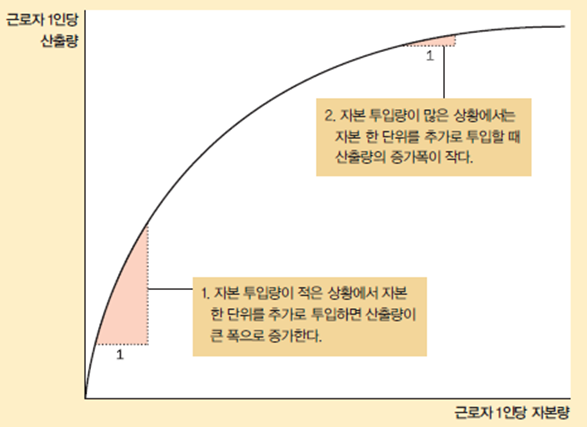

## 생산과 성장

- 경제 전체의 소득과 지출
  - 1인당 실질 GDP
    - 나라에 따라 생활수준에 큰 차이가 있음을 알 수 있다
  - 성장률
    - 1인당 실질 GDP가 매년 얼마나 빠른 속도로 증가했는지 측정
  - 국가간 성장률이 다르기 때문에
    - 시간이 흐름에 따라 소득 순위가 많이 바뀐다

### 생산성

노동 투입량 한 단위당 재화와 서비스의 산출량

- 중요한 이유
  - 생활수준을 좌우하는 변수
  - 생산성의 증가율이 생활수준의 상승률을 결정
  - 한 경제의 소득은 산출량과 같다
- 결정변수
  - 근로자 1인당 물적자본
    - 재화와 서비스의 생산에 투입되는 장비와 건축물의 스톡
  - 근로자 1인당 인적자본
    - 근로자들이 교육과 훈련, 경험을 통해 습득하는 지식과 기술
  - 근로자 1인당 자연자원
    - 토지, 강, 광물 등 자연에 의해 제공되는 생산요소
  - 기술지식
    - 재화와 서비스를 생산하는 최선의 방법에 대한 사회의 이해

#### 경제성장 촉진 정부 정책

- 저축과 투자
  - 미래의 생산성을 높이는 방법
    - 지금보다 많은 자원을 투자해서 자본재를 생산하는 것
    - 자원은 희소하기 때문에 자본재를 더 많이 생산하려면 당장 소비할 재화의 생산에 대한 자원 투입량을 줄여야 한다
- 해외투자, 교육, 연구개발 장려
- 건강과 영양 증진, 재산권 확립과 정치적 안정 도모, 자유무역 촉진, 인구성장

#### 수확체감의 법칙

- 수확체감
  - 생산요소의 투입량이 증가함에 따라 추가 투입에 따른 산출량 증가분이 감소하는 현상
- 저축률 증가의 효과
  - 장기적으로 저축률이 높으면 생산성과 소득이 높아지지만
    이 변수들의 성장률은 높아지지 않는다

- 생산함수 그래프

  

#### 따라잡기 효과

- 가난한 상태에서 출발한 나라들이 부유한 상태에 있는 나라들에 비해 성장률이 높은 경향
- 가난한 나라
  - 생산성이 낮다
  - 자본을 조금만 투자해도 근로자들의 생산성이 크게 향상
- 부유한 나라
  - 생산성이 높다
  - 자본의 추가 투자는 생산성을 크게 증가시키지 못함

#### 해외투자

- 외국자본에 의한 투자
  - 신규 자본 투자 재원을 마련하는 하나의 방법
- 외국 자본의 투자 유형
  - 외국인 직접투자
  - 외국인 포트폴리오 투자

#### 교육

- 교육은 인적자본에 대한 투자
  - 교육을 받은 근로자와 교육을 받지 못한 근로자의 임금격차 존재
  - 기회비용 : 임금
  - 긍정적 외부효과를 창출
  - 공교육 : 인적자본에 대한 대대적인 지원
- 가난한 나라의 교육의 문제 : 두뇌유출

#### 건강과 영양

- 다른 조건이 같다면 건강한 노동자들의 생산성이 높다
  - 국민 건강 증진을 위한 적절한 투자는 한 나라의 생산성과 생활수준을 높이는 길
- 건강상태와 부의 인과관계는 양방향으로 작용
  - 악순환 구조는 선순환의 가능성을 시사
  - 경제성장을 촉진하는 정책은 국민들의 건강 상태 개선에 기여, 이는 다시 경제성장을 촉진

#### 재산권과 정치적 안정

- 재산권
  - 사람들이 자신이 보유한 자원에 대한 권리를 행사할 수 있는 능력
  - 시장가격 기구가 작동하기 위한 가장 중요한 전제조건
- 정치적 불안
  - 재산권에 대한 위협
  - 내국인 : 저축, 투자, 창업의 인센티브가 없어진다
  - 외국인 : 투자할 이유가 없어진다

#### 자유무역

- 자유무역은 국민들의 경제적 후생을 향상시킬 수 있다
- 대내지향적 정책
  - 다른 나라들과 교류를 피하고 자체적으로 생산성과 생활수준을 높이는 것
- 대외지향적 정책
  - 자국 경제를 세계 경제에 통합
  - 무역은 일종의 기술 : 무역장벽을 제거함으로써 중요한 기술 진보에 따르는 경제성장 경험

#### 연구 개발

- 기술지식의 진보는 생활수준을 향상시킴
- 정부 : 새로운 기술에 대한 연구 개발을 장려
  - 지식은 상당 부분 공공재
  - 연구비 지원, 교육, 세재 감면, 특허제도

#### 인구성장

- 인구성장이 한 사회에 미치는 영향에 대해서 경제학자들과 다른 사회과학자들은 오랫동안 논쟁을 벌여왔음
- 인구성장과 다른 생산요소의 상호작용
  - 자연자원 제약의 심화
  - 1인당 자본량의 감소
  - 기술 진보의 촉진