# 알고리즘

- 어떤 값이나 값의 집합을 입력으로 받아 또 다른 값이나 값의 집합을 출력하는, 잘 정의된 계산 절차
- 잘 정의된 계산 문제를 풀기 위한 **도구**로 사용

## Correct Algorithm(타당한 알고리즘)

- 문제를 풀 수 있는 알고리즘
  - 타당한 알고리즘인지 확인하기 위해, 루프 불변성을 보여야 함(Loop invariants)
    - Initialization : 루프가 첫번째 반복을 시작하기 전에 루프 불변성이 참이어야 한다
    - Maintenance : 루프의 반복이 시작되기 전에 루프 불변성이 참이었다면 다음 반복이 시작되기 전까지도 계속 참이어야 한다
    - Termination : 루프가 종료될 때 그 루프 불변식이 알고리즘의 타당성을 보이는데 도움이 될 유용한 특성을 가져야 한다

## 알고리즘의 효율성

- 알고리즘의 효율성 : input size n에 대하여 알고리즘의 실행 시간을 분석
  - RAM(Random Access Machine) Model
    - 기본적인 산술연산, 데이터 이동 연산, 제어 연산을 수행하는 명령어들을 가지고 있으며 이 명령어들을 **한 개씩 상수 시간만큼 걸려서 수행**한다고 가정한 모델
    - 캐쉬나 가상 메모리와 같은 메모리 계층 구조가 없다고 가정

### Order of growth(증가 차수)

- 수행시간 분석을 할 때 함수를 단순화 한다

  - 최고차항만 고려하고, 상수 계수는 무시한다

    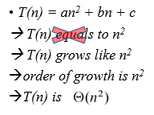

## Sorting Problem

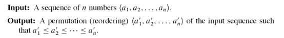

- Sequence는 주로 배열에 저장, a_i는 key이고 실제로는 각 key로 대표되는 satelite data가 있다

### Insertion Sort(삽입 정렬)

- **Incremental Approach**

- 단계

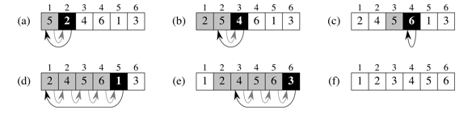

- 의사코드

  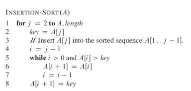

- Loop Invariants

  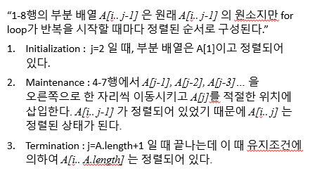

- 분석

  - 알고리즘의 수행시간 = 수행된 기본연산의 갯수를 입력크기 n에 대한 함수로 나타냄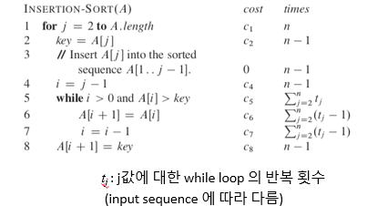

- 수행시간

  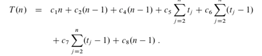

- Best Case

  - 배열이 이미 정렬되어 있는 경우

    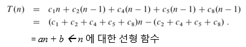

- Worst Case

  - 배열이 역순으로 정렬되어 있는 경우

    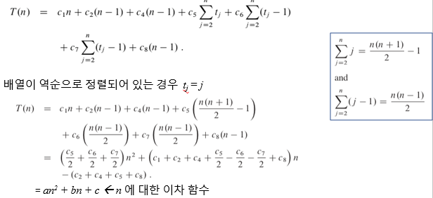

- **In-place Sorting** / Out-of-place Sorting
  - 다른 배열을 만들 필요가 없음

### Merge Sort

- **Divide And Conquer Approach**

  - Divide : 정렬할 n개 원소의 배열을 n/2개씩 부분 수열 2개로 분할
  - Conquer : 병합 정렬을 이요해 두 부분 배열을 재귀적으로 정렬
  - Combine : 정렬된 두 개의 부분 배열을 병합해 정렬된 배열 하나로 만든다

- 단계

  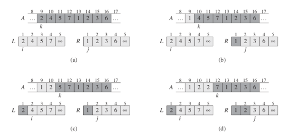

  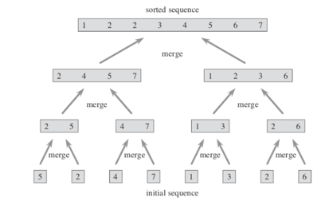

- 의사코드

  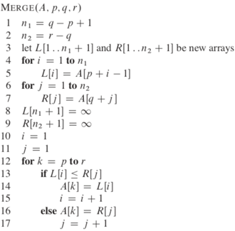

  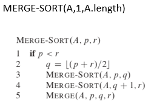

- In-place Sorting / **Out-of-place Sorting**

  - 다른 배열을 만들어서 값을 옮겨야 함

- 분석

  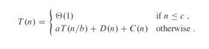

  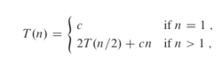

  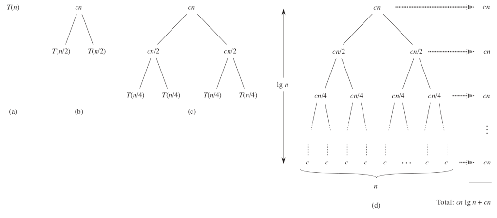

- 시간복잡도

  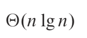