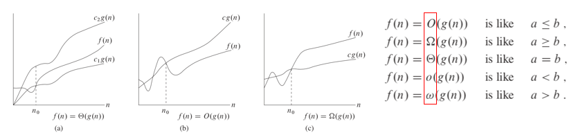
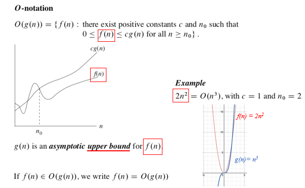
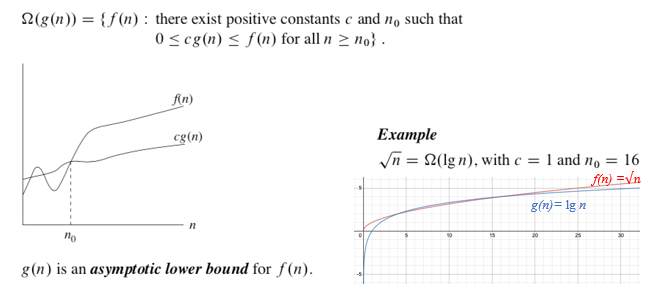
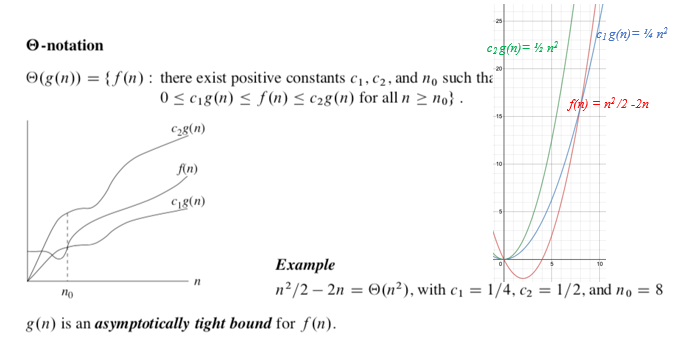
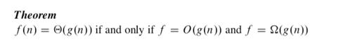
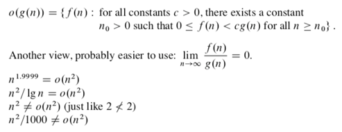
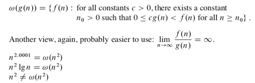
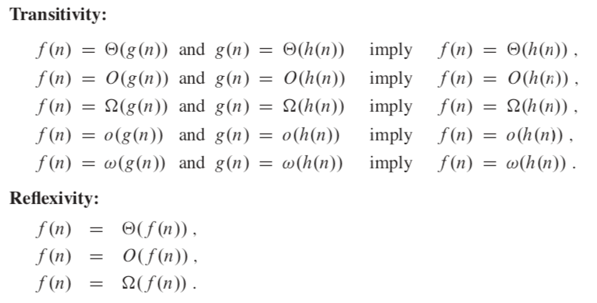
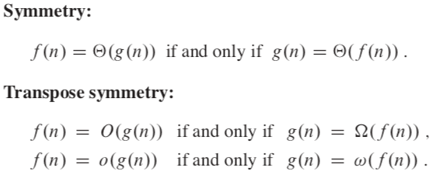
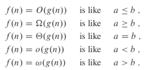

# 점근적 표기(Asymptotic Notation)

- To describe growth of functions and to compare functions

- 함수들의 독립변수가 아주 커졌을 때, 함수값의 크기를 비교하는데 사용

## O-Notation

## Ω-Notation

## Θ-Notation

## o-Notation(Little O)

## ω-Notation(Little Omega)

## Comparing Functions

- 실수와는 다르게, 모든 Function이 점근적으로 비교가능한건 아니다

# Standard Notations and Common Functions

- Floor Function(내림), Ceiling Function(올림)

  

- modulo 연산

  

- d차 다항식

  

  - 최고차항만 보면 된다

- a>1인 모든 실수 a와 b에 대하여

  

  - 다항식으로 나오는게 더 빨리 수행됨

- 모든 실수 x에 대하여

  

- 　

  

  - e^x를 approximate 할 때 활용

- 모든 x에 대하여

  

## Logarithms

## Factorials

## The iterated logarithm function

## Fibonacci numbers

- 지수적으로 증가함

  