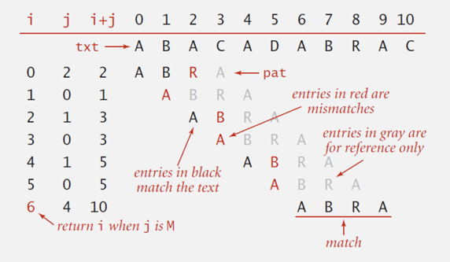

## String Matching

- Substring search

  - Find a pattern of length M in a text of length N
    (typically N >> M)

    

### Brute-Force Substring Search

#### Naive algorithm

- Check for pattern starting at each text position

  

  

  

  - can be slow if text and pattern are repetitive

- Improvement

  - develop a linear time algorithm
  - avoid **backup**
    - naive algorithm needs backup for every mismatch
    - thus naive algorithm cannot be used when input text is a stream

  

### Knuth-Morris-Pratt(KMP) Algorithm

- Clever method to always avoid **backup** problem

  

### Deterministic Finite Automaton

- DFA

  - Finite number of states (including **start** and **accept states**)
  - Exactly one transition for each char
  - Accept if sequence of transitions leads to accept state

  

  

  

  

- Difference from naive algorithm

  - precomputation of DFA[][] from pattern
  - text pointer `i` never decrements (**no backup**)

  

- The state of DFA represents

  - the number of characters in pattern that have been matched

    
  
- Prefix / Sufix of a Text

  

  

#### DFA Construction

- Suppose that all transitions from state `0` to stat `j-1` are already computed

- Match transition

  - If in state `j` and next char `char c = pattern[j]`, then transit to state `j+1`

    

- Mismatch transition

  - If in state `j` and next`char c != pattern[j]`, then which state to transit

    

  

  - then the last `j-1` characters of input text are 
    `pattern[1] ~ pattern[j-1]`, followed by `c`
  - to compute `DFA[c][j]`:
    - simulate `pattern[1] ~ pattern[j-1]` on DFA (still under construction) and let the current state `X`
    
    - Then `DFA[c][j] = DFA[c][X]`
    
      
    
    - take a transition `c` from state `X`
    
    - Running time : require `j` steps
    
    - **But, if we maintain state X, it takes only constant time!**

- Maintaining state `X`:

  - finished computing transitions from state `j`

  - Now, move to next state `j+1`

  - then what the new state(`X'`) of `X` be?

    

- A Linear Time Algorithm

  - for each state `j`

    - Match case : set `DFA[pattern[j]][j] = j+1`
    - Mismatch case : copy `DFA[][X]` to `DFA[][j]`
    - Update `X`

    

- Example

  

  
  
  

#### Algorithm with DFA

- String matching algorithm with DFA accesses no more than M+N chars to search for a pattern of length M in a text of length N

- `DFA[][]` can be constructed in time and space of order `O(RM)`, where `R` is the number of characters used in a text
- Questions : Text에 나타나는 모든 pattern을 찾을 수 있는가?

  - Text : AAAAAAAAA
  - Pattern : AAAAA
  - Solution : 0, 1, 2, 3, 4, 5
