# Multi-threaded Algorithms

- Multiprocessors
  - Shared memory multiprocessor model
    - 공통의 메모리를 통해 데이터를 주고 받으면 된다
  - Distributed memory multiprocessor model
- Thread : Serial process
  - Static threading
    - 컴파일 할 때 스레드가 선언됨
  - **Dynamic threading**
    - 런타임에 스레드가 선언됨
- Dynamic multi-threaded programming
  - Parallel loops
  - Nested parallelism
    - Spawn 한 Thread가 또 Spawn할 수 있는 것

## Basics of Dynamic Multi-Threading

### Computing Fibonacci numbers

- 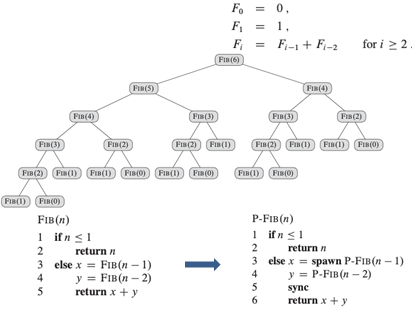
  - spawn : 런타임에 새로운 스레드를 만드는 것
  - sync : 기다리는 것

- Computation DAG(Directed Assigned Graph)

  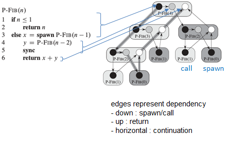

- Performance

  - work : 하나의 프로세서를 이용해 계산할 때 걸리는 시간 
    															= 각 vertex에 걸린 시간의 합 17

  - span : DAG의 임의의 경로를 따라 vertex를 실행할 때 걸리는 가장 긴 시간 
    																= critical path의 vertex 갯수 8

  - $T_p$ : p 개의  프로세서에 의한 multi-threaded 수행 시간

  - $T_1$ : sequential execution time 17

  - $T_\infin$ : processor가 충분히 많을 때 수행 시간 8

  - work law : $T_p \ge T_1 / P$

  - span law : $T_p \ge T_\infin$

    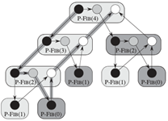

- Speedup
  - work law : $T_p \ge T_1 / P$

  - span law : $T_p \ge T_\infin$

  - speedup  = $T_1/T_p \le P$

  - perfect speedup = $T_1 / T_p = P$

  - parallelism of the multi-threaded computation = $T_1/T_\infin$

    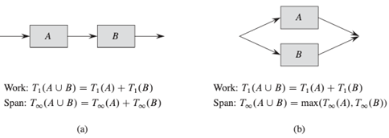

- Parallel for loop

  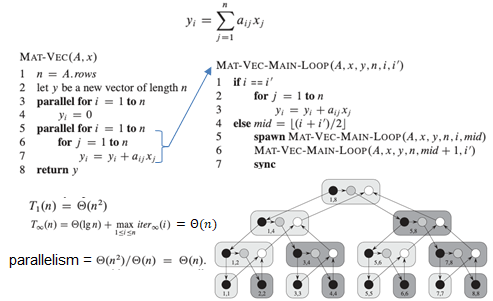

- Race conditions

  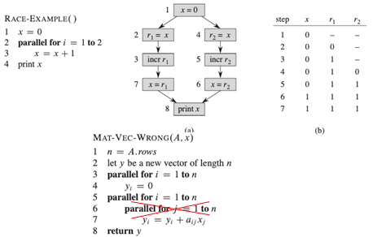

## Multi-threaded Matrix Multiplication

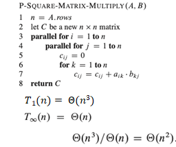

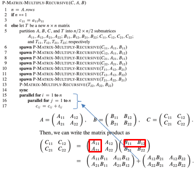

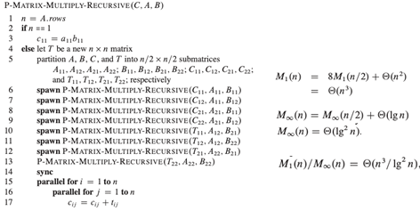

## Multi-threaded Merge Sort

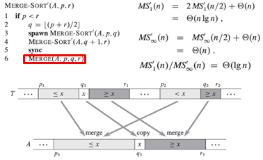

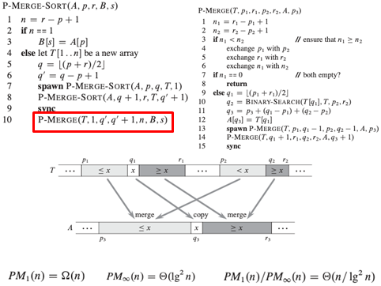