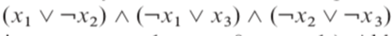
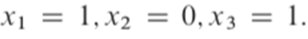
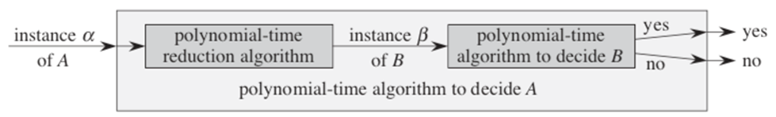
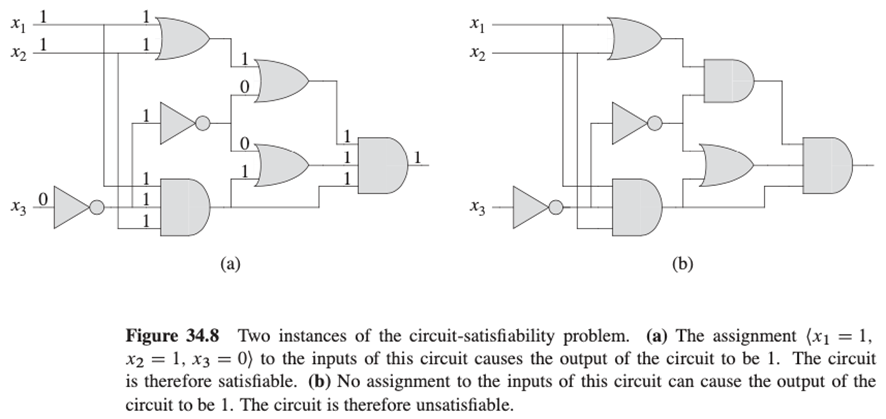
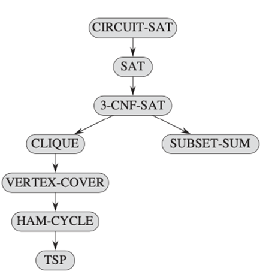
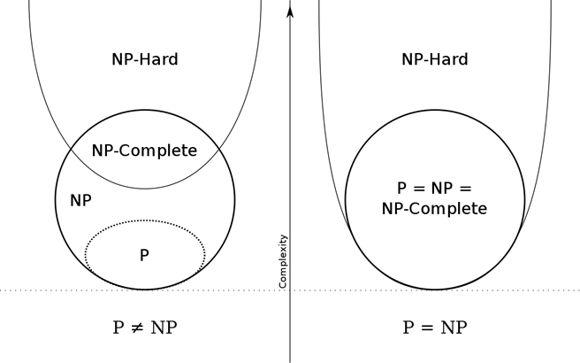
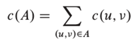
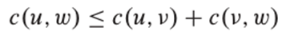
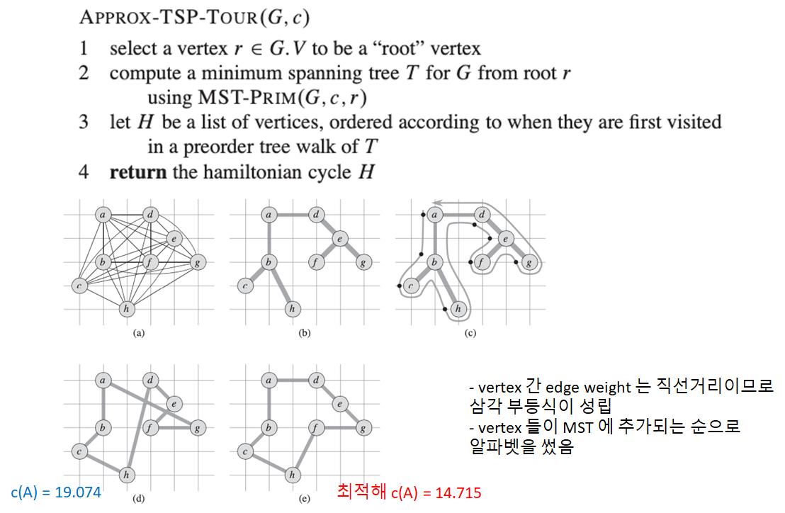

# NP-Completeness

- Class P (Polynomial time class)
  - input size $n$에 대해서 $O(n^k)$에 풀 수 있는 문제들
- class NP (Nondeterministic Polynomial time class)
  - $O(n^k)$에 verifiable 한 문제들
    **"verifiable" : 해의 후보가 주어지면 그것이 해인지를 확인할 수 있음**
    = non-deterministic Turing machine으로 polynomial time에 풀 수 있는 decision problems
- class NPC : NP 중에서 P인지 P가 아닌지 현재까지 알 수 없는 문제들

#### Tractability

- Polynomial Algorithm으로 **풀 수 있는** 문제 : Tractable
- Polynomial Algorithm으로 **풀 수 없는** 문제 : Intractable
- NPC의 문제들은 NP 중에서 가장 어려운 문제들 (Intractable할 것으로 추정되나 실제로 증명 X)

#### Shortest vs. Longest simple paths in a graph with negative edge weights

- Shortest path from a single source = $O(VE)$
- 주어진 수 이상의 edge를 갖는 단순 경로가 그래프에 존재하는지를 판별하는 문제 : NP-complete

#### Euler tour vs Hamiltonian cycle

- Euler tour : a connected, directed graph에서 vertex를 한 번 이상 방문해도 되지만 모든 edge를 정확히 한 번씩 방문하는 cycle을 찾기 = $O(E)$
- Hamiltonian cycle : 모든 vertex를 포함하는 simple cycle이 존재하는지를 판별하는 문제
  = NP-Complete

#### 2-CNF Satisfiability vs. 3-CNF Satisfiability

- CNF(Conjunctive Normal Form) : ANDs of ORs
  ex) 
- k-CNF : CNF의 각 clause 들이 정확히 $k$개의 변수 혹은 그 부정을 갖는 형태
  ex) 
- Satisfiability : 논리식의 값이 1이 되게 하는 변수들의 진리값 조합의 존재 여부
  ex) 
- 2-CNF satisfiability = P Class
- 3-CNF satisfiability = NP-Complete

### How to show a problem is NP-Complete

- Using a polynomial time reduction algorithm

  

- problem B가 P면 problem A도 P다
  :arrow_forward: problem A가 NP-complete 이면 problem B도 NP-complete이다 (Proof by contradiction)

- **Problem A = boolean satisfiability problem(proven to be NP-complete)에 대하여 B로의 polynomial reduction algorithm이 있음을 보이면 B가 NPC에 속함을 증명한 것이다**

#### The problem A : the first NP-complete problem

- Circuit satisfiability problem
  : **Given a boolean combinational circuit composed of AND, OR, and NOT gates, **
  **is it satisfiable?**

### Some NPC Problems

### P-NP? We don't know yet(Millennium prize problems)

- 임의의 NP-complete 문제가 polynomial time에 풀린다면 
  모든 NP-complete 문제가 polynomial time에 풀린다

  

#### NP-hard

- a problem $H$ is NP-hard when every problem $L$ in NP can be reduced in polynomial time to $H$
- $H$ is "at least as hard as the hardest problems in NP"

## Approximation Algorithm : TSP

- TSP(Traveling Salesman Problem)
  : Finding a Hamiltonian cycle of minimum weight

  

  - 삼각 부등식이 성립하면 approximation algorithm

    

  - 삼각 부등식이 성립하지 않으면 P=NP 이어야만 좋은 approximation algorithm이다

