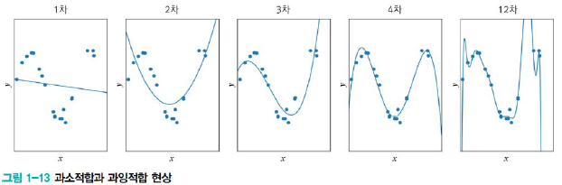
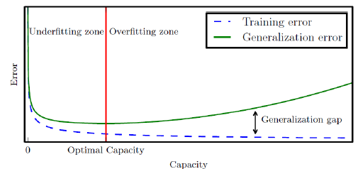

# 기계학습이란

## 정의

- 학습
  - 경험의 결과로 나타나는, 비교적 지속적인 행동의 변화나 그 잠재력의 변화 또는 지식을 습득하는 과정
- 기계학습
  - 사무엘(인공지능 초창기), 컴퓨터가 **경험을 통해 학습**할 수 있도록 프로그래밍할 수 있다면, 세세하게 프로그래밍해야하는 번거로움에서 벗어날 수 있다

### 현대적 정의

- 어떤 컴퓨터그램이 T라는 작업을 수행할 때, 
  경험을 통해 성능이 개선된다면 이 프로그램은 학습을 한다고 말할 수 있음
  - **최적의 알고리즘**을 찾는 행위
    - 경험 **E**를 통해, 주어진 작업 **T**에 대한 성능 **P**의 향상
- 사례 데이터, 즉 과거 경험을 이용하여 성능 기준을 최적화하도록 프로그래밍 하는 작업
- 성능을 개선하거나 정확하게 **예측**하기 위해 경험을 이용하는 계산학 방법들

### 기계학습 VS 전통적인 프로그래밍

## 지식기반 :arrow_forward: 기계학습 대전환

- 인공지능의 탄생
  - 컴퓨터의 뛰어난 능력
    - 사람이 어려워하는 일을 아주 쉽게 수행한다
  - 컴퓨터에 대한 기대감
    - 사람이 쉽게하는 일도 컴퓨터가 할 수 있지 않을까?
    - **1950년대에 '인공지능' 개념 첫 등장**
- 초창기 : 지식기반 방식
  - **경험적인 지식** 혹은 **사실**을 인위적으로 컴퓨터에 부여하여 학습
- 큰 깨달음
  - **지식기반의 한계**
  - 사람은 변화가 심한 장면을 아주 쉽게 인식하지만, **왜 그렇게 인식**하는지 서술하지는 못함
- 주도권 전환
  - 지식 기반 :arrow_forward: 기계학습
  - 데이터 중심 접근방식

## 개념

- 교사학습의 예

  - 가로축은 **시간**, 세로축은 **이동체**의 위치
  - 관측한 4개의 점이 데이터

- 예측 문제

  - 임의의 시간이 주어질 때, **이동체의 위치**는?
  - 회귀문제와 분류문제
    - 회귀 : 목표치가 **실수**
    - 분류 : 목표치가 **부류 혹은 종류의 값**

- 훈련집합

  - 가로축은 특징, 세로축은 목표치 
  - 관측한 4개의 점이 **훈련집합**

  

- 관찰된 데이터를 어떻게 설명할 것인가?

  - 눈대중으로 봤을 때 점들이 직선을 이룬다 :arrow_forward: 모델로 **직선을 선택을 가정**
  - 직선 모델의 수식
    - **y = wx + b (매개변수 w, b)**

- 기계학습은

  - 가장 정확하게 예측할 수 있는 **최적의 매개변수**를 찾는 작업
  - 처음에는 최적값을 모르니 **임의의 값**에서 시작, 점점 성능을 개선해 **최적에 도달**

  

  - f1 :arrow_forward: f2 :arrow_forward: f3 (**성능개선**)
    - w = 0.5, b = 2

- 학습을 마치면

  - 새로운 **특징(x값)**에 대응되는 **목표치(y값)**의 **예측에 사용**
  - y = 0.5x + 2 :arrow_forward: x가 10일때 y가 7이라고 **예측**

- 궁극적인 목표

  - 훈련집합에 없는 **새로운 샘플**에 대한 **오류 최소화**
    - 새로움 샘플 집합 = 테스트 집합(**Test Set**)
  - **일반화 능력** : 테스트 집합에 대한 높은 성능

- 필수요소

  - 내, 외부적 **규칙 존재**
  - **수학적으로 설명 불가능**
  - **데이터**가 있어야 함

## 사람 VS 기계 학습

## 특징공간에 대한 이해

### 1차원과 2차원 특징공간

- 1차원 특징공간

  

- 2차원 특징공간

  

  - 특징 **벡터 표기**

    

  - 예시

    - x = (몸무게,키)^T, y = 장타율

### 다차원 특징공간

- x값(특징)의 종류가 **몇개인지에 따라 d차원**
  
- 모든 데이터는 **특징공간 안에 존재**한다
  
- d-차원 데이터

  - 특징 벡터 표기

    

  - 학습모델

    - 직선 모델인 경우 : 매개변수 수 = **d+1**

      

    - 2차 곡선 모델인 경우 : 매개변수 수 = **d^2 + d + 1**

      

      - **최적화를 잘 해야 함**

### 특징공간 변환과 표현문제

- 선형 분리 불가능한 원래 특징 공간

  - 직선모델 적용시 **정확도 75프로 한계**

    

    - XOR 문제
    - **좌표계를 변형시켜** 선형에 가깝게 만든다

- 표현문제의 예

  

- 식으로 변환된 새로운 특징 공간

  - **공간변환**을 통해 직선 모델로 **100% 정확도**

    

- 표현학습

  - 좋은 **특징 공간을 자동으로 찾는 작업**

  - 딥 러닝 (Deep Learning)

    - 다수의 은닉층을 가진 **신경망을 이용하여 최적의 계층적인 특징 공간을 찾아냄**
    - 아래쪽 은닉층은 **저급 특징**(선, 구석점 등), 위쪽은 **고급 특징**(얼굴, 바퀴 등) 추출

    

- 차원에 대한 몇가지 설명
  - 거리 : **차원에 무관하게 수식 적용 가능**
  - 보통 2~3차원의 **저차원에서 식을 고안해 고차원으로 확장 적용**
- **차원의 저주**(Curse of dimensionality)
  - 차원이 높아짐에 따라 발생하는 현실적인 문제들
    - 차원이 크면 클수록 **데이터가 더 많이 필요**하다

## 데이터에 대한 이해

- 과학 기술의 정립 과정

  

- 기계 학습

  - 기계 학습이 푸는 문제는 훨씬 복잡함
  - 단순한 수학 공식으로 표현 불가능
  - 데이터로부터 자동으로 학습 모델을 찾아내는 과정이 필수적
    - **데이터 수집 및 전처리가 중요**

### 데이터 생성 과정

- 데이터 생성 과정을 완전히 아는 인위적 상황의 예제 (가상)

  

- 실제 기계 학습 문제 (현실)

  - 데이터 생성 과정을 알 수 없음
  - 주어진 훈련집함 X, Y로 예측 모델 또는 생성 모델을 **근사 추정**만 가능

### 데이터의 중요성

- 데이터의 양과 질

  - 주어진 응용에 맞는 충분히 다양한 데이터를 충분한 양만큼 수집

    - 추정 정확도 높아짐
    - 환경 파악과 그에 맞는 데이터 확보는 아주 중요

  - 데이터의 양과 학습 모델의 성능 경향성

    

- 공개 데이터
  - 기계 학습의 초파리로 여겨지는 3가지 데이터베이스
    - Iris : 1936년 통계학자 피셔 교수가 3종의 붓꽃을 50종씩 채취하여 만든 데이터
    - MNIST : NIST에서 수집한 필기 숫자 데이터베이스
    - ImageNet : WordNet의 단어 계층 분류를 그대로 따라 부류마다 수백수천개의 영상 수집
  - 위키피디아 'list of datasets for machine learning research' 검색
  - UCI Repository

### 데이터베이스 크기와 기계 학습 성능

- 데이터베이스의 왜소한 크기 : 차원의 저주와 관련

  - MNIST는 고작 6만개의 샘플을 가짐

- 왜소한 양의 데이터베이스로 높은 성능을 달성하는 법

  - 방대한 공간에서 실제 데이터가 발생하는 곳은 매우 작은 부분 공간

  - **데이터 희소 특성** 가정

    - 희소한 샘플의 발생 확률은 0에 가깝다

  - 매니폴드 가정(Manifold Hypothesis)

    - 대부분의 실제 고차원 데이터집합이 더 낮은 저차원 매니폴드에 가깝게 놓여 있음

      

    - 일정한 규칙에 따라 매끄럽게 변화

### 데이터 가시화

- 4차원 이상의 초공간은 한꺼번에 가시화 불가능

- 여러가지 가시화 기법 존재

  - 2개씩 조합하여 여러 개의 그래프 그림

    

  - 고차원 공간을 저차원으로 변환

## 간단한 기계 학습의 예

- 선형 회귀(Linear Regression) 문제

  

  - 직선 모델, 두개의 매개변수
  - y = wx + b

- 목적 함수(Objective Function) 또는 비용 함수(Cost Function)

  

  - 예제

    

    

  - 선형 회귀 문제와 매개변수 최적화 관계의 예

    

- 기계학습이 할 일을 공식화하면

  

  - 작은 개선을 반복하여 최적의 해를 찾아가는 수치적 방법으로 식 (1.9)를 품

  - 알고리즘 형식

    

- 좀 더 현실적인 상황

  - 실제 세계는 선형이 아니며 잡음이 섞임 :arrow_forward: 비선형 모델이 필요함

    

- 기계학습 요소

  - 카드 승인 예제

    

    - 요소

      

- 기계학습 설정

  - 교사학습

    

## 모델 선택

### 과소적합과 과잉적합

- 1차 모델은 과소적합
  - 모델의 용량이 작아 오차가 클 수 밖에 없는 현상
- 2,3,4,12차 모델은 비선형 모델을 사용
  - 다항식 곡선을 선택
  - 1차에 비해 오차가 크게 감소

- 과잉 적합

  - 12차 다항식 곡선을 채택하면 **훈련집합에 대해 거의 완벽하게 근사화**
  - 하지만 **새로운 데이터를 예측**할 때 큰 문제 발생
    - 모델의 용량이 크기 때문, 학습 과정에서 잡음까지 수용 :arrow_forward: 과잉적합 현상
    - 훈련집합에 과몰입해서 단순 암기했기 때문
  - 적절한 용량의 모델을 선택하는 모델 선택 작업이 필요

- 비교 관찰

  - 1~2차 : 훈련집합 / 테스트집합 모두 낮은 성능 :arrow_forward: 과소적합
  - 12차 : 훈련집합에 높은 성능, 테스트집합에 낮은 성능 :arrow_forward: 과잉적합(낮은 일반화 능력)
  - 3~4차 : 훈련집합 / 테스트집합 모두 높은 성능 :arrow_forward: 적합 모델(높은 일반화 능력)

- 모델의 일반화 능력과 용량 관계

  

- 세가지 모델 적합도 예

  

### 바이어스와 분산

- 훈련집합을 여러 번 수집하여 1차~12차에 적용하는 실험

  - 2차는 매번 큰 오차(바이어스가 크다), 하지만 비슷한 모델을 얻음(분산이 낮다)
  - 12차는 매번 작은 오차(바이어스가 작다), 하지만 크게 다른 모델을 얻음(분산이 높다)
  - 일반적으로 **용량이 작은 모델**은 바이어스가 **크고**, 분산이 **작음**
  - 일반적으로 **용량이 큰 모델**은 바이어스가 **작고**, 분산은 **큼**
  - 바이어스와 분산은 **트레이드오프 관계**

- 기계학습의 목표

  - 낮은 바이어스와 낮은 분산을 가진 예측 모델을 만드는 것이 목표

    

    - 하지만 바이어스와 분산은 트레이드오프 관계
    - 바이어스 희생을 최소로 유지하며 분산을 최대로 낮추는 전략 필요

- 바이어스와 분산의 관계

  - 용량 증가 :arrow_forward: 바이어스 감소, 분산 증가 경향

  - 일반화 오차 성능은 U형의 곡선을 가짐

    

### 검증집합과 교차검증을 이용한 모델 선택 알고리즘

- 검증집합을 이용한 모델 선택

  - 훈련집합과 테스트집합과 다른 별도의 **검증집합(Validation Set)**을 가진 상황

    

- 교차검증(Cross Validation)

  - 비용 문제로 별도의 **검증집합이 없는 상황**에 유용한 모델 선택 기법

  - 훈련집합을 등분하여, 학습과 평가 과정을 여러 번 반복한 후 평균 사용

    

  - 10겹 교차검증

    

- 부트스트랩(bootstrap)

  - 임의의 복원 추출 샘플링(Sampling with replacement) 반복

    - 데이터 분포가 불균형일 때 적용

    

### 모델 선택의 한계와 현실적인 해결책

- 알고리즘 1-2, 1-3, 1-4에서 모델 집합 Ω
  - 서로 다른 차수의 다항식이 Ω인 셈
  - 현실에서는 학습 모델들이 아주 다양함
    - 신경망, 강화학습, 확률 그래피컬 모델, 서포트 벡터 머신, 트리 분류기 등
- 현실에서는 경험으로 큰 틀을 선택한 후
  - **모델 선택 알고리즘**으로 세부 모델을 선택하는 전략 사용
  - 경험적인 접근 방법
    - 어느 정도 우리가 하는 일은 항상 둥근 홈(우리가 선택한 모델)에 네모 막대기(데이터 생성 과정)를 끼워 넣는 것이라고 말할 수 있다
- 현대 기계 학습의 전략
  - 용량이 충분히 큰 모델을 선택 한 후, 
    선택한 모델이 정상을 벗어나지 않도록 여러가지 규제 기법 적용

## 규제

### 데이터 확대

- 데이터를 더 많이 수집하면 일반화 능력이 향상 됨

  

- 훈련집합의 크기가 오차 성능에 미치는 영향 예

  

- 데이터 수집은 많은 비용이 듦

  - 검증자료(Ground Truth)를 사람이 일일이 표식(Labeling)을 해야 함

- 인위적으로 데이터 확대(Data Augmentation)

  - 훈련집합에 있는 샘플을 **변형**함
    - 약간 회전 또는 왜곡(원 데이터의 부류 소속등의 고유 특성은 변하지 않게 해야 함)

### 가중치 감쇠

- 가중치를 작게 조절하는 기법

  - 개선된 목적함수를 이용하여 가중치를 작게 조절하는 규제 기법

    

    - 두 번째 항이 규제 항으로서 가중치 크기를 작게 유지해줌

- 가중치 감쇠를 가진 선형 회귀 예

  

## 기계 학습 유형

### 지도 방식에 따른 유형

- 지도학습(Supervised Learning)
  - 특징 벡터 X와 목표치 Y(정답 있음)가 모두 주어진 상황
  - 회귀(Regression)와 분류(Classification) 문제로 구분
- 비지도학습(Unsupervised Learning)
  - 특징 벡터 X는 주어지는데 목표치 Y(정답 없음)가 주어지지 않는 상황
  - 군집화(Clustering) 과업 (고객 성향에 따른 맞춤 홍보 응용 등)
  - 밀도 추정(Density Estimation), 특징 공간 변환 과업
- 강화학습(Reinforcement Learning)
  - 목표치가 주어지는데, 지도 학습과 다른 형태(보상 - Reward)
  - 예시) 바둑
    - 수를 두는 행위가 샘플, 게임이 끝나면 목표치 하나 부여(이기면 1, 지면 -1)
    - 게임을 구성한 샘플들 각각에 목표치를 나눠준다
- 준지도학습(Semi-supervised Learning)
  - 일부는 X와 Y를 모두 가지지만, 나머지는 X만 가진 상황
  - 최근, 대부분의 데이터가 X의 수집은 쉬우나 Y는 수작업이 필요하여 중용성이 부각됨

### 다양한 기준에 따른 유형

- 오프라인 학습과 온라인 학습
  - 보통은 오프라인 학습
  - 온라인 학습은 IoT 등에서 추가로 발생하는 데이터 샘플을 가지고 점증적 학습 수행
- 결정론적 학습(Deterministic Learning)과 확률적 학습(Stochastic Learning)
  - 결정록적 학습에서는 같은 데이터를 가지고 다시 학습하면 같은 예측 모델 생성
  - 확률적 학습에서는 학습과정에서 확률 분포를 사용, 같은 데이터로 다시 학습하면 다른 예측 모델 생성
- 분별 모델과 생성 모델(Generative Models)
  - 분별 모델은 부류 예측에만 관심, 즉 P(y|x)의 추정에 관심
  - 생성 모델은 P(x) 또는 P(x|y)를 추정함
    - 새로운 샘플을 **생성**할 수 있음

## 기계 학습의 과거와 현재, 미래

### 인공지능과 기계 학습의 간략한 역사

- 주요 연구 및 사건

  

- 인공신경망의 역사

  - 1940-60 : 인공두뇌학(Cybernetics)
  - 1980-90 : 결합설(Connectionism, Parallel distributed processing)
  - 2006-현재 : 딥러닝
    - 인공신경망의 역사적인 급증

  

### 기술 추세

- 딥러닝은 인공지능 시현에 핵심 기술
- 기계 학습 알고리즘과 응용의 **다양화**
- 서로 다른 알고리즘과 응용의 **융합**
- **딥러닝**이 기계 학습의 주류
- **표현 학습**이 중요해짐

### 사회적 전망

- 미래의 직업 변화

  - 시의적절하고 심사숙고 해야 할 객관적 담론

- 기계가 사람을 지배할지 모른다는 **두려움**

  - 쓸데없는 과장에 불과
  - 현재 인공지능은 온통 수학과 컴퓨터 알고리즘 단계

- 인공지능의 단계

  