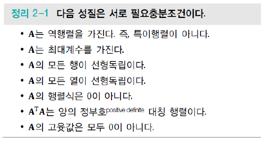
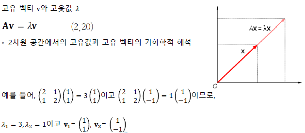

# 기계학습과 수학

## 선형대수

### 벡터와 행렬

- 벡터

  - 샘플을 **특징 벡터**로 표현

    

  - 여러 개의 특징 벡터를 첨자로 구분 (X_i)

    

  - 종류와 크기 표현의 예) x ∈ R^n

- 행렬

  - 여러 개의 벡터를 담음

    

  - 훈련집합을 담은 행렬 : 설계행렬

    

  - 전치 행렬 : A (i,j) 를 A' (j,i)로 바꾸는 것

  - 행렬을 이용하면 방정식을 간결하게 표현 가능하다

    

  - 특수한 행렬들

    - 정사각행렬(정방행렬)
    - 대각행렬
    - 단위행렬
    - 대칭행렬

    
    
  - 행렬 연산
  
    - 행렬 곱셈
  
      
  
      - 교환법칙 성립 X : AB ≠ BA
      - 분배법칙 / 결합법칙 성립 : A(B+C) = AB + AC , A(BC) = (AB)C
  
    - 벡터의 내적(Inner Product)
  
      
  
    - C = AB 예시
  
      
  
    - 행렬 곱셈을 통한 벡터의 변환(Function / Mapping) 예시
  
      
  
  - 텐서
  
    - 3차원 이상의 구조를 가진 숫자 배열
  
      - 0차 : 수(Scalar)
      - 1차 : 벡터
      - 2차 : 행렬
      - 고차원 ...
  
      

### 놈과 유사도

- 벡터와 행렬의 크기를 놈(Norm)으로 측정
  - 벡터의 p차 놈

    

    

  - 행렬의 프로베니우스(Frobenius Norm) : 행렬의 크기를 측정

    

- 1차 놈(Manhattan Distance, L1)과 2차 놈(Euclidean Distance, L2) 비교

  

- 유사도(Similarity)와 거리(Distance)

  - 벡터를 기하학적으로 해석

    

  - 코사인 유사도(Cosine Similarity)

    

### 퍼셉트론의 해석

- 퍼셉트론 : 1958년 로젠블라트가 고안한 **분류기(Classifier) 모델**

  

  - 그림 2-3의 c의 파란 직선은 두 개의 부분공간을 나누는 결정직선(Decision Line)

    

  - 동작을 수식으로 표현하면

    

    - 활성 함수(Activation Function)으로는 계단함수(Step Function) 사용

  - 3차원 특징공간은 결정평면(Decision Plane), 4차원 이상은 결정 초평면(Decision Hyperplane)

    - 3차원 특징공간을 위한 퍼셉트론

      

  - 예제

    

  - AND 분류 문제는?

    

  - XOR 분류 문제는?

    

  - 다층 퍼셉트론(**M**ulti-**L**ayer **P**erceptron)

    - 두 단계에 걸쳐 문제해결

      - 단계 1 : 원래 특징 공간을 새로운 공간으로 매핑
      - 단계 2 : 새로운 공간에서 분류

    - XOR의 경우, 다음과 같은 조건을 활용

      

    

    - 다층 퍼셉트론을 활용한 XOR 분류 문제

      

    - 다층 퍼셉트론의 구조(입력층, 은닉층, 출력층)

      

  - 출력이 여러 개인 퍼셉트론의 표현

    

- 선형 분류기 이해

  

- 학습의 정의

  - 추론(Inferring) : 
    식(2,10)은 학습을 마친 알고리즘을 현장의 새로운 데이터에 적용했을 때 일어나는 과정

    

  - 학습(Learning) : 훈련집합의 샘플에 대해 식(2.11)을 가장 잘 만족하는 W를 찾아내는 과정

    

- 현대 기계 학습에서 퍼셉트론의 중요성

  - 딥러닝은 퍼셉트론을 여러 층으로 확장하여 만듦

### 선형결합과 벡터공간

- 벡터 : 공간상의 한 점으로 화살표 끝이 벡터의 좌표에 해당

- 선형결합이 만드는 벡터공간

  - 기저(basis)벡터 a와 b의 선형 결합(Linear Combination)

    

  - 선형결합으로 만들어지는 공간을 벡터공간(Vector Space)이라 부름

### 역행렬

- 원리

  

- 역행렬을 활용한 방정식 표현과 해

  

- 정리

  

- 행렬식(**Determinant**)

  

- 기하학적 의미

  - 행렬식의 절대값은 주어진 행렬의 곱에 의한 공간의 확장 또는 축소로 볼 수 있음
    - If det(A) = 0, 하나의 차원을 따라 축소되어 공간의 부피를 잃게 됨
    - If det(A) = 1, 공간의 부피를 유지한 변환
  - 차원에서의 기하학적인 예시
    - 2차원에서는 2개의 행 벡터가 이루는 평행사변형 넓이
    - 3차원에서는 3개의 행 벡터가 이루는 평행사각기둥의 부피

  

- 정부호(**Definiteness**) 행렬

  

  - 종류

    

### 행렬 분해

- **분해**(Decomposition)란?

  - 정수 3717은 특성이 보이지 않지만, 3\*3\*7*59로 소인수분해하면 특성이 보이듯 분해하는 것

- 고윳값(**Eigenvalue**)과 고유 벡터(**Eigenvector**)

  

- 고윳값의 효과

  

  

- 고윳값과 고유 벡터의 기하학적 해석

  

- 고유 분해(**Eigen-decomposition**)

  

- n*m 행렬 A의 **특잇값 분해**(**S**ingular **V**alue **D**ecomposition)

  
  - 기하학적 해석

    

  - 정사각행렬이 아닌 행렬의 역행렬을 구하는데 사용됨

    

## 확률과 통계

### 확률 기초

- **확률변수** (Random value)

  

  - 다섯 가지 경우 중 한 값을 갖는 확률변수 x
  - x의 정의역 : { 도, 개, 걸, 윷, 모 }

- **확률분포** (probability distribution)

  - 확률질량함수 (probability mass function) : 이산 확률 변수

    

  - 확률밀도함수 (probability density function) : 연속 확률 변수

    

- **확률벡터** (random vector)

  - Iris에서 x는 4차원 확률 벡터

    

- 간단한 확률실험 장치

  - 주머니에서 번호르를 뽑은 다음, 번호에 따라 해당 병에서 공을 뽑고 색을 관찰함

  - 번호를 y, 공의 색을 x라는 확률변수로 표현하면

    

- **곱** 규칙 (product rule) 과 **합** 규칙 (sum rule)

  

  - 조건부 확률 (conditional probability)에 의한 결합확률 계산

    

    - 하얀 공이 뽑힐 확률

      

  - 합 규칙과 곱 규칙에 의한 주변확률 (marginal probability) 계산

    

- **조건부 확률**

  

- 확률의 **연쇄 법칙** (chain rule)

  

- **독립** (indepedence)

  

- **조건부 독립** (conditional independence)

  

- **기대값** (expectation)

  

### 베이즈 정리와 기계 학습

- **베이즈 정리** (Bayes's rule)

  

  - 다음 질문을 식으로 쓰면

    

    

  - 해석 : **사후 (posteriori) 확률 = 우도 (likelihood) 확률 * 사전 (prior) 확률**

    

- 기계학습에 적용

  - 예시) Iris 데이터 부류 문제

    

  - 사후확률 P(y|x)를 직접 추정하는 일은 아주 단순한 경우를 빼고 불가능

  - 따라서 베이즈 정리를 이용하여 추정

    - 사전확률

      

    - 우도확률 : 밀도추정기법으로 추정

### 최대 우도

- 매개변수 (모수) Θ를 모르는 상황에서 매개변수를 추정하는 문제

  
  

- 최대 우도법 (maximum likelihood)

  - 어떤 확률변수의 관찰된 값들을 토대로 그 확률변수의 매개변수를 구하는 방법

  

### 평균과 분산

- 데이터의 **요약 정보**로서 **평균**과 **분산**

  

- 평균 벡터(치우침 정도)와 공분산 행렬 (covariance matrix) (확률변수의 상관정도)

  

- 평균 벡터와 공분산 행렬 예제

  

### 유용한 확률분포

- **가우시안** 분포 (Gaussian distribution)

  

  - 다차원 가우시안 분포

    

- **베르누이** 분포 (Bernoulli distribution)

  

- **이항** 분포 (Binomial distribution)

  

- 확률 분포와 연관된 유용한 함수들

  - **로지스틱 시그모이드** 함수 (logistic sigmoid function)

    

  - **소프트플러스** 함수 (softplus function)

    

- **지수** 분포 (exponential distribution)

  

- 라플라스 분포 (laplace distribution)

  

- 디랙 분포 (dirac distribution)

  

- 경험적 분포 (empirical distribution)

  

- 혼합 분포들 (mixture distributions)

  

- 변수 변환 (change of variables)

  - 기존 확률변수를 새로운 확률변수로 바꾸는 것

  - 변환 y = g(x)와 가역성을 가진 g에 의해 정의되는 x,y 두 확률변수를 가정할 때
    두 확률 변수는 다음과 같이 상호 정의될 수 있음

    

  

### 정보이론

- **정보이론**과 **확률통계**는 많은 **교차점**을 가짐
- 확률통계는 기계학습의 기초적인 **근간**을 제공
  - 정보이론 관점에서 기계학습을 접근이 가능
    - 해당 확률 분포를 추정하거나 확률 분포 간의 유사성을 정량화 등의 기계 학습에
      정보이론을 활용한 예로서 **엔트로피, 교차 엔트로피, KL 다이버전스**
- 정보이론 : 사건이 지닌 **정보를 수량화**할 수 있나?
  - "아침에 해가 뜬다" 와 오늘 "아침에 일식이 있었다"라는
    									 두 사건중 어느 것이 더 많은 정보를 가지는지
  - 정보이론의 기본 원리 :arrow_forward: **확률이 작을수록 많은 정보**
    - **자주 발생하는 사건보다 잘 일어나지 않는 사건 (unlikely event)의 정보량이 많음**

#### 자기 정보 (self information)

#### 엔트로피 (entropy)

- 확률 변수 x의 불확실성을 나타내는 엔트로피

- 모든 사건 정보량의 기대값으로 표현

  

  - 예를 들면, 동전의 앞뒤의 발생 확률이 동일한 경우의 엔트로피는

    

  - 동전의 발생 확률에 따른 엔트로피 변화

    

- 자기 정보와 엔트로피 예제

  

- **교차 엔트로피** (cross entropy) : 두 확률분포 P와 Q 사이의 교차 엔트로피

  

  - 딥러닝의 **손실함수**로 자주 사용됨

  - 식을 전개하면

    

    - 여기서 **P**를 **데이터의 분포**라 하면, 이는 학습 과정에서 **변화하지 않음**
      - 교차 엔트로피를 손실함수로 사용하는 경우, **KL 다이버전스의 최소화함과 동일**

- KL 다이버전스

  - 식 (2.48)은 P와 Q 사이의 KL 다이버전스

  - **두 확률분포 사이의 거리를 계산**할 때 주로 사용

    

- 교차 엔트로피와 KL 다이버전스의 관계

  

  - **가지고 있는 데이터 분포 P(x)와 추정한 데이터 분포 Q(x)간의** 
    **차이 최소화하는데 교차 엔트로피 사용**

## 최적화

- 순수 수학 최적화와 기계 학습 최적화의 차이
  - 기계학습의 처적화는 단지 **훈련집합**이 주어지고, 
    훈련집합에 따라 정해지는 **목적함수의 최저점**을 찾아야 함
    - 주로 SGD(스토캐스틱 경사 하강법) 사용
    - 데이터로 미분하는 과정 필요 :arrow_forward: 오류 역전파 알고리즘

### 매개변수 공간의 탐색

- 학습 모델의 매개변수 공간

  - 높은 차원에 비해 **훈련집합의 크기가 작아 참인 확률분포를 구하는 일은 불가능**

  - 기계학습은 **적절한 모델을 선택**하고, **목적함수를 정의**하고, 모델의 **매개변수 공간을 탐색**하여 **목적함수가 최저가 되는 최적점을 찾는 전략** 사용

    - 특징공간에서 해야 하는 일을 모델의 **매개변수 공간**에서 하는 일로 대치

    

  - 특징공간보다 수 배 ~ 수만배 넓음

    - 선형회귀에서의 특징공간은 1차원, 매개변수 공간은 2차원
    - MNIST 인식하는 딥러닝 모델 : 784차원 특징공간, 수십~수백만 차원 매개변수 공간

  

- 최적화 문제 해결

  - **낱낱탐색**(exhaustive search) 알고리즘

    - 차원이 조금만 높아져도 적용 불가능

    

  - **무작위탐색**(random search) 알고리즘

    - 아무 전략이 없는 순진한 알고리즘

      

  - 기계학습이 사용하는 전형적인 알고리즘

    - **목적함수가 작아지는 방향**을 주로 **미분으로 찾아냄**(라인 3)

      

### 미분

- 미분에 의한 최적화

  - 미분의 정의

    

  - **1차 도함수** f'(x)는 함수의 **기울기**, 즉 **값이 커지는 방향**을 지시

    - **-f'(x) 방향에 목적함수의 최저점**이 존재

    

- 편미분(Partial Derivative)

  - **변수가 여러 개인 함수의 미분**
  - **미분값이 이루는 벡터**를 **그래디언트**라 부름

  

- 기계 학습에서 편미분

  - 매개변수 집합 Θ에 많은 변수가 있으므로 편미분 사용

- 편미분으로 얻은 그레디언트에 따라 최저점을 찾아가는 예제

  

- 독립변수와 종속변수의 구분

  - [y = wx + b]에서 x는 **독립변수**, y는 **종속변수**
  - 기계학습에서 이런 해석은 **무의미**(예측을 위한 해석에 불과)
  - 최적화는 예측이 아니라 **학습 단계에 필요**

  

- **연쇄법칙**

  

- **다층 퍼셉트론은 합성함수**

  

- 야코비언 행렬(Jacobian Matrix)

  

- 헤시안 행렬(Hessian Matrix)

  

### 경사 하강 알고리즘

- 경사하강법**(gradient desent)이 **낮은곳을 찾아가는 원리**

  

- **배치**(batch) 경사 하강 알고리즘

  - 샘플의 그레이디언트를 평균한 후 **한꺼번에 갱신**

  - 훈련집합 전체를 다 봐야 갱신이 일어나므로 학습 과정이 **오래 걸리는 단점**

    

- **스토캐스틱 경사 하강**(SGD) 알고리즘

  - **한 샘플 혹은 미니배치**의 그레디언트를 계산한 후 즉시 갱신

  - 라인 3~6을 한번 반복 : 한 세대(epoch)

    

  - 다른 방식의 구현 (라인 3~6 대치)

    

- 경사 하강 알고리즘 비교

  

  - 배치 경사 하강 알고리즘 : 정확한 방향으로 수렴, 느림
  - 스토캐스틱 경사 하강 알고리즘 : 수렴이 다소 헤맬 수 있음, 빠름

- 추가 경사 하강 알고리즘 비교

  