# 딥러닝 최적화

- 과학과 공학에서 최적화
- 기계학습의 최적화도 매우 복잡함
  - 훈련집합으로 학습을 마친 후, 현장에서 발생하는 새로운 샘플을 잘 예측해야 함
    - 즉 **일반화 능력**이 좋아야 함
    - **훈련집합**은 전체 데이터(실제로 알 수 없음)의 대리자 역할
    - **검증집합**은 테스트집합의 대리자 역할
    - 오차제곱의 평균, 로그우도와 같은 **목적함수**도 궁극 목표인 정확률(판단 기준)의 대리자 역할
- 기계학습의 최적화가 어려운 이유
  - 대리자 관계
  - 목적함수의 비볼록 성질, 고차원 특징 공간, 데이터의 희소성 등
    - 볼록 성질을 가지는 목적함수도 있긴하다(MSE) - 최소값이 하나
  - 긴 시간 소요

## 목적함수 : 교차 엔트로피와 로그우도

### 평균제곱 오차 다시 생각하기

평균제곱 오차 목적함수

- 오차가 클수록 $e$값이 크므로 벌점으로 훌륭함

- 큰 **허점**이 존재

  

  - 왼쪽 상황은 $e = 0.2815$
  - 오른쪽 상황은 $e = 0.4971$, 오른쪽이 더 큰 벌점을 받아야 마땅함
    - 큰 교정이 필요함에도, **더 작은 그레이디언트가 적용됨**	
    - 더 낮은 벌점을 받은 꼴 -> 학습이 더디다

- **이유**

  

  - $wx+b$ (위 그래프의 가로축)가 커지면 그레디언트가 작아짐

### 교차 엔트로피 목적함수

- **교차 엔트로피**

  - 레이블에 해당하는 $y$가 확률변수 (부류가 2개라고 가정하면 $y \in \{0,1\}$

  - 확률 분포 : $P$는 정답 레이블, $Q$는 신경망 출력

    

  - 확률분포를 통일된 수식으로 쓰면

    

  - 교차 엔트로피 $H(P,Q) = -\sum_xP(x)log_2Q(x)= -\sum_{i=1,k}P(e_i)log_2Q(e_i)$을 적용
    
    - $H(P,Q) = -\sum_{y\in \{0,1\}}P(y)log_2Q(y)$

- 손쉬운 예

  

- **교차 엔트로피 목적함수**

  $e = -(ylog_2o + (1-y)log_2(1-o)),$ 이때, $o = \sigma(z)이고 z = wx + b$ (5,4)

  - y가 1, o가 0.98일때(예측이 잘됨)
    - 오류 e = 0.0291로서 낮은 값
  - y가 1, o가 0.0001일때(예측이 잘못됨)
    - 오류 e = 13.2877로서 높은 값

- **공정한 벌점**을 부여하는가

  

  - 그레디언트를 계산해보면 오류가 더 큰 쪽에 더 큰 벌점 부과

    

- 식 (5,4)를 **c개의 출력 노드를** 가진 경우로 **확장**

  - 출력 벡터 $\bold{o} = (o_1,o_2,...,o_c)^T$인 상황으로 확장

    

### 소프트맥스 함수와 로그우도 목적함수

#### 소프트맥스 함수

- 동작 예시

  - 소프트맥스는 최대를 모방

    - 출력 노드의 중간 계산 결과 $s_i^L$의 최대값을 더욱 활성화하고 다른 작은 값들은 억제
    - 모두 더하면 1이 되어 확률 모방

    

    - 로지스틱 시그모이드로 바꾼 값은 확률분포일수가 없다
    - max가 1인 값만 1에 가깝도록 하고, 나머지는 0쪽으로 누르는 방식

#### 로그우도 목적함수

- 모든 출력 노드값을 사용하는 MSE나 교차 엔트로피와는 달리 $o_y$라는 **하나의 노드만 적용**
  - 정답 노드만 보겠다는 뜻
- $o_y$는 샘플의 레이블에 해당하는 노드의 출력값
  - 그림 5-5에서 현재 샘플이 두번째 부류라면 $o_y = o_2$
    - 잘못 분류한 셈, 목적함수값이 **큼**
  - 그림 5-5에서 현재 샘플이 세번째 부류라면 $o_y = o_3$
    - 제대로 분류한 셈, 목적함수값이 **작음**

- **소프트맥스와 로그우도**
  - 소프트맥스는 **최댓값이 아닌 값을 억제하여 0에 가깝게 만든다**는 의도 내포
  - 학습 샘플이 알려주는 부류에 **해당하는 노드만 보겠다는 로그우도**와 잘 어울림
  - 따라서 **둘을 결합하여 사용하는 경우가 많음**

#### 소프트맥스 분류기

- 다항 로지스틱 회귀분석의 예
- 분류기의 최종 값을 확률로 표현
- 소프트맥스와 로그우도 목적함수

#### 힌지로스

- 확실한 분별력을 요할 때 주로 사용
- SVM : 분류할 때 마진을 크게 만듬(클래스 간의 간격이 벌어진다)

## 성능 향상을 위한 요령

### 데이터 전처리

- 규모 문제

  - 예시) 건강에 관련된 데이터 (키, 몸무게, 혈압)
    - 1.8과 1.5는 30cm나 차이나지만 특징값 차이는 불과 0.3
    - 60kg와 40kg는 20의 차이
    - 둘다 양수이며, 100배의 규모차이가 남
    - 키 특징에 연결된 가중치가 몸무게 특징보다 100배 느리게 학습됨(느린 학습의 요인)
  - 데이터들의 같은 차원에 있도록 크기를 맞춰줄 필요가 있다

- **<u>모든 특징이 양수인 경우의 문제</u>**(시험 나올듯)

  - $\delta_jz_i$가 그레디언트이므로

    

    - :arrow_up: 표시된 가중치는 모두 증가, :arrow_down: 표시된 가중치는 모두 감소
    - 가중치가 뭉치로 증가 또는 감소하면 최저점을 찾아가는 경로가 갈팡질팡하여 수렴이 느림

- **정규화** : 규모문제와 양수문제 해결

  - 특징별로 독립적으로 적용

  - 통계학의 표준화 변환(z-transform)을 적용한 경우

    

  - 일부의 경우, 최대 최소 변환을 적용한 경우

    
  
- 전처리 과정 예

  

- **명목 변수**를 **원핫**코드로 변환

  - 명목 변수, 객체간 서로 구분하기 위한 변수

  - 거리개념이 없다

  - 값의 개수만큼 bit를 부여

  - 데이터 전처리의 핵심

    

  - 성별은 2비트, 체질은 4비트

  

### 가중치 초기화

- **대칭적 가중치** 문제

  

  - 위 그림의 대칭적 가중치에서는 $z_1^{l-1}$과 $z_2^{l-1}$과 같은 값이 됨
    - $-\delta_jz_i$가 그레이디언트이기 때문에 $u_{11}^l$과 $u_{12}^l$이 같은 값으로 갱신됨
    - 두 노드가 같은 일을 하는 중복성 발생
  - 난수 초기화를 통해 대칭 파괴

- **난수**로 가중치 초기화

  - 가우시안 분포 또는 균일 분포에서 난수 추출. 두 분포는 성능 차이 거의 없음

  - 난수 범위는 무척 중요함

    - 식 (5.10) 또는 식(5.11)로 r를 결정한 후 [-r, r] 사이에서 난수 발생

    `

  - 바이어스는 보통 0으로 초기화

- 사례

  - AlexNet : 평균 0, 표준편차 0.01인 가우시안에서 난수 생성
  - ResNet : 평균 0, 표준편차 $\sqrt{\frac{2}{n_{in}}}$인 가우시안에서 난수 생성, 바이어스 0 설정

- 가중치 초기화에 따른 변화 예

  

### 모멘텀

- **그레이디언트의 잡음** 현상

  - 기계 학습은 훈련집합을 이용하여 그레이디언트를 추정하므로 잡음 가능성 높음
  - **모멘텀**은 그레이디언트에 스무딩을 가하여 잡음 효과 줄임
    - 관성 : 과거에 이동했던 방식을 기억하면서 기존 방향으로 일정 이상 추가 이동함
    - 수렴 속도 향상(지역 최저에 빠지는 문제 해소)

- **모멘텀을 적용한 가중치 갱신 수식**

  

  - 속도 벡터 $v$는 이전 그레이디언트를 누적한 것에 해당함 (처음에는 $v = 0$으로 출발)

  - $\alpha$의 효과(관성의 정다)

    - $\alpha  = 0$이면 모멘텀이 적용 안 된 이전 공식과 같음

    - $\alpha$가 1에 가까울수록 이전 그레이디언트 정보에 큰 가중치를 주는 셈

      :arrow_forward: $\theta$가 그리는 궤적이 매끄러움

    - 보통 0.5, 0.9, 또는 0.99 사용

      (또는 0.5로 시작하여 세대가 지남에 따라 점점 키워 0.99에 도달하는 방법)

- **모멘텀의 효과**

  - 지나침 현상 누그러뜨림

    

- **네스테로프 가속 그레이디언트** 모멘텀

  - 현재 $v$값으로 다음 이동할 곳 $\hat{\theta}$을 예견한 후, 예견한 곳의 그레이디언트  를 사용

    

    

  - 일반적으로 성능이 조금 더 좋다 

- 알고리즘

  - 일반적인 경사 하강 알고리즘

    

  - 네스테로프 모멘텀을 적용한 경사 하강 알고리즘

    

### 적응적 학습률

- **학습률** $p$의 중요성
  
- 너무 크면 지나침에 따른 진자 현상, 너무 작으면 수렴이 느림
  

- **적응적 학습률**

  - 그레이디언트에 학습률 p를 곱하면, 

    즉, 모든 매개변수가 같은 크기의 학습률을 사용하는 셈

  - **적응적 학습률**은 **매개변수마다** 자신의 상황에 따라 **학습률을 조절**해 사용
    
    - 매개변수마다 학습률이 다르다
    - ex) 학습률 담금질
      이전 그레이디언트와 현재 그레이디언트의 부호가 같은 매개변수는 값을 키우고 다른 매개변수는 값을 줄이는 전략

- **AdaGrad** (Adaptive Gradient)

  - **시간에 따라서 줄어든다(누적)**
  - **각각의 차원축에 따로 적용**
  
  
  
  - 라인 5~7을 자세히 쓰면
  
    
  
      - 6번 라인 : normalize, 보폭을 정해주는 적응적 학습률
  
    - $r$은 이전 그레이디언트를 누적한 벡터
      - $r_i$가 크면 갱신값 $|\triangle \theta_i|$는 작아서 조금만 이동
      - $r_i$가 작으면 $|\triangle \theta_i|$는 커서 많이 이동
  
- **RMSProp**

  - Adagrad의 단점

    - [알고리즘 5-3]의 라인 5는 단순히 제곱을 더함

    - 따라서, 오래된 그레이디언트와 최근 그레이디언트는 **같은 비중**의 역할

      :arrow_forward: **$r$이 점점 커져 수렴 방해**할 가능성이 있다

  - **가중 이동 평균** 기법 적용

    $r = \alpha r + (1-\alpha )g\odot g$

    - $\alpha$가 작을수록 **최근 것에 비중**을 둠
    - 보통 $\alpha$로 0.9, 0.99, 0.999를 사용

  

  - **과거의 데이터에 힘을 빼겠다는 의미가 강함**

- **Adam**(Adaptive moment)

  - RMSProp에 식 (5-12)의 **모멘텀을 추가**로 적용한 알고리즘

  

  - 일반적으로 $\alpha_1 = 0.9, \alpha_2 = 0.999, p = 1e-3$ 혹은 $5e-4$ 설정
  - 모멘텀, 적응적 학습률 모두 사용

- 동작 예시

  

  - [그림 5-13(a)]는 중앙으로 급강하하는 절벽 지형
  - [그림 5-13(b)]는 중앙 부근에 안장점이 있는 지형
  - SGD, SGD+Momentum, Adagrad, RMSProp, Adam 모두 학습률을 하이퍼매개변수로 가짐
  - NAG (네스테로프)
  - 최적의 러닝레이트를 직접 찾는것이 가장 좋은 결과를 낳지만, 현실적으로 힘들어 사용

### 활성함수

- 선형 연산 결과인 활성값 $z$를 계산하고 비선형 활성함수 $\tau$를 적용하는 과정

  

  - tanh는 활성값이 커지면 포화상태가 되고, 그레이디언트는 0에 가까워짐
    - **매개변수 갱신(학습)이 매우 느린 요인**

- **ReLU**

  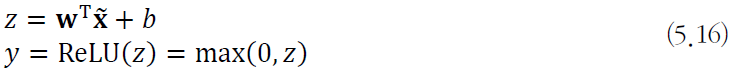

  - 그레이디언트 포화문제 해소
  - 문제점 : 평균점이 0보다 크다
    - **양의 문제** 발생 가능성이 있음
    - ReLU에 0이 한번 걸리면 신호가 전달되지 않을 것이다
    - 초기화를 잘못해서 ReLU에 0으로 한번 걸리면 계속 0이 돼버린다

- ReLU 변형

  - Leaky ReLU(보통 $\alpha$ = 0.01을 사용)

    

  - PReLU($\alpha$를 학습으로 알아냄)

    

- 다양한 활성함수

  

### 배치 정규화

- **공변량 시프트** 현상

  - 학습이 진행되면서 층1의 매개변수가 바뀜에 따라 이 따라 바뀜

    - 층2 입장에서 보면 자신에게 입력되는 **데이터의 분포가 수시로 바뀌는 셈**

  - 층2, 층3, ... 으로 깊어짐에 따라 더욱 심각

  - **학습을 방해하는 요인**으로 작용

    

- **배치 정규화**

  - 공변량 시프트 현상을 누그러뜨리기 위해 식 (5.9)의 **정규화를 모든 층에 적용**하는 기법

    

  - 정규화를 적용하는 곳이 중요

    - 식 (5.15)의 연산 과정 중 식 (5.9)를 어디에 적용하나? (**적용 위치**)

      

    - 입력  또는 중간 결과 $z$ 중 어느 것에 적용? :arrow_forward: **$z$에 적용하는 것이 유리**

    - 일반적으로 완전 연결층, 컨볼루셔층 직후 혹은 **비선형 함수 적용 직전** 적용

  - 훈련집합 전체 또는 미니배치 중 어느 것에 적용? (**적용 단위**)

    - **미니배치에 적용하는 것이 유리**

- 과정

  

- 장점

  - 신경망의 그레이디언트 흐름 개선
    - 분포가 흔들리는 것(평균이 흔들리는 것)이 학습을 방해하는 요소다
    - 분포를 표준화(정규 분포) 시켜서 학습을 시키자
  - 높은 학습률 허용
  - 초기화에 대한 의존성 감소
  - 의도하지 않았지만 규제와 유사한 행동을 하며, 드롭아웃의 필요성을 감소시킴

- 정규화 변환 수행 코드
  - 미니배치 $X_B = \{x_1,x_2,...,x_m\}$에 식(5.15)를 적용하여 $\hat{X_B}=\{z_1,z_2,...,z_m\}$을 얻은 후, $\hat{X_B}$를 가지고 코드 1을 수행

  - 즉, 미니배치 단위로 **노드마다 독립적으로** 코드 1을 수행

  - $\gamma$와 $\beta$는 노드마다 고유한 매개변수로서 **학습으로 알아냄**

    

- 최적화를 마친 후 추가적인 **후처리 작업** 필요

  - **각 노드**는 **전체 훈련집합**을 가지고 **독립적으로** 코드2를 **수행**

    

- 예측단계

  - 각 노드는 독립적으로 식(5.18)을 적용하여 변환 (코드 1의 마지막 두 라인을 수행하는 셈)

    

- CNN에서는

  - 노드 단위가 **특징 맵 단위**로 코드 1과 코드 2를 적용
    - 특징 맵의 크기가 $p*q$라면 미니배치에 있는 샘플마다 $pq$개의 값이 발생
    - 코드 1은 총 $pqm$개의 값을 가지고 평균과 분산을 계산
    - $\gamma$와 $\beta$는 특징 맵마다 하나씩 존재

- 배치 정규화의 긍정적 효과를 측정한 실험사례 [loffe2015]
  - 가중치 초기화에 덜 민감함
  - 학습률을 크게 하여 수렴 속도 향상 가능
  - 시그모이드를 활성함수로 사용하는 깊은 신경망도 학습이 이루어짐
- 배치 정규화는 규제 효과를 제공
  
  - 드롭아웃이라는 규제 기법을 적용하지 않아도 높은 성능

## 규제의 필요성과 원리

### 과잉적합에 빠지는 이유와 과잉적합을 피하는 전략

- **학습 모델의 용량**에 따른 일반화 능력

  

- 대부분 가지고 있는 데이터에 비해 훨씬 **큰 용량의 모델**을 사용

  - 예) VGGNet은 분류층에 1억 2천 1백만 개의 매개변수
  - 훈련집합을 단순히 '암기'하는 **과잉적합에** 주의를 기울여야 함

- **현대 기계 학습의 전략**

  - 충분히 **큰 용량의 모델을 설계**한 다음, **학습 과정에서 여러 규제 기법을 적용**

### 규제의 정의

- 오래 전부터 수학과 통계학에서 연구해온 주제

  - **모델 용량에 비해 데이터가 부족한 경우**의 불량조건문제를 푸는 데 최초 제안

  - 적절한 가정을 투입하여 문제를 품

    - 데이터의 원천에 내재한 정보를 사전 지식이라고 하며, 이를 활용

    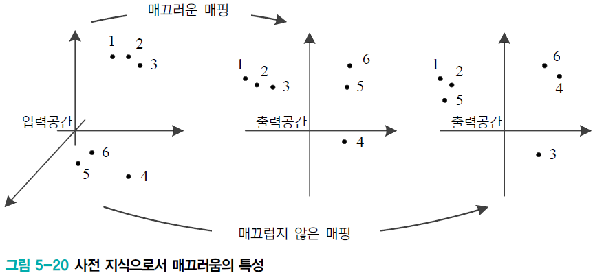

- **매끄러움 가정**

  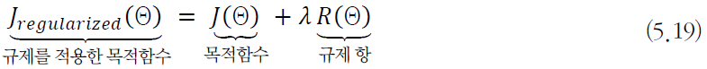

- 일반화 오류를 줄이려는 의도를 가지고 학습 알고리즘을 수정하는 방법

## 규제 기법

- 명시적 규제 : 가중치 감쇠나 드롭아웃처럼 목적함수나 신경망 구조를 **직접 수정**하는 방식
- 암시적 규제 : 조기 멈춤, 데이터 증대, 잡음 추가, 앙상블처럼 **간접적으로 영향**을 미치는 방식

### 가중치 벌칙

- **규제항**은 훈련집합과 무관하며, **데이터 생성 과정에 내재한 사전 지식에 해당**
- 규제항은 매개변수를 작은 값으로 유지하므로 **모델의 용량을 제한하는 역할**
  - 가중치의 크기를 정량화 시키는 것 포함(손실함수에)
- 규제항 $R(\theta)$로 무엇을 사용할 것인가
  - 큰 가중치에 벌칙을 가해 **작은 가중치를 유지**하려고 주로 L2놈이나 L1놈 사용
  - L1놈 : 가중치 셀렉션(**하나만 살아남고** 나머지는 0)
  - L2놈 :  가중치들 모두 **전체적**으로 감소

#### L2 놈

- 가중치 감쇠 기법

  

- 그레디언트 계산

  

- 선형 회귀에 적용

  

  - 행렬식

    

  - 목적함수

    

  - 미분
    

  - 정리

    

    - 역행렬을 곱하므로 가중치를 축소하여 원점으로 당기는 효과

  - 예측

    

- 리지회귀

  

#### L1놈

- L1놈 적용

  

- 미분

  

- 매개변수 갱신식

  

  - 가중치 감쇠 효과

    

- L1놈의 **희소성 효과** (0이 되는 매개변수가 많음)

  - 선형회귀에 적용하면 **특징 선택 효과**

#### 가중치 벌칙

- 규제

  

  - 목적함수 : 적용된 충분한 학습 모델로 훈련집합을 예측한 오차
  - 규제 : 학습 모델이 훈련집합의 예측을 너무 잘 수행하지 못하도록 방지

- 효과

  - 가중치에 대한 선호도 표현
  - 학습 모델을 단순화시킴으로 테스트 집합에 대한 일반화 성능 향상
  - 매끄럽게 하여 최적화 개선

- 대표적인 예

  

### 조기 멈춤

- 학습 시간에 따른 일반화 능력

  - 일정 시간($t_{opt}$)이 지나면 과잉적합 현상이 나타남 :arrow_forward: 일반화 능력 저하

  - 즉 훈련 데이터를 단순히 암기하기 시작

    

- **조기 멈춤**이라는 규제 기법

  - 검증집합의 오류가 최저인 점 $t_{opt}$에서 학습을 멈춤

    

- 순진한 버전(현실성 X)

  

- 참을성(연속적으로 성능 향상이 없으면 멈추는 정도)을 반영한 버전

  

### 데이터 확대

- 과잉적합 방지하는 가장 확실한 방법은 큰 훈련집합 사용

  

  - 하지만 데이터 수집은 비용이 많이 드는 작업

- 데이터 확대라는 규제 기법

  - 데이터를 인위적으로 **변형하여 확대함**
  - 자연계에서 벌어지는 잠재적인 변형을 프로그램으로 흉내 내는 셈

- 예) MNIST에 affine(이동, 회전, 반전) 변환 적용

  

  - 한계
    - 수작업 변형
    - 모든 부류가 같은 변형 사용

- 예) 모핑을 이용한 변형 [Hauberg2016]

  

  - 비선형 변환으로서 아핀 변환에 비해 훨씬 다양한 형태의 확대
  - 학습 기반 : 데이터에 맞는 비선형 변환 규칙을 학습하는 셈

- 예) 자연영상 확대 [Krizhevsky2012]

  - 256\*256 영상에서 224\*224 영상을 1024장 잘라내여 이동 효과

    좌우 반전까지 시돟하여 2048배로 확대

  - PCA를 이용한 색상 변환으로 추가 확대

  - 예측 단계에서는 [그림 5-26]과 같이 5장 잘라내고 좌우 반전하여 10장을 만든 후, 앙상블 적용하여 정확도 향상

    

- 예) 잡음을 섞어 확대하는 기법

  - 입력 데이터에 잡음을 섞는 기법
  - 은닉 노드에 잡음을 섞는 기법(고급 특징 수준에서 데이터를 확대하는 셈)

### 드롭아웃

- 드롭아웃 규제기법

  - 입력층과 은닉층의 노드 중 일정 비율을 임의로 선택하여 **제거**(일반적으로 p=0.5 적용)

  - 남은 부분 신경망을 학습

    

  - 많은 부분 신경망을 만들고, 예측 단계에서 앙상블 결합하는 기법으로 볼 수 있음

    

  - 많은 부분 신경망을 학습하고, 저장하고, 앙상블 결합하는데 요구되는 계산 시간과 메모리 공간 측면의 부담

- 실제로는 가중치 공유 사용

  - 하나의 신경망(하나의 가중치 집합에 드롭아웃을 적용함

    

  - 라인 6의 전방 계산
  
    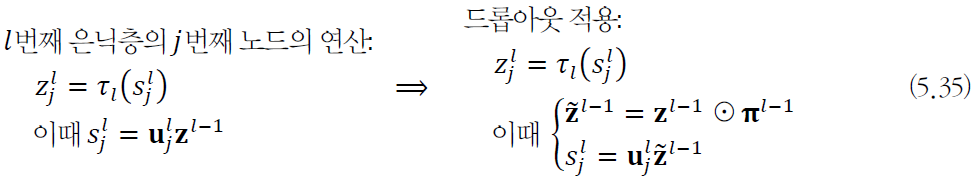
  
    - 불린 배열 $\pi$에 노드 제거 여부를 표시
    - $\pi$는 샘플마다 독립적으로 정하는데, 난수로 설정
    - 보통 입렵층 제거 비율 $P_{input}=0.2$, 은닉층 제거 비율 $P_{hidden} = 0.5$로 설정
  
- 예측단계

  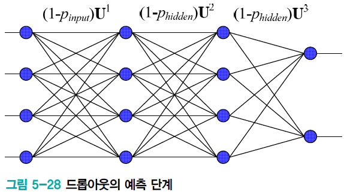

  - 앙상블 효과 모방
    - 가중치에 생존 비율(1-드롭아웃 비율)을 곱하여 전방 계산
    - 학습 과정에서 가중치가(1-드롭아웃 비율)만큼만 참여했기 때문

- 메모리와 계산 효율

  - 추가 메모리는 불린 배열 $\pi$, 추가 계산은 작음
  - 실제 부담은 신경망의 크기에서 옴 : 보통 은닉 노드 수를 $\frac{1}{P_{hidden}}$만큼 늘림 

### 앙상블 기법

- 앙상블
  - 서로 다른 여러 개의 모델을 결합하여 일반화 오류를 줄이는 기법
  - 현대 기계 학습은 앙상블도 규제로 여김
  - 서로 다른 신경망에게 동일한 문제를 풀게 시킨다
- 두 가지 일
  1. 서로 다른 예측기를 학습하는 일
     - 예) 서로 다른 구조의 신경망 여러 개를 학습 또는 같은 구조를 사용하지만 서로 다른 초깃값과 하이퍼 매개변수를 설정하고 학습
     - 예) **배깅** (훈련집합을 여러 번 **샘플링**하여 서로 다른 훈련집합을 구성)
       - 여러 모델 동시에 학습시킴
     - 예) **부스팅** ($i$번째 예측기가 틀린 샘플을 $i+1$번째 예측기가 잘 인식하도록 **연계성을 고려**)
       - 순차적으로 학습, 이전 모델의 학습자료에 대한 피드백을 전달
  2. 학습된 예측기를 결합하는 일 - 모델 평균
     - 여러 모델의 출력으로부터 평균을 구하거나 투표하여 최종 결과 결정
     - 주로 투표 방식을 사용

### 하이퍼 매개변수 최적화

- 학습 모델에는 두 종류의 매개변수가 있음
  - 내부 매개변수
    - 신경망의 경우 에지 가중치로서 이 책은 $\theta$로 표기
    - 학습 알고리즘이 최적화함 : 주어진 데이터로부터 결정
  - 하이퍼 매개변수
    - 모델의 외부에서 모델의 동작을 조정함(사람에 의해서 결정)
    - 예) 은닉층의 개수, CNN의 필터 크기와 보폭, 학습률, 모멘텀과 관련된 매개변수 등

- 하이퍼 매개변수 선택

  - 표준 참고 문헌이 제시하는 기본값을 사용

    - 보통 여러 후보 값 또는 범위를 제시

  - 후보 값 중에서 주어진 데이터에 최적인 값 선택

    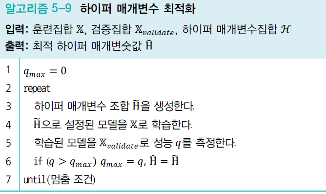

    - 라인 3을 구현하는 방법에 따라 수동탐색/격자탐색/임의탐색
    - 최근 학습을 통한 자동 탐색 방법들이 연구됨

- 격자탐색과 임의 탐색

  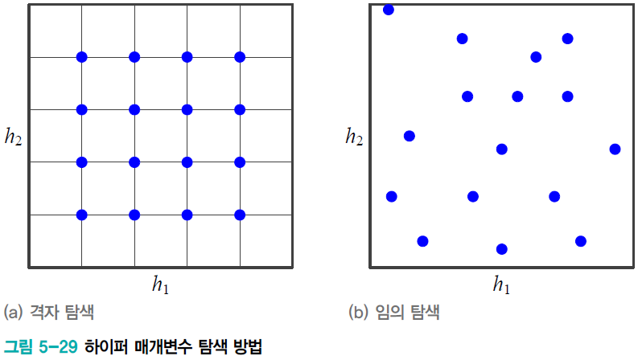

  - 임의 탐색은 난수로 하이퍼 매개변수 조합을 생성

- 로그공간 간격으로 탐색

  - 어떤 하이퍼 매개변수는 로그 공간을 사용해야 함
  - 예) 학습률 범위가 [0.0001 ~ 0.1]일 때
    - 등 간격은 0.0001, 0.0002, 0.0003, ..., 0.0998, 0.0999로 총 1000개 값을조사
    - 로그 공간 간격은 2배씩 증가시킴

- 차원의 저주 문제 발생

  - 매개변수가 $m$개이고 각각이 $q$개 구간이라면 $q^m$개의 점을 조사해야 함

- 임의 탐색이 우월함

  - [Bergstra2012]의 실험 :arrow_forward: 임의 탐색이 유리함

  - [그림 5-30]은 임의 탐색이 유리한 이유를 설명

    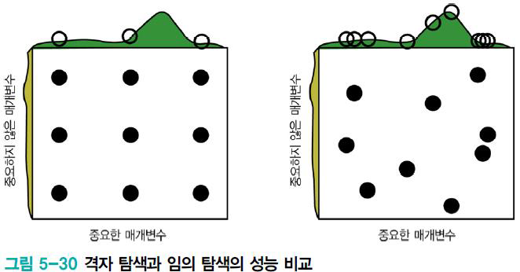

### 2차 미분을 이용한 방법

- 그레이디언트(1차 미분)을 사용하는 경사 하강법

  - 현재 기계학습의 주류 알고리즘
  - 두가지 방향의 개선책 [Bottou2017]
    - 그레이디언트의 잡음을 줄임 (ex - 미니배치 사용)
    - 2차 미분 정보를 활용

- 경사 하강법을 더 빠르게 할 수 있나?

  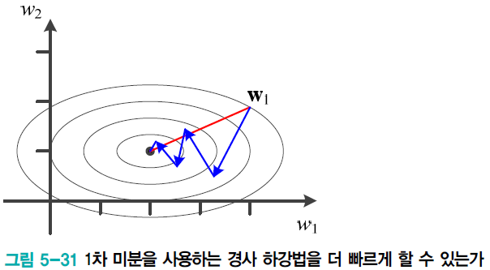

  - 1차 미분 정보로는 빨간 경로를 알 수 없음
    - 현재 위치에서 지역적인 기울기 정보만 알려줌
  - 뉴턴 방법은 2차 미분 정보를 활용해 빨간 경로를 알아냄

- 1차 미분 최적화와 2차 미분 최적화 비교

  - 1차 미분

    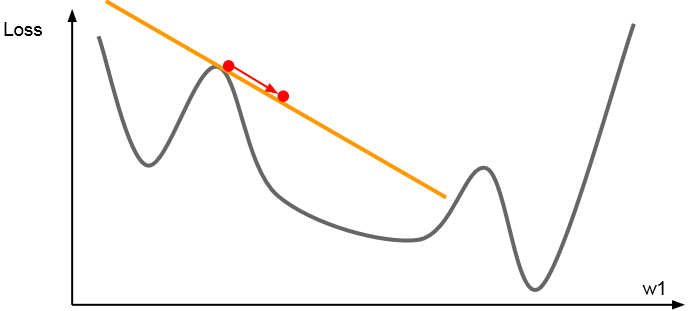

    - 그레이디언트 사용하여 선형 근사 사용
    - 근사치 최소화

  - 2차 미분

    

    - 그레이디언트와 헤시안을 사용하여 2차 근사 사용
    - 근사치의 최소값

#### 뉴턴 방법

- 테일러 급수를 적용하면,

  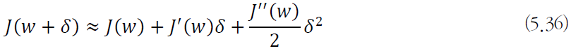

  - 식 (5.37)은 변수가 여러 개일 때 (H는 헤시언 행렬)

    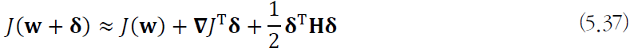

  - $\delta$로 미분하면,

    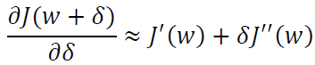

    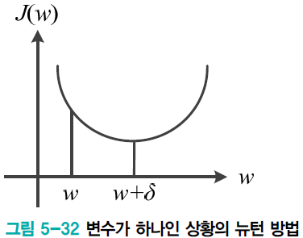

  - [그림 5-32] 처럼 $w + \delta$를 최소점이라 가정하면,

    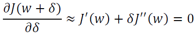

  - 식을 조금 정리하면,

    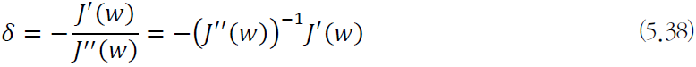

  - 변수가 여러 개인 경우로 확장하면,

    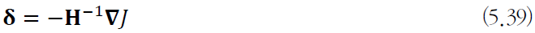

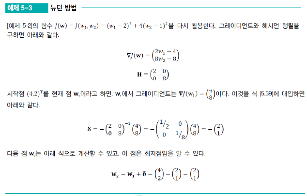

- 뉴턴 방법의 적용

  - [예제 5.3]은 2차 함수에 뉴턴 방법을 적용했으므로, 3차 항 이상을 무시한 식 (5.36)을 사용했음에도 최적 경우 제시

  - 기계 학습이 사용하는 목적함수는 2차 함수보다 복잡한 함수이므로 한번에 최적해에 도다달 불가능 :arrow_forward: [알고리즘 5-10]과 같이 반복하는 뉴턴 방법을 사용해야 함

    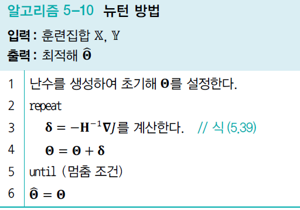

  - 라인 3에서 헤시언 H를 구해야 함

    - 매개변수의 개수를 $m$이라 할 때 $O(m^3)$이라는 과다한 연산량 필요
    - 켤레 그레이디언트 방법이 대안 제시

#### 켤레 그레이디언트 방법

- 직선 탐색

  - [그림 5-33(a)]는 경사 하강법이 학습률을 직선 탐색으로 찾는 상황을 예시

  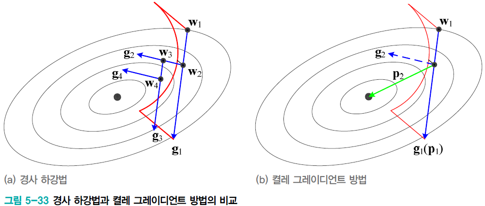

  - 켤레 그레이디언트 방법

    - a의 경사 하강법은 근본적으로 이전 경사 하강법과 같음

      $g_2$로 직선 탐색할 때 직전에 사용한 $g_1$정보를 전혀 고려하지 않음

    - b의 켤레 그레이디언트는 직전 정보를 사용하여 해에 빨리 접근

- 켤레 그레이디언트

  - 직선에 사용한 직선이 $p_{t-1}$이라면 다음 순간에는 식 (5.40)을 만족하는 $p_t$를 사용($p_{t-1}$과 $p_t$를 켤레라 부름) 그런데 식 (5.40)은 여전히 헤시언 행렬을 포함

    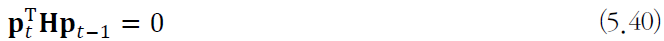

  - 켤레 그레이디언트 방법에서는 식 (5.41)로 대치하여 계산

    - $g_{t-1}$과 $g_t$는 그레이디언트로서, 그레이디언트를 이용하여 2차 미분 정보를 근사하는 셈

      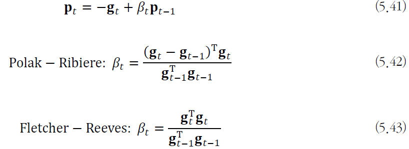

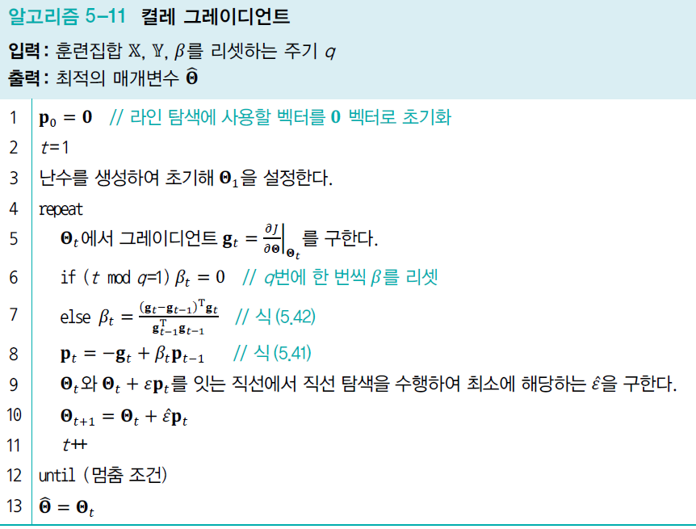

- 식 (5.42)와 식 (5.43)은 2차 함수를 가정하고 유도한 식임
- 라인 6은 이 때문에 발생하는 오차를 보정하는 역할

#### 유사 뉴턴 방법

- 기본 아이디어
  - 헤시언 $H$의 역행렬을 근사하는 행렬 $M$을 사용
  - 처음에 단위 행렬 $I$로 시작하여 그레이디언트 정보를 이용하여 점점 개선
  - LFGS가 많이 사용됨
  - 기계 학습에서는 $M$을 저장하는 메모리를 적게쓰는 **L-BFGS를 주로 사용함**
    - 전체 배치를 통한 갱신을 할 수 있다면, L-BFGS 사용을 고려
- 기계학습에서 2차 미분 정보의 활용
  - 현재 널리 활용되지는 않지만 계속 연구중