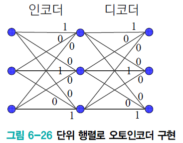
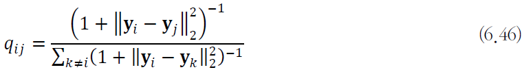

# 비지도학습

## 지도학습 / 비지도학습 / 준지도학습

- 지도 학습 : 모든 훈련 샘플이 레이블 정보를 가짐
- 비지도 학습 : 모든 훈련 샘플이 레이블 정보를 가지지 않음
- 준지도 학습 : 레이블을 가진 샘플과 가지지 않은 샘플이 섞여 있음

- 기계 학습이 사용하는 두 종류의 지식
  - 훈련집합을 통한 전체 데이터에 대한 지식
  - 사전 지식(세상의 일반적인 규칙)
- 중요한 두가지 **사전 지식**
  - 매니폴드 가정 : 데이터 집합은 하나의 매니폴드 또는 여러 개의 매니폴드를 구성하며, 모든 샘플은 매니폴드와 가까운 곳에 있다
  - 매끄러움 가정 : 샘플은 어떤 요인에 의해 변화한다. 예를 들어, 장면과 카메라 위치를 고정한 상태에서 조명을 조금씩 변화하면서 영상을 획득한 경우, 획득된 영상 샘플은 특징 공간에서 위치가 조금씩 바뀔 것이다. 매끄러운 곡면을 따라 위치가 변함
- 비지도 학습 / 준지도 학습은 **사전 지식을 더 명시적으로 사용**
  - 매니폴드와 매끄러움 사전 지식에 의해 우리가 학습하는 함수는 작은 영역 내에서는 많이 변하지 않음을 가정함 $f(x) \approx f(x+\epsilon), \epsilon$ : 작은 변화
  - 예로 좋은 입력들의 경우, 정답이 같으면 유사한 입력 특징 공간에 존재할 확률이 높음

## 비지도학습

### 비지도 학습의 일반 과업

- 세 가지 일반 **과업**

  - **군집화** : 유사한 샘플을 모아 같은 그룹으로 묶는 일
  - **밀도 추정** : 데이터로부터 **확률분포를 추정**하는 일
  - **공간 변환** : 원래 특징공간을 **저차원 또는 고차원 공간으로 변환**하는 일
    - 원래 가지고 있던 공간에 대한 이해를 토대로 변환

- 데이터에 내재한 구조를 잘 파악하여 새로운 정보를 발견해야 함

  

### 비지도 학습의 응용 과업

- 아주 많은 응용
  - **군집화**의 응용
    - 영상 분할
    - 유전자 데이터 분석
    - 맞춤 광고, SNS 실시간 검색어 분석을 통해 사람들의 관심 파악하여 제안
  - **밀도 추정**의 응용
    - 분류, 생성 모델 구축 등
  - **공간 변환**의 응용
    - 데이터 가시화, 데이터 압축, 특징 추출(표현 학습) 등

## 군집화

### k-평균 알고리즘

- 군집화 **문제**

  $X = \{x_1,x_2,...,x_n\}$에서 식 (6.1)을 만족하는 **군집** 집합 $C = \{c_1,c_2,...,c_k\}$를 **찾아내는 작업**

  - 군집의 개수 $k$는 주어지는 경우와 자동으로 찾아야 하는 경우가 있음
  - 군집화를 부류 발견 작업이라 부르기도 함

- 군집화의 **주관성** 

  - 군집의 개수, 최적의 거리 측정 방식을 설정해야 함

  

- 군집의 개수 $k$

  - 주관에 의해 결정

- **거리 측정법**

  

  - L1 (Manhattan) Distance
  - L2 (Euclidean) Distance
  - 어떤 것을 선택하느냐에 따라 바운더리가 달라진다
    - 정해진 정답이 없음

- **분류**

  

  - 연결 기준 군집화 (ex) single-linkage clustering
    - 인접한 거리 기준으로 묶어가는 가는 것
    - $k$개로 나누고 싶다 :arrow_forward: hierarchical clustering dendrogram의 상위 $k$개로 분류
  - 중심 기준 군집화 (ex) k-means clustering
    - 가장 기본적인 군집화 방법
    - 중심점을 찾고, 그걸 기준으로 묶어가는 것
  - 분포 기준 군집화 (ex) gaussian mixture model clustering
    - 확률 분포 활용
  - 밀도 기준 군집화 (ex) DBSCAN
    - 어느 범주 안에서 밀도 기준으로 군집화

- $k$-**평균 군집화** 알고리즘의 특성

  - 원리 단순하지만 성능이 좋아 인기가 좋음
  - 직관적으로 이해하기 쉽고 구현 쉬움
  - 군집 개수 $k$, 거리측정 방법을 설정해야 함

  

  

  - 임의의 k개 점을 잡고(군집 중심), 할당된 점에 가까운 점들을 할당시켜줌
  - 각 군집별로 평균값을 구하고, 중심점을 옮김
    - 반복해서 새롭게 계산(어느정도 수렴이 될 때까지)

- $k$-평균과 $k$-**중앙객체** 군집

  - $k$-평균은 [알고리즘 6-1]의 라인 7에서 **샘플의 평균으로 군집 중심을 갱신** (잡음에 민감)

  - $k$-중앙객체는 **실제 존재하는 객체들 중 하나를 뽑아 대표 객체로 선정**하고 이 객체를 중심으로 군집 중심을 갱신 ($k$-평균에 비해 **잡음에 둔감**)

  - 중앙객체 : 객체 집합에서 수학적으로 대표적인 객체

    

    - 평균에 가장 가까운 요소(Outlier 때문에 평균값이 끌려가는걸 방지)

- 최적화 문제로 해석

  - $k$-평균은 식 (6.2)의 목적함수를 최소화하는 알고리즘

  - 행렬 $\bold{A}$는 군집 배정 정보를 나타내는 $k*n$행렬

    ($i$번째 샘플이 $j$번째 군집에 배정되었다면 $a_{ji}$는 1, 그렇지 않으면 0)

    

- 다중 시작 $k$-평균

  - $k$-평균은 [알고리즘 6-1]의 라인 1에서 **초기 군집 중심이 달라지면 최종 결과가 달라짐**
  - 다중 시작은 서로 다른 초기 군집 중심을 가지고 **여러 번 수행**한 다음, 
    **가장 좋은 품질의 해를 취함**

  

- EM(Expectation Maximization) 기초

  - $k$-평균에서 훈련집합 $X$와 군집집합 $C$(행렬 $\bold{A}$)는 각각 입력단과 출력단에서 관찰 가능

  - 중간 단계의 임시 변수 $Z$ (입출력단에서 보이지 않기 때문에 은닉변수라 부름)

  - $k$**-평균의 할당과 갱신과정은**

    $Z$의 추정 (E 단계)과 $\bold{A}$의 추정 (M 단계)을 번갈아 가면 수행하는 **EM 알고리즘과 유사**

    

### 친밀도 전파 알고리즘

- **친밀도 전파** 알고리즘

  - **데이터들간의 신호 전달 개념을 사용**
    - 모든 데이터가 **친밀도 기준에 따라 자신을 대표할 중심 데이터를 선택하고 군집화**함
  - **책임 행렬 $\bold{R}$과 가용 행렬 $\bold{A}$라는 두 종류의 친밀도 행렬**을 이용하여 군집화
    - $r_{ik}$ : 데이터 $x_k$가 데이터 $x_i$의 **대표가 되어야 한다는 책임의 근거**
    - $a_{ik}$ : 데이터 $x_i$가 데이터 $x_k$를 **대표로 선택될 가능성의 근거**
  - **군집 개수 $k$를 자동으로 추정**하여 알아냄 ($k$-평균 군집의 단점 해소)

- 샘플 $i$와 $k$의 유사도 $s_{ik}$

  

  - **유사도를 이용하여 책임 행렬과 가용 행렬을 계산**
  - 유클리디언 거리의 제곱에 음수
    - 가까울수록, 즉 유사할수록 큰 값을 가짐

- 책임 행렬 $\bold{R}$과 가용 행렬 $\bold{A}$의 계산

  

  

  

- 자가 유사도 $s_{kk}$

  - 유사도의 최솟값, 중앙값, 최댓값 중에서 선택 (하이퍼 매개변수임)
  - 최솟값은 적은 수의 군집, 최댓값은 많은 수의 군집을 생성, 중앙값은 중간 정도

- 자가 친밀도 $r_{kk}$과 $a_{kk}$

  - $r_{kk}$는 식 (6.4)를 그대로 사용. 즉 $r_{kk} = s_{kk} - max_{k' \ne k}(a_{kk'}+s_{kk'})$

  - $a_{kk}$는 (6.6)으로 계산

    

- 알고리즘 세부 과정

  

  

  - (B) : **"책임"** $r(i,k)$ : 데이터 포인트 :arrow_forward: 후보 표본
    - 각 데이터 포인트가 다른 후보 표본보다 **후보 표본을 선호하는 정도**

  - (C) : **"가용도"** $a(i,k)$ : 후보 표본 :arrow_forward: 데이터 포인트
    - 각 후보 표본이 데이터 포인트의 **군집 중심으로 사용될 수 있는 정도**

## 밀도 추정

- 밀도 추정 문제

  - **모수적 추정** : 정해진 확률 밀도 함수로 추정 (몇 개의 매개변수로 확률 분포 정의)

  - **비모수적 추정** : 관측치만으로 데이터의 분포를 추정

  - 어떤 점 $x$에서 데이터가 발생할 확률, 즉 **확률분포 $P(x)$를 구하는 문제**

    

    - $P(x_1) \gt P(x_2) \gt P(x_3)$

### 커널 밀도 추정

- **히스토그램 추정법**

  - 특징 공간을 칸의 집합으로 분한할 다음, 칸에 있는 샘플의 빈도를 세어 식(6.7)로 추정

    

  - 여러 문제점

    - **매끄럽지 못하고 (경계에서의 불연속성) 계단 모양**을 띠는 확률밀도함수가 됨
    - 칸의 크기와 위치에 **민감함**

- **커널 밀도 추정법** (비모수 방법)

  - 커널함수를 이용한 확률 밀도 함수를 만들어 **히스토그램 추정의 단점을 개선**
    - 커널(알맹이) : 원점 대칭이면서 1인 적분값을 가지는 함수로 정의
  - 점 $\bold{x}$에 [그림 6-9]가 예시하는 커널을 씌우고 커널 안에 있는 샘플의 가중합을 이용함
  - 대역폭 $h$의 크기가 중요

  

- 히스토그램 방법과 커널 밀도 추정법의 비교

  - 관측된 샘플마다 해당 값을 중심으로 하는 커널 함수 생성 $K_h(x-x_i)$

  - 얻어진 커널 함수의 결과를 더하여 전체 개수로 난눔

    - 커널 밀도 추정법은 매끄러운 확률밀도함수를 추정함

    

- 커널 밀도 추정법에서 **대역폭 $h$의 중요성**

  - $h$가 너무 작으면 (빨강) 뾰족뾰족한 모양, $h$가 너무 크면 (녹색) 뭉개짐, 적절하게 설정 (검정)

    

- 커널 밀도 추정 기법의 근본적 문제점

  - 샘플을 모두 저장하고 있어야 하는 메모리 기반 방법
    (새로운 샘플이 주어질 때마다 식 (6.8)을 처음부터 다시 계산)
  - 데이터 희소성(차원의 저주)
    - 데이터가 낮은 차원인 경우로 국한하여 활용

- **커널 함수**

  - **커널 밀도 추정법**의 예와 같이 확률 밀도 추정에서 활용

  - **차원 변환**에서도 활용

    - 원공간에서 선형 분리가 안되는 데이터들을 공간 변형을 통해 고차원 공간으로 옮기고 선형 분리되도록 함

    

    커널 대치

    - 서포트 벡터머신에서 활용됨
    - 실제 데이터를 새로운 공간으로 변형하지 않고 변형된 공간의 데이터간의 거리를 구함
      (ex) 다항식 커널, 가우시안 커널

### 가우시안 혼합

- **가우시안을 이용한 방법** (모수적 방법)

  - 데이터가 **가우시안 분포를 따른다고 가정하고** 평균 벡터 $\mu$와 **공분산** 행렬 $\sum$을 **추정함**

    

- 대부분 데이터가 하나의 가우시안으로 불충분(오른쪽)

  

- **가우시안 혼합**

  - [그림 6-13]은 2개의 가우시안을 사용한 예

    

    - 가우시안 간의 가중치를 정해주게 됨(퍼센티지)
    - 가우시안 별로 (평균, 분산, 가중치)만 알면 됨

  - $k$개의 가우시안으로 일반화하면,

    - 확률 분포 $P(x)$는 $k$개 가우시안의 선형 결합으로 표현

      

- 주어진 데이터와 추정해야 할 매개변수를 정리하면,

  

- **최대 우도**를 이용한 최적화 문제로 공식화

  

  

  - **주어진 X가 발생할 가능성이 가장 큰 $\theta$를 찾는 문제**

### EM 알고리즘

- **EM 알고리즘을 이용**한 식 (6.13)의 풀이

  - $\theta$를 모르므로 난수로 설정하고 출발

    

  - 과정 : 가우시안으로 샘플의 소속 정보 개선 (E단계)

    - 샘플의 소속 정보로 가우시안 개선 (M단계)
    - 가우시안으로 샘플의 소속 정보 개선 (E단계)
    - 샘플의 소속 정보로 가우시안 개선 (M단계)
    - ...

- 가우시안 혼합을 위한 EM 알고리즘

  

  - 라인 3과 라인 4를 위한 수식

  - $z_{ji}$는 $\bold{x_i}$가 $j$번째 가우시안에 속할 확률

    

  

## 공간변환의 이해

- 간단한 상황 예시

  - 2개 군집을 가진 [그림 6-16]의 2차원 특징 공간을 극좌표 공간으로 변환하면 1차원만으로 2개 군집 표현 가능

    

  - 실제 문제에서는 비지도 학습을 이용하여 **최적의 공간 변환을 자동으로 알아내야 함** 

- **인코딩**과 **디코딩**

  - 원래 공간을 다른 공간으로 변환하는 인코딩 과정 $(f)$
    변환 공간을 원래 공간으로 역변환하는 디코딩 과정 $(g)$

    

    

## 선형 인자 모델

- **선형 인자 모델**

  - **선형 연산을 이용한 공간 변환 기법**

  - 선형 연산을 사용하므로 행렬 곱으로 인코딩과 디코딩 과정을 표현

    

  - $\bold{\alpha}$는 데이터를 원점으로 이동하거나 잡음을 추가하는 등의 역할

  - **인자 $z$와 추가 항 $\alpha$에 따라 여러가지 모델이 존재**

    - $z$에 확률 개념이 없고 $\alpha$를 생략하면 **주성분 분석**(알파값이 없는 경우, 단순 행렬 곱)
    - $z$와 $\alpha$가 가우시안 분포를 따른다고 가정하면 **확률 주성분 분석**
      가우시안 + 선형 연산 = 가우시안
    - $z$가 비가우시안 분포를 따른다고 가정하는 **독립 성분 분석**

### 주성분 분석

- 데이터를 원점 중심으로 옮기는 **전처리**를 먼저 수행

  

  

- **주성분 분석**이 사용하는 변환식

  - 일반적인 선형 변환식인 식 (6.17)에서 $z$에 확률 개념이 없고 $\alpha$를 생략하면 주성분 분석

  - 변환 행렬 $\bold{W}$는 $d*q$로서 주성분 분석은 $d$차원의 $x$를 $q$차원의 $z$로 변환 ($q < d$)

    - $\bold{W}$의 $j$번째 열 벡터와의 내적 $\bold{u}_j^T\bold{x}$는 $\bold{x}$를 $\bold{u}_j$가 가리키는 축으로 투영

      

  - 예, 2차원을 1차원으로 변환하는 상황 ($d = 2, q = 1$)

    

- 주성분 분석의 목적

  - **손실을 최소화하면서 저차원으로 변환**하는 것
    - [그림 6-19]에서 정보 손실 예(c에서 정보 손실이 가장 적다)
  - 주성분 분석은 변환된 훈련집합 ℤ = {𝐳1, 𝐳2,⋯, 𝐳𝑛} 의 **분산이 클수록 정보 손실이 적다**고 판단

  

  

- 주성분 분석의 최적화 문

  

  

  

  - $\bold{u}$가 **단위 벡터라는 사실을 적용**하여 문제를 다시 쓰면

    

    

- 주성분 분석의 학습 알고리즘

  - **훈련집합**으로 **공분산 행렬 $\Sigma$를 계산**한다
  - 식 (6.22)를 풀어 $d$개의 고윳값과 고유벡터를 구한다
  - 고윳값이 큰 순서대로 $\bold{u}_1, \bold{u}_2, \bold{u}_3, ..., \bold{u}_d$를 나열한다 (이들을 주성분이라고 부름)
  - $q$**개의 주성분 $\bold{u}_1, \bold{u}_2, ..., \bold{u}_q$를 선택**하여 식 (6.20)에 있는 **행렬** $\bold{W}$에 채운다

  

  - (시험) 고유값, 고유벡터 구할 수 있어야 한다

- **디코딩** 과정

  - 역변환은 $\bold{x} = (\bold{W}^T)^{-1}z$인데, $\bold{W}$가 **정규직교 행렬**이므로 식 (6.23)이 됨

    

  - $q = d$로 설정하면 $\bold{W}$가 $d*d$이고 $\hat{x}$는 원래 샘플 $x$와 같게 됨

    - 원래 공간을 단지 일정한 양만큼 회전하는 것에 불과

- 실제로는 $q < d$로 설정하여 **차원 축소**를 꾀함

  - 많은 응용이 있음
    - 데이터 압축, 데이터 가시화, 고유얼굴 기법

### 독립 성분 분석

- **블라인드 원음 분리 문제**

  - 실제 세계에서는 여러 신호가 섞여 나타남

    

### 희소 코딩

- **기저함수** 또는 **기저벡터**의 **선형 결합으로 신호를 표현**

  - 푸리에 변환 또는 웨이블릿 변환 등

- **희소 코딩**

  - 사전 $\bold{D}$를 구성하는 기저 벡터 $\bold{d}_1, \bold{d}_2, ..., \bold{d}_m$를 선형 결합으로 신호 $\bold{x}$를 표현

    

    

- 희소 코딩이 다른 변환 기법과 다른 점

  - 비지도 학습이 **사전(즉 기저벡터)를 자동으로 알아냄** (푸리에 변환은 삼각함수를 사용함)
    희소 코딩은 데이터에 맞는 기저 벡터를 사용하는 셈
  - 사전의 크기 ($m$)을 기저벡터의 크기($d$)보다 과잉 완벽하게 책정 ($m>d$)
  - 희소 코드 $\bold{a}$를 구성하는 요소 대부분이 0 값을 가짐

- 희소 코딩 구현

  - 최적의 사전과 최적의 희소 코드를 알아내야 함

  - $\emptyset$는 희소 코드의 희소성을 강제 (많은 계수들을 0으로 만듬)하는 규제항

    

  - 결과적으로 $x=0\cdot d_1 + 0\cdot d_2 + ... + 0.1\cdot d_m$처럼 최대한 많이 0이 되게 하는 선형 계수를 찾는 학습 알고리즘

## 오토 인코더

- 오토 인코더

  - 특징 벡터 $\bold{x}$를 입력 받아 동일한 또는 유사한 벡터 $\bold{x}'$를 출력하는 신경망

    

  - 단순 복사하는 단위 행렬은 무의미

    

    

    - 일반적으로 차원 감소를 위해 데이터 집합에 대한 표현을 학습함

  - 여러가지 규제 기법 적용하여 유용한 신경망으로 활용

- 병목 구조 오토인코더의 동작 원리

  

  - $m <d$인 구조
    ex) 256*256 영상을 입력 받아 256\*256 영상을 출력하는 경우
     $d=65536$인데 $m=1024$로 설정
  - 은닉층의 $\bold{h}$는 훨씬 적은 메모리로 데이터 특징 표현, 필요하면 디코더로 원래 데이터 복원
  - $\bold{h}$는 $\bold{x}$의 핵심 정보를 표현 :arrow_forward: 특징 추출, 영상 압축 등의 응용

- 여러 형태의 오토인코더

  - 은닉 노드의 개수에 따라 $m < d,m=d,m>d$구조

  - 활성함수에 따라 선형 식 (6.34)과 비선형 식 (6.35)

    

- 오토인코더의 학습

  - 주어진 데이터는 훈련집합 $X = \{\bold{x}_1,\bold{x}_2,...,\bold{x}_n\}$, 알아내야 하는 매개변수는
    $f$와 $g$라는 매핑 함수, 즉 가중치 집합 $\theta = \{\bold{W}, \bold{V}\}$

  - 오토 인코더 학습을 최적화 문제로 쓰면

    

    

### 규제 오토인코더

- 여러 규제 기법을 적용

  - $m > d$인 상황에서도 단순 복사를 피할 수 있음

    충분히 큰 모델을 사용하되 적절한 규제 기법을 적용하는 현대 기계학습 추세를 따름

- SAE(Sparse Auto Encoder)

  - 희소한 독립적 인자들로 표현 가능

  

- DAE(Denoising Auto Encoder)

  - 입력의 부분 손실에도 견고한 표현 학습

  

- CAE(Contractive Auto Encoder)

  - 데이터의 작은 변화에 견고한 표현 학습

  - 인코더함수 $f$의 야코비안 행렬의 프로베니우스 놈을 작게 유지

    

  - CAE는 공간을 축소하는 효과 :arrow_forward: SAE + DAE 효과

### 적층 오토인코더

- 오토인코더는 얕은 신경망

  - 은닉층이 하나뿐, 표현력에 한계
  - 여러 층으로 쌓으면 용량이 커짐

- 적층 오토인코더

  - 층별 예비학습을 이용하여 깊은 신경망을 만듦

    

- 적층 오토인코더를 지도 학습에 활용하는 경우의 학습 과정

  1. 층별 예비학습을 필요한 만큼 수행한다. (X만 가지고 비지도 학습)
  2. 마지막 층의 출력을 입력으로 하여, MLP를 학습 (X와 Y를 가지고 지도 학습)
  3. 신경망 전체를 한꺼번에 추가로 학습한다 (미세 조정 단계)

- 층별 예비학습의 변천사

  - 깊은 구조의 MLP 학습이 번번이 실패하던 상황에서 2006년에 힌튼 교수가 층별 예비학습 아이디어를 제안하고, 성공적인 성능을 입증
  - 딥러닝의 가능성을 확인, 현재 딥러닝이 기계 학습을 주도
  - 여러가지 기술 향상으로 현재는 층별 예비학습을 별로 사용하지 않음

## 매니폴드 학습

### 매니폴드란?

- 매니폴드(많은, 여러가지의)

  - 매니폴드는 고차원 공간에 내재한 저차원 공간

  - 자동차 위치를 데이터로 간주하면

    $\bold{x}$ = (위도, 경도, 고도)$^T$

  - 이 3차원(고차원) 공간 데이터를 $\bold{x}$ = (기준점에서의 거리)$^T$ 라는 1차원(저차원) 공간, 즉 매니폴드로 표현할 수 있음

  - 보통 매니폴드는 비선형 공간이지만 지역적으로 살피면 선형 구조

  

- 매니폴드 가정

  - 고차원 공간에 주어진 실제 세계의 데이터는 고차원 입력 공간 $R^d$에 내재한 훨씬 저차원인 $d_M$차원 매니폴드의 인근에 집중되어 있다

  - 인위적인 상황예시

    

    

    - 차원 감소를 통해서 두 군집의 차이가 업어짐

### IsoMap

- IsoMap 알고리즘
  - 최근접 이웃 그래프 구축
    - 첫째, 각 점은 $k$-최근접 이웃을 구하여 거리를 $n*n$ 행렬 $\bold{M}$에 채움
    - 둘째, 빈 곳은 최단경로의 길이로 채움
  - $\bold{M}$의 고유 벡터를 계산하고, 큰 순서대로 $d_{low}$개의 고유 벡터를 선택
    - 이들 고유 벡터가 새로운 저차원 공간 형성
    - $i$번째 샘플의 $k$번째 좌표는 $\sqrt{\lambda_kv_k^i}$로 변환($v_k^i$는 $\lambda_k$에 해당하는 고유 벡터의 $i$번째 요소)
  - ex) 2차원으로 변환하는 경우, $X =  \{\bold{x}_1,\bold{x}_2,...,\bold{x}_n\}$의 $\bold{x}_i$는 $(\sqrt{\lambda_1v_1^i}, \sqrt{\lambda_2v_2^i})^T$
- $\bold{M}$의 크기가 방대한 문제점

### LLE

- LLE 알고리즘

  - 거리 행렬 $\bold{M}$ 대신에 식 (6.42)의 함수 $\epsilon$를 최소로 하는 가중치 행렬 $\bold{W}$를 사용함

    

  - $\bold{x}_i$를 $k$-최근접 이웃의 선형 결합 $\Sigma_{x_j \in\{x_i의 이웃\}}w_{ij}x_j$로 근사화하는 셈 

    

  - 저차원 공간에서는,

    - 변환된 저차원 공간의 점을 $X' = \{\bold{y}_1, \bold{y}_2, ..., \bold{y}_n \}$이라면 식 (6.43)을 최소화하는 $X'$를 찾아야 함

    

  - 고차원 원래 공간에서의 식 (6.42)와 저차원 변환 공간에서 식 (6.43)을 비슷하게 유지함으로써 원래 데이터 $X$와 변환된 데이터 $X'$가 비슷한 구조를 가짐

### t-SNE

- 현재 t-SNE는 매니폴드 공간 변환 기법 중에서 가장 뛰어남

  

- 원래 공간에서 유사도 측정

  - $\bold{x}_i$와 $\bold{x}_j$의 유사도를 식 (6.45)의 확률로 측정

    

- 변환된 공간에서의 유사도는 학생-t 분포로 측정

  - $\bold{y}_i$와 $\bold{y}_j$는 변환된 공간에서의 점

    

- 원래 데이터와 변환된 데이터의 구조가 비슷해야 하므로,

  - 확률 분포 $P$와 $Q$가 비슷할수록 좋음

  - 비슷한 정도를 측정하기 위해 식 (6.47)의 KL 다이버전스를 사용

    

- 학습 알고리즘

  - 목적함수 $J$를 최소로 하는, 즉 $P$와 $Q$의 KL 다이버전스를 최소로 하는 $X'$를 찾는 문제

  - 경사 하강법을 이용

    

  

- 직관적인 동작 예

  

  1. 임의의 점 선택 (검정 점)
  2. 선택된 검정 점으로부터 다른 점들까지의 거리 측정
  3. t 분포의 검정 점을 중심에 있다고 할 때, 다른 점들은 상대적인 거리에 의해 값 선택
     이 값을 유사도 (친밀도)로 하고, 가까운 값끼리 군집

- 단점

  - 낮은 차원으로 잘 변환하는 장점이 있지만

  - 수행할 때마다 축의 위치가 변화하는 특성 때문에 모양이 매번 변화함

  - 따라서 데이터의 고유 특성을 시각화하는 분석에는 적합하지만 학습 특징으로 부적합함

    

### 귀납적 학습 모델과 전이유추 학습 모델

- 전이유추 학습 모델
  - 관찰된 훈련 사례에서 시험 사례로 추론됨
  - 훈련집합 이외의 새로운 샘플을 처리할 능력이 없는 모델
  - IsoMap, LLE, t-SNE는 모두 트랜스덕티브 모델
  - 데이터 가시화라는 목적에 관한 한 PCA나 오토인코더와 같은 귀납적 모델보다 성능이 뛰어남
- 귀납적 모델
  - 관찰된 훈련 사례에서 일반적 규칙에 이르기 까지 추론한 다음 시험 사례 적용
  - 훈련집합 이외의 새로운 샘플을 처리할 능력이 있는 모델
  - IsoMap, LLE, t-SNE를 제외한 지금까지 공부한 모든 모델
- 주어진 문제에 따라 둘 중 적절한 것을 선택하는 지혜 필요

