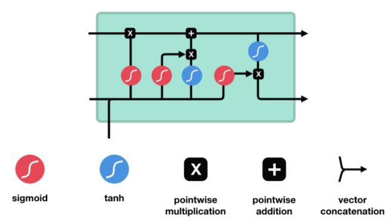

# 순환신경망

- **시간성** 데이터

  - 특징이 순서를 가지므로 **순차 데이터**라 부름
    (지금까지 다룬 데이터는 어느 한 순간에 취득한 정적인 데이터이고 고정 길이임)
  - 순차 데이터는 **동적**이며 보통 **가변** 길이임

  

  

- 순환 신경망과 LSTM
  - 순환 신경망은 시간성 정보를 활용하여 순차 데이터를 처리하는 효과적인 학습 모델
  - 매우 긴 순차 데이터를 처리에는 장기 의존성을 잘 다룬는 LSTM을 주로 사용
    (LSTM은 선별 기억능력을 가짐)
  - 시간에 따라 변화하는 특징을 잘 캐치 하겠다는 의도
- 최근에는 순환 신경망을 생성 모델로 사용
  - ex) CNN과 LSTM이 협력하여 자연 영상에 주석 생성하는 문제를 해결

## 순차 데이터

- 많은 응용
  - 심전도 신호를 분석하여 심장 이상 유무 판정
  - 주식 시세 분석하여 사고 파는 시점 결정
  - 음성 인식을 통한 지능적인 인터페이스 구축
  - 기계 번역기 또는 자동 응답 장치 제작
  - 유전자 열 분석을 통한 치료 계획 수립

### 표현

- 순차 데이터의 예시

  - 온라인 숫자와 3채널 심전도 신호

    

- 순차 데이터의 일반적 표기

  - 벡터의 벡터(벡터의 요소가 벡터)

    

  - 온라인 숫자의 요소는 1차원, 심전도의 요소는 3차원

    - ex) 심전도 신호 (초당 100번 샘플링하고 2분간 측정한다면 길이는 $T = 12000$)

      

- 훈련집합 

  - 각 샘플은 식 (8.2)로 표현

    

- 문자열 순차 데이터의 표현

  - 예) 기계 번역에서

    입력 $\bold{x}$가 "April is the curelest month"이고
    출력 $\bold{y}$가 "사월은 가장 잔인한 달"일 때, 식 (8.2) 표기법으로 어떻게 표현할까?

- 사전을 사용하여 표현

  - 사전 구축 방법
    - 사람이 사용하는 단어를 모아 구축
      또는 주어진 말뭉치를 분석하여 단어를 자동 추출하여 구축
      ex) 영어를 불어로 번역하는 논문에서는 사용 빈도가 가장 높은 3만 개 단어로 사전 구축함
  - 사전을 사용한 텍스트 순차 데이터의 표현 방법
    - 단어 가방
    - 원핫 코드
    - 단어 임베딩

#### 단어 가방

- 단어 각각의 빈도수를 세어 $m$차원의 벡터로 표현 ($m$은 사전 크기)

- 한계

  - 정보 검색에 주로 사용되지만, 기계 학습에는 부적절
    - "April is the curelest month"와 "The cruelest month is April"은 같은 특징 벡터로 표현
      :arrow_forward: **시간성 정보가 사라짐**

  

#### 원핫 코드

- 해당 단어의 위치만 1로 표시
  - ex) "April is the curelest month"는 
    $\bold{x} = ((0,0,1,0,0,0,...)^T,(0,0,0,0,1,0,...)^T,...)^T$로 표현
    - $m$차원 벡터를 요소로 가진 5차원 벡터
- 한계
  - 한 **단어**를 표현하는데 $m$차원 벡터를 사용하는 **비효율**(차원의 저주)
  - 단어간의 유사성을 측정할 수 없음

#### 단어 임베딩

- 고차원에서 유사하면 저차원에서도 투영하겠다(Projection)

- 단어 사이의 상호작용을 분석하여 새로운 공간으로 변환 (보통 $m$보다 훨씬 낮은 차원으로 변환)

- 변환 과정은 학습이 말뭉치를 훈련집합으로 사용하여 알아냄
  ex) word2vec [Cho2014b]는 $m=30000$차원을 620차원으로 변환

- 각각의 의미를 이해해서 저차원으로 투영

  

### 특성

- 특징이 나타나는 순서가 중요
  - "아버지가 방에 들어가신다"를 "아버지 가방에 들어가신다"로 바꾸면 의미가 크게 훼손
  - 비순차 데이터에서는 순서를 바꾸어도 무방
- 샘플마다 길이가 다름
  - [그림 8-2]의 예제
  - 순환 신경망은 은닉층에 순환 연결을 부여하여 가변 길이 수용
- 문맥 의존성
  - 비순차 데이터는 공분산이 특징 사이의 의존성을 나타냄
  - 순차 데이터에서는 공분산은 의미가 없고, 대신 문맥 의존성이 중요함
    - ex) "그녀는 점심때가 다 되어서야 ... 점심을 먹었느넫, 철수는 ..."에서
      "그녀는"과 "먹었는데"는 강한 문맥 의존성을 가짐
    - 특히 이 경우 둘 사이의 간격이 크므로 **장기 의존성**이라 부름 <- LSTM으로 처리

## 순환 신경망

- 필수 기능
  - 시간성 : 특징을 순서대로 한 번에 하나씩 입력해야 한다
  - 가변 길이 : 길이가 $T$인 샘플을 처리하려면 은닉층이 $T$번 나타나야 한다. $T$는 가변적이다
  - 문맥 의존성 : 이전 특징 내용을 기억하고 있다가 적절한 순간에 활용해야 한다

### 구조

- RNN의 구조

  - 기존 깊은 신경망과 유사

    - 입력층, 은닉층, 출력층을 가짐

  - 다른 점은 은닉층이 **순환 연결**을 가진다는 점

    - 시간성, 가변 길이, 문맥 의존성을 모두 처리할 수 있음
    - 순환 연결은 $t-1$ 순간에 발생한 정보를 $t$ 순간으로 전달하는 역할

    

- 수식으로 쓰면

  

  - $t=1$ 순간에 계산하고, 그 결과를가지고 $t=2$ 순간에 계산하고, ... $T$ 순간까지 반복
  - 일반적으로 $t$순간에는 $t-1$순간의 은닉층 값(상태)$\bold{h}^{(t-1)}$과 
    $t$순간의 입력 $\bold{x}^{(t)}$를 받아 $\bold{h}^{(t)}$로 전환함
  - $\theta$는 순환 신경망의 매개변수

  

- 식 (8.3)을 펼치면

  

- 순환 신경망의 매개변수 (가중치 집합)는 $\theta = \{\bold{U,W,V,b,c}\}$

  - $\bold{U}$ : 입력층 - 은닉층을 연결하는 $p*d$ 행렬
  - $\bold{W}$ : 은닉층 - 은닉층을 연결하는 $p*p$ 행렬
  - $\bold{V}$ :  은닉층 - 출력층을 연결하는 $q*p$ 행렬
  - $\bold{b,c}$는 바이어스로서 각각 $p*1$과 $q*1$ 행렬
  - RNN 학습이란 훈련집합을 최적의 성능으로 예측하는 $\theta$값을 찾는 일

- 매개변수 공유

  - 매 순간 다른 값을 사용하지 않고 같은 값을 공유함
  - 공유의 장점
    - 추정할 때 매개변수 수가 획기적으로 줄어듦
    - 매개변수의 수가 특징 벡터의 길이 $T$에 무관
    - 특징이 나타나는 순간이 뒤바뀌어도 같거나 유사한 출력을 만들 수 있음
      ex) "어제 이 책을 샀다"와 "이 책을 어제 샀다"를 비슷한 영어문장으로 번역할 수 있음

- 문서 단위 언어 모델의 예

  

  - 가중치는 중간에 안바뀐다

- 다양한 RNN 구조

  - [그림 8-4]는 입력의 개수 $T$와 출력의 개수 $L$이 같은 경우

  

  - [그림 8-5]는 $T \ne L$인 경우

    

  

  - many-to-many : machine translation 할 때

  

- 기본 RNN의 연산 그래프

  - 같은 가중치 행렬 $\bold{W}$을 매 시간마다 재사용함

    

- 다대다 RNN의 연산 그래프

  

- 일대다 RNN의 연산 그래프

  

- 문장 대 문장 RNN의 연산 그래프

  - 다대일과 일대다의 조합

  

  - 결과적으로 신경망 2개가 유기적으로 동작하는 것

### 동작

- RNN의 가중치

  

  - $\bold{u}_j = (u_{j1}, u_{j2},...,u_{jd})$는 $\bold{U}$행렬의 $j$번째 행 ($h_j$에 연결된 선의 가중치들)

    

- 은닉층의 계산

  

- 은닉층 계산이 끝난 후 출력층의 계산

  

- RNN의 동작(시험 나옴)

  

  

- RNN 동작의 예

  - 순차적 입력

  

  - Tanh 동작의 예

    

  - 은닉층 정보 전달

    

  - 입력 + 은닉층 정보 갱신

    

- RNN의 기억 기능

  

### BPTT 학습

- 훈련집합 

  - 샘플 $\bold{x}_i$와 $\bold{y}_i$는 길이가 $T_i$와 $L_i$인 시간성 데이터

- RNN과 DMLP의 유사성

  - 둘 다 입력층, 은닉층, 출력층을 가짐

  - [그림 8-8(a)]는 RNN의 노드를 수직으로 배치하여 DMLP와 비교하기 쉽게 함

    

- RNN과 DMLP의 차별성

  - RNN은 샘플마다 은닉층의 수가 다름 (얼마나 전달될 수 있는지에 따라 은닉층의 수가 다름)
  - DMLP는 왼쪽에 입력, 오른쪽에 출력이 있지만, RNN은 매 순간 입력과 출력이 있음
  - RNN은 가중치를 공유함
    - DMLP는 가중치를 $\bold{W}^1,\bold{W}^2,\bold{W}^3,...$로 표기하는데, RNN은 $\bold{W}$로 표기

- 목적함수의 정의

  

- 학습이 할 일

  

- [그림 8-10]은 식 (8.21)을 설명

  

- 시간에 따른 오류역전파의 동작

  

- 잘린 시간에 따른 오류역전파의 동작

  

  - 전체를 다 back propagate 하기에는 부담

### 양방향 RNN

- 양방향 문맥 의존성

  - 왼쪽에서 오른쪽으로만 정보가 흐르는 단방향 RNN은 한계

  - 예, [그림 8-11]에서 '거지'와 '지지'를 구별하기 어려움

    

- 양방향 RNN(Bidirectional RNN)

  - $t$순간의 단어는 앞쪽단어와 뒤쪽 단어 정보를 모두 보고 처리됨
  - 기계 번역에서도 BRNN을 활용함

  

## 장기 문맥 의존성

- 장기 문맥 의존성

  - 관련된 요소가 멀리 떨어진 상황

  - ex) 아래 문장에서 순간 $t=1$의 '길동은'과 순간 $t=32$의 '쉬기로'는 아주 밀접한 관련

    

    

- 문제점

  - 그레이디언트 소멸 ($\bold{W}$ 요소가 1보다 작을 때)
    또는 그레이디언트 폭발($\bold{W}$ 요소가 1보다 클 때)

  - RNN은 DMLP나 CNN보다 심각
    - 긴 입력 샘플이 자주 발생하기 때문
    - 가중치 공유 때문에 같은 값을 계속 곱함

- LSTM은 가장 널리 사용되는 해결책

## LSTM(Long Short Term Memory)

### 게이트를 이용한 영향력 범위 확장

- 입력 게이트와 출력 게이트

  - 게이트를 열면 (O) 신호가 흐르고, 닫으면 (X) 차단됨
  - 예) [그림 8-14]에서 $t=1$에서는 입력만 열렸고, 32와 33 에서는 입력과 출력이 모두 열림
  - 실제로는 [0,1] 사이의 실수 값으로 개폐 정도를 조절
  - 이 값은 학습으로 알아냄

  

### LSTM의 동작

- 크게 4가지의 구성

  - 장기 기억 : 메모리 블록 (셀)의 은닉 상태
  - 기억 유지 혹은 제거 : 망각 게이트 (1: 유지, 0 : 제거)
  - 입력 : 입력 게이트
  - 출력 : 출력 게이트

  

  - 포겟 게이트 : 시그모이드 활성함수를 통과(확률값으로 변환)
    - 이전 내용이 중요하다면 메모리값을 유지해줄 것이다
    - 이전 내용이 필요없어진다면 메모리값을 날려버릴 것이다(Flush)
  - 입력 게이트 : 지금 들어오는 정보가 중요한가?
    - 시그모이드 활성함수 통과, 현재 값이 중요하다면 메모리 셀에 +해서 저장하겠다
  - 출력 게이트
    - 출력값을 얼마나 내보낼 것인지 결정

- 전체 동작 예시

  

  

- 시간에 따른 LSTM의 동작

  

- 쌓은 LSTM의 동작

  

- 그레이디언트 흐름

  

  - 그레이디언트 소멸 문제 걱정 없다

## 응용사례

- 순환 신경망은 분별 모델뿐 아니라 생성 모델로도 활용됨

  

- 장기 문맥을 처리하는 데 유리한 LSTM이 주로 사용됨

### 언어 모델

- 문장, 즉 단어 열의 확률 분포

  - ex) $P$(자세히, 보아야, 예쁘다) > $P$(예쁘다, 보아야, 자세히)

- 활용

  - 음성 인식기 또는 언어 번역기가 후보로 출력한 문장이 여럿 있을 때, 언어 모델로 확률을  계산한 다음 확률이 가장 높은 것을 선택하여 성능을 높임

- 확률분포를 추정하는 방법

  - $n$-그램
  - 다층 퍼셉트론
  - 순환 신경망

- $n$-그램을 이용한 언어 모델

  - 고전적인 방법

    

  - 문장을 $\bold{x} = (z_1,z_2,...,z_T)^T$라 하면, $\bold{x}$가 발생할 확률을 식 (8.47)로 추정

    

  - $n$-그램은 $n-1$개의 단어만 고려하는데, 이때 식 (8.48)이 성립

    
    - 알아야 할 확률의 개수는 $m^n$ -> 차원의 저주 때문에 $n$을 1~3 정도로 작게 해야만 함
    - 확률 추정은 말뭉치를 사용

  - 단어가 원핫코드로 표현되므로 단어 간의 의미 있는 거리를 반영하지 못하는 한계

- 순환 신경망을 이용한 언어 모델

  - 현재까지 본 단어 열을 기반으로 다음 단어를 예측하는 방식으로 학습
    확률분포 추정뿐만 아니라 문장 생성 기능가지 갖춤

  - 비지도 학습에 해당하며, 말뭉치로부터 쉽게 훈련집합 구축 가능

  - ex) 자세히 보아야 예쁘다의 샘플화

    

  - 일반화

    

    

- 순환 신경망의 학습

  - 말뭉치에 있는 문장을 식 (8.49)처럼 변환하여 훈련집합을 만든 다음, BPTT학습 알고리즘 적용

- 학습을 마친 순환 신경망의 활용

  - 기계 번역기나 음성 인식기의 성능을 향상하는 데 활용

    

- 생성 모델로 활용

  - 문장 생성 알고리즘

    

### 기계 번역

- 기계번역

  - 훈련 샘플 예

    

  - 언어 모델보다 어려움

    - 언어 모델은 입력 문장과 출력 문장의 길이가 같은데, 
      기계 번역은 길이가 서로 다른 열 대 열 문제
    - 어순이 다른 문제

  - 고전적인 통계적 기계 번역 방법의 한계

  - 현재는 딥러닝에 기반한 신경망 기계 번역 방법이 주류

- LSTM을 사용하여 번역 과정 전체를 통째로 학습

  - LSTM 2개를 사용 (앞쪽은 인코더, 뒤쪽은 디코더)

  - 인코더는 원시 언어 문장 $\bold{x}$를 $\bold{h}_{Ts}$라는 특징 벡터로 변환

  - 디코더는 $\bold{h}_{Ts}$를 가지고 목적 언어 문장 $\bold{y}$를 생성함

    

    - 가변 길이의 문장을 고정 길이의 특징 벡터로 변환한 후, 고정 길이에서 가변 길이 문장을 생성
      -> 문장이 길이가 크게 다를 때는 성능 저하

- 모든 순간의 상태 변수를 사용하는 방식

  - 인코더의 계산 결과인 $\bold{h}_1, \bold{h}_2, ..., \bold{h}_{Ts}$를 모두 디코더에 넘겨 줌

  - 양방향 구조를 채택하여 어순이 다른 문제를 해결

    

### 영상 주석 생성

- 영상 주석 생성 응용

  - 영상 속 물체를 검출하고 인식, 물체의 속성과 행위, 물체 간의 상호 작용을 알아내는 일

    \+ 의미를 요약하는 문장 생성하는 일

  - 예전에는 물체 분할, 인식, 단어 생성과 조립 단계를 따로 구현한 후 연결하는 접근방법
  - 현재는 딥러닝 기술을 사용하여 통째 학습

- 딥러닝 접근방법

  - CNN은 영상을 분석하고 인식 + LSTM은 문장을 생성

    

- 훈련집합

  - $\bold{x}$는 영상, $\bold{y}$는 영상을 기술하는 문장 ($\bold{y} = (<시작>, \bold{z}_1, \bold{z}_2, ..., \bold{z}_T, <끝>)^T$)로 표현됨

- CNN

  - 입력 영상 $\bold{x}$를 단어 임베딩 공간의 특징 벡터 $\bold{\tilde{z}}_{-1}$로 변환

    

- 훈련 샘플 $\bold{y}$의 단어 $\bold{z}_t$는 단어 임베딩 공간의 특징 벡터 $\bold{\tilde{z}}_{\bold{t}}$로 변환됨

  - 식 8.50의 두 번째 줄에서 행렬 $\bold{E}$를 이용하여 변환
  - $\bold{E}$는 통째 학습 과정에서 CNN, LSTM과 동시에 최적화됨

- 학습 과정의 입력

  

- 목적함수

  

- 학습이 최적화해야 할 매개변수 집합

  

- $\Theta$는 통째 학습으로 한꺼번에 최적화 됨 

- 영상 주석 적용 사례

  

  

  

- 영상 주석에서의 집중 적용 사례

  

  

- 영상 질의 응답 적용 사례

  

