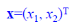
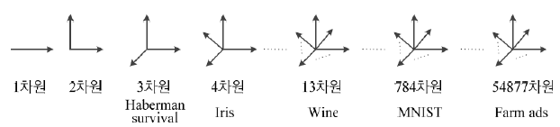
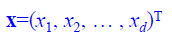
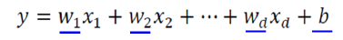
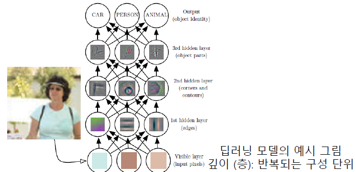

# 기계학습이란

## 정의

## 지식기반 :arrow_forward: 기계학습 대전환

## 개념

- 교사학습의 예

  - 가로축은 시간, 세로축은 이동체의 위치
  - 관측한 4개의 점이 데이터

- 예측 문제

  - 임의의 시간이 주어질 때, 이동체의 위치는?
  - 회귀문제와 분류문제
    - 회귀 : 목표치가 실수
    - 분류 : 목표치가 부류 혹은 종류의 값

- 훈련집합

  - 가로축은 특징, 세로축은 목표치 
  - 관측한 4개의 점이 훈련집합

  

- 관찰된 데이터를 어떻게 설명할 것인가?

  - 눈대중으로 봤을 때 점들이 직선을 이룬다 :arrow_forward: 모델로 직선을 선택을 가정
  - 직선 모델의 수식
    - y = wx + b (매개변수 w, b)

- 기계학습은

  - 가장 정확하게 예측할 수 있는 **최적의 매개변수**를 찾는 작업
  - 처음에는 최적값을 모르니 **임의의 값**에서 시작, 점점 성능을 개선해 **최적에 도달**

  

  - f1 :arrow_forward: f2 :arrow_forward: f3 (성능개선)
    - w = 0.5, b = 2

- 학습을 마치면

  - 새로운 **특징(x값)**에 대응되는 **목표치(y값)**의 예측에 사용
  - y = 0.5x + 2 :arrow_forward: x가 10일때 y가 7이라고 예측

- 궁극적인 목표

  - 훈련집합에 없는 **새로운 샘플**에 대한 오류 최소화
    - 새로움 샘플 집합 = 테스트 집합(Test Set)
  - 일반화 능력 : 테스트 집합에 대한 높은 성능

- 필수요소

  - 내, 외부적 규칙 존재
  - 수학적으로 설명 불가능
  - 데이터가 있어야 함

## 사람 VS 기계 학습

# 특징공간에 대한 이해

## 1차원과 2차원 특징공간

- 1차원 특징공간

  

- 2차원 특징공간

  

  - 특징 벡터 표기

    

  - 예시

    - x = (몸무게,키)^T, y = 장타율

## 다차원 특징공간

- x값(특징)의 종류가 몇개인지에 따라 d차원
  - 모든 데이터는 특징공간 안에 존재한다

- d-차원 데이터

  - 특징 벡터 표기

    

  - 학습모델

    - 직선 모델인 경우 : 매개변수 수 = d+1

      

    - 2차 곡선 모델인 경우 : 매개변수 수 = d^2 + d + 1

      

      - 최적화를 잘 해야 함

## 특징공간 변환과 표현문제

- 선형 분리 불가능**한 원래 특징 공간

  - 직선모델 적용시 정확도 75프로 한계

    

    - XOR 문제
    - 좌표계를 변형시케 선형에 가깝게 만든다

- 표현문제의 예

  

- 식으로 변환된 새로운 특징 공간

  - 공간변환을 통해 직선 모델로 100% 정확도

    

- 표현학습

  - 좋은 특징 공간을 자동으로 찾는 작업

  - 딥 러닝 (Deep Learning)

    - 다수의 은닉층을 가진 신경망을 이용하여 최적의 계층적인 특징 공간을 찾아냄
    - 아래쪽 은닉층은 저급 특징(선, 구석점 등), 위쪽은 고급 특징(얼굴, 바퀴 등) 추출

    

- 차원에 대한 몇가지 설명
  - 거리 : 차원에 무관하게 수식 적용 가능
  - 보통 2~3차원의 저차원에서 식을 고안해 고차원으로 확장 적용
- 차원의 저주(Curse of dimensionality)
  - 차원이 높아짐에 따라 발생하는 현실적인 문제들
    - 차원이 크면 클수록 데이터가 더 많이 필요하다

