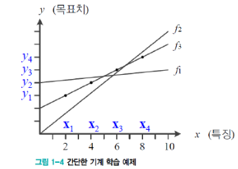

# 기계학습이란

## 정의

## 지식기반 :arrow_forward: 기계학습 대전환

## 개념

- 교사학습의 예

  - 가로축은 시간, 세로축은 이동체의 위치
  - 관측한 4개의 점이 데이터

- 예측 문제

  - 임의의 시간이 주어질 때, 이동체의 위치는?
  - 회귀문제와 분류문제
    - 회귀 : 목표치가 실수
    - 분류 : 목표치가 부류 혹은 종류의 값

- 훈련집합

  - 가로축은 특징, 세로축은 목표치 
  - 관측한 4개의 점이 훈련집합

  

- 관찰된 데이터를 어떻게 설명할 것인가?

  - 눈대중으로 봤을 때 점들이 직선을 이룬다 :arrow_forward: 모델로 직선을 선택을 가정
  - 직선 모델의 수식
    - y = wx + b (매개변수 w, b)

- 기계학습은

  - 가장 정확하게 예측할 수 있는 **최적의 매개변수**를 찾는 작업
  - 처음에는 최적값을 모르니 **임의의 값**에서 시작, 점점 성능을 개선해 **최적에 도달**

  

  - f1 :arrow_forward: f2 :arrow_forward: f3 (성능개선)
    - w = 0.5, b = 2

- 학습을 마치면

  - 새로운 **특징(x값)**에 대응되는 **목표치(y값)**의 예측에 사용
  - y = 0.5x + 2 :arrow_forward: x가 10일때 y가 7이라고 예측

- 궁극적인 목표

  - 훈련집합에 없는 **새로운 샘플**에 대한 오류 최소화
    - 새로움 샘플 집합 = 테스트 집합(Test Set)
  - 일반화 능력 : 테스트 집합에 대한 높은 성능

## 사람 VS 기계 학습

