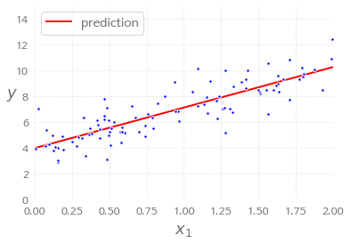
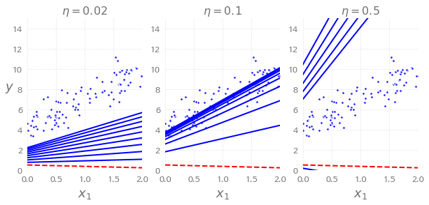
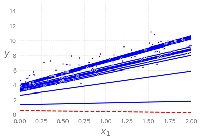
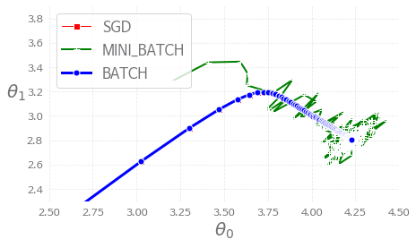
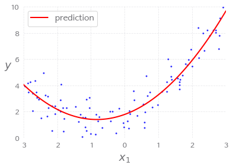
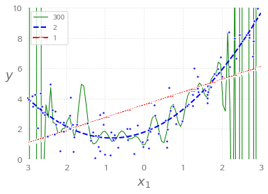
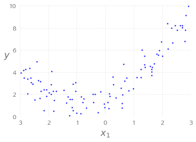

# 인공지능 과제1 - 20142697 권민수

```python
# 선형회귀
# 관련 라이브러리
import numpy as np
%matplotlib inline
import matplotlib
import matplotlib.pyplot as plt
```


```python
# 랜덤 X 집합 생성 (100행 1열)
X = 2 * np.random.rand(100, 1) 
y = 4 + 3 * X + np.random.randn(100,1) # y = f(x)
plt.plot(X, y, "b") # X, y 를 blue 마커로 plot
plt.xlabel("$x_1$", fontsize = 18)
plt.ylabel("$y$", rotation = 0, fontsize = 18)
plt.axis([0,2,0,15]) # xmin, xmax, ymin, ymax
plt.show()

# (1) 화면 출력 확인
```


- X 집합을 랜덤으로 구성했고, f(x)에 추가적으로 랜덤항이 하나 더 있어서 그래프로 그리면 이렇게 됨

```python
### 정규 방정식을 사용한 선형회귀 접근 ###
X_b = np.c_[np.ones((100,1)), X] # np.c_ : 행렬을 열방향으로 합치는 함수, 1열에는 1, 2열에는 X값 저장
theta_best = np.linalg.inv(X_b.T.dot(X_b)).dot(X_b.T).dot(y) # np.linalg.inv() : 역행렬 구하는 함수, dot() 행렬곱셈

# (2) theta_best 출력 확인
print(theta_best)
```

    [[3.96871983]
     [3.13682135]]


```python
X_new = np.array([[0],[2]])
X_new_b = np.c_[np.ones((2,1)), X_new]
y_predict = X_new_b.dot(theta_best)
# (3) y_predict 출력 확인
print(y_predict)
```

    [[ 3.96871983]
     [10.24236253]]


```python
plt.plot(X_new,y_predict,"r-",linewidth=2,label="prediction")
plt.plot(X, y, "b.")
plt.xlabel("$x_1$", fontsize = 18)
plt.ylabel("$y$", rotation = 0, fontsize = 18)
plt.legend(loc = "upper left", fontsize = 14)
plt.axis([0,2,0,15])
plt.show()
# (4) 화면 출력 확인
```





```python
from sklearn.linear_model import LinearRegression
lin_reg = LinearRegression()
lin_reg.fit(X,y) # fit : 모형 추정, 상수항 결합을 자동으로 해줌
# (5) lin_reg.intercept_, lin_reg.coef_ 출력 확인
print(lin_reg.intercept_) # 추정된 상수항
print(lin_reg.coef_) # 추정된 가중치 벡터
```

    [3.96871983]
    [[3.13682135]]


```python
# (6) lin.reg.predict(X_new) 출력 확인
print(lin_reg.predict(X_new)) # 앞서 추정한 모형으로 X_new 집합에 대한 출력 예측
```

    [[ 3.96871983]
     [10.24236253]]


```python
theta_best_svd, residuals, rank, s = np.linalg.lstsq(X_b, y, rcond = 1e-6) 
# lstsq : 행렬 A와 b를 받아 최소차승문제의 답 x, 전자제곱합 resid, 랭크 rank, 특이값 s를 반환 ... 선형연립방정식 풀기

# (7) theta_best_svd 출력 확인
print(theta_best_svd)
```

    [[3.96871983]
     [3.13682135]]


```python
# (8) np.linalg.pinv(X_b).dot(y) 출력 확인
print(np.linalg.pinv(X_b).dot(y)) # SVD 사용 역행렬 구하기
```

    [[3.96871983]
     [3.13682135]]


```python
### 경사 하강법을 사용한 선형회귀 접근 ###
eta = 0.1
n_iterations = 1000
m = 100
theta = np.random.randn(2,1)
for iteration in range(n_iterations):
    gradients = 2/m * X_b.T.dot(X_b.dot(theta) - y)
    theta = theta - eta * gradients
# (9) theta 출력 확인
print(theta)
```

    [[4.22817414]
     [2.80739908]]


```python
# (10) X_new_b.dot(theta) 출력 확인
print(X_new_b.dot(theta))
```

    [[4.22817414]
     [9.84297231]]


```python
theta_path_bgd = []
def plot_gradient_descent(theta, eta, theta_path = None):
    m = len(X_b)
    plt.plot(X, y, "b.")
    n_iterations = 1000
    for iteration in range(n_iterations):
        if iteration < 10:
            y_predict = X_new_b.dot(theta)
            style = "b-" if iteration > 0 else "r--"
            plt.plot(X_new, y_predict, style)
        gradients = 2/m * X_b.T.dot(X_b.dot(theta) - y)
        theta = theta - eta * gradients
        if theta_path is not None:
            theta_path.append(theta)
    plt.xlabel("$x_1$", fontsize = 18)
    plt.axis([0,2,0,15])
    plt.title(r"$\eta = {}$".format(eta), fontsize = 16)
np.random.seed(42)
theta = np.random.randn(2,1)
plt.figure(figsize = (10,4))
plt.subplot(131); plot_gradient_descent(theta, eta = 0.02)
plt.ylabel("$y$", rotation = 0, fontsize = 18)
plt.subplot(132); plot_gradient_descent(theta, eta = 0.1, theta_path=theta_path_bgd)
plt.subplot(133); plot_gradient_descent(theta, eta = 0.5)
plt.show()
# (11) 화면 출력 확인
```





```python
### 스토캐스틱 경사 하강법을 사용한 선형회귀 접근 ###
theta_path_sgd = []
m = len(X_b)
np.random.seed(42)
n_epochs = 50
t0, t1 = 5, 50
def learning_schedule(t):
    return t0 / (t + t1)
theta = np.random.randn(2,1)
for epoch in range(n_epochs):
    for i in range(m):
        if epoch == 0 and i < 20:
            y_predict = X_new_b.dot(theta)
            style = "b-" if i > 0 else "r--"
            plt.plot(X_new, y_predict, style)
        random_index = np.random.randint(m)
        xi = X_b[random_index:random_index+1]
        yi = y[random_index:random_index+1]
        gradients = 2 * xi.T.dot(xi.dot(theta) - yi)
        eta = learning_schedule(epoch * m + i)
        theta = theta - eta * gradients
        theta_path_sgd.append(theta)
plt.plot(X,y,"b.")
plt.xlabel("$x_1$", fontsize = 18)
plt.ylabel("$y$", rotation = 0, fontsize = 18)
plt.axis([0,2,0,15])
plt.show()
# (12) 화면 출력 확인
```





```python
# (13) theta 출력 확인
print(theta)
```

    [[4.27707077]
     [2.86885816]]


```python
from sklearn.linear_model import SGDRegressor
sgd_reg = SGDRegressor(max_iter = 50, penalty = None, eta0 = 0.1, random_state = 42)
# (14) sgd_reg.fit(X, y.ravel()) 출력 확인
print(sgd_reg.fit(X, y.ravel()))
```

    SGDRegressor(alpha=0.0001, average=False, early_stopping=False, epsilon=0.1,
                 eta0=0.1, fit_intercept=True, l1_ratio=0.15,
                 learning_rate='invscaling', loss='squared_loss', max_iter=50,
                 n_iter_no_change=5, penalty=None, power_t=0.25, random_state=42,
                 shuffle=True, tol=0.001, validation_fraction=0.1, verbose=0,
                 warm_start=False)


```python
# (15) sgd_reg.intercept_, sgd_reg.coef_ 출력 확인
print(sgd_reg.intercept_, sgd_reg.coef_)
```

    [4.27426738] [2.85942346]


```python
### 미니배치 경사 하강법을 사용한 선형회귀 접근 ###
theta_path_mgd = []
n_iterations = 50
minibatch_size = 20
np.random.seed(42)
theta = np.random.randn(2,1)
t0, t1 = 200, 1000
def learning_schedule(t):
    return t0 / (t + t1)
t = 0
for epoch in range(n_iterations):
    shuffled_indices = np.random.permutation(m)
    X_b_shuffled = X_b[shuffled_indices]
    y_shuffled = y[shuffled_indices]
    for i in range(0, m, minibatch_size):
        t += 1
        xi = X_b_shuffled[i:i+minibatch_size]
        yi = y_shuffled[i:i + minibatch_size]
        gradients = 2/minibatch_size * xi.T.dot(xi.dot(theta) - yi)
        eta = learning_schedule(t)
        theta = theta - eta * gradients
        theta_path_mgd.append(theta)
# (16) theta 출력 확인
print(theta)
```

    [[4.22875695]
     [2.83863073]]


```python
theta_path_bgd = np.array(theta_path_bgd)
theta_path_sgd = np.array(theta_path_sgd)
theta_path_mgd = np.array(theta_path_mgd)

plt.figure(figsize = (7,4))
plt.plot(theta_path_sgd[:,0], theta_path_sgd[:,1], "r-s", linewidth = 1, label = "SGD")
plt.plot(theta_path_mgd[:,0], theta_path_mgd[:,1], "g-+", linewidth = 2, label = "MINI_BATCH")
plt.plot(theta_path_bgd[:,0], theta_path_bgd[:,1], "b-o", linewidth = 3, label = "BATCH")
plt.legend(loc = "upper left", fontsize = 16)
plt.xlabel(r"$\theta_0$", fontsize = 20)
plt.ylabel(r"$\theta_1$    ", fontsize = 20, rotation = 0)
plt.axis([2.5,4.5,2.3,3.9])
plt.show()
# (17) 화면 출력 확인
```





```python
# 다차항회귀
# 관련 라이브러리
import numpy as np
import numpy.random as rnd

np.random.seed(42)
m = 100
X = 6 * np.random.rand(m,1) - 3
y = 0.5 * X**2 + X + 2 + np.random.randn(m,1)
plt.plot(X,y,"b.")
plt.xlabel("$x_1$", fontsize = 18)
plt.ylabel("$y$", rotation = 0, fontsize = 18)
plt.axis([-3,3,0,10])
plt.show()
# (1) 화면 출력 확인
```


```python
from sklearn.preprocessing import PolynomialFeatures
poly_features = PolynomialFeatures(degree=2, include_bias = False)
X_poly = poly_features.fit_transform(X)
# (2) X[0] 출력 확인
print (X[0])
```

    [-0.75275929]


```python
# (3) X_poly[0] 출력 확인
print (X_poly[0])
```

    [-0.75275929  0.56664654]


```python
lin_reg = LinearRegression()
lin_reg.fit(X_poly, y)
# (4) lin_reg.intercept_, lin_reg.coef_ 출력 확인
print (lin_reg.intercept_, lin_reg.coef_)
```

    [1.78134581] [[0.93366893 0.56456263]]


```python
X_new = np.linspace(-3, 3, 100).reshape(100,1)
X_new_poly = poly_features.transform(X_new)
y_new = lin_reg.predict(X_new_poly)
plt.plot(X,y,"b.")
plt.plot(X_new, y_new, "r-", linewidth = 2, label = "prediction")
plt.xlabel("$x_1$", fontsize = 18)
plt.ylabel("$y$", rotation = 0, fontsize = 18)
plt.legend(loc = "upper left", fontsize = 14)
plt.axis([-3,3,0,10])
plt.show()
# (5) 화면 출력 확인
```

    /usr/local/lib/python3.6/dist-packages/matplotlib/backends/backend_agg.py:211: RuntimeWarning: Glyph 8722 missing from current font.
      font.set_text(s, 0.0, flags=flags)
    /usr/local/lib/python3.6/dist-packages/matplotlib/backends/backend_agg.py:180: RuntimeWarning: Glyph 8722 missing from current font.
      font.set_text(s, 0, flags=flags)





```python
from sklearn.preprocessing import StandardScaler
from sklearn.pipeline import Pipeline

for style, width, degree in (("g-", 1, 300), ("b--", 2, 2), ("r-+", 2, 1)):
    polybig_features = PolynomialFeatures(degree = degree, include_bias = False)
    std_scaler = StandardScaler()
    lin_reg = LinearRegression()
    polynomial_regression = Pipeline([
        ("poly_features", polybig_features),
        ("std_scaler", std_scaler),
        ("lin_reg", lin_reg),
    ])
    
    polynomial_regression.fit(X,y)
    y_newbig = polynomial_regression.predict(X_new)
    plt.plot(X_new, y_newbig, style, label = str(degree), linewidth = width)
plt.plot(X, y, "b.", linewidth = 3)
plt.legend(loc = "upper left")
plt.xlabel("$x_1$", fontsize = 18)
plt.ylabel("$y$", rotation = 0, fontsize = 18)
plt.axis([-3,3,0,10])
plt.show()
# (6) 화면 출력 확인
```

    /usr/local/lib/python3.6/dist-packages/matplotlib/backends/backend_agg.py:211: RuntimeWarning: Glyph 8722 missing from current font.
      font.set_text(s, 0.0, flags=flags)
    /usr/local/lib/python3.6/dist-packages/matplotlib/backends/backend_agg.py:180: RuntimeWarning: Glyph 8722 missing from current font.
      font.set_text(s, 0, flags=flags)





```python
# 규제
# 관련 라이브러리
from sklearn.linear_model import Ridge

np.random.seed(42)
m = 20
X = 3 * np.random.rand(m,1)
y = 1 + 0.5 * X + np.random.randn(m,1) / 1.5
X_new = np.linspace(0, 3, 100).reshape(100,1)

def plot_model(model_class, polynomial, alphas, **model_kargs):
    for alpha, style in zip(alphas, ("b-", "g--", "r:")):
        model = model_class(alpha, **model_kargs) if alpha > 0 else LinearRegression()
        if polynomial:
            model = Pipeline([
                ("poly_features", PolynomialFeatures(degree=10, include_bias=False)),
                ("std_scaler", StandardScaler()),
                ("regul_reg", model),
            ])
        model.fit(X,y)
        y_new_regul = model.predict(X_new)
        lw = 2 if alpha > 0 else 1
        plt.plot(X_new, y_new_regul, style, linewidth=lw, label = r"$\alpha = {}$".format(alpha))
    plt.plot(X, y, "b.", linewidth = 3)
    plt.legend(loc = "upper left", fontsize = 15)
    plt.xlabel("$x_1$", fontsize = 15)
    plt.axis([0,3,0,4])
    
plt.figure(figsize = (8,4))
plt.subplot(121)
plot_model(Ridge, polynomial=False, alphas = (0,10,100), random_state = 42)
plt.ylabel("$y$", rotation = 0, fontsize = 18)
plt.subplot(122)
plot_model(Ridge, polynomial=True, alphas = (0,10**-5,1), random_state = 42)
plt.show()
# 화면 출력 확인 및 결과 분석
```


```python
# 활성함수
# 파이썬 2, 파이썬 3 지원
from __future__ import division, print_function, unicode_literals

# 관련 라이브러리
import os

def logit(z):
    return 1 / (1 + np.exp(-z))

def relu(z):
    return np.maximum(0,z)

def derivative(f, z, eps = 0.000001):
    return (f(z+eps) - f(z-eps)) / (2 * eps)

z = np.linspace(-5, 5, 200)

plt.figure(figsize = (11,4))

plt.subplot(121)
plt.plot(z, np.sign(z), "r-", linewidth = 2, label = "step")
plt.plot(z, logit(z), "g--", linewidth = 2, label = "sigmoid")
plt.plot(z, np.tanh(z), "b-", linewidth= 2, label = "tanh")
plt.plot(z, relu(z), "m-.", linewidth = 2, label = "ReLU")
plt.grid(True)
plt.legend(loc = "center right", fontsize = 14)
plt.title("activation function : g(z)", fontsize = 14)
plt.axis([-5,5,-1.2,1.2])

plt.subplot(122)
plt.plot(z, derivative(np.sign, z), "r-", linewidth = 2, label = "step")
plt.plot(0, 0, "ro", markersize = 5)
plt.plot(0, 0, "rx", markersize = 10)
plt.plot(z, derivative(logit, z), "g--", linewidth = 2, label = "sigmoid")
plt.plot(z, derivative(np.tanh, z), "b-", linewidth = 2, label = "tanh")
plt.plot(z, derivative(relu, z), "m-.", linewidth = 2, label = "ReLU")
plt.grid(True)
plt.title("gradient: g'(z)", fontsize = 14)
plt.axis([-5,5,-0.2,1.2])

plt.show()
# 화면 출력 확인 및 각 활성함수의 특징을 비교 서술
```





```python
# 오류 역전파

np.random.seed(0)

N, D = 3, 4

x = np.random.randn(N,D)
y = np.random.randn(N,D)
z = np.random.randn(N,D)

a = x * y
b = a + z
c = np.sum(b)

# (1) 해당 연산망의 그래프 연산을 손으로 작성
```


```python
import torch

x = torch.randn(N,D, requires_grad = True)
y = torch.randn(N,D, requires_grad = True)
z = torch.randn(N,D)

a = x * y
b = a + z
c = torch.sum(b)

c.backward()
# (3) 역전파 함수 backward() 를 이용한 x의 미분, y의 미분 출력 확인

# (4) (2)와 (3)의 방법의 차이를 설명
```


```python
# 신경망 학습
N, D_in, H, D_out = 64, 1000, 100, 10

x = torch.randn(N, D_in)
y = torch.randn(N, D_out)
w1 = torch.randn(D_in, H, requires_grad = True)
w2 = torch.randn(H, D_out, requires_grad = True)

learning_rate = 10e-6

for t in range(500):
    y_pred = x.mm(w1).clamp(min=0).mm(w2)
    loss = (y_pred - y).pow(2).sum()
    
    loss.backward()
    
    with torch.no_grad():
        w1 -= learning_rate * w1.grad
        w2 -= learning_rate * w2.grad
        w1.grad.zero_()
        w2.grad.zero_()
        
# 매 t마다 y_pred에 따른 loss 변화를 화면 출력 확인 (plot)하고, 결과 해석
```
