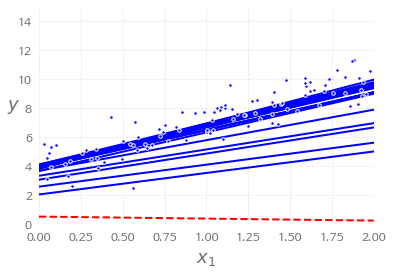

# 인공지능 과제1 - 20142697 권민수

## 1. 선형회귀

### 정규방정식

```python
# 20142697 권민수
# 선형회귀
# 관련 라이브러리
import numpy as np
%matplotlib inline
import matplotlib
import matplotlib.pyplot as plt
```


```python
# 0부터 1사이의 값을 가지는 100 행 1열 행렬 생성, 2배수 - 훈련집합
X = 2 * np.random.rand(100, 1) 
# 기대값 0, 표준편차 1의 가우시안 정규 분포를 따르는 행렬을 더 해줌
y = 4 + 3 * X + np.random.randn(100,1) # x 값이 커짐에 따라서 y값도 커진다
plt.plot(X, y, "b.") # X, y 를 blue 마커로 plot
plt.xlabel("$x_1$", fontsize = 18)
plt.ylabel("$y$", rotation = 0, fontsize = 18)
plt.axis([0,2,0,15]) # xmin, xmax, ymin, ymax
plt.show()

# (1) 화면 출력 확인
```


- y = 3x + 4 + 노이즈(가우시안 분포)
    - Θ0 = 4, Θ1 = 3 인 데이터


```python
### 정규 방정식을 사용한 선형회귀 접근 ###
X_b = np.c_[np.ones((100,1)), X] # np.c_ : 행렬을 열방향으로 합치는 함수
theta_best = np.linalg.inv(X_b.T.dot(X_b)).dot(X_b.T).dot(y) # np.linalg.inv() : 역행렬 구하는 함수, dot() 행렬곱셈

# (2) theta_best 출력 확인
print(theta_best)
```

    [[3.86501051]
     [3.13916179]]

- 정규 방정식을 사용해 Θ값을 찾는 방식, 아래는 정규방정식이다

- 노이즈 때문에 정확하게 나오지는 않지만, 매우 비슷하게 나온다

$$
\hat\theta = (X^T\cdot X)^{-1}\cdot X^T\cdot y
$$


```python
X_new = np.array([[0],[2]])
X_new_b = np.c_[np.ones((2,1)), X_new]
y_predict = X_new_b.dot(theta_best)
# (3) y_predict 출력 확인
print(y_predict)
```

    [[ 3.86501051]
     [10.14333409]]


- 새로운 테스트 집합 X_new_b에 위에서 구한 theta_best 값을 기반으로 예측 수행


```python
plt.plot(X_new,y_predict,"r-",linewidth=2,label="prediction")
plt.plot(X, y, "b.")
plt.xlabel("$x_1$", fontsize = 18)
plt.ylabel("$y$", rotation = 0, fontsize = 18)
plt.legend(loc = "upper left", fontsize = 14)
plt.axis([0,2,0,15])
plt.show()
# (4) 화면 출력 확인
```


- 정규방정식을 통해 구한 세타값으로 예측값을 플롯


```python
from sklearn.linear_model import LinearRegression
lin_reg = LinearRegression()
lin_reg.fit(X,y) # fit : 모형 추정, 상수항 결합을 자동으로 해줌
# (5) lin_reg.intercept_, lin_reg.coef_ 출력 확인
print(lin_reg.intercept_) # 추정된 상수항
print(lin_reg.coef_) # 추정된 가중치 벡터
```

    [3.86501051]
    [[3.13916179]]


- LinearRegression 객체를 활용해서 선형회귀분석 진행, 추정된 상수항(Θ0 = 4) 과 벡터(Θ1 = 3)가 위와 같이 나옴


```python
# (6) lin.reg.predict(X_new) 출력 확인
print(lin_reg.predict(X_new)) # 앞서 추정한 모형으로 X_new 집합에 대한 출력 예측
```

    [[ 3.86501051]
     [10.14333409]]


- 앞서 구한 상수항과 벡터를 기반으로 X_new의 값에 대한 출력 예측, 위와 같음


```python
theta_best_svd, residuals, rank, s = np.linalg.lstsq(X_b, y, rcond = 1e-6) 
# lstsq : 행렬 A와 b를 받아 최소차승문제의 답 x, 전자제곱합 resid, 랭크 rank, 특이값 s를 반환 ... 선형연립방정식 풀기

# (7) theta_best_svd 출력 확인
print(theta_best_svd)
```

    [[3.86501051]
     [3.13916179]]

- SVD 방법을 사용하는 np.linalg.lstsq 함수를 이용해 구해도 결과가 똑같이 나옴


```python
# (8) np.linalg.pinv(X_b).dot(y) 출력 확인
print(np.linalg.pinv(X_b).dot(y)) # SVD 사용 역행렬 구하기
```

    [[3.86501051]
     [3.13916179]]

- 마찬가지로 SVD를 사용해 유사 역행렬을 구하는 넘파이의 pinv 함수 사용해도 결과가 같음

### 경사하강법

```python
### 경사 하강법을 사용한 선형회귀 접근 ###
eta = 0.1
n_iterations = 1000
m = 100
theta = np.random.randn(2,1)
for iteration in range(n_iterations):
    gradients = 2/m * X_b.T.dot(X_b.dot(theta) - y) # 새로운 그레디언트 구하기
    theta = theta - eta * gradients
# (9) theta 출력 확인
print(theta)
```

    [[3.86501051]
     [3.13916179]]

- 경사 하강법을 이용해서 세타값 구하기

- 경사 하강법의 스텝
  $$
  \theta^{(next　step)} = \theta - \eta \nabla_\theta MSE(\theta)
  $$

- 정규 방정식으로 찾은 결과와 같음

```python
# (10) X_new_b.dot(theta) 출력 확인
print(X_new_b.dot(theta))
```

    [[ 3.86501051]
     [10.14333409]]

- 당연히 예측값도 동일하게 나옴

```python
theta_path_bgd = []
def plot_gradient_descent(theta, eta, theta_path = None):
    m = len(X_b)	# 훈련집합의 크기
    plt.plot(X, y, "b.")
    n_iterations = 1000
    for iteration in range(n_iterations):
        if iteration < 10:
            y_predict = X_new_b.dot(theta)
            style = "b-" if iteration > 0 else "r--" 
            # 첫번째 세타로 구한 그래프는 빨간색점선으로 플롯, 나머지는 파란색 실선
            plt.plot(X_new, y_predict, style)
        gradients = 2/m * X_b.T.dot(X_b.dot(theta) - y) # 그래디언트를 구한다
        theta = theta - eta * gradients	# 세타값 갱신
        if theta_path is not None:
            theta_path.append(theta)
    plt.xlabel("$x_1$", fontsize = 18)
    plt.axis([0,2,0,15])
    plt.title(r"$\eta = {}$".format(eta), fontsize = 16)
np.random.seed(42)
theta = np.random.randn(2,1)
plt.figure(figsize = (10,4))
plt.subplot(131); plot_gradient_descent(theta, eta = 0.02) # 작은 학습률
plt.ylabel("$y$", rotation = 0, fontsize = 18)
plt.subplot(132); plot_gradient_descent(theta, eta = 0.1, theta_path=theta_path_bgd) # 적당한 학습률
plt.subplot(133); plot_gradient_descent(theta, eta = 0.5) # 과한 학습률
plt.show()
# (11) 화면 출력 확인
```


- 학습률을 다르게 했을 때, 알고리즘이 최적화되는 과정을 플롯한 결과
  - 첫번째 그래프는 0.02의 학습률을 설정해, 언젠가는 최적점에 도달하지만 너무 느리다
  - 두번째 그래프는 적당한 학습률 설정을 통해 금방 최적점에 도달
  - 세번째 그래프는 0.5의 과한 학습률을 설정해, 최적점에 도달하지 못하고 멀어진다

```python
### 스토캐스틱 경사 하강법을 사용한 선형회귀 접근 ###
theta_path_sgd = []
m = len(X_b)
np.random.seed(42)
n_epochs = 50
t0, t1 = 5, 50

def learning_schedule(t): # 매 반복에서 학습률을 결정하는 학습 스케쥴 함수
    return t0 / (t + t1)

theta = np.random.randn(2,1) # 세타값 랜덤으로 초기화

for epoch in range(n_epochs):
    for i in range(m):
        if epoch == 0 and i < 20: # 첫 번째 세대, 20번째까지만 플롯
            y_predict = X_new_b.dot(theta)
            style = "b-" if i > 0 else "r--"
            plt.plot(X_new, y_predict, style)
        random_index = np.random.randint(m)
        xi = X_b[random_index:random_index+1]
        yi = y[random_index:random_index+1]
        gradients = 2 * xi.T.dot(xi.dot(theta) - yi)
        eta = learning_schedule(epoch * m + i)
        theta = theta - eta * gradients
        theta_path_sgd.append(theta)
        
plt.plot(X,y,"b.")
plt.xlabel("$x_1$", fontsize = 18)
plt.ylabel("$y$", rotation = 0, fontsize = 18)
plt.axis([0,2,0,15])
plt.show()
# (12) 화면 출력 확인
```




- 매 반복마다 새로운 학습률을 적용,  스토캐스틱 경사 하강법을 이용해서 구한 세타 최적값을 이용한 예측
  - 빠른 속도로 실제 세타값에 가까워 지는 모습이다

```python
# (13) theta 출력 확인
print(theta)
```

    [[3.90521218]
     [3.15642095]]

- 학습 결과 각각 4, 3에 매우 가까워진 모습

```python
from sklearn.linear_model import SGDRegressor
# 기본값으로 제곱 오차 비용 함수를 최적화 하는 클래스
sgd_reg = SGDRegressor(max_iter = 50, penalty = None, eta0 = 0.1, random_state = 42)
# (14) sgd_reg.fit(X, y.ravel()) 출력 확인
print(sgd_reg.fit(X, y.ravel()))
```

    SGDRegressor(alpha=0.0001, average=False, early_stopping=False, epsilon=0.1,
                 eta0=0.1, fit_intercept=True, l1_ratio=0.15,
                 learning_rate='invscaling', loss='squared_loss', max_iter=50,
                 n_iter_no_change=5, penalty=None, power_t=0.25, random_state=42,
                 shuffle=True, tol=0.001, validation_fraction=0.1, verbose=0,
                 warm_start=False)

- 제곱 오차 비용 함수를 이용해 최적화 진행

```python
# (15) sgd_reg.intercept_, sgd_reg.coef_ 출력 확인
print(sgd_reg.intercept_, sgd_reg.coef_)
```

    [3.86256592] [3.15101583]

- 정규 방정식으로 구한 값과 매우 비슷하다(4,3)

```python
### 미니배치 경사 하강법을 사용한 선형회귀 접근 ###
theta_path_mgd = []
n_iterations = 50
minibatch_size = 20
np.random.seed(42)
theta = np.random.randn(2,1)
t0, t1 = 200, 1000

def learning_schedule(t):
    return t0 / (t + t1)
t = 0

for epoch in range(n_iterations):
    shuffled_indices = np.random.permutation(m)	# 이 랜덤값으로 X_b, y 값을 뽑는다
    X_b_shuffled = X_b[shuffled_indices]
    y_shuffled = y[shuffled_indices]
    for i in range(0, m, minibatch_size): # 지정한 미니배치 사이즈만큼 건너뛰면서 반복 수행
        t += 1
        xi = X_b_shuffled[i:i+minibatch_size]
        yi = y_shuffled[i:i + minibatch_size]
        gradients = 2/minibatch_size * xi.T.dot(xi.dot(theta) - yi)
        eta = learning_schedule(t)
        theta = theta - eta * gradients
        theta_path_mgd.append(theta)
# (16) theta 출력 확인
print(theta)
```

    [[3.87558894]
     [3.13893713]]

- 미니배치 경사 하강법을 이용한 선형회귀 접근
  - 임의의 **작은 샘플 세트**에 대해 그래디언트를 계산
  - 정규 방정식으로 구한 값과 매우 비슷

```python
theta_path_bgd = np.array(theta_path_bgd)
theta_path_sgd = np.array(theta_path_sgd)
theta_path_mgd = np.array(theta_path_mgd)

plt.figure(figsize = (7,4))
plt.plot(theta_path_sgd[:,0], theta_path_sgd[:,1], "r-s", linewidth = 1, label = "SGD")
plt.plot(theta_path_mgd[:,0], theta_path_mgd[:,1], "g-+", linewidth = 2, label = "MINI_BATCH")
plt.plot(theta_path_bgd[:,0], theta_path_bgd[:,1], "b-o", linewidth = 3, label = "BATCH")
plt.legend(loc = "upper left", fontsize = 16)
plt.xlabel(r"$\theta_0$", fontsize = 20)
plt.ylabel(r"$\theta_1$    ", fontsize = 20, rotation = 0)
plt.axis([2.5,4.5,2.3,3.9])
plt.show()
# (17) 화면 출력 확인
```


- 풀 배치(파란색), SGD(빨간색), 미니배치(초록색)의 세타값 변화를 비교한 결과
  - 풀 배치는 가장 안정적으로 최적값에 도달한다(대신 속도는 느림)
  - SGD는 최적값을 찾아가는 과정이 험난하지만 결국 찾아가긴 한다
  - 미니 배치도 최적값을 찾아가는 과정이 험난하지만(SGD보다는 덜) 결국 찾아가긴 한다

## 2. 다차항회귀

```python
# 다차항회귀
# 관련 라이브러리
import numpy as np
import numpy.random as rnd

np.random.seed(42)
m = 100
X = 6 * np.random.rand(m,1) - 3
y = 0.5 * X**2 + X + 2 + np.random.randn(m,1) # 노이즈 포함
plt.plot(X,y,"b.")
plt.xlabel("$x_1$", fontsize = 18)
plt.ylabel("$y$", rotation = 0, fontsize = 18)
plt.axis([-3,3,0,10])
plt.show()
# (1) 화면 출력 확인
```


- 노이즈를 포함하는 간단한 2차 방정식 데이터 생성
  $$
  y = 0.5x^2 + x + 2
  $$

```python
from sklearn.preprocessing import PolynomialFeatures
poly_features = PolynomialFeatures(degree=2, include_bias = False)
X_poly = poly_features.fit_transform(X)
# (2) X[0] 출력 확인
print (X[0])
```

    [-0.75275929]

- 훈련세트에 있는 각 특성을 제곱해 새로운 특성으로 추가

```python
# (3) X_poly[0] 출력 확인
print (X_poly[0])
```

    [-0.75275929  0.56664654]

- X와 다르게 X_poly는 새로운 특성이 추가 됨(제곱된 결과)

```python
lin_reg = LinearRegression()
lin_reg.fit(X_poly, y)
# (4) lin_reg.intercept_, lin_reg.coef_ 출력 확인
print (lin_reg.intercept_, lin_reg.coef_)
```

    [1.78134581] [[0.93366893 0.56456263]]

- 확장된 X_poly 데이터에 선형회귀를 적용하면, 원래 값들인 2, 1, 0.5에 가깝게 구해진다

```python
X_new = np.linspace(-3, 3, 100).reshape(100,1)
X_new_poly = poly_features.transform(X_new)
y_new = lin_reg.predict(X_new_poly)
plt.plot(X,y,"b.")
plt.plot(X_new, y_new, "r-", linewidth = 2, label = "prediction")
plt.xlabel("$x_1$", fontsize = 18)
plt.ylabel("$y$", rotation = 0, fontsize = 18)
plt.legend(loc = "upper left", fontsize = 14)
plt.axis([-3,3,0,10])
plt.show()
# (5) 화면 출력 확인
```


- 그래프로 예측값을 플롯해본 결과, 그럴듯하게 학습이 된 것을 알 수 있다

```python
from sklearn.preprocessing import StandardScaler
from sklearn.pipeline import Pipeline

for style, width, degree in (("g-", 1, 300), ("b--", 2, 2), ("r-+", 2, 1)):
    # 여기서 degree는 주어진 차수까지 특성 간의 교차항을 몇개 쓸건지를 정함
    polybig_features = PolynomialFeatures(degree = degree, include_bias = False)
    std_scaler = StandardScaler()
    lin_reg = LinearRegression()
    polynomial_regression = Pipeline([
        ("poly_features", polybig_features),
        ("std_scaler", std_scaler),
        ("lin_reg", lin_reg),
    ])
    
    polynomial_regression.fit(X,y)
    y_newbig = polynomial_regression.predict(X_new)
    plt.plot(X_new, y_newbig, style, label = str(degree), linewidth = width)
plt.plot(X, y, "b.", linewidth = 3)
plt.legend(loc = "upper left")
plt.xlabel("$x_1$", fontsize = 18)
plt.ylabel("$y$", rotation = 0, fontsize = 18)
plt.axis([-3,3,0,10])
plt.show()
# (6) 화면 출력 확인
```


- 교차항을 300개 쓴 경우, 훈련 샘플에 가까이 가려고 하는 과정에서 구불구불하게 나타남
  - 과잉적합에 해당
- 교차항을 1개 쓴 경우, 직선으로 나타남
  - 과소적합에 해당
- 교차항을 2개 쓴 경우, 역시 2차방정식으로 생성된 데이터기 때문에 가장 일반화가 잘 됨

## 3. 규제

```python
# 규제
# 관련 라이브러리
from sklearn.linear_model import Ridge

# 릿지 회귀 사용
np.random.seed(42)
m = 20
X = 3 * np.random.rand(m,1)
y = 1 + 0.5 * X + np.random.randn(m,1) / 1.5
X_new = np.linspace(0, 3, 100).reshape(100,1)

def plot_model(model_class, polynomial, alphas, **model_kargs):
    for alpha, style in zip(alphas, ("b-", "g--", "r:")):
        # alpha값이 0이면 일반 선형회귀분석이 됨
        model = model_class(alpha, **model_kargs) if alpha > 0 else LinearRegression()
        if polynomial:
            model = Pipeline([
                ("poly_features", PolynomialFeatures(degree=10, include_bias=False)),
                ("std_scaler", StandardScaler()),
                ("regul_reg", model),
            ])
        model.fit(X,y)
        y_new_regul = model.predict(X_new)	# 규제를 추가된 선형회귀분석 진행
        lw = 2 if alpha > 0 else 1
        plt.plot(X_new, y_new_regul, style, linewidth=lw, 
                 							label = r"$\alpha = {}$".format(alpha))
    plt.plot(X, y, "b.", linewidth = 3)
    plt.legend(loc = "upper left", fontsize = 15)
    plt.xlabel("$x_1$", fontsize = 15)
    plt.axis([0,3,0,4])
    
plt.figure(figsize = (8,4))
plt.subplot(121)
plot_model(Ridge, polynomial=False, alphas = (0,10,100), random_state = 42)
plt.ylabel("$y$", rotation = 0, fontsize = 18)
plt.subplot(122)
plot_model(Ridge, polynomial=True, alphas = (0,10**-5,1), random_state = 42)
plt.show()
# 화면 출력 확인 및 결과 분석
```


- 릿지 규제가 추가된 선형 회귀

  - 릿지 회귀의 규제항이 추가됨
    $$
    \alpha \sum^n_{i=1}\theta^2_i
    $$

    - 훈련하는 동안에만 비용 함수에 추가되고, 훈련이 끝나면 규제가 없는 성능 지표로 평가

    - 알파는 여기서 하이퍼 파라미터, 모델을 얼마나 규제할 지 조절함

      - 0 이면 선형회귀와 같아짐

      - 아주 커지면 모든 가중치가 0에 가까워지고, 데이터의 평균을 지나는 수평선이 됨

      - 커질수록 분산은 줄고, 편향은 커지게 됨

      - 릿지 회귀의 비용함수
        $$
        J(\theta) = MSE (\theta) + \alpha\frac{1}{2}\sum^n_{i=1}\theta^2_i
        $$

- 왼쪽 그림은 선형회귀분석, 규제가 많아 질수록 그래프가 수평에 가까워진다
- 오른족 그림은 다차항회귀분석, 규제가 많아 질수록 그래프가 직선에 가깝게 된다, 규제가 없을 때는 과잉적합에 해당하는 구불구불한 그래프가 그려진다

## 4. 활성 함수

```python
# 활성함수
# 파이썬 2, 파이썬 3 지원
from __future__ import division, print_function, unicode_literals

# 관련 라이브러리
import os

def logit(z):	# 로지스틱 시그모이드 함수
    return 1 / (1 + np.exp(-z))

def relu(z):		# ReLU 함수
    return np.maximum(0,z)

def derivative(f, z, eps = 0.000001):	# 미분
    return (f(z+eps) - f(z-eps)) / (2 * eps)

z = np.linspace(-5, 5, 200)

plt.figure(figsize = (11,4))

plt.subplot(121)
plt.plot(z, np.sign(z), "r-", linewidth = 2, label = "step")
plt.plot(z, logit(z), "g--", linewidth = 2, label = "sigmoid")
plt.plot(z, np.tanh(z), "b-", linewidth= 2, label = "tanh")
plt.plot(z, relu(z), "m-.", linewidth = 2, label = "ReLU")
plt.grid(True)
plt.legend(loc = "center right", fontsize = 14)
plt.title("activation function : g(z)", fontsize = 14)
plt.axis([-5,5,-1.2,1.2])

plt.subplot(122)
plt.plot(z, derivative(np.sign, z), "r-", linewidth = 2, label = "step")
plt.plot(0, 0, "ro", markersize = 5)
plt.plot(0, 0, "rx", markersize = 10)
plt.plot(z, derivative(logit, z), "g--", linewidth = 2, label = "sigmoid")
plt.plot(z, derivative(np.tanh, z), "b-", linewidth = 2, label = "tanh")
plt.plot(z, derivative(relu, z), "m-.", linewidth = 2, label = "ReLU")
plt.grid(True)
plt.title("gradient: g'(z)", fontsize = 14)
plt.axis([-5,5,-0.2,1.2])

plt.show()
# 화면 출력 확인 및 각 활성함수의 특징을 비교 서술
```


- 계단함수, 로지스틱 시그모이드, 탄젠트 시그모이드, ReLU함수와 그 도함수를 각각 그래프로 그려본 결과
  - 계단 함수는 가장 간단한 형태를 보이지만, 영역을 점으로 변환하는 경성 의사결정 형태를 보이기 때문에 **융통성이 없다**
  - 시그모이드 함수들은 출력이 연속값이고, 출력을 신뢰도로 간주하기 때문에 **융통성 있는 의사결정**이 가능하다(연성 의사결정)
    - 시그모이드 함수들은 넓은 포화곡선을 지니는데(그레디언트 기반 학습이 어려움), 가끔 운 나쁘게 신호가 있어도 미분값이 0에 걸리면 오류 역전파가 전달되지 못할 수 있어서 문제가 있다
    - 로지스틱 시그모이드 함수의 경우, 0~1 사이의 값, 즉 확률값으로 조정해주기 때문에 **은닉층에서 자주 사용**하는 편이다
  - ReLU는 신호가 있으면 무조건 1을 반환, 따라서 딥러닝은 거의 ReLU 함수를 주로 사용한다

## 5. 오류 역전파

```python
# 오류 역전파

np.random.seed(0)

N, D = 3, 4

x = np.random.randn(N,D)	# 가우시안 난수 행렬(3x4)
y = np.random.randn(N,D)
z = np.random.randn(N,D)

a = x * y
b = a + z
c = np.sum(b)

# (1) 해당 연산망의 그래프 연산을 손으로 작성
```


~~~python
grad_c = 1.0							# c(output)
grad_b = grad_c * torch.ones((N,D))		# grad_b 계산 (sum gate : fan out)
grad_a = grad_b.clone()					# grad_a 계산 (add gate : distribute)
grad_z = grad_b.clone()					# grad_z 계산 (add gate : distribute)
grad_x = grad_a*y						# grad_x 계산 (mul gate : swap multiply(반대 항))
grad_y = grad_a*x						# grad_y 계산 (mul gate : swap multiply(반대 항))
# (2) 위의 연산을 통한 grad_c, grad_b, grad_a, grad_z, grad_x, grad_y 출력 확인
print('grad c :', grad_c)
print('grad b :', grad_b)
print('grad a :', grad_a)
print('grad z :', grad_z)
print('grad x :', grad_x)
print('grad y :', grad_y)
~~~

~~~
grad c : 1.0
grad b : tensor([[1., 1., 1., 1.],
        [1., 1., 1., 1.],
        [1., 1., 1., 1.]])
grad a : tensor([[1., 1., 1., 1.],
        [1., 1., 1., 1.],
        [1., 1., 1., 1.]])
grad z : tensor([[1., 1., 1., 1.],
        [1., 1., 1., 1.],
        [1., 1., 1., 1.]])
grad x : tensor([[ 0.2733,  0.3888, -1.8015, -0.1939],
        [ 1.0435, -0.1102, -1.0211, -0.9159],
        [ 1.5077,  0.0116,  0.9070,  0.8731]], grad_fn=<MulBackward0>)
grad y : tensor([[ 0.9447,  0.0972, -0.2716, -0.9744],
        [-3.1647,  0.0549,  0.0044, -0.2055],
        [-0.2126, -0.1065, -1.4093,  0.9438]], grad_fn=<MulBackward0>)
~~~


```python
import torch

x = torch.randn(N,D, requires_grad = True)
y = torch.randn(N,D, requires_grad = True)
z = torch.randn(N,D)

a = x * y
b = a + z
c = torch.sum(b)

c.backward()
# (3) 역전파 함수 backward() 를 이용한 x의 미분, y의 미분 출력 확인
print(x.grad, y.grad)
# (4) (2)와 (3)의 방법의 차이를 설명
```

~~~
tensor([[ 0.2733,  0.3888, -1.8015, -0.1939],
        [ 1.0435, -0.1102, -1.0211, -0.9159],
        [ 1.5077,  0.0116,  0.9070,  0.8731]]) tensor([[ 0.9447,  0.0972, -0.2716, -0.9744],
        [-3.1647,  0.0549,  0.0044, -0.2055],
        [-0.2126, -0.1065, -1.4093,  0.9438]])
~~~

- (2)의 방법은 오류 역전파를 수작업으로 단계별로 계산한 것이고, 결과는 따로 저장해야 한다
- 반면 (3)의 방법은 PyTorch의 텐서 객체 함수 backward()를 이용해 일괄적으로 계산하고, 
  자동으로 그래디언트 값을 각각의 텐서에 저장해준다

## 6. 신경망 학습


```python
# 신경망 학습
N, D_in, H, D_out = 64, 1000, 100, 10

x = torch.randn(N, D_in)
y = torch.randn(N, D_out)
w1 = torch.randn(D_in, H, requires_grad = True)
w2 = torch.randn(H, D_out, requires_grad = True)

learning_rate = 10e-6

loss_list, t_list = [], []
for t in range(500):
    # 예측값 계산 : y_pred = ReLU(x * w1)* w2, 중간단계에서 ReLU사용(clamp)
    y_pred = x.mm(w1).clamp(min=0).mm(w2) # mm : 행렬과 행렬의 곱, clamp : 값 제한(최소값 = 0)
    
    # 손실계산
    loss = (y_pred - y).pow(2).sum()
    
    # loss.item : 손실의 스칼라 값, t와 loss를 각각의 list에 집어넣는다
    loss_list.append(loss.item())
    t_list.append(t)
    
    # backward 함수로 인해 w1.grad와 w2.grad는 각각에 대한 손실의 그래디언트를 갖게됨
    loss.backward()
    
    with torch.no_grad():
        # 경사하강법을 이용해 w1, w2값 갱신 
        w1 -= learning_rate * w1.grad
        w2 -= learning_rate * w2.grad
      	
        # 그레디언트값 초기화
        w1.grad.zero_()
        w2.grad.zero_()

        
plt.plot(t_list,loss_list,"b-")
plt.xlabel("$t$", fontsize = 18)
plt.ylabel("$loss$", rotation = 0, fontsize = 18)
plt.show()
        
# 매 t마다 y_pred에 따른 loss 변화를 화면 출력 확인 (plot)하고, 결과 해석
```


- 신경망이 제대로 작동한다면, 손실이 t가 지나갈수록 점점 줄어들며, 0에 가까워져야 한다
  - 하지만 그래프를 보면, 손실값이 갈수록 커지며, t = 3에 매우 큰 값, t = 4에 Inf 값, 그 다음은 NaN값이 되어버린다. 즉, 신경망이 제대로 작동하지 않고 있다
  - 이는 learning_rate가 10e-6으로 너무 크기 때문이다. 
    - 학습률이 과하게 커서, 최적점에 도달하지 못하고 오히려 점점 멀어지는 결과가 생긴 것

## 7. Probability

- 직원이 **A 제조사로부터 1000개**의 직접회로(IC)를,  **B제조사로부터 2000개**의 IC를, **C제조사로부터 3000개**의 IC를 구매했다. IC의 불량 검사 결과, **A사**로부터 구매한 IC의 불량 확률은 **0.05**, **B사**로부터 구매한 IC의 불량 확률은 **0.10**, **C사**로부터 구매한 IC의 불량 확률은 **0.10**이었다

  - (1) 만약 3개의 제조사로부터 구매한 IC가 섞여 있는 경우, 임의로 선택한 IC가 불량일 확률은 얼마인가
    $$
    P(불량) = P(불량|A)P(A) + P(불량|B)P(B) + P(불량|C)P(C)
    $$

    $$
    P(불량) = 0.05 *\frac{1000}{6000} + 0.1*\frac{2000}{6000} + 0.1 *\frac{3000}{6000}
    $$

    $$
    P(불량) = \frac{11}{120} \approx 9.17\%
    $$

  - (2) 임의로 선택한 IC가 불량인 경우, 그것이 제조사 A로부터 만들어질 확률은 얼마인가
    $$
    P(A|불량) = \frac{P(불량|A)P(A)}{P(불량)} 
    $$

    $$
    P(A|불량) = \frac{0.05*\frac{1}{6}}{\frac{11}{120}}
    $$

    $$
    P(A|불량) = \frac{1}{11} \approx 9\%
    $$

## 8. Probability

- K대학은 대학원생보다 2배의 학부생이 재학중이다. 대학원생의 25%가 기숙사에 살고 있고, 학부생의 10%가 기숙사에 살고 있다
  $$
  대학원생 = x명, 학부생 = 2x명
  $$

  - (1) 한 학생을 임의로 선정한 경우, 그 학생이 기숙사에 살고 있는 학부생일 확률은 얼마인가?
    $$
    P(기숙사,학부생) = P(기숙사|학부생)P(학부생)
    $$

    $$
    P(기숙사,학부생) = \frac{1}{10} * \frac{2x}{3x}
    $$

    $$
    P(기숙사, 학부생) = \frac{1}{15} \approx 6.67\%
    $$

  - (2) 기숙사에 살고 있는 한 학생을 임의로 선정한 경우, 그 학생이 대학원생일 확률은 얼마인가
    $$
    P(대학원생|기숙사) = \frac{P(기숙사|대학원생)*P(대학원생)}{P(기숙사)}
    $$

    $$
    P(대학원생|기숙사) = \frac{\frac{1}{4}*\frac{x}{3x}}{P(기숙사)}
    $$

    $$
    P(기숙사) = P(기숙사|대학원생)P(대학원생) + P(기숙사|학부생)P(학부생)
    $$

    $$
    P(기숙사) = \frac{1}{4} * \frac{x}{3x} + \frac{1}{10}*\frac{2x}{3x}
    $$

    $$
    P(기숙사) = \frac{3}{20}
    $$

    $$
    P(대학원생|기숙사) = \frac{\frac{1}{4}*\frac{x}{3x}}{\frac{3}{20}}
    $$

    $$
    P(대학원생|기숙사) = \frac{5}{9} \approx 55.56\%
    $$

## 9. 퍼셉트론

- 다음 그림의 퍼셉트론입니다

  

  - (1) 해당 퍼셉트론에 의해 결정되는 결정평면의 방향과 원점에서의 거리를 구하세요
    $$
    결정평면과\ 원점사이의\  거리(T=1) = \frac{1.3*0 + 0.9*0+0.7*0 + 1}{\sqrt{1.3^2+0.9^2+0.7^2}}
    $$

    $$
    결정평면과\ 원점사이의\  거리(T=1) \approx 0.578
    $$

  - (2) T=2.0, T=0.0으로 바꾸기 위해 퍼셉트론을 수정하고, 결정평면의 변화를 설명하세요
    $$
    결정평면과\ 원점사이의\  거리(T=2) = \frac{1.3*0 + 0.9*0+0.7*0 + 2}{\sqrt{1.3^2+0.9^2+0.7^2}}
    $$

    $$
    결정평면과\ 원점사이의\  거리(T=2) \approx 1.167
    $$

    - T=2.0 이 될 경우, 편향이 높아지는 셈이고, 그만큼 분류의 기준이 엄격해진다

    $$
    결정평면과\ 원점사이의\  거리(T=0) = \frac{1.3*0 + 0.9*0+0.7*0 + 0}{\sqrt{1.3^2+0.9^2+0.7^2}}
    $$

    $$
    결정평면과\ 원점사이의\  거리(T=0) = 0
    $$

    - T=0.0 이 될 경우, 편향이 낮아지는 셈이고, 그만큼 분류의 기준이 덜 엄격해진다

## 10. PLA

- PLA 가중치 갱신 법칙$ w(t+1) = w(t) + y(t)x(t)$를 보고 다음 문제의 답을 보이세요

  - (1)  $y(t)w^T(t)x(t) < 0$ 임을 보이세요.

    $w^T(t)x(t)$는 예측값, $y(t)$는 실제값이다
  
    여기서 $x(t)$가 $w(t)에 의해 오분류되기 때문에, 실제값과 예측값은 **서로 부호가 달라진다**

    따라서, $y(t)w^T(t)x(t)$는 음수가 된다

  - (2) $y(t)w^T(t+1)x(t) > y(t)w^T(t)x(t)$

    $w(t+1) = w(t) + y(t)x(t)$를 좌항에 대입하면
  
  $$
y(t)x(t)(w^T(t)+y(t)x(t)) = y(t)w^T(t)x(t) + (y(t)x(t))^2
  $$
  
  ​		좌항과 우항을 정리하면
  $$
  (y(t)x(t))^2 > 0 
  $$
  ​		이 참인지 거짓인지 판단하면 되는데, 제곱수는 무조건 양수이기 때문에 참이 된다
  - (3)  $w(t)$에서 $w(t+1)$로 이동하는 것이 $x(t)$를 분류하는데 올바른 방향으로 이동함을 설명하세요
  
    $w(t+1) = w+y(t)x(t)$ 에서, $y(t)$는 틀린 예측값이다. 
    따라서, w는 틀린쪽의 반대방향으로 이동하게 된다.
    그러므로, $w(t)$에서 $w(t+1)$로 이동하는 것은 올바른 방향으로 이동하는 것이다
  
    - (4)  $\bold{w} = [w_0,w_1,w_2]^T$이고, $\bold{x} = [1,x_1,x_2]^T$인 $h(x) = sign(\bold{w}^T\bold{x})$일 때, $h(x) = -1$와 $h(x) = 1$는 결정 직선 $x_2 = ax_1 +b$에 의해 구분된다. 결정 직선의 기울기 a와 절편 b를 가중치 $w_0, w_1, w_2$에 의해 설명하세요.

$$
h(x) = sign(w0 + w_1x_1 + w_2x_2), 결정 직선이\ b + ax_1 -x_2 = 0 이다
$$
​				따라서,절편 b는 입력이 1인 가중치 $w_0$과 같고, 기울기 a는 $w_1$과 같다. 
​				그리고 가중치 $w_2$는 -1임을 알수있다

## 11. MLP

다음은 은닉층이 3개인 MLP입니다


- (1) 가중치 행렬 U1, U2, U3, U4를 식 (4.1) 처럼 쓰세요

$$
\bold{U^1} = 
\begin{pmatrix} 
u^1_{10} & u^1_{11} & u^1_{12}\\
u^1_{20} & u^1_{21} & u^1_{22}
\end{pmatrix}
\ \bold{U^2} = 
\begin{pmatrix} 
u^2_{10} & u^2_{11} & u^2_{12}\\
u^2_{20} & u^2_{21} & u^2_{22}
\end{pmatrix}\

\ \bold{U^3} = 
\begin{pmatrix} 
u^3_{10} & u^3_{11} & u^3_{12}\\
u^3_{20} & u^3_{21} & u^3_{22}
\end{pmatrix}
\ \bold{U^4} = 
\begin{pmatrix} 
u^4_{10} & u^4_{11} & u^4_{12}\\
u^4_{20} & u^4_{21} & u^4_{22}
\end{pmatrix}
$$

- (2) **x** = $(1,0)^T$가 입력되었을 때 출력 **o** = $(o_1,o_2)^T$를 구하세요. 활성함수는 로지스틱 시그모이드를 사용하세요
  $$
  \bold{o} = (0.72,0.75)^T
  $$

- (3) **x** = $(1,0)^T$가 입력되었을 때 출력 **o** = $(o_1,o_2)^T$를 구하세요. 활성함수는 ReLU를 사용하세요
  $$
  \bold{o} = (0.949, 1.095)^T
  $$

- (4) **x** = $(1,0)^T$의 기대 출력이 **o** = (0,1)일 때, 현재 1.0인 $u^3_{12}$가중치를 0.9로 줄이면 오류에 어떤 영향을 미치는지 설명하세요

  현재 **o**의 출력이 (0.949, 1.095) 이기 때문에, $o_1$의 값이 줄어들어야 오류가 줄어든다. 3번째 은닉층의 첫번째 노드가 양수 가중치와 곱해져 $o_1$으로 가기 때문에, 해당 노드에 연결 된 $u^3_{12}$의 가중치가 줄어든다면, **결과적으로 $o_1$의 값이 줄어들 것이다. 따라서, 오류가 줄어들것이다** 

## 12. 오류 역전파

- 아래 그림의 연산 그래프 예처럼 $f(x, y, z) = (x+y)z$ 연산에 대한 연산 그래프를 새롭게 생성하고, $x=-2,y=5,z=-4$인 경우에 전방 전파와 이에 대응되는 오류 역전파를 각 가중치마다 계산하세요

  