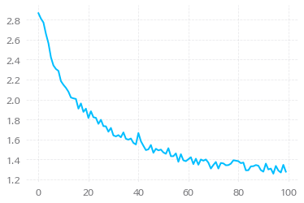
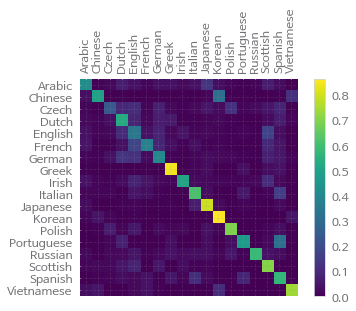

# Character-Level RNN 이름 분류기

18개 언어로부터 1000여개의 성을 가져와 학습해서,
어떤 성이 주어졌을 때 어느 언어의 성인지 예측하는 Character-Level RNN을 만들 것이다

(실행 예시)

    $ python predict.py Hinton
    (-0.47) Scottish
    (-1.52) English
    (-3.57) Irish
    
    $ python predict.py Schmidhuber
    (-0.19) German
    (-2.48) Czech
    (-2.68) Dutch

데이터 준비
==================

`PyTorch`로부터 데이터를 받아와서, 언어별로 이름의 리스트를 저장하고 있는 딕셔너리를 만든다


```python
from __future__ import unicode_literals, print_function, division
from io import open
import glob
import os

def findFiles(path): return glob.glob(path)

print(findFiles('data/names/*.txt'))

import unicodedata
import string

all_letters = string.ascii_letters + " .,;'"
n_letters = len(all_letters)

# Turn a Unicode string to plain ASCII, thanks to http://stackoverflow.com/a/518232/2809427
def unicodeToAscii(s):
    return ''.join(
        c for c in unicodedata.normalize('NFD', s)
        if unicodedata.category(c) != 'Mn'
        and c in all_letters
    )

print(unicodeToAscii('Ślusàrski'))

# Build the category_lines dictionary, a list of names per language
category_lines = {}
all_categories = []

# Read a file and split into lines
def readLines(filename):
    lines = open(filename, encoding='utf-8').read().strip().split('\n')
    return [unicodeToAscii(line) for line in lines]

for filename in findFiles('data/names/*.txt'):
    category = os.path.splitext(os.path.basename(filename))[0]
    all_categories.append(category)
    lines = readLines(filename)
    category_lines[category] = lines

n_categories = len(all_categories)
```

    ['data/names/Arabic.txt', 'data/names/Chinese.txt', 'data/names/Czech.txt', 'data/names/Dutch.txt', 'data/names/English.txt', 'data/names/French.txt', 'data/names/German.txt', 'data/names/Greek.txt', 'data/names/Irish.txt', 'data/names/Italian.txt', 'data/names/Japanese.txt', 'data/names/Korean.txt', 'data/names/Polish.txt', 'data/names/Portuguese.txt', 'data/names/Russian.txt', 'data/names/Scottish.txt', 'data/names/Spanish.txt', 'data/names/Vietnamese.txt']
    Slusarski

```python
print(category_lines['Italian'][:5])
```

    ['Abandonato', 'Abatangelo', 'Abatantuono', 'Abate', 'Abategiovanni']

- 데이터가 잘 들어갔는지 확인(이탈리아 이름 5개 시험) - 정상

이름을 텐서로 바꾸기
--------------------------

사용할 때 편하게 하기 위해 이름들을 Tensor로 바꿈

- 하나의 letter를 표현하기 위해 One-hot vector 사용(`1 x n_letters` 크기)
  ex) `"b" = <0 1 0 0 0 ... >`
- 단어를 만드는 작업은 위의 vector를 2D Matrix로 합치는 작업
  (`line_length x 1 x n_letters` 크기)
  - 여기서 1은 배치 사이즈를 의미

```python
import torch

# Find letter index from all_letters, e.g. "a" = 0
def letterToIndex(letter):
    return all_letters.find(letter)

# Just for demonstration, turn a letter into a <1 x n_letters> Tensor
def letterToTensor(letter):
    tensor = torch.zeros(1, n_letters)
    tensor[0][letterToIndex(letter)] = 1
    return tensor

# Turn a line into a <line_length x 1 x n_letters>,
# or an array of one-hot letter vectors
def lineToTensor(line):
    tensor = torch.zeros(len(line), 1, n_letters)
    for li, letter in enumerate(line):
        tensor[li][0][letterToIndex(letter)] = 1
    return tensor

print(letterToTensor('J'))

print(lineToTensor('Jones').size())
```

    tensor([[0., 0., 0., 0., 0., 0., 0., 0., 0., 0., 0., 0., 0., 0., 0., 0., 0., 0.,
             0., 0., 0., 0., 0., 0., 0., 0., 0., 0., 0., 0., 0., 0., 0., 0., 0., 1.,
             0., 0., 0., 0., 0., 0., 0., 0., 0., 0., 0., 0., 0., 0., 0., 0., 0., 0.,
             0., 0., 0.]])
    torch.Size([5, 1, 57])


신경망 만들기
====================

RNN 모듈을 만든다. 구성은 아래와 같다


```python
import torch.nn as nn

class RNN(nn.Module):
    def __init__(self, input_size, hidden_size, output_size):
        super(RNN, self).__init__()

        self.hidden_size = hidden_size

        self.i2h = nn.Linear(input_size + hidden_size, hidden_size)
        self.i2o = nn.Linear(input_size + hidden_size, output_size)
        self.softmax = nn.LogSoftmax(dim=1)

    def forward(self, input, hidden):
        combined = torch.cat((input, hidden), 1)
        hidden = self.i2h(combined)
        output = self.i2o(combined)
        output = self.softmax(output)
        return output, hidden

    def initHidden(self):
        return torch.zeros(1, self.hidden_size)

n_hidden = 128
rnn = RNN(n_letters, n_hidden, n_categories)
```

위 신경망의 step에서는

- input(현재 letter의 Tensor)과 이전 상태(0으로 초기화)를 넘겨줘야한다

- output으로 각 언어의 확률과 다음 hidden state(다음 스텝에서 사용)을 받을 것이다

```python
input = letterToTensor('A')
hidden =torch.zeros(1, n_hidden)

output, next_hidden = rnn(input, hidden)
```

효율성을 위해 새로운 Tensor를 매번 만드는 것을 피하기 위해 `lineToTensor`를 사용

```python
input = lineToTensor('Albert')
hidden = torch.zeros(1, n_hidden)

output, next_hidden = rnn(input[0], hidden)
print(output)
```

    tensor([[-2.7864, -2.9299, -2.7485, -2.8315, -2.8954, -2.9493, -2.9437, -2.7828,
             -2.9665, -2.9824, -2.9273, -2.9567, -2.8961, -2.9536, -2.8016, -2.9449,
             -2.8726, -2.9027]], grad_fn=<LogSoftmaxBackward>)

결과물로 `<1 x n_categories>` Tensor가 나온다. 각 요소는 해당 language의 우도를 뜻한다.


훈련
========
훈련준비
----------------------

Output을 해석하기 위한 Helper Function `categoryFromOutput()` 정의

```python
def categoryFromOutput(output):
    top_n, top_i = output.topk(1)
    category_i = top_i[0].item()
    return all_categories[category_i], category_i

print(categoryFromOutput(output))
```

    ('Czech', 2)

빠른 훈련 예시를 가져오기 위한 Helper Function `randomChoice()`와 `randomTrainingExample()`

```python
import random

def randomChoice(l):
    return l[random.randint(0, len(l) - 1)]

def randomTrainingExample():
    category = randomChoice(all_categories)
    line = randomChoice(category_lines[category])
    category_tensor = torch.tensor([all_categories.index(category)], dtype=torch.long)
    line_tensor = lineToTensor(line)
    return category, line, category_tensor, line_tensor

for i in range(10):
    category, line, category_tensor, line_tensor = randomTrainingExample()
    print('category =', category, '/ line =', line)
```

    category = English / line = Brook
    category = Polish / line = Maly
    category = Greek / line = Stroggylis
    category = Dutch / line = Severijns
    category = Italian / line = Nicchi
    category = Czech / line = Skokan
    category = Irish / line = Kavanagh
    category = Korean / line = Suk
    category = Korean / line = Choi
    category = Arabic / line = Safar


신경망 훈련시키기
--------------------

이제 훈련시키는 일만 남았는데, 손실함수는 NLL 사용(RNN의 마지막 Layer가 Softmax이기 때문)

```python
criterion = nn.NLLLoss()
```

각 루프마다 훈련 과정은

- input과 target tensor를 만들고
- 다음을 위한 hidden state를 만들고
- 각 글자를 불러와서
  - 다음 글자를 위해 hidden state를 저장하고
- 실제값과 예측값을 비교하고
- 오류 역전파 알고리즘 수행하고
- output과 손실값을 반환할 것이다

```python
learning_rate = 0.005 # If you set this too high, it might explode. If too low, it might not learn

def train(category_tensor, line_tensor):
    hidden = rnn.initHidden()

    rnn.zero_grad()

    for i in range(line_tensor.size()[0]):
        output, hidden = rnn(line_tensor[i], hidden)

    loss = criterion(output, category_tensor)
    loss.backward()

    # Add parameters' gradients to their values, multiplied by learning rate
    for p in rnn.parameters():
        p.data.add_(-learning_rate, p.grad.data)

    return output, loss.item()
```

실제 `train` 과정 수행, `print_every ` 마다 훈련결과 출력

```python
import time
import math

n_iters = 100000
print_every = 5000
plot_every = 1000


# Keep track of losses for plotting
current_loss = 0
all_losses = []

def timeSince(since):
    now = time.time()
    s = now - since
    m = math.floor(s / 60)
    s -= m * 60
    return '%dm %ds' % (m, s)

start = time.time()

for iter in range(1, n_iters + 1):
    category, line, category_tensor, line_tensor = randomTrainingExample()
    output, loss = train(category_tensor, line_tensor)
    current_loss += loss

    # Print iter number, loss, name and guess
    if iter % print_every == 0:
        guess, guess_i = categoryFromOutput(output)
        correct = '✓' if guess == category else '✗ (%s)' % category
        print('%d %d%% (%s) %.4f %s / %s %s' % (iter, iter / n_iters * 100, timeSince(start), loss, line, guess, correct))

    # Add current loss avg to list of losses
    if iter % plot_every == 0:
        all_losses.append(current_loss / plot_every)
        current_loss = 0
```

    5000 5% (0m 26s) 2.3073 Thi / Korean ✗ (Vietnamese)
    10000 10% (0m 53s) 2.0964 Shamoun / Irish ✗ (Arabic)
    15000 15% (1m 18s) 3.7886 Wang / Chinese ✗ (German)
    20000 20% (1m 43s) 1.7482 Schermer / German ✗ (Dutch)
    25000 25% (2m 7s) 1.8704 Moreno / Italian ✗ (Portuguese)
    30000 30% (2m 30s) 1.1055 Ha / Korean ✓
    35000 35% (2m 54s) 0.6470 Sokolsky / Polish ✓
    40000 40% (3m 20s) 1.1755 Moreno / Spanish ✓
    45000 45% (3m 43s) 1.7413 Elizondo / Italian ✗ (Spanish)
    50000 50% (4m 5s) 2.9381 Webber / German ✗ (English)
    55000 55% (4m 29s) 0.2866 Dam / Vietnamese ✓
    60000 60% (4m 53s) 4.5152 Shalimo / Portuguese ✗ (Russian)
    65000 65% (5m 19s) 0.9932 Svejda / Czech ✓
    70000 70% (5m 42s) 1.0920 Awad / Arabic ✓
    75000 75% (6m 6s) 0.8357 Sui / Chinese ✓
    80000 80% (6m 33s) 0.0154 Papadopulos / Greek ✓
    85000 85% (6m 55s) 3.2044 Blades / Portuguese ✗ (Greek)
    90000 90% (7m 17s) 1.2264 Bishara / Japanese ✗ (Arabic)
    95000 95% (7m 41s) 1.3673 Girard / French ✓
    100000 100% (8m 8s) 0.3396 Ly / Vietnamese ✓


결과 보기
--------------------

신경망이 잘 배우고 있는지 확인하기 위해 손실값을 Plot 한다

```python
import matplotlib.pyplot as plt
import matplotlib.ticker as ticker

plt.figure()
plt.plot(all_losses)
```


    [<matplotlib.lines.Line2D at 0x7f02b0369748>]




- 손실값이 줄어드는 것으로 보아 잘 배우고 있다


결과 평가
======================

평가를 위해 `train()`에서 오류 역전파 알고리즘이 빠진 `evaluate()`를 정의하고, 평가 수행

```python
# Keep track of correct guesses in a confusion matrix
confusion = torch.zeros(n_categories, n_categories)
n_confusion = 10000

# Just return an output given a line
def evaluate(line_tensor):
    hidden = rnn.initHidden()

    for i in range(line_tensor.size()[0]):
        output, hidden = rnn(line_tensor[i], hidden)

    return output

# Go through a bunch of examples and record which are correctly guessed
for i in range(n_confusion):
    category, line, category_tensor, line_tensor = randomTrainingExample()
    output = evaluate(line_tensor)
    guess, guess_i = categoryFromOutput(output)
    category_i = all_categories.index(category)
    confusion[category_i][guess_i] += 1

# Normalize by dividing every row by its sum
for i in range(n_categories):
    confusion[i] = confusion[i] / confusion[i].sum()

# Set up plot
fig = plt.figure()
ax = fig.add_subplot(111)
cax = ax.matshow(confusion.numpy())
fig.colorbar(cax)

# Set up axes
ax.set_xticklabels([''] + all_categories, rotation=90)
ax.set_yticklabels([''] + all_categories)

# Force label at every tick
ax.xaxis.set_major_locator(ticker.MultipleLocator(1))
ax.yaxis.set_major_locator(ticker.MultipleLocator(1))

# sphinx_gallery_thumbnail_number = 2
plt.show()
```




결과 그래프의 밝은 값은 Guess가 많이 된 곳이다. Greek과 Korean의 정확도가 높은 편이다

Running on User Input
---------------------

사용자가 제공하는 Input에 대해 예측을 수행하는 `predict()`를 정의한 뒤 테스트

```python
def predict(input_line, n_predictions=3):
    print('\n> %s' % input_line)
    with torch.no_grad():
        output = evaluate(lineToTensor(input_line))

        # Get top N categories
        topv, topi = output.topk(n_predictions, 1, True)
        predictions = []

        for i in range(n_predictions):
            value = topv[0][i].item()
            category_index = topi[0][i].item()
            print('(%.2f) %s' % (value, all_categories[category_index]))
            predictions.append([value, all_categories[category_index]])

predict('Dovesky')
predict('Jackson')
predict('Satoshi')
```


    > Dovesky
    (-0.44) Russian
    (-1.49) Czech
    (-3.05) English
    
    > Jackson
    (-0.60) Scottish
    (-1.05) English
    (-3.11) Russian
    
    > Satoshi
    (-0.56) Italian
    (-1.96) Japanese
    (-2.43) Polish

