# 20142697 권민수 - 인공지능 과제3

## 1. 차원 변환

```python
import pandas as pd
import matplotlib.pyplot as plt
%matplotlib inline
import numpy as np
from sklearn.cluster import KMeans
from sklearn_extra.cluster import KMedoids
from sklearn.decomposition import PCA
from sklearn.manifold import TSNE
```


```python
# 데이터 로드
data = pd.read_csv('./hw3data.csv')
data = data.to_numpy()

plt.scatter(data[:,2],data[:,3], label='True Position')
```


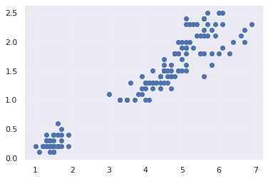

```python
# 1. 차원변환
# (1) PCA
pca = PCA(n_components=2)

pca_data = pca.fit_transform(data)

plt.scatter(pca_data[:,0] ,pca_data[:,1])
```


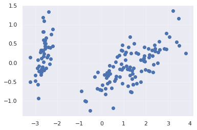

```python
# (2) t-SNE
tsne = TSNE() # default n_components = 2

tsne_data = tsne.fit_transform(data)

plt.scatter(tsne_data[:,0], tsne_data[:,1])
```

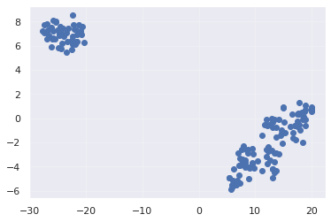

## 2. 군집화

```python
# (1) k-means
kmeans = KMeans(n_clusters=4)
kmeans.fit(data)

plt.scatter(data[:,2], data[:,3], c=kmeans.labels_, cmap='rainbow')
plt.scatter(kmeans.cluster_centers_[:,2] ,kmeans.cluster_centers_[:,3], color='black')
```


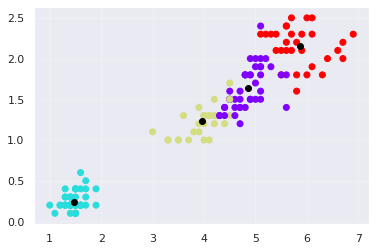

```python
# (2) k-medoids
kmedoids = KMedoids(n_clusters=4).fit(data)

plt.scatter(data[:,2], data[:,3], c=kmedoids.labels_, cmap='rainbow')
plt.scatter(kmedoids.cluster_centers_[:,2] ,kmedoids.cluster_centers_[:,3], color='black')
```


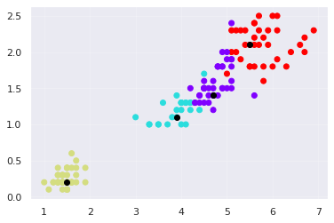

```python
# (3) affinity propagation
from sklearn.datasets.samples_generator import make_blobs
from sklearn.cluster import AffinityPropagation

model = AffinityPropagation(preference=-50).fit(data)
plt.scatter(data[:,2], data[:,3], c=model.labels_, cmap='rainbow')
```


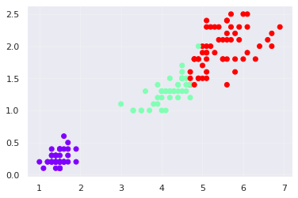

```python
# (4) 군집 결과 비교

plt.figure(figsize=(21,7))

plt.subplot(131)
plt.scatter(data[:,2], data[:,3], c=kmeans.labels_, cmap='rainbow')
plt.scatter(kmeans.cluster_centers_[:,2] ,kmeans.cluster_centers_[:,3], color='black')

plt.subplot(132)
plt.scatter(data[:,2], data[:,3], c=kmedoids.labels_, cmap='rainbow')
plt.scatter(kmedoids.cluster_centers_[:,2] ,kmedoids.cluster_centers_[:,3], color='black')

plt.subplot(133)
plt.scatter(data[:,2], data[:,3], c=model.labels_, cmap='rainbow')
```


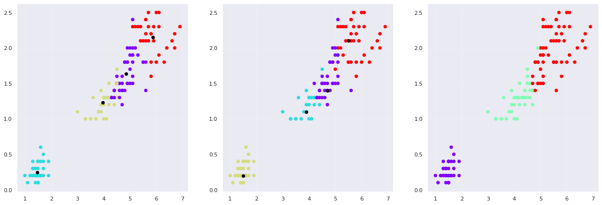

## 순환신경망

### 3.

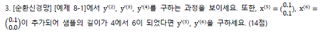

~~~python
import numpy as np
import torch
import torch.nn.functional as F

U = np.array([[0.1,0.1],
             [0.0,0.0],
             [0.0,-0.1]], np.float32)
U = torch.tensor(U)

W = np.array([[0.1,0.1,0.0],
            [0.0,0.0,0.0],
            [0.2,-0.1,-0.1]], np.float32)
W = torch.tensor(W)

V = np.array([[0.0,0.1,0.0],
            [-0.2,0.0,0.0]], np.float32)
V = torch.tensor(V)

b = np.array([[0.0],
            [0.0],
            [0.2]], np.float32)
b = torch.tensor(b)

c = np.array([[0.2],
            [0.1]], np.float32)
c = torch.tensor(c)


x = np.array([
    [
        [0.0],
        [1.0]
    ],
    [
        [0.0],
        [0.1]
    ],
    [
        [0.1],
        [-0.2]
    ],
    [
        [0.5],
        [0.0]
    ]
], np.float32)
x = torch.tensor(x)

h0 = np.array([[0,0,0]], np.float32).T
h0 = torch.tensor(h0)

# y'1
a1 = W.matmul(h0) + U.matmul(x[0]) + b
h1 = torch.tanh(a1)
y1_ = F.softmax(V.matmul(h1) + c, dim=0)

# y'2
a2 = W.matmul(h1) + U.matmul(x[1]) + b
h2 = torch.tanh(a2)
y2_ = F.softmax(V.matmul(h2) + c, dim=0)
print("y'(2) : ", y2_)

# y'3
a3 = W.matmul(h2) + U.matmul(x[2]) + b
h3 = torch.tanh(a3)
y3_ = F.softmax(V.matmul(h3) + c, dim=0)
print("y'(3) : ", y3_)

# y'4
a4 = W.matmul(h3) + U.matmul(x[3]) + b
h4 = torch.tanh(a4)
y4_ = F.softmax(V.matmul(h4) + c, dim=0)
print("y'(4) : ", y4_)

# x5, x6
x = np.array([
    [
        [0.0],
        [1.0]
    ],
    [
        [0.0],
        [0.1]
    ],
    [
        [0.1],
        [-0.2]
    ],
    [
        [0.5],
        [0.0]
    ],
    [
        [0.1],
        [0.1]
    ],
    [
        [0.1],
        [0.0]
    ]
], np.float32)
x = torch.tensor(x)

# y'5
a5 = W.matmul(h4) + U.matmul(x[4]) + b
h5 = torch.tanh(a5)
y5_ = F.softmax(V.matmul(h5) + c, dim=0)
print("y'(5) : ", y5_)

# y'6
a6 = W.matmul(h5) + U.matmul(x[5]) + b
h6 = torch.tanh(a6)
y6_ = F.softmax(V.matmul(h6) + c, dim=0)
print("y'(6) : ", y6_)
~~~

~~~
y'(2) :  tensor([[0.5260],
        [0.4740]])
y'(3) :  tensor([[0.5246],
        [0.4754]])
y'(4) :  tensor([[0.5274],
        [0.4726]])
y'(5) :  tensor([[0.5262],
        [0.4738]])
y'(6) :  tensor([[0.5256],
        [0.4744]])
~~~

### 4.

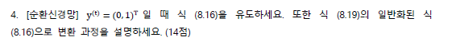

$$
\frac{\delta J^{(t)}}{\delta y'^{(t)}}\frac{\delta y'^{(t)}}{\delta o_1^{(t)}} = \frac{\delta J^{(t)}}{\delta o_1^{(t)}} = \frac{\delta -log\frac{exp(o_1^{(t)})}{exp(o_1^{(t)})+exp(o_2^{t})}}{\delta o_1^{(t)}} \\
= \frac{\delta(-o_1^{(t)} + log(exp(o_1^{(t)})+exp(o_2^{(t)})))}{\delta o_1^{t}} \\
= \frac{exp(o_1^{(t)})}{exp(o_1^{(t)}) + exp(o_2^{(t)})} \\
= y_1^{'(t)}
$$
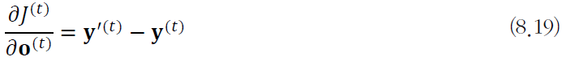

- 각각 $\bold{y^{(t)}}$의 요소 각각이 1일 때의 경우를 모두 계산해야 하기 때문에 위와 같이 일반화된다
  - 자신의 요소가 1일때만 $\bold{y^{(t)}}$값이 1이 된다, 아닌 경우 $\bold{y^{'(t)}}$값, 즉 틀린값만 남는다

## 5. Bias-Variance Tradeoff

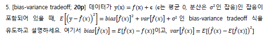

- 위는 MSE를 편향0분산 분해하는 과정이다

- 먼저 어떤 확률 변수 X에 대해
  $$
  E[X^2] = E[X^2] - E[2XE[X]] + E[E[X]^2] + E[2XE[X]] - E[E[X]^2]\\
  = E[X^2 - 2XE[X] + E[x]^2] + 2E[X]^2 - E[X]^2\\
  =E[(X-E[X])^2] + E[X]^2
  = Var[X] + E[X]^2
  $$
  이고,

  

  $f(x)$의 값들은 결정되어 있으므로
  $$
  0 = Var[f(x)] = E[(f(x)-E[f(x)]^2] \\ 
  \Rightarrow f(x) - E[f(x)] = 0 \\
  \Rightarrow E[f(x)] = f(x)
  $$
  가 성립한다. 주어진 조건 $y = f(x) + \epsilon$과 $E[\epsilon] = 0$으로부터 $E[y] = E[f(x) + \epsilon] = E[f(x)] = f(x)$가 성립한다.

  

  그리고 $Var[\epsilon] = \sigma^2$이므로,

  

  $Var[y] = E[(y-E[y])^2] = E[(y-f(x))^2] = E[(f(x) + \epsilon - f(x))^2] $

  $= E[\epsilon^2] = Var[\epsilon] + E[\epsilon]^2 = \sigma^2$

  

  $\epsilon$와 $\hat{f}(x)$는 서로 독립적이므로
  $$
  E[(y-\hat{f}(x)^2)] = E[y^2 + \hat{f}(x)^2 - 2y\hat{f}(x)] \\
  = E[y^2] + E[\hat{f}(x)^2] - E[2y\hat{f}(x)]\\
  = Var[y] + E[y]^2 + Var[\hat{f}(x)] + E[\hat{f}(x)]^2 - 2f(x)E[\hat{f}(x)] \\
  = Var[y] + Var[\hat{f}(x)] + (f(x) - E[\hat{f}(x)])^2 \\
  = \sigma^2 + Var[\hat{f}(x)] + Bias[\hat{f}(x)]^2
  $$
  가 성립한다.

  

  따라서 $E[y-\hat{f}(x)^2] = bias[\hat{f}(x)]^2 + var[\hat{f}(x)] + \sigma^2$ 이다.

## 6. Character-Level RNN 이름 분류기

18개 언어로부터 1000여개의 성을 가져와 학습해서,
어떤 성이 주어졌을 때 어느 언어의 성인지 예측하는 Character-Level RNN을 만들 것이다

(실행 예시)

    $ python predict.py Hinton
    (-0.47) Scottish
    (-1.52) English
    (-3.57) Irish
    
    $ python predict.py Schmidhuber
    (-0.19) German
    (-2.48) Czech
    (-2.68) Dutch

### 데이터 준비

`PyTorch`로부터 데이터를 받아와서, 언어별로 이름의 리스트를 저장하고 있는 딕셔너리를 만든다


```python
from __future__ import unicode_literals, print_function, division
from io import open
import glob
import os

def findFiles(path): return glob.glob(path)

print(findFiles('data/names/*.txt'))

import unicodedata
import string

all_letters = string.ascii_letters + " .,;'"
n_letters = len(all_letters)

# Turn a Unicode string to plain ASCII, thanks to http://stackoverflow.com/a/518232/2809427
def unicodeToAscii(s):
    return ''.join(
        c for c in unicodedata.normalize('NFD', s)
        if unicodedata.category(c) != 'Mn'
        and c in all_letters
    )

print(unicodeToAscii('Ślusàrski'))

# Build the category_lines dictionary, a list of names per language
category_lines = {}
all_categories = []

# Read a file and split into lines
def readLines(filename):
    lines = open(filename, encoding='utf-8').read().strip().split('\n')
    return [unicodeToAscii(line) for line in lines]

for filename in findFiles('data/names/*.txt'):
    category = os.path.splitext(os.path.basename(filename))[0]
    all_categories.append(category)
    lines = readLines(filename)
    category_lines[category] = lines

n_categories = len(all_categories)
```

    ['data/names/Arabic.txt', 'data/names/Chinese.txt', 'data/names/Czech.txt', 'data/names/Dutch.txt', 'data/names/English.txt', 'data/names/French.txt', 'data/names/German.txt', 'data/names/Greek.txt', 'data/names/Irish.txt', 'data/names/Italian.txt', 'data/names/Japanese.txt', 'data/names/Korean.txt', 'data/names/Polish.txt', 'data/names/Portuguese.txt', 'data/names/Russian.txt', 'data/names/Scottish.txt', 'data/names/Spanish.txt', 'data/names/Vietnamese.txt']
    Slusarski

```python
print(category_lines['Italian'][:5])
```

    ['Abandonato', 'Abatangelo', 'Abatantuono', 'Abate', 'Abategiovanni']

- 데이터가 잘 들어갔는지 확인(이탈리아 이름 5개 시험) - 정상

#### 이름을 텐서로 바꾸기

사용할 때 편하게 하기 위해 이름들을 Tensor로 바꿈

- 하나의 letter를 표현하기 위해 One-hot vector 사용(`1 x n_letters` 크기)
  ex) `"b" = <0 1 0 0 0 ... >`
- 단어를 만드는 작업은 위의 vector를 2D Matrix로 합치는 작업
  (`line_length x 1 x n_letters` 크기)
  - 여기서 1은 배치 사이즈를 의미

```python
import torch

# Find letter index from all_letters, e.g. "a" = 0
def letterToIndex(letter):
    return all_letters.find(letter)

# Just for demonstration, turn a letter into a <1 x n_letters> Tensor
def letterToTensor(letter):
    tensor = torch.zeros(1, n_letters)
    tensor[0][letterToIndex(letter)] = 1
    return tensor

# Turn a line into a <line_length x 1 x n_letters>,
# or an array of one-hot letter vectors
def lineToTensor(line):
    tensor = torch.zeros(len(line), 1, n_letters)
    for li, letter in enumerate(line):
        tensor[li][0][letterToIndex(letter)] = 1
    return tensor

print(letterToTensor('J'))

print(lineToTensor('Jones').size())
```

    tensor([[0., 0., 0., 0., 0., 0., 0., 0., 0., 0., 0., 0., 0., 0., 0., 0., 0., 0.,
             0., 0., 0., 0., 0., 0., 0., 0., 0., 0., 0., 0., 0., 0., 0., 0., 0., 1.,
             0., 0., 0., 0., 0., 0., 0., 0., 0., 0., 0., 0., 0., 0., 0., 0., 0., 0.,
             0., 0., 0.]])
    torch.Size([5, 1, 57])


### 신경망 만들기

RNN 모듈을 만든다. 구성은 아래와 같다


```python
import torch.nn as nn

class RNN(nn.Module):
    def __init__(self, input_size, hidden_size, output_size):
        super(RNN, self).__init__()

        self.hidden_size = hidden_size

        self.i2h = nn.Linear(input_size + hidden_size, hidden_size)
        self.i2o = nn.Linear(input_size + hidden_size, output_size)
        self.softmax = nn.LogSoftmax(dim=1)

    def forward(self, input, hidden):
        combined = torch.cat((input, hidden), 1)
        hidden = self.i2h(combined)
        output = self.i2o(combined)
        output = self.softmax(output)
        return output, hidden

    def initHidden(self):
        return torch.zeros(1, self.hidden_size)

n_hidden = 128
rnn = RNN(n_letters, n_hidden, n_categories)
```

위 신경망의 step에서는

- input(현재 letter의 Tensor)과 이전 상태(0으로 초기화)를 넘겨줘야한다

- output으로 각 언어의 확률과 다음 hidden state(다음 스텝에서 사용)을 받을 것이다

```python
input = letterToTensor('A')
hidden =torch.zeros(1, n_hidden)

output, next_hidden = rnn(input, hidden)
```

효율성을 위해 새로운 Tensor를 매번 만드는 것을 피하기 위해 `lineToTensor`를 사용

```python
input = lineToTensor('Albert')
hidden = torch.zeros(1, n_hidden)

output, next_hidden = rnn(input[0], hidden)
print(output)
```

    tensor([[-2.7864, -2.9299, -2.7485, -2.8315, -2.8954, -2.9493, -2.9437, -2.7828,
             -2.9665, -2.9824, -2.9273, -2.9567, -2.8961, -2.9536, -2.8016, -2.9449,
             -2.8726, -2.9027]], grad_fn=<LogSoftmaxBackward>)


결과물로 `<1 x n_categories>` Tensor가 나온다. 각 요소는 해당 language의 우도를 뜻한다.


### 훈련

#### 훈련준비

Output을 해석하기 위한 Helper Function `categoryFromOutput()` 정의

```python
def categoryFromOutput(output):
    top_n, top_i = output.topk(1)
    category_i = top_i[0].item()
    return all_categories[category_i], category_i

print(categoryFromOutput(output))
```

    ('Czech', 2)


빠른 훈련 예시를 가져오기 위한 Helper Function `randomChoice()`와 `randomTrainingExample()`

```python
import random

def randomChoice(l):
    return l[random.randint(0, len(l) - 1)]

def randomTrainingExample():
    category = randomChoice(all_categories)
    line = randomChoice(category_lines[category])
    category_tensor = torch.tensor([all_categories.index(category)], dtype=torch.long)
    line_tensor = lineToTensor(line)
    return category, line, category_tensor, line_tensor

for i in range(10):
    category, line, category_tensor, line_tensor = randomTrainingExample()
    print('category =', category, '/ line =', line)
```

    category = English / line = Brook
    category = Polish / line = Maly
    category = Greek / line = Stroggylis
    category = Dutch / line = Severijns
    category = Italian / line = Nicchi
    category = Czech / line = Skokan
    category = Irish / line = Kavanagh
    category = Korean / line = Suk
    category = Korean / line = Choi
    category = Arabic / line = Safar


#### 신경망 훈련시키기

이제 훈련시키는 일만 남았는데, 손실함수는 NLL 사용(RNN의 마지막 Layer가 Softmax이기 때문)

```python
criterion = nn.NLLLoss()
```

각 루프마다 훈련 과정은

- input과 target tensor를 만들고
- 다음을 위한 hidden state를 만들고
- 각 글자를 불러와서
  - 다음 글자를 위해 hidden state를 저장하고
- 실제값과 예측값을 비교하고
- 오류 역전파 알고리즘 수행하고
- output과 손실값을 반환할 것이다

```python
learning_rate = 0.005 # If you set this too high, it might explode. If too low, it might not learn

def train(category_tensor, line_tensor):
    hidden = rnn.initHidden()

    rnn.zero_grad()

    for i in range(line_tensor.size()[0]):
        output, hidden = rnn(line_tensor[i], hidden)

    loss = criterion(output, category_tensor)
    loss.backward()

    # Add parameters' gradients to their values, multiplied by learning rate
    for p in rnn.parameters():
        p.data.add_(-learning_rate, p.grad.data)

    return output, loss.item()
```

실제 `train` 과정 수행, `print_every ` 마다 훈련결과 출력

```python
import time
import math

n_iters = 100000
print_every = 5000
plot_every = 1000


# Keep track of losses for plotting
current_loss = 0
all_losses = []

def timeSince(since):
    now = time.time()
    s = now - since
    m = math.floor(s / 60)
    s -= m * 60
    return '%dm %ds' % (m, s)

start = time.time()

for iter in range(1, n_iters + 1):
    category, line, category_tensor, line_tensor = randomTrainingExample()
    output, loss = train(category_tensor, line_tensor)
    current_loss += loss

    # Print iter number, loss, name and guess
    if iter % print_every == 0:
        guess, guess_i = categoryFromOutput(output)
        correct = '✓' if guess == category else '✗ (%s)' % category
        print('%d %d%% (%s) %.4f %s / %s %s' % (iter, iter / n_iters * 100, timeSince(start), loss, line, guess, correct))

    # Add current loss avg to list of losses
    if iter % plot_every == 0:
        all_losses.append(current_loss / plot_every)
        current_loss = 0

```

    5000 5% (0m 26s) 2.3073 Thi / Korean ✗ (Vietnamese)
    10000 10% (0m 53s) 2.0964 Shamoun / Irish ✗ (Arabic)
    15000 15% (1m 18s) 3.7886 Wang / Chinese ✗ (German)
    20000 20% (1m 43s) 1.7482 Schermer / German ✗ (Dutch)
    25000 25% (2m 7s) 1.8704 Moreno / Italian ✗ (Portuguese)
    30000 30% (2m 30s) 1.1055 Ha / Korean ✓
    35000 35% (2m 54s) 0.6470 Sokolsky / Polish ✓
    40000 40% (3m 20s) 1.1755 Moreno / Spanish ✓
    45000 45% (3m 43s) 1.7413 Elizondo / Italian ✗ (Spanish)
    50000 50% (4m 5s) 2.9381 Webber / German ✗ (English)
    55000 55% (4m 29s) 0.2866 Dam / Vietnamese ✓
    60000 60% (4m 53s) 4.5152 Shalimo / Portuguese ✗ (Russian)
    65000 65% (5m 19s) 0.9932 Svejda / Czech ✓
    70000 70% (5m 42s) 1.0920 Awad / Arabic ✓
    75000 75% (6m 6s) 0.8357 Sui / Chinese ✓
    80000 80% (6m 33s) 0.0154 Papadopulos / Greek ✓
    85000 85% (6m 55s) 3.2044 Blades / Portuguese ✗ (Greek)
    90000 90% (7m 17s) 1.2264 Bishara / Japanese ✗ (Arabic)
    95000 95% (7m 41s) 1.3673 Girard / French ✓
    100000 100% (8m 8s) 0.3396 Ly / Vietnamese ✓


### 결과 보기

신경망이 잘 배우고 있는지 확인하기 위해 손실값을 Plot 한다

```python
import matplotlib.pyplot as plt
import matplotlib.ticker as ticker

plt.figure()
plt.plot(all_losses)
```


    [<matplotlib.lines.Line2D at 0x7f02b0369748>]


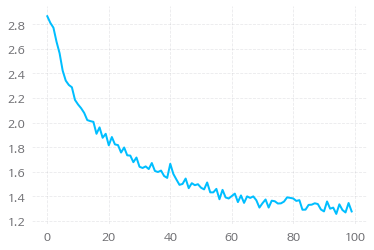

- 손실값이 줄어드는 것으로 보아 잘 배우고 있다


### 결과 평가

평가를 위해 `train()`에서 오류 역전파 알고리즘이 빠진 `evaluate()`를 정의하고, 평가 수행

```python
# Keep track of correct guesses in a confusion matrix
confusion = torch.zeros(n_categories, n_categories)
n_confusion = 10000

# Just return an output given a line
def evaluate(line_tensor):
    hidden = rnn.initHidden()

    for i in range(line_tensor.size()[0]):
        output, hidden = rnn(line_tensor[i], hidden)

    return output

# Go through a bunch of examples and record which are correctly guessed
for i in range(n_confusion):
    category, line, category_tensor, line_tensor = randomTrainingExample()
    output = evaluate(line_tensor)
    guess, guess_i = categoryFromOutput(output)
    category_i = all_categories.index(category)
    confusion[category_i][guess_i] += 1

# Normalize by dividing every row by its sum
for i in range(n_categories):
    confusion[i] = confusion[i] / confusion[i].sum()

# Set up plot
fig = plt.figure()
ax = fig.add_subplot(111)
cax = ax.matshow(confusion.numpy())
fig.colorbar(cax)

# Set up axes
ax.set_xticklabels([''] + all_categories, rotation=90)
ax.set_yticklabels([''] + all_categories)

# Force label at every tick
ax.xaxis.set_major_locator(ticker.MultipleLocator(1))
ax.yaxis.set_major_locator(ticker.MultipleLocator(1))

# sphinx_gallery_thumbnail_number = 2
plt.show()
```


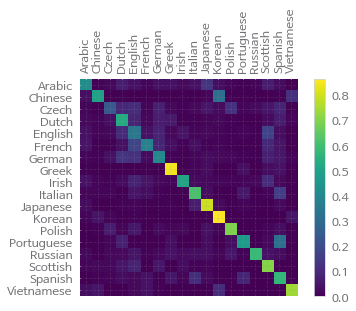

결과 그래프의 밝은 값은 Guess가 많이 된 곳이다. Greek과 Korean의 정확도가 높은 편이다

### 사용자 입력에 대한 예측

사용자가 제공하는 Input에 대해 예측을 수행하는 `predict()`를 정의한 뒤 테스트

```python
def predict(input_line, n_predictions=3):
    print('\n> %s' % input_line)
    with torch.no_grad():
        output = evaluate(lineToTensor(input_line))

        # Get top N categories
        topv, topi = output.topk(n_predictions, 1, True)
        predictions = []

        for i in range(n_predictions):
            value = topv[0][i].item()
            category_index = topi[0][i].item()
            print('(%.2f) %s' % (value, all_categories[category_index]))
            predictions.append([value, all_categories[category_index]])

predict('Dovesky')
predict('Jackson')
predict('Satoshi')
```


    > Dovesky
    (-0.44) Russian
    (-1.49) Czech
    (-3.05) English
    
    > Jackson
    (-0.60) Scottish
    (-1.05) English
    (-3.11) Russian
    
    > Satoshi
    (-0.56) Italian
    (-1.96) Japanese
    (-2.43) Polish

## 7. 텍스트 분류 튜토리얼

``TextClassification`` 데이터셋을 활용해 지도 학습 수행

### `ngrams`로 데이터 불러오기

`ngrams`를 통해 word를 하나 단위로만이 아니라 인접한 n개 word의 조합으로도 볼 수 있다
여기서는 `ngrams`를 2로 설정해 word 하나, word 2개의 조합으로 text를 만든다

```python
import torch
import torchtext
from torchtext.datasets import text_classification
NGRAMS = 2
import os
if not os.path.isdir('./.data'):
	os.mkdir('./.data')
train_dataset, test_dataset = text_classification.DATASETS['AG_NEWS'](
    root='./.data', ngrams=NGRAMS, vocab=None)
BATCH_SIZE = 16
device = torch.device("cuda" if torch.cuda.is_available() else "cpu")
```

    ag_news_csv.tar.gz: 11.8MB [00:00, 27.2MB/s]
    120000lines [00:11, 10794.80lines/s]
    120000lines [00:23, 5200.79lines/s]
    7600lines [00:01, 4923.44lines/s]


### 모델 정의하기


신경망은 위와 같은 구성을 가지며,

- `EmbeddingBag` layer와 linear layer로 구성되어 있다
- `EmbeddingBag` 레이어에서 Bag의 평균값을 계산한다
- Text Entry들은 길이가 다 다르지만, offset에 텍스트 길이가 저장되어 있어서 괜찮다
- 추가적으로, `EmbeddingBag`은 평균값들을 누적시켜 성능을 향상 시키고 메모리 효율성을 높인다


```python
import torch.nn as nn
import torch.nn.functional as F
class TextSentiment(nn.Module):
    def __init__(self, vocab_size, embed_dim, num_class):
        super().__init__()
        self.embedding = nn.EmbeddingBag(vocab_size, embed_dim, sparse=True)
        self.fc = nn.Linear(embed_dim, num_class)
        self.init_weights()

    def init_weights(self):
        initrange = 0.5
        self.embedding.weight.data.uniform_(-initrange, initrange)
        self.fc.weight.data.uniform_(-initrange, initrange)
        self.fc.bias.data.zero_()
        
    def forward(self, text, offsets):
        embedded = self.embedding(text, offsets)
        return self.fc(embedded)
```

### 인스턴스 초기화 

The AG_NEWS dataset has four labels and therefore the number of classes
is four.

`AG_NEWS` 데이터셋에는 4개의 레이블이 있으며, 따라서 클래스도 4개가 된다

1. World
2. Sports
3. Business
4. Sci/Tec 

`VOCAB_SIZE`는 각 `vocab`의 길이에 맞게 초기화하고, `NUM_CLASS`는 label의 갯수(4개)에 맞게 초기화한다

```python
VOCAB_SIZE = len(train_dataset.get_vocab())
EMBED_DIM = 32
NUN_CLASS = len(train_dataset.get_labels())
model = TextSentiment(VOCAB_SIZE, EMBED_DIM, NUN_CLASS).to(device)
```

### 배치 관련 함수

텍스트 엔트리마다 길이가 다르기 때문에, `generate_batch()` 함수를 정의해 batch와 offset을 만든다

- `torch.utils.data.DataLoader`의 `collate_fn`파라미터로 해당 함수를 보내주면, mini-batch로 돌려준다.

텍스트 엔트리는 `EmbeddingBag`에 들어가기 전, 하나의 텐서로 포장된다

- offset은 각각 sequence의 시작 index를 표현한다
- label은 각각의 text entry의 label을 표현한다

```python
def generate_batch(batch):
    label = torch.tensor([entry[0] for entry in batch])
    text = [entry[1] for entry in batch]
    offsets = [0] + [len(entry) for entry in text]
    # torch.Tensor.cumsum returns the cumulative sum
    # of elements in the dimension dim.
    # torch.Tensor([1.0, 2.0, 3.0]).cumsum(dim=0)
    
    offsets = torch.tensor(offsets[:-1]).cumsum(dim=0)
    text = torch.cat(text)
    return text, offsets, label
```

### 훈련 / 평가를 위한 함수

`DataLoader`를 활용해 AG_NEWS 데이터셋을 불러와서 모델로 보내 학습 및 평가를 진행한다

```python
from torch.utils.data import DataLoader

def train_func(sub_train_):

    # Train the model
    train_loss = 0
    train_acc = 0
    data = DataLoader(sub_train_, batch_size=BATCH_SIZE, shuffle=True,
                      collate_fn=generate_batch)
    for i, (text, offsets, cls) in enumerate(data):
        optimizer.zero_grad()
        text, offsets, cls = text.to(device), offsets.to(device), cls.to(device)
        output = model(text, offsets)
        loss = criterion(output, cls)
        train_loss += loss.item()
        loss.backward()
        optimizer.step()
        train_acc += (output.argmax(1) == cls).sum().item()

    # Adjust the learning rate
    scheduler.step()
    
    return train_loss / len(sub_train_), train_acc / len(sub_train_)

def test(data_):
    loss = 0
    acc = 0
    data = DataLoader(data_, batch_size=BATCH_SIZE, collate_fn=generate_batch)
    for text, offsets, cls in data:
        text, offsets, cls = text.to(device), offsets.to(device), cls.to(device)
        with torch.no_grad():
            output = model(text, offsets)
            loss = criterion(output, cls)
            loss += loss.item()
            acc += (output.argmax(1) == cls).sum().item()

    return loss / len(data_), acc / len(data_)
```

### 데이터셋을 나누고, 모델 실행

- AG_NEWS 데이터셋에는 검증 데이터셋이 없기 때문에, 나눠준다 0.95(훈련) / 0.05(검증)의 비율로 나눈다

- 손실함수는 교차엔트로피손실함수를 사용한다

- 최적화는 SGD 방식으로 진행한다

- Learning Rate 조절은 `lr_scheduler.StepLR`을 통해 진행한다

```python
import time
from torch.utils.data.dataset import random_split
N_EPOCHS = 5
min_valid_loss = float('inf')

criterion = torch.nn.CrossEntropyLoss().to(device)
optimizer = torch.optim.SGD(model.parameters(), lr=4.0)
scheduler = torch.optim.lr_scheduler.StepLR(optimizer, 1, gamma=0.9)

train_len = int(len(train_dataset) * 0.95)
sub_train_, sub_valid_ = \
    random_split(train_dataset, [train_len, len(train_dataset) - train_len])

for epoch in range(N_EPOCHS):

    start_time = time.time()
    train_loss, train_acc = train_func(sub_train_)
    valid_loss, valid_acc = test(sub_valid_)

    secs = int(time.time() - start_time)
    mins = secs / 60
    secs = secs % 60

    print('Epoch: %d' %(epoch + 1), " | time in %d minutes, %d seconds" %(mins, secs))
    print(f'\tLoss: {train_loss:.4f}(train)\t|\tAcc: {train_acc * 100:.1f}%(train)')
    print(f'\tLoss: {valid_loss:.4f}(valid)\t|\tAcc: {valid_acc * 100:.1f}%(valid)')
```

    Epoch: 1  | time in 0 minutes, 12 seconds
    	Loss: 0.0260(train)	|	Acc: 84.7%(train)
    	Loss: 0.0001(valid)	|	Acc: 88.0%(valid)
    Epoch: 2  | time in 0 minutes, 11 seconds
    	Loss: 0.0118(train)	|	Acc: 93.7%(train)
    	Loss: 0.0001(valid)	|	Acc: 90.5%(valid)
    Epoch: 3  | time in 0 minutes, 11 seconds
    	Loss: 0.0068(train)	|	Acc: 96.4%(train)
    	Loss: 0.0000(valid)	|	Acc: 89.6%(valid)
    Epoch: 4  | time in 0 minutes, 10 seconds
    	Loss: 0.0038(train)	|	Acc: 98.2%(train)
    	Loss: 0.0001(valid)	|	Acc: 90.5%(valid)
    Epoch: 5  | time in 0 minutes, 9 seconds
    	Loss: 0.0022(train)	|	Acc: 99.0%(train)
    	Loss: 0.0001(valid)	|	Acc: 90.8%(valid)

- 손실이 줄어들고, 정확도가 올라가는 것으로 보아 학습이 잘 되고 있음을 알 수 있다


### 테스트 데이터셋으로 모델 평가하기

```python
print('Checking the results of test dataset...')
test_loss, test_acc = test(test_dataset)
print(f'\tLoss: {test_loss:.4f}(test)\t|\tAcc: {test_acc * 100:.1f}%(test)')
```

    Checking the results of test dataset...
    	Loss: 0.0002(test)	|	Acc: 90.8%(test)

- 90 퍼센트의 정확도를 보인다


### 랜덤 뉴스에 테스트해보기

이때까지 제일 성능이 좋았던 모델을 사용해 랜덤 뉴스에 테스트 해본다

```python
import re
from torchtext.data.utils import ngrams_iterator
from torchtext.data.utils import get_tokenizer

ag_news_label = {1 : "World",
                 2 : "Sports",
                 3 : "Business",
                 4 : "Sci/Tec"}

def predict(text, model, vocab, ngrams):
    tokenizer = get_tokenizer("basic_english")
    with torch.no_grad():
        text = torch.tensor([vocab[token]
                            for token in ngrams_iterator(tokenizer(text), ngrams)])
        output = model(text, torch.tensor([0]))
        return output.argmax(1).item() + 1

ex_text_str = "MEMPHIS, Tenn. – Four days ago, Jon Rahm was \
    enduring the season’s worst weather conditions on Sunday at The \
    Open on his way to a closing 75 at Royal Portrush, which \
    considering the wind and the rain was a respectable showing. \
    Thursday’s first round at the WGC-FedEx St. Jude Invitational \
    was another story. With temperatures in the mid-80s and hardly any \
    wind, the Spaniard was 13 strokes better in a flawless round. \
    Thanks to his best putting performance on the PGA Tour, Rahm \
    finished with an 8-under 62 for a three-stroke lead, which \
    was even more impressive considering he’d never played the \
    front nine at TPC Southwind."

vocab = train_dataset.get_vocab()
model = model.to("cpu")

print("This is a %s news" %ag_news_label[predict(ex_text_str, model, vocab, 2)])
```

    This is a Sports news

- 성공

## 8. `TorchText`와 함께하는 언어 번역

`torchtext`를 활용해 영어/독일어 데이터셋을 전처리 하고, sequence-to-sequence 모델을 학습시켜, 독일어를 영어로 번역할 수 있는 모델을 만드는 것이 목표

### `Field` and `TranslationDataset`

`torchtext`의 유틸리티를 활용해 데이터 전처리를 진행한다

- `Field` 클래스
  - 각각의 문장이 어떻게 전처리 되어야 하는지 정의
- `TranslationDataset` 클래스

데이터셋은 `Multi30K` 데이터셋을 사용한다(30000 여개의 문장 포함, 영어/독일어)


```python
from torchtext.datasets import Multi30k
from torchtext.data import Field, BucketIterator

SRC = Field(tokenize = "spacy",
            tokenizer_language="de",
            init_token = '<sos>',
            eos_token = '<eos>',
            lower = True)

TRG = Field(tokenize = "spacy",
            tokenizer_language="en",
            init_token = '<sos>',
            eos_token = '<eos>',
            lower = True)

train_data, valid_data, test_data = Multi30k.splits(exts = ('.de', '.en'),
                                                    fields = (SRC, TRG))
```

    downloading training.tar.gz


    training.tar.gz: 100%|██████████| 1.21M/1.21M [00:02<00:00, 479kB/s]


    downloading validation.tar.gz


    validation.tar.gz: 100%|██████████| 46.3k/46.3k [00:00<00:00, 175kB/s]


    downloading mmt_task1_test2016.tar.gz


    mmt_task1_test2016.tar.gz: 100%|██████████| 66.2k/66.2k [00:00<00:00, 166kB/s]

`torchtext` `Field` 클래스의 `build_vocab()`함수를 활용해 각각의 언어에 맞는 Vocabulary를 만들 수 있다


```python
SRC.build_vocab(train_data, min_freq = 2)
TRG.build_vocab(train_data, min_freq = 2)
```

이 라인들이 실행 된 뒤

- `SRC.vocab.stoi`는 생성된 token들이 각각 key로, 해당되는 indice가 value로 저장되는 딕셔너리가 된다
- `SRC.vocab.itos`는 같은 딕셔너리지만, key와 value가 바뀐 딕셔너리가 된다

### ``BucketIterator``

`torchtext`의 `BucketIterator`는 `TranslationDataset`을 첫 인자로 받아, 비슷한 길이의 데이터들을 배치로 묶고, 패딩의 길이를 최소화 하되, 매 epoch마다 새롭게 뒤섞인 배치를 만들 수 있도록 해준다.


```python
import torch

device = torch.device('cuda' if torch.cuda.is_available() else 'cpu')

BATCH_SIZE = 128

train_iterator, valid_iterator, test_iterator = BucketIterator.splits(
    (train_data, valid_data, test_data),
    batch_size = BATCH_SIZE,
    device = device)
```

위를 실행한 뒤 `for i, batch in enumerate(iterator)` 반복문에서 
`batch`는 `src`와 `trg` 속성을 가지게 되며, 손쉽게 호출이 가능해진다

### 신경망과 최적화 기법 정의


- 위와 같은 Encoder-Decoder 구조를 가지는 신경망을 만들 것이다


```python
import random
from typing import Tuple

import torch.nn as nn
import torch.optim as optim
import torch.nn.functional as F
from torch import Tensor


class Encoder(nn.Module):
    def __init__(self,
                 input_dim: int,
                 emb_dim: int,
                 enc_hid_dim: int,
                 dec_hid_dim: int,
                 dropout: float):
        super().__init__()

        self.input_dim = input_dim
        self.emb_dim = emb_dim
        self.enc_hid_dim = enc_hid_dim
        self.dec_hid_dim = dec_hid_dim
        self.dropout = dropout

        self.embedding = nn.Embedding(input_dim, emb_dim)

        self.rnn = nn.GRU(emb_dim, enc_hid_dim, bidirectional = True)

        self.fc = nn.Linear(enc_hid_dim * 2, dec_hid_dim)

        self.dropout = nn.Dropout(dropout)

    def forward(self,
                src: Tensor) -> Tuple[Tensor]:

        embedded = self.dropout(self.embedding(src))

        outputs, hidden = self.rnn(embedded)

        hidden = torch.tanh(self.fc(torch.cat((hidden[-2,:,:], hidden[-1,:,:]), dim = 1)))

        return outputs, hidden


class Attention(nn.Module):
    def __init__(self,
                 enc_hid_dim: int,
                 dec_hid_dim: int,
                 attn_dim: int):
        super().__init__()

        self.enc_hid_dim = enc_hid_dim
        self.dec_hid_dim = dec_hid_dim

        self.attn_in = (enc_hid_dim * 2) + dec_hid_dim

        self.attn = nn.Linear(self.attn_in, attn_dim)

    def forward(self,
                decoder_hidden: Tensor,
                encoder_outputs: Tensor) -> Tensor:

        src_len = encoder_outputs.shape[0]

        repeated_decoder_hidden = decoder_hidden.unsqueeze(1).repeat(1, src_len, 1)

        encoder_outputs = encoder_outputs.permute(1, 0, 2)

        energy = torch.tanh(self.attn(torch.cat((
            repeated_decoder_hidden,
            encoder_outputs),
            dim = 2)))

        attention = torch.sum(energy, dim=2)

        return F.softmax(attention, dim=1)


class Decoder(nn.Module):
    def __init__(self,
                 output_dim: int,
                 emb_dim: int,
                 enc_hid_dim: int,
                 dec_hid_dim: int,
                 dropout: int,
                 attention: nn.Module):
        super().__init__()

        self.emb_dim = emb_dim
        self.enc_hid_dim = enc_hid_dim
        self.dec_hid_dim = dec_hid_dim
        self.output_dim = output_dim
        self.dropout = dropout
        self.attention = attention

        self.embedding = nn.Embedding(output_dim, emb_dim)

        self.rnn = nn.GRU((enc_hid_dim * 2) + emb_dim, dec_hid_dim)

        self.out = nn.Linear(self.attention.attn_in + emb_dim, output_dim)

        self.dropout = nn.Dropout(dropout)


    def _weighted_encoder_rep(self,
                              decoder_hidden: Tensor,
                              encoder_outputs: Tensor) -> Tensor:

        a = self.attention(decoder_hidden, encoder_outputs)

        a = a.unsqueeze(1)

        encoder_outputs = encoder_outputs.permute(1, 0, 2)

        weighted_encoder_rep = torch.bmm(a, encoder_outputs)

        weighted_encoder_rep = weighted_encoder_rep.permute(1, 0, 2)

        return weighted_encoder_rep


    def forward(self,
                input: Tensor,
                decoder_hidden: Tensor,
                encoder_outputs: Tensor) -> Tuple[Tensor]:

        input = input.unsqueeze(0)

        embedded = self.dropout(self.embedding(input))

        weighted_encoder_rep = self._weighted_encoder_rep(decoder_hidden,
                                                          encoder_outputs)

        rnn_input = torch.cat((embedded, weighted_encoder_rep), dim = 2)

        output, decoder_hidden = self.rnn(rnn_input, decoder_hidden.unsqueeze(0))

        embedded = embedded.squeeze(0)
        output = output.squeeze(0)
        weighted_encoder_rep = weighted_encoder_rep.squeeze(0)

        output = self.out(torch.cat((output,
                                     weighted_encoder_rep,
                                     embedded), dim = 1))

        return output, decoder_hidden.squeeze(0)


class Seq2Seq(nn.Module):
    def __init__(self,
                 encoder: nn.Module,
                 decoder: nn.Module,
                 device: torch.device):
        super().__init__()

        self.encoder = encoder
        self.decoder = decoder
        self.device = device

    def forward(self,
                src: Tensor,
                trg: Tensor,
                teacher_forcing_ratio: float = 0.5) -> Tensor:

        batch_size = src.shape[1]
        max_len = trg.shape[0]
        trg_vocab_size = self.decoder.output_dim

        outputs = torch.zeros(max_len, batch_size, trg_vocab_size).to(self.device)

        encoder_outputs, hidden = self.encoder(src)

        # first input to the decoder is the <sos> token
        output = trg[0,:]

        for t in range(1, max_len):
            output, hidden = self.decoder(output, hidden, encoder_outputs)
            outputs[t] = output
            teacher_force = random.random() < teacher_forcing_ratio
            top1 = output.max(1)[1]
            output = (trg[t] if teacher_force else top1)

        return outputs


INPUT_DIM = len(SRC.vocab)
OUTPUT_DIM = len(TRG.vocab)
# ENC_EMB_DIM = 256
# DEC_EMB_DIM = 256
# ENC_HID_DIM = 512
# DEC_HID_DIM = 512
# ATTN_DIM = 64
# ENC_DROPOUT = 0.5
# DEC_DROPOUT = 0.5

ENC_EMB_DIM = 32
DEC_EMB_DIM = 32
ENC_HID_DIM = 64
DEC_HID_DIM = 64
ATTN_DIM = 8
ENC_DROPOUT = 0.5
DEC_DROPOUT = 0.5

enc = Encoder(INPUT_DIM, ENC_EMB_DIM, ENC_HID_DIM, DEC_HID_DIM, ENC_DROPOUT)

attn = Attention(ENC_HID_DIM, DEC_HID_DIM, ATTN_DIM)

dec = Decoder(OUTPUT_DIM, DEC_EMB_DIM, ENC_HID_DIM, DEC_HID_DIM, DEC_DROPOUT, attn)

model = Seq2Seq(enc, dec, device).to(device)


def init_weights(m: nn.Module):
    for name, param in m.named_parameters():
        if 'weight' in name:
            nn.init.normal_(param.data, mean=0, std=0.01)
        else:
            nn.init.constant_(param.data, 0)


model.apply(init_weights)

optimizer = optim.Adam(model.parameters())


def count_parameters(model: nn.Module):
    return sum(p.numel() for p in model.parameters() if p.requires_grad)


print(f'The model has {count_parameters(model):,} trainable parameters')
```

    The model has 1,856,685 trainable parameters

손실함수는 교차엔트로피 손실함수를 사용한다

- 성능을 평가할 때는 손실함수를 비활성화 시킬 것을 명심!


```python
PAD_IDX = TRG.vocab.stoi['<pad>']

criterion = nn.CrossEntropyLoss(ignore_index=PAD_IDX)
```

- 이제 모델의 학습과 평가가 가능하다


```python
import math
import time


def train(model: nn.Module,
          iterator: BucketIterator,
          optimizer: optim.Optimizer,
          criterion: nn.Module,
          clip: float):

    model.train()

    epoch_loss = 0

    for _, batch in enumerate(iterator):

        src = batch.src
        trg = batch.trg

        optimizer.zero_grad()

        output = model(src, trg)

        output = output[1:].view(-1, output.shape[-1])
        trg = trg[1:].view(-1)

        loss = criterion(output, trg)

        loss.backward()

        torch.nn.utils.clip_grad_norm_(model.parameters(), clip)

        optimizer.step()

        epoch_loss += loss.item()

    return epoch_loss / len(iterator)


def evaluate(model: nn.Module,
             iterator: BucketIterator,
             criterion: nn.Module):

    model.eval()

    epoch_loss = 0

    with torch.no_grad():

        for _, batch in enumerate(iterator):

            src = batch.src
            trg = batch.trg

            output = model(src, trg, 0) #turn off teacher forcing

            output = output[1:].view(-1, output.shape[-1])
            trg = trg[1:].view(-1)

            loss = criterion(output, trg)

            epoch_loss += loss.item()

    return epoch_loss / len(iterator)


def epoch_time(start_time: int,
               end_time: int):
    elapsed_time = end_time - start_time
    elapsed_mins = int(elapsed_time / 60)
    elapsed_secs = int(elapsed_time - (elapsed_mins * 60))
    return elapsed_mins, elapsed_secs


N_EPOCHS = 10
CLIP = 1

best_valid_loss = float('inf')

for epoch in range(N_EPOCHS):

    start_time = time.time()

    train_loss = train(model, train_iterator, optimizer, criterion, CLIP)
    valid_loss = evaluate(model, valid_iterator, criterion)

    end_time = time.time()

    epoch_mins, epoch_secs = epoch_time(start_time, end_time)

    print(f'Epoch: {epoch+1:02} | Time: {epoch_mins}m {epoch_secs}s')
    print(f'\tTrain Loss: {train_loss:.3f} | Train PPL: {math.exp(train_loss):7.3f}')
    print(f'\t Val. Loss: {valid_loss:.3f} |  Val. PPL: {math.exp(valid_loss):7.3f}')

test_loss = evaluate(model, test_iterator, criterion)

print(f'| Test Loss: {test_loss:.3f} | Test PPL: {math.exp(test_loss):7.3f} |')
```

    Epoch: 01 | Time: 0m 28s
    	Train Loss: 5.679 | Train PPL: 292.619
    	 Val. Loss: 5.251 |  Val. PPL: 190.821
    Epoch: 02 | Time: 0m 28s
    	Train Loss: 5.015 | Train PPL: 150.606
    	 Val. Loss: 5.043 |  Val. PPL: 154.873
    Epoch: 03 | Time: 0m 28s
    	Train Loss: 4.673 | Train PPL: 107.065
    	 Val. Loss: 4.813 |  Val. PPL: 123.128
    Epoch: 04 | Time: 0m 28s
    	Train Loss: 4.478 | Train PPL:  88.015
    	 Val. Loss: 4.790 |  Val. PPL: 120.268
    Epoch: 05 | Time: 0m 28s
    	Train Loss: 4.358 | Train PPL:  78.100
    	 Val. Loss: 4.791 |  Val. PPL: 120.379
    Epoch: 06 | Time: 0m 28s
    	Train Loss: 4.268 | Train PPL:  71.368
    	 Val. Loss: 4.740 |  Val. PPL: 114.488
    Epoch: 07 | Time: 0m 27s
    	Train Loss: 4.179 | Train PPL:  65.312
    	 Val. Loss: 4.678 |  Val. PPL: 107.588
    Epoch: 08 | Time: 0m 28s
    	Train Loss: 4.074 | Train PPL:  58.771
    	 Val. Loss: 4.539 |  Val. PPL:  93.564
    Epoch: 09 | Time: 0m 28s
    	Train Loss: 3.981 | Train PPL:  53.588
    	 Val. Loss: 4.481 |  Val. PPL:  88.282
    Epoch: 10 | Time: 0m 28s
    	Train Loss: 3.905 | Train PPL:  49.642
    	 Val. Loss: 4.404 |  Val. PPL:  81.809
    | Test Loss: 4.418 | Test PPL:  82.945 |

- 10 세대를 거쳐 학습이 되었다