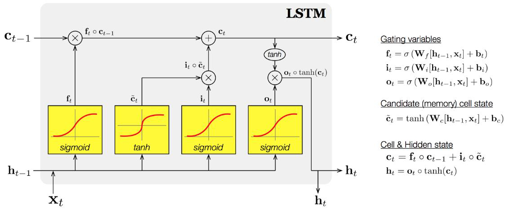

#### 컨볼루션

##### 전체구조

- 빌딩 블록 : 여러개를 이어붙여서 깊은 구조로 확장 (CONV - $\tau$ - POOL)
- 출력 크기 : 입력이 W1 x H1 x D1, K개 FxF 커널, 보폭 S, 덧대기 P일때 출력 W2 = (W1 - F + 2P) / S + 1, D2 = K

CNN은 가변크기의 입력을 다룰 수 있다 (보폭 조정 등을 통해)

#### 사례연구

##### AlexNet

- 매개변수가 많고, GPU 2개로 분할해 학습 수행, 마지막 층은 softmax
- 성공요인 : 대용량 DB, GPU병렬사용(외적요인), ReLU사용, 지역반응 정규화, 데이터확대/드롭아웃(내적요인), 테스트단계에서 앙상블 적용

##### VGGNet

- 3x3 작은 커널 사용, 깊은 신경망
- 작은 커널 : 큰 크기의 커널을 여러 개의 작은 커널로 분해, 매개변수가 줄어들고 신경망이 깊어지는 효과
  여기에 비선형 함수 적용시 분별력 상승 - NIN에서 유래 (실험만 진행됨)

##### GoogLeNet

- NIN 구조 : Mlpconv 층이 컨볼루션 연산을 대신함(커널 옮겨가며 MLP 전방계산 수행)
  - 전역 평균 풀링 사용, 특징 맵 각각을 평균해 출력 노드에 입력(매개변수 줄어듬)
- 인셉션 모델 : NIN 구조를 확장해 여러개의 병렬적인 CONV층을 가지도록, 네 종류의 CONV연산(다양한 특징)
  - 9개 결합해 사용, 완전연결층은 단 하나
- 보조 분류기 : 원 분류기 / 보조 분류기 오류역전파 결과 결함 -> 그레디언트 소멸 문제 완화(동작시에는 제거)

###### ResNet

- 잔류학습 : 성능저하를 피하면서 층수를 대폭 늘림(깊을수록 특징 잘 추출)
  지름길 연결된 x를 더한 F(x) + x에 $\tau$를 적용, F(x)는 잔류
- VGGNet과 같은 점 : 3x3 커널 사용, 다른 점 : 잔류학습, GAP, 배치 정규화 적용(드롭아웃 X)

#### 생성모델 : 실제 데이터 분포 알 수 없음

- GAN : 우월한 성능, 생성기 G와 분별기 D의 대립 구도에서 G의 승리를 목표로 함

딥러닝의 강력함 : 종단간 학습, 깊이의 중요성, 계층적 특징(층의 역할 구분 확실)

#### 딥러닝 최적화 : 대리자 관계/비볼록성질/고차원특징공간/데이터의 희소성에 따른 어려움

##### 목적함수

- 평균 제곱 오차 : 로지스틱 시그모이드 도함수의 모양 때문에 큰 교정이 필요할 때 작은 그레디언트가 적용
- 교차 엔트로피 : 오류가 더 큰 쪽에 큰 벌점
  $e = -\sum_{l=1,x}(y_ilog_2o_i + (1-y_i)log_2(1-o_i))$
- 소프트맥스/로그우도 : 소프트맥스는 최대값 활성화, 다른값 억제(모두 더하면 1)
  로그우도는 하나의 노드만 적용(잘못 분류시 목적함수값 상승, 잘 분류되면 하락), 확실한 분별력 요할때 사용
  $e = -log_2o_y$

##### 데이터 전처리 : 데이터들이 같은 차원에 있도록 크기 맞춰주기

- 양의 가중치 문제(모든 특징이 양수인 경우) : 가중치가 뭉치로 움직이는 현상, 수렴이 느려짐
- 정규화 : 규모/양수문제 해결 - 특징별로 독립적으로 적용 / 최대최소 변환
  $x_i^{new} = \frac{x_i^{old} - min(x_i)}{max(x_i) - min(x_i)}$
- 원핫코드 : 거리개념 X, 값의 개수만큼 비트 부여, 전처리의 핵심

##### 가중치 초기화

- 대칭적 가중치 문제 :잘못된 초기화로 인해 여러 노드가 같은 일을 하는 현상
  난수 가중치 초기화로 해결 (범위 중요) $r = \frac{1}{\sqrt{n_{in}}} or \frac{\sqrt{6}}{\sqrt{n_{in} + n_{out}}}$
  너무 작으면 학습 더딤, 크면 활성값 포화

##### 모멘텀

- 그레디언트 잡음 현상 : 잡음 가능성이 높음 -> 모멘텀으로 해결(과거의 이동 방식을 기억하고 추가 이동)
  -> 수렴속도 향상, 지나침 현상 누그러뜨림
- 가중치 갱신 수식 $v = \alpha v - p \frac{\delta J}{\delta \theta}$, $\theta = \theta + v$

- 네스테로프 가속 그레디언트 모멘텀 : 현재 v값으로 이동할 곳 예견, 예견한 곳의 그레디언트 사용

  $\hat{\theta} = \theta + \alpha v$, $v = \alpha v - p \frac{\delta J}{\delta \theta}$, $\theta = \theta + v$

##### 적응적 학습률 : 학습률에 따른 지나침 현상 - 매개변수마다 자신의 상황에 따라 학습률 조절

- AdaGrad : 시간에 따라서 줄어듬, 각각의 차원 축에 따로 적용
  단점 : r이 점점 커져 수렴 방해, 오래된 g 현재 g 같은 비율
- RMSProp : 가중 이동 평균 기법 적용 - 최근 것에 더 비중을 두고 과거의 데이터에 힘을 뺌
- Adam : RMSProp에 모멘텀 추가로 적용 - v값 r값 동시 사용 밑 적용
  모멘텀 계수, 가중 이동 평균 계수, 학습률 3가지 매개변수 필요

##### 활성함수 : 포화문제 해결, 출력의 중심을 0으로, 연산량 줄이기

- ReLU : tanh는 활성값이 커지면 포화상태, 그레디언트는 0에 가깝게(매개변수 학습이 느려짐)
  문제점 - 양의 문제 발생 가능성, 0한번 걸리면 계속 0
- LeakyReLU : 음수일때 $\alpha$ 곱한값 적용, PReLU : $\alpha$를 학습으로 알아냄

##### 배치 정규화

- 공변량 시프트 현상 : 학습이 진행되면서 데이터의 분포가 수시로 바뀜 -> 학습방해
- 정규화를 모든 층에 적용, 중간결과 $z$에 정규화 적용(비선형 함수 통과 직전)
  미니배치에 적용하는 것이 유리
- 장점 : 그레디언트 흐름 개선, 높은 학습률 허용, 초기화 의존성 하락, 규제와 유사한 효과(드롭아웃 필요 X)
  후처리 작업 : 전체 훈련집합을 대상으로 평균과 분산 알아냄
  CNN에서는 특징맵 단위로 적용

#### 규제

##### 필요성

- 용량이 큰 모델 -> 과잉적합 우려, 사전지식 활용한 규제 수행 필요
  매끄러움 가정 : 일반화 오류를 줄이기 위해 학습 알고리즘 수정 $J_{regularized}(\theta) = J(\theta) + \lambda R(\theta)$
  - 명시적 규제 : 목적함수, 신경망구조 직접 수정(가중치 감쇠/드롭아웃)
  - 암시적 규제 : (간접적인 영향, 조기멈춤/대이터증대/잡음추가/앙상블 등)

##### 가중치 벌칙

- 규제항은 훈련집합과 무관, 사전지식에 해당
  모델의 용량을 제한 - L1놈/L2놈 사용
  - L2놈 : 규제항 = $\lambda ||\theta||_2^2$ -> $\theta = (1-2p\lambda)\theta - pJ$
    그냥 $\theta$에 $(1-2p\lambda)$를 곱해주는 셈
  - L1놈 : 규제항 = $\lambda||\theta||$ -> $\theta = \theta - pJ - p\lambda sign(\theta)$
  - 효과 : 가중치에 대한 선호도 표현, 학습모델 단순화, 매끄럽게(최적화 개선)
    엘라스틱 넷 = (L1놈 + L2놈)

##### 조기멈춤 : 일정시간이 지나면 과잉적합(일반화 능력 떨어짐)

- 검증집합의 오류가 최저인 점 $t$에서 학습 중단 - 순진한 버전 : 바로 멈춤, 현실적 버전: 몇번 참고 멈춤

##### 데이터확대 : 데이터 수집은 비용이 많이 들어서 인위적으로 변형 / 확대 

- 한계 : 수작업 변형, 모든 부류 같은 변형
- 모핑 : 비선형 변환, 데이터에 맞는 변환규칙 적용(자연영상 확대, 잡음 섞어 확대)

##### 드롭아웃 : 입력층과 은닉층의 노드 중 일정 비율을 임의 선택 / 제거

- 많은 부분 신경망을 만들고 예측단계에서 앙상블 하는 셈(실제로는 가중치 공유 사용)
  노드 제거 여부를 표시하고, 입력/은닉 제거 비율을 따로 정함
- 예측 단계 : 앙상블 효과 모방, 가중치에 생존비율을 곱해 전방계산
  신경망의 크기가 부담, 은닉노드 수를 $\frac{1}{P_{hidden}}$ 만큼 늘림

##### 앙상블 기법

- 서로 다른 여러 모델을 결합해 오류를 줄임, 서로 다른 신경망에게 동일한 문제를 풀게 함
  1. 서로 다른 예측기 학습
     다른 구조 신경망 여러개 또는 같은 구조 다른 가중치 매개변수 설정 학습
     배깅 : 훈련집합을 여러번 샘플링, 서로 다른 훈련집합 구성 / 부스팅 : 순차적 학습, 연계성 고려
  2. 학습된 예측기 결합 : 평균을 구하거나 보팅

##### 하이퍼 매개변수 최적화

- 매개변수 : 내부 매개변수 - 가중치 -> 학습 알고리즘이 최적화, 
  하이퍼 매개변수 - 모델 외부에서 동작 조정(사람이 결정)
- 격자 탐색 / 임의 탐색 / 로그공간 탐색 : 임의 탐색이 성능 제일 좋음

##### 2차 미분 이용 방법 : 경사하강법을 더 빠르게

- 뉴턴 방법 : 2차 미분이라 최저점 존재, 헤시안 구하는 연산량이 너무 많음
- 켤레 그레디언트 방법 : 직전 정보를 사용해 빠르게 접근
- 유사 뉴턴 방법 : H를 근사하는 M을 사용, LFGS

#### 비지도 학습 : 사전지식을 더 명시적으로 사용

- 기계학습 : 전체 데이터에 대한 지식(훈련집합으로부터) + 사전지식(세상의 일반적인 규칙으로부터)
  - 매니폴드 가정 : 데이터 집합을 하나 또는 여러개의 매니폴드로 구성
    매끄러움 가정 : 샘플은 어떤 요인에 의해 매끄러운 곡선에 따라 변한다

##### 군집화

- K-Means : 군집의 개수 K, 거리 측정방식을 주관에 의해 결정(연결기준, 중심기준, 분포기준, 밀도기준)
  - 특성 : 원리는 단순, 성능은 우수, 이해도 쉽다
    군집중심 초기화 -> 훈련집합 배치 -> 중심 재계산 -> 반복
- K-Medoids : 중심을 점으로 정함, 잡음에 둔감, 최적화 문제로 해석
- 다중시작 K-Means : 임의로 K개 샘플 픽하고, K-평균 수행 - EM 알고리즘과 유사

- 친밀도 전파 알고리즘 : 데이터들 간 신호 전달 개념 사용
  책임 행렬 R, 가용행렬 A를 이용해 군집화 수행, K의 개수는 자동으로 측정해서 알아냄
  자가 유사도 $S_{kk}$ : 유사도의 최소/중간/최대값 중 선택
  "책임" : 데이터 포인트가 후보를 선호하는 정도
  "가용도" : 후보표본이 데이터포인트의 군집중심으로 사용될 수 있는 정도

##### 밀도 추정

- 모수 : 정해진 확률 밀도 함수로 추정, 비모수 : 관측치만으로 데이터 분포 추정
- 커널 밀도 추정(비모수)
  - 히스토그램 추정법 : 계단모양, 매끄럽지 못함, 칸 크기/위치에 민감
  - 커널을 씌우고 샘플의 가중합 이용(커널 함수) -> 차원변환에도 적용
    매끄러움, 대역폭 $h$ 중요(작으면 뾰족, 크면 뭉개짐)
  - 문제점 : 메모리 기반 방법(새로운 샘플 -> 처음부터 다시 계산), 데이터 희소성

- 가우시안 혼합(모수적 방법)
  - 데이터가 가우시안 분포를 따른다고 가정 -> 평균벡터, 공분산행렬 추정
    -> 하나의 가우시안으로 표현은 어려움, k개의 가우시안의 선형결합으로 표현
  - 최대 우도를 이용한 최적화 문제가 됨
  - EM 알고리즘임 (샘플의 소속정보 개선 <-> 가우시안 개선) 

##### 공간 변환

- 인코딩 : 원래공간 -> 다른공간, 디코딩 : 다른공간 -> 원래공간

- 선형 인자모델 - 행렬곱으로 표현, $\alpha$값은 데이터 잡음 추가/이동에 사용
  $f : z = W_{enc}X + \alpha_{enc}$, $g : X = W_{dec}z + \alpha_{dec}$

  z에 확률 개념 x, $\alpha$ 생략 -> 주성분 분석
  z와 $\alpha$가 가우시안 분포 -> 확률 주성분 분석
  z가 비 가우시안 분포 -> 독립성분 분석

- 주성분 분석
  - 데이터를 원점으로 옮기는 전처리 작업 필요 $X_i = X_i - u$
    변환식 : $Z = W^TX$
  - 목적 : 손실을 최소화하면서 저차원으로 변환(분산이 클수록 정보손실이 적음)
    원점으로 옮기기 -> u축으로 투영 -> 분산 측정
  - 최적화 문제 : 공분산 행렬 계산 -> d개의 고유값, 고유벡터 계산 ->
    고유값 큰 순서대로 벡터 나열 -> q개의 주성분 선택해서 w채움
  - 고유벡터 구하기 $(\Sigma - \lambda I)k = 0$, $det(\Sigma - \lambda I) = 0$
- 독립성분 분석 : 블라인드 원음 분리 문제, 기저함수/기저벡터의 선형결합으로 신호를 표현
  - 희소코딩 : 사전 D를 구성하는 기저벡터의 선형결합으로 신호 X 표현 $X = Da$
    - 다른 변환기법과 다른 점 : 비지도학습이 사전 자동으로 알아냄, 
      사전의 크기를 과잉완벽하게 책정, 희소코드 a를 구성하는 요소 대부분 0 값
      -> 최대한 많이 0이 되게 하는 선형 계수를 찾음
- 오토 인코더 : 특징벡터 x를 이력 받아 동일한, 유사한 벡터 x'를 출력하는 신경망
  -> 차원감소 위해 데이터 집단에 대한 표현 학습
  - 병목 구조 오토인코더 : $h$가 $x$의 핵심 정보 표현
  - 학습 : 훈련집합 X, 알아내야 하는 매개변수 $f$와 $g$ (매핑함수)
  - 규제 오토 인코더
    SAE : 희소한 독립적 인자들로 표현, $h$가 희소하도록 강제, 가중치 감쇠
    DAE : 입력의 부분 손실에도 견고한 표현 학습, 잡음 추가 및 원본 복원
    CAE : 데이터의 작은 변황 ㅔ견고, $f$의 야코비안 행렬의 프로베니우스 놈을 작게 유지
  - 적층 오토 인코더 : 층별 예비학습을 통한 깊은 신경망
    -> 지도학습에 활용 : 층별 예비학습 수행(X, 비지도) -> 출력을 입력으로 MLP 학습(X,Y , 지도학습)
    		-> 전체를 추가로 학습(미세 조정)

##### 매니폴드 학습 : 고차원 공간에 내재한 저차원 공간

- 매니폴드 가정 : 고차원 공간에 주어진 실제 세계의 데이터는 고차원 입력공간 $R^d$에 내재한 훨씬 저차원인 $d_M$차원 매니폴드의 인근에 집중됨

- ISOMap : 최근접이웃그래프 구축
  K-최근접이웃을 구해 거리를 nxn M 행렬에 저장, 빈 곳은 최단 경로의 길이로 채움
  M의 고유벡터를 계산 - M의 크기가 너무 큰 문제
- LLE : 함수 $\epsilon$을 최소로 하는 가중치 행렬 $W$ 사용, $x_i$를 k-최근접이웃의 선형결합으로 근사화
- t-SNE : 가장 뛰어난 매니폴드 공간 변환 기업
  - 원래 공간에서 유사도 측정, 변환된 공간에서의 유사혿는 학생-t 분포도 측정
    둘의 KL다이버전스를 구해서 이를 최소화하는 $X'$를 구한다
  - 동작 : 임의의 점 선택, 다른 점들까지의 거리 측정, 
    $t$분포의 검정 점을 중심에 있다고 할 때, 유사도가 큰 값끼리 군집
  - 단점 : 낮은 차원으로 잘 변환, 축 위치가 매번 바뀜, 시각화에만 유용

##### 귀납적 모델 : 일반적 규칙에 이르기까지 추론한 후 시험사례 적용, 새로운 샘플 처리가능

##### 전이유추 학습모델 : 시험사례로 추론, 새로움 샘플 처리능력 X, IsoMAP/LLE/t-SNE, 데이터 가시화 목적

#### 순환신경망

- 순차데이터 : 특징이 순서를 가짐, 동적이며 가변길이
- 순환신경망 : 시간성 저옵를 활용하여 순차 데이터를 처리하는 효과적인 학습 모델
  매우 긴 순차 데이터는 LSTM으로 해결
  시간에 따라 변화하는 특징을 잘 캐치하겠다는 의도, 최근에는 순환신경망을 생성 모델로 사용하기도

##### 순차 데이터

- 표현
  - 일반적인 표기 : $\bold{x} = (\bold{x}^{(1)},\bold{x}^{(2)},...,\bold{x}^{(T)})^T$
  - 문자열 순차 데이터 표현
    - 사전 구축 방법 : 단어를 모아 구축, 주어진 말뭉치를 분석하여 단어를 자동 추출하여 구축
  - 단어 가방 : 단어 각각의 빈도수를 세어 $m$차원의 벡터로 표현
    - 한계 : 정보 검색에 주로 사용되지만, 기계 학습에는 부적절(시간성 정보가 사라짐)
  - 원핫 코드 : 해당 단어의 위치만 1로 표시
    - 한계 : 한 단어를 표현하는데 $m$차원 벡터를 사용(비효율), 단어간의 유사성 측정 불가
  - 단어 임베딩 : 고차원에서 유사하면 저차원에서도 투영하겠다
    단어사이의 상호작용을 분석하여 새로운 공간으로 변환 ($m$보다 훨씬 낮은 차원)
    변환 과정은 학습이 말뭉치를 훈련집합으로 사용해 알아냄, 각각의 의미를 이해해서 저차원으로 투영

- 특성
  - 특징이 나타나는 순서가 중요, 샘플마다 길이가 다름, 
    문맥 의존성(공분산 의미 X, 간격이 클 경우 장기 의존성 : LSTM으로 처리)

##### 순환신경망(RNN)

- 필수기능 : 시간성(한번에 하나씩 입력), 가변길이, 문맥 의존성(적절한 순간에 활용)
- 구조 : 기존 깊은 신경망과 유사(입력층, 은닉층, 출력층), 
  은닉층이 순환 연결($t-1$순간의 정보를 $t$순간으로 전달)을 가짐
  - $h^{(t)} = f(h^{(t-1)}, x^{(t)};\theta)$

- 매개변수 : $\bold{U}$ - 입력층/은닉층 연결, $\bold{W}$ - 은닉층/은닉층 연결, $\bold{V}$ - 은닉층/출력층 연결, $\bold{b,c}$ - 바이어스
  매순간 다른 값을 사용하지 않고, 같은 값을 공유함(중간에 안바뀐다)
  - 장점 : 추정할 때 매개변수 수가 엄청 줄어듬, 매개변수의 수가 특징 벡터의 길이에 무관
    특징이 나타나는 순간이 뒤바뀌어도 같거나 유사한 출력 만들기 가능

- 다양한 RNN 구조 : 입력의 개수와 출력의 개수가 같거나 다를 수 있다 (하나이거나 여럿이거나)
- 동작
  - 은닉층 계산 : $\bold{a^{(t)}} = \bold{W}\bold{h^{(t-1)}} + \bold{U}\bold{x^{(t)}} + \bold{b}$
  - 출력층 계산 : $\bold{o^{(t)}} = \bold{V}\bold{h^{(t)}} + c$
    $\bold{y^{'(t)}} = softmax(\bold{o^{(t)}})$
  - 은닉층 정보전달에 tanh 사용 : 최대한 그레디언트 소멸문제 해결할려고

##### BPTT 학습

- RNN과 DMLP의 유사성 : 둘 다 입력층, 은닉층, 출력층을 가짐
  차별성 : RNN은 샘플마다 은닉층의 수가 다름, 매순간 입력과 출력이 있음, 가중치를 공유함
- 목적함수 정의 : 평균제곱 오차, 교차 엔트로피, 로그우도 중 선택해서 사용
- 오류 역전파의 동작 : 전체를 다 역전파 하기에는 부담 -> 부분만

##### 양방향 RNN : 왼쪽에서 오른쪽으로만 정보가 흐르는 RNN은 한계

- $t$순간의 단어는 앞쪽 단어와 뒤쪽 단어 정보를 모두 보고 처리됨(BRNN)

##### 장기 문맥 의존성

- 관련된 요소가 멀리 떨어져 있으면 같은 가중치를 사용하기 때문에 그레디언트 소멸/폭발 문제
  - LSTM으로 해결

##### LSTM(Long Short Term Memory)

- 게이트 : 열면 신호가 전달되고, 닫으면 차단됨

- 동작 : 장기기억(메모리 블록의 은닉 상태), 기억 유지/제거(망각 게이트), 입력, 출력

  

  - 포겟게이트 : 시그모이드 활성함수통과(확률값)
    이전내용이 중요하면 메모리값 유지, 아니면 날림
  - 입력 게이트 : 지금 들어오는 정보가 중요한 정도, 중요하다면 메모리셀에 +해서 저장
  - 출력 게이트 : 출력값을 얼마나 내보낼지 결정

- 그레디언트 흐름 : f값이 1에 가까우면 해당 값을 잘 기억할 것, ResNET처럼 그레디언트 소멸문제 걱정 X

##### 언어모델

- 문장, 즉 단어 열의 확률 분포
- 활용 : 후보로 출력한 문장이 여럿 있을 때, 언어 모델로 확률 계산 후 확률이 가장 높은 것을 선택
- 확률 분포 추정법
  - n-그램 : 고전적인 방법, unigrams/bigrams/trigrams
    단어를 원핫코드로 표현, 단어간의 의미 있는 거리를 반영하지는 못하는 한계
  - 다층 퍼셉트론
  - 순환 신경망
    - 현재까지 본 단어 열을 기반으로 다음 단어를 예측하는 방식, 문장 생성 기능까지 갖춤
    - 비지도 학습에 해당, 말뭉치로 쉽게 훈련집합 구축 가능
    - 말뭉치의 문장을 변환하여 훈련집합으로 만들어 BPTT 학습 알고리즘 적용
    - 학습을 마쳤으면 기계 번역기 / 음성 인식기 성능 향상에 사용

##### 기계번역

- 언어 모델보다 어려움 : 언어모델은 입력/출력 길이가 같은데 기계 번역은 sequence to sequence, 어순
- LSTM을 사용하여 번역 과정 전체를 통째로 학습
  - LSTM 2개 사용(인코더, 디코더)
  - 인코더는 원시 언어 문장 x를 $\bold{h}_{T_s}$라는 특징 벡터로 변환
  - 디코더는 $\bold{h}_{T_s}$를 가지고 목적 언어 문장 $\bold{y}$를 생성
    - 가변 길이의 문장을 고정 길이의 특징 벡터로 변환한 후 고정길이에서 가변 길이 문장 생성
      문장 길이가 크게 다르면 성능 저하
  - 모든 순간의 상태 변수를 사용하는 방식
    - 인코더의 계산 결과를 모두 디코더에 넘겨주고, 양방향 구조를 채택해 어순이 다른 문제 해결

##### 영상 주석 생성

- 영상 주석 생성 응용
  - 영상 속 물체 검출/인식, 물체의 속성/행위, 물체간의 상호작용을 알아내는 일 + 의미요약 문장 생성
  - 딜버닝 기술을 사용해 통째 학습
- 딥러닝 접근 방법 : CNN은 영상을 분석하고 인식 + LSTM은 문장을 생성
  - CNN : 입력 영상 x를 단어 임베딩 공간의 특징 벡터 $\hat{\bold{z}}_{-1}$로 변환
    - 통째 학습 과정에서 동시에 최적화
  - 목적함수 : $J(\theta) = - \sum^T_{t=1}log(\hat{\bold{y_t}}\bold{z_t})$
    로그우도로 일치 정도 평가
  - 최적화해야 할 매개변수 집합 : CNN 매개변수, LSTM 매개변수, 단어 임베딩 매개변수
    통째학습으로 한꺼번에 최적화 