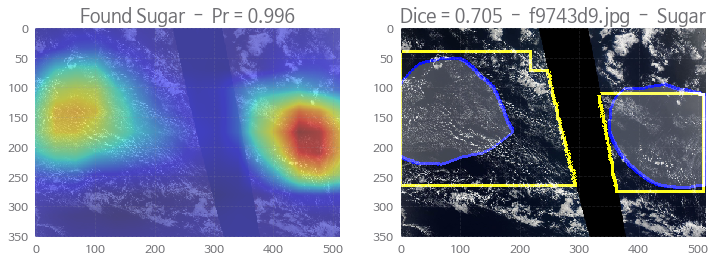

```python
import keras
import numpy as np, pandas as pd, os 
from keras import layers
from keras.models import Model
from PIL import Image
from keras import optimizers
import scipy, cv2   
import matplotlib.pyplot as plt 
from sklearn.model_selection import train_test_split
from sklearn.metrics import roc_auc_score, accuracy_score
```

```python
train = pd.read_csv('./understanding_cloud_organization/train.csv')
train['Image'] = train['Image_Label'].map(lambda x: x.split('.')[0])
train['Label'] = train['Image_Label'].map(lambda x: x.split('_')[1])
train2 = pd.DataFrame({'Image':train['Image'][::4]})
train2['e1'] = train['EncodedPixels'][::4].values
train2['e2'] = train['EncodedPixels'][1::4].values
train2['e3'] = train['EncodedPixels'][2::4].values
train2['e4'] = train['EncodedPixels'][3::4].values
train2.set_index('Image',inplace=True,drop=True)
train2.fillna('',inplace=True); train2.head()
train2[['d1','d2','d3','d4']] = (train2[['e1','e2','e3','e4']]!='').astype('int8')
train2[['d1','d2','d3','d4']].head()
```

<table border="1" class="dataframe">
  <thead>
    <tr style="text-align: right;">
      <th></th>
      <th>d1</th>
      <th>d2</th>
      <th>d3</th>
      <th>d4</th>
    </tr>
    <tr>
      <th>Image</th>
      <th></th>
      <th></th>
      <th></th>
      <th></th>
    </tr>
  </thead>
  <tbody>
    <tr>
      <th>0011165</th>
      <td>1</td>
      <td>1</td>
      <td>0</td>
      <td>0</td>
    </tr>
    <tr>
      <th>002be4f</th>
      <td>1</td>
      <td>1</td>
      <td>0</td>
      <td>1</td>
    </tr>
    <tr>
      <th>0031ae9</th>
      <td>1</td>
      <td>1</td>
      <td>0</td>
      <td>1</td>
    </tr>
    <tr>
      <th>0035239</th>
      <td>0</td>
      <td>1</td>
      <td>1</td>
      <td>0</td>
    </tr>
    <tr>
      <th>003994e</th>
      <td>1</td>
      <td>0</td>
      <td>1</td>
      <td>1</td>
    </tr>
  </tbody>
</table>


```python
def rle2maskX(mask_rle, shape=(2100,1400), shrink=1):
    # Converts rle to mask size shape then downsamples by shrink
    s = mask_rle.split()
    starts, lengths = [np.asarray(x, dtype=int) for x in (s[0:][::2], s[1:][::2])]
    starts -= 1
    ends = starts + lengths
    img = np.zeros(shape[0]*shape[1], dtype=np.uint8)
    for lo, hi in zip(starts, ends):
        img[lo:hi] = 1
    return img.reshape(shape).T[::shrink,::shrink]

def rle2mask2X(mask_rle, shape=(2100,1400), shrink=(512,352)):
    # Converts rle to mask size shape then downsamples by shrink
    s = mask_rle.split()
    starts, lengths = [np.asarray(x, dtype=int) for x in (s[0:][::2], s[1:][::2])]
    starts -= 1
    ends = starts + lengths
    img = np.zeros(shape[0]*shape[1], dtype=np.uint8)
    for lo, hi in zip(starts, ends):
        img[lo:hi] = 1
    img = img.reshape(shape).T
    img = Image.fromarray(img)
    img = img.resize(shrink)
    img = np.array(img)
    return img

def mask2contour(mask, width=5):
    w = mask.shape[1]
    h = mask.shape[0]
    mask2 = np.concatenate([mask[:,width:],np.zeros((h,width))],axis=1)
    mask2 = np.logical_xor(mask,mask2)
    mask3 = np.concatenate([mask[width:,:],np.zeros((width,w))],axis=0)
    mask3 = np.logical_xor(mask,mask3)
    return np.logical_or(mask2,mask3) 

def mask2rle(img, shape=(525,350)):    
    pixels= img.T.flatten()
    pixels = np.concatenate([[0], pixels, [0]])
    runs = np.where(pixels[1:] != pixels[:-1])[0] + 1
    runs[1::2] -= runs[::2]
    return ' '.join(str(x) for x in runs)

def dice_coef6(y_true_rle, y_pred_rle, y_pred_prob, th):
    if y_pred_prob<th:
        if y_true_rle=='': return 1
        else: return 0
    else:
        y_true_f = rle2maskX(y_true_rle,shrink=4)
        y_pred_f = rle2maskX(y_pred_rle,shape=(525,350))
        union = np.sum(y_true_f) + np.sum(y_pred_f)
        if union==0: return 1
        intersection = np.sum(y_true_f * y_pred_f)
        return 2. * intersection / union

def dice_coef8(y_true_f, y_pred_f):
    union = np.sum(y_true_f) + np.sum(y_pred_f)
    if union==0: return 1
    intersection = np.sum(y_true_f * y_pred_f)
    return 2. * intersection / union

class DataGenerator(keras.utils.Sequence):
    # USES GLOBAL VARIABLE TRAIN2 COLUMNS E1, E2, E3, E4
    'Generates data for Keras'
    def __init__(self, list_IDs, batch_size=8, shuffle=False, width=512, height=352, scale=1/128., sub=1., mode='train',
                 path='./understanding_cloud_organization/train_images/', flips=False):
        'Initialization'
        self.list_IDs = list_IDs
        self.shuffle = shuffle
        self.batch_size = batch_size
        self.path = path
        self.scale = scale
        self.sub = sub
        self.path = path
        self.width = width
        self.height = height
        self.mode = mode
        self.flips = flips
        self.on_epoch_end()
        
    def __len__(self):
        'Denotes the number of batches per epoch'
        ct = int(np.floor( len(self.list_IDs) / self.batch_size))
        if len(self.list_IDs)>ct*self.batch_size: ct += 1
        return int(ct)

    def __getitem__(self, index):
        'Generate one batch of data'
        indexes = self.indexes[index*self.batch_size:(index+1)*self.batch_size]
        X, y = self.__data_generation(indexes)
        if (self.mode=='train')|(self.mode=='validate'): return X, y
        else: return X

    def on_epoch_end(self):
        'Updates indexes after each epoch'
        self.indexes = np.arange(int( len(self.list_IDs) ))
        if self.shuffle: np.random.shuffle(self.indexes)

    def __data_generation(self, indexes):
        'Generates data containing batch_size samples' 
        # Initialization
        lnn = len(indexes)
        X = np.empty((lnn,self.height,self.width,3),dtype=np.float32)
        y = np.zeros((lnn,4),dtype=np.int8)
        
        # Generate data
        for k in range(lnn):
            img = cv2.imread(self.path + self.list_IDs[indexes[k]] + '.jpg')
            img = cv2.resize(img,(self.width,self.height),interpolation = cv2.INTER_AREA)
            # AUGMENTATION FLIPS
            hflip = False; vflip = False
            if (self.flips):
                if np.random.uniform(0,1)>0.5: hflip=True
                if np.random.uniform(0,1)>0.5: vflip=True
            if vflip: img = cv2.flip(img,0) # vertical
            if hflip: img = cv2.flip(img,1) # horizontal
            # NORMALIZE IMAGES
            X[k,] = img*self.scale - self.sub      
            # LABELS
            if (self.mode=='train')|(self.mode=='validate'):
                y[k,] = train2.loc[self.list_IDs[indexes[k]],['d1','d2','d3','d4']].values
            
        return X, y

```


```python
# USE KERAS XCEPTION MODEL
from keras.applications.xception import Xception
base_model = Xception(weights='imagenet',include_top=False,input_shape=(None,None,3))
# FREEZE NON-BATCHNORM LAYERS IN BASE
for layer in base_model.layers:
    if not isinstance(layer, layers.BatchNormalization): layer.trainable = False
# BUILD MODEL NEW TOP
x = base_model.output
x = layers.GlobalAveragePooling2D()(x)
x = layers.Dense(4,activation='sigmoid')(x)
model = Model(inputs=base_model.input, outputs=x)
# COMPILE MODEL
model.compile(loss='binary_crossentropy', optimizer = optimizers.Adam(lr=0.001), metrics=['accuracy'])

# SPLIT TRAIN AND VALIDATE
idxT, idxV = train_test_split(train2.index, random_state=42, test_size=0.2)
train_gen = DataGenerator(idxT, flips=True, shuffle=True)
val_gen = DataGenerator(idxV, mode='validate')

# TRAIN NEW MODEL TOP LR=0.001 (with bottom frozen)
h = model.fit_generator(train_gen, epochs = 2, verbose=2, validation_data = val_gen)
# TRAIN ENTIRE MODEL LR=0.0001 (with all unfrozen)
for layer in model.layers: layer.trainable = True
model.compile(loss='binary_crossentropy', optimizer = optimizers.Adam(lr=0.0001), metrics=['accuracy'])
h = model.fit_generator(train_gen, epochs = 2, verbose=2, validation_data = val_gen)
```

    Epoch 1/2
     - 669s - loss: 0.5974 - acc: 0.6710 - val_loss: 0.5390 - val_acc: 0.7218
    Epoch 2/2
     - 416s - loss: 0.5438 - acc: 0.7230 - val_loss: 0.5237 - val_acc: 0.7336
    Epoch 1/2
     - 427s - loss: 0.5295 - acc: 0.7335 - val_loss: 0.5141 - val_acc: 0.7495
    Epoch 2/2
     - 412s - loss: 0.4952 - acc: 0.7570 - val_loss: 0.4946 - val_acc: 0.7599


```python
# PREDICT HOLDOUT SET
train3 = train2.loc[train2.index.isin(idxV)].copy()
oof_gen = DataGenerator(train3.index.values, mode='predict')
oof = model.predict_generator(oof_gen, verbose=2)
for k in range(1,5): train3['o'+str(k)] = 0
train3[['o1','o2','o3','o4']] = oof

# COMPUTE ACCURACY AND ROC_AUC_SCORE
types = ['Fish','Flower','Gravel','Sugar']
for k in range(1,5):
    print(types[k-1],': ',end='')
    auc = np.round( roc_auc_score(train3['d'+str(k)].values,train3['o'+str(k)].values  ),3 )
    acc = np.round( accuracy_score(train3['d'+str(k)].values,(train3['o'+str(k)].values>0.5).astype(int) ),3 )
    print('AUC =',auc,end='')
    print(', ACC =',acc) 
print('OVERALL: ',end='')
auc = np.round( roc_auc_score(train3[['d1','d2','d3','d4']].values.reshape((-1)),train3[['o1','o2','o3','o4']].values.reshape((-1)) ),3 )
acc = np.round( accuracy_score(train3[['d1','d2','d3','d4']].values.reshape((-1)),(train3[['o1','o2','o3','o4']].values>0.5).astype(int).reshape((-1)) ),3 )
print('AUC =',auc, end='')
print(', ACC =',acc) 
```

    Fish : AUC = 0.798, ACC = 0.722
    Flower : AUC = 0.91, ACC = 0.823
    Gravel : AUC = 0.799, ACC = 0.726
    Sugar : AUC = 0.806, ACC = 0.768
    OVERALL: AUC = 0.841, ACC = 0.76


```python
# NEW MODEL FROM OLD TO EXTRACT ACTIVATION MAPS
all_layer_weights = model.layers[-1].get_weights()[0]
cam_model = Model(inputs=model.input, 
        outputs=(model.layers[-3].output, model.layers[-1].output)) 

# DISPLAY 25 RANDOM IMAGES
PATH = './understanding_cloud_organization/train_images/'
IMGS = os.listdir(PATH)
for k in np.random.randint(0,5000,25):
    
    # LOAD IMAGE AND PREDICT CLASS ACTIVATION MAP
    img = cv2.resize( cv2.imread(PATH+IMGS[k]), (512, 352))
    x = np.expand_dims(img, axis=0)/128. -1.
    last_conv_output, pred_vec = cam_model.predict(x) 
    last_conv_output = np.squeeze(last_conv_output) 
    pred = np.argmax(pred_vec)
    layer_weights = all_layer_weights[:, pred] 
    final_output = np.dot(last_conv_output.reshape((16*11, 2048)), layer_weights).reshape(11,16) 
    final_output = scipy.ndimage.zoom(final_output, (32, 32), order=1) 

    # DISPLAY IMAGE WITH CLASS ACTIVATION MAPS
    plt.figure(figsize=(12,6))
    plt.subplot(1,2,1)
    mx = np.round( np.max(final_output),1 )
    mn = np.round( np.min(final_output),1 )
    final_output = (final_output-mn)/(mx-mn)
    mask0 = (final_output>0.3).astype(int)
    contour0 = mask2contour(mask0,5)
    plt.imshow(img, alpha=0.5)
    plt.imshow(final_output, cmap='jet', alpha=0.5)
    plt.title('Found '+types[pred]+'  -  Pr = '+str(np.round(pred_vec[0,pred],3)) )
    
    # DISPLAY IMAGE WITH MASKS
    plt.subplot(1,2,2)
    img = cv2.cvtColor(img, cv2.COLOR_BGR2RGB)
    rle = train2.loc[IMGS[k].split('.')[0],'e'+str(pred+1)]
    mask = rle2mask2X(rle,shrink=(512,352))
    contour = mask2contour(mask,5)
    img[contour==1,:2] = 255
    img[contour0==1,2] = 255
    diff = np.ones((352,512,3),dtype=np.int)*255-img
    img=img.astype(int); img[mask0==1,:] += diff[mask0==1,:]//4
    plt.imshow( img )
    dice = np.round( dice_coef8(mask,mask0),3 )
    plt.title('Dice = '+str(dice)+'  -  '+IMGS[k]+'  -  '+types[pred])
    
    plt.show()
```





```python
print('Computing',len(train3),'masks...')
for i in range(1,5): train3['p'+str(i)] = ''
for i in range(1,5): train3['pp'+str(i)] = 0

for i,f in enumerate(train3.index.values):
    
    # LOAD IMAGE AND PREDICT CLASS ACTIVATION MAPS
    img = cv2.resize( cv2.imread(PATH+f+'.jpg'), (512, 352))
    x = np.expand_dims(img, axis=0)/128. -1.
    last_conv_output, pred_vec = cam_model.predict(x) 
    last_conv_output = np.squeeze(last_conv_output) 
    
    for pred in [0,1,2,3]:
        # CREATE FOUR MASKS FROM ACTIVATION MAPS
        layer_weights = all_layer_weights[:, pred]  
        final_output = np.dot(last_conv_output.reshape((16*11, 2048)), layer_weights).reshape(11,16) 
        final_output = scipy.ndimage.zoom(final_output, (32, 32), order=1)
        mx = np.round( np.max(final_output),1 )
        mn = np.round( np.min(final_output),1 )
        final_output = (final_output-mn)/(mx-mn)
        final_output = cv2.resize(final_output,(525,350))
        train3.loc[f,'p'+str(pred+1)] = mask2rle( (final_output>0.3).astype(int) )
        train3.loc[f,'pp'+str(pred+1)] = pred_vec[0,pred]
    if i%25==0: print(i,', ',end='')
print(); print()
        
# COMPUTE KAGGLE DICE
th = [0.8,0.5,0.7,0.7]
for k in range(1,5):
    train3['ss'+str(k)] = train3.apply(lambda x:dice_coef6(x['e'+str(k)],x['p'+str(k)],x['pp'+str(k)],th[k-1]),axis=1)
    dice = np.round( train3['ss'+str(k)].mean(),3 )
    print(types[k-1],': Kaggle Dice =',dice)
dice = np.round( np.mean( train3[['ss1','ss2','ss3','ss4']].values ),3 )
print('Overall : Kaggle Dice =',dice)
```

    Computing 1110 masks...
    0 , 25 , 50 , 75 , 100 , 125 , 150 , 175 , 200 , 225 , 250 , 275 , 300 , 325 , 350 , 375 , 400 , 425 , 450 , 475 , 500 , 525 , 550 , 575 , 600 , 625 , 650 , 675 , 700 , 725 , 750 , 775 , 800 , 825 , 850 , 875 , 900 , 925 , 950 , 975 , 1000 , 1025 , 1050 , 1075 , 1100 , 
    
    Fish : Kaggle Dice = 0.548
    Flower : Kaggle Dice = 0.735
    Gravel : Kaggle Dice = 0.576
    Sugar : Kaggle Dice = 0.514
    Overall : Kaggle Dice = 0.593

