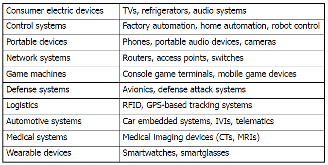
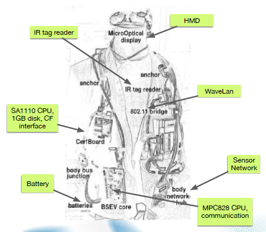
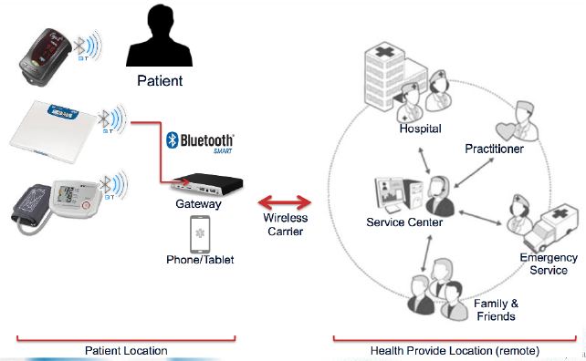
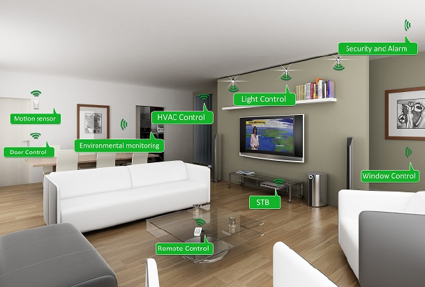
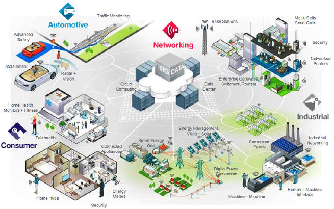
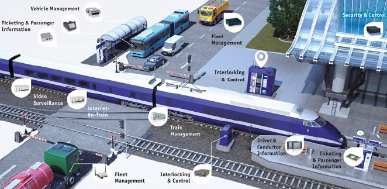
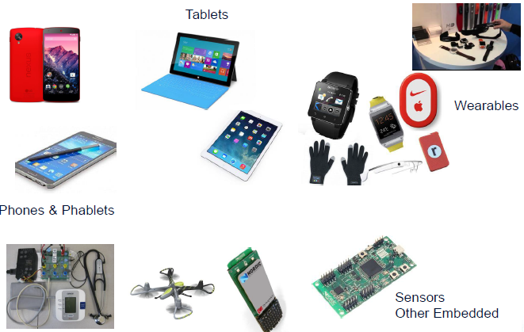

# Introduction of Embedded Systems

## Embedded Systems

- Traditional Definition
  - Systems with hardware and software for special-purposes with customized designs
  - Systems whose sub-components are CPUs, memory, I/O, and other specialized components with customized software stacks are running
- Convergence of GP(General Purpose) and embedded systems
  - The line between embedded systems and GP systems blurred
  - Issues shared between two platforms
    - Performance
    - Power consumption
    - Use of operating systems

## Apllications of Embedded Systems

### Portable Devices

- Portable information terminals
  - Simple voice communication devices :arrow_forward: **smart devices**
  - Architecture of **modern smart devices** resemble **GP computing systems**
  - Diverse smart devices are being converged into **one powerful smart phones**

### Avionics(항공 전자 공학)

- Aircraft
  - Safety critical, hard real-time system with **hundreds of control CPUs**
- Space Aircrafts
  - RTOS-based **mission critical** systems
  - Hard **real-time** multimedia systems

### Automotives

- Automotive Systems
  - Car embedded systems, self-driving cars, electric cars
  - Intelligent transportation systems

### Wearable Computer

### IoT Systems

- Connected Home
- Automotive
- Retail
- Transportation
- Logistics
- Energy / Utilities
- Building automation
- Industrial automation
- Law Enforcement
- Fitness

### Healthcare Example

### Home Networking with IoT

### IoT Practical Uses

### Other Practical Uses

### IoT Software Platforms

- IFTTT
  - Gives you creative control over the products and apps you love

### 

### IoT Hardware Platforms

### ARM-based Devices

## Characteristics

- Usually **lower performance** CPUs are used
- **Pre-determined** functionalities
- **Light**-weight and **low** power
- **Low cost**
- **Mission** critical
- Mostly **hard real-time**