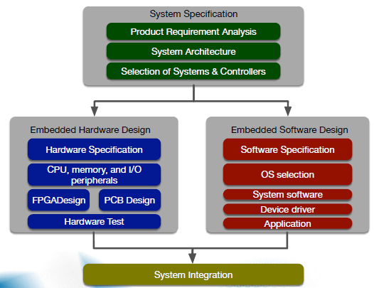
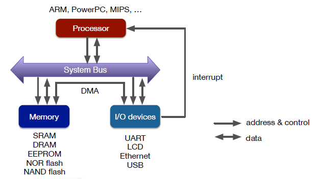
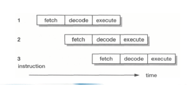

## Embedded Systems Design Workflow

- Step 1 : System specification
- Step 2 : Design two components : HW & SW
  - Can be performed in parallel
  - Room for optimization : effectively reduce the time to market
- Step 3 : System Integration
  - Combine both HW and SW
  - Often requires debugging
  - If necessary, go to **Step 1** to revise the system specification

### Schematic Design

- Schematic : A logical representation of the circuit
  - Make a logical connection among I/O pins
  - **No physical constraint** is considered

### PCB Design

- Physical level design
  - PCB : Printed Circuit Board
- Physical Constraints
  - Clearance between lines
  - Number of layers in the PCB
  - Timing constraints(High-speed circuit design)

### HW Assembly & Test

### HW Debugging

### Embedded SW Development

- Host System : The place where an embedded application SW is developed
- Target System
  - The system being developed
  - The place where an embedded app is running
- Connection
  - UART, ethernet, etc
  - Remote execution / debugging
- Cross compiler
  - Runs on host system
  - Generates binary executable on the target system

## Embedded HW Structure

### Processor Structure

- Components

  - Register
  - Arithmetic Logic Unit (ALU)
  - Control Unit (CU)
  - Processor Bus

  

#### Control Unit

#### Registers

- A small amount of storage as a part of a processor
  - Temporarily store input data and results
  - At the top of memory hierarchy
    - Faster than L1, L2 cache, and main memory
  - Flip-flop or latch is used
- Type of registers
  - General-Purpose registers : Used by programs for data processing
  - Control registers : Control processors and/or program execution flows
  - Status registers : Represent the processor status

#### ALU (Arithmetic Logic Unit)

- Arithmetic operations : add / subtract / multiply / divide

- Logical operations : and / or / xor/ 1's complement

- Bit shift operations : Arithmetic shift, Logical shift, Rotate

- Signals

  - Data

  - Opcode : Set by instruction decoder

  - Status : Carry-out / Zero / Negative / Overflow / Parity(even/odd)

    

#### Processor Bus

- Bus : A communication path to connect two or more devices on digital systems
- Internal Bus : A path between registers and an ALU
- External Bus : A path between a processor and external memory & I/O devices
  - Data bus : transfer data values between a processor and external memory & I/O devices
    					(bidirectional)
  - Address bus : send address values (unidirectional)
  - Control bus : send control signals to control various types of devices (unidirectional)

### Microprocessor vs. SoC

- Microprocessor
  - A single chip processor containing all CPU components
  - Registers, ALU, control units
  - L1 and L2 caches
- SoC (System on Chip)
  - A single chip containing various system components including a microprocessor

### Assembler and Machine Language

- Assembler
  - A computer program which translates assembly language to machine language format
  - Machine language : recognizable by the instruction decoder of a processor

#### Instruction Set Architecture (ISA)

- Structure of an instruction

  - Opcode(Operation code) : specifies the operation to perform

  - Operand : the object of the operation sepecified by opcode

    - Register value : values stored in a register
    - Memory value : values stored in external memory
    - Immediate value : values stored in the instruction itself

    

#### Instruction Pipelining

- Pipeline

  - Split each instruction into a sequence of steps

  - Execute different steps of different instructions concurrently and in parallel

  - Able to increase instruction throughput by increasing resource utilization in the processor

    

- Typical Processors

  

- ARM Processors

  

#### CISC vs. RISC

- CISC : **complex** instruction set computer
- RISC : **reduced** instruction set computer

#### Von-Neumann vs. Havard Architecture

- Von-Neumann architecture

  - Unified memory interface for both instruction and data
  - Cannot transfer instruction and data at the same time
  - ex) Intel CPUs, ARM7 CPU

  

- Havard architecture

  - Separated memory interfaces, one each for instruction and data
  - Able to transfer instruction and data at the same time
  - ex) ARM9, ARM10, XScale, etc.

  

  