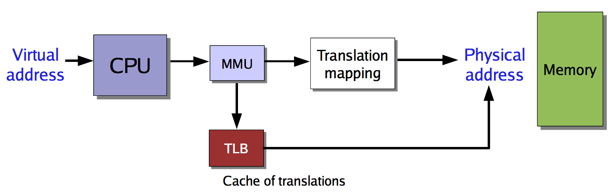

## Virtual Memory

### VM for Embedded Systems

- Virtual Memory
  - Not an issue for embedded systems
    - A single dedicated application without OS support
  - Things changed
    - Many of modern embedded systems rely on OS
- 자원(memory)을 요청하는 client가 많을 수 있다
- Virtual Memory로 인해 **실시간성**에 심각한 악영항을 끼친다

### Memory Management

- Goals

  - convenient abstraction for programming
  - provide isolation between different processes
  - allocate scarce physical memory resources across processes
    - especially important when memory is heavily contended for

- Mechanisms

  - virtual address translation
  - paging and TLBs
  - page table management

- Policies

  - page replacement policies

    

### Virtual Memory

- VM?
  - The basic abstraction provided by the OS for memory management
  - Enables programs to be executed without requiring their entire address space to be resident in physical memory
    - called "Demand Paging"
- Observation
  - Many programs don't use all of their code or data(효율적이지 못하다)
    - ex) branches never taken, variables never accessed
  - No need to allocate memory for it until it's used

- Functions
  - OS uses VM to adjust amount **of physical memory** allocated **to each process** based on its run-time behavior
  - VM also provides **isolation** among processes
    - 하드웨어의 도움을 많이 받음
  - Each process has its won isolated address space
  - One process cannot access memory addresses in others
- Implementation
  - HW support : address translation
    - MMU(Memory Management Unit), TLB(Translation Lookaside Buffer)
    - MMU가 없으면 virtual memory 구축안됨
    - 간단하고 빈도가 잦은 작업
  - OS support : mapping between **VA-to-PA**
    - Page fault handler, page table
    - handling하는 function 제공(CPU가 아닌 Software 영역)
    - 복잡하고 빈도가 낮은 작업

### Virtual Address(VA)

- VA : a memory address that a process uses to access its own memory
  - VA != PA(Physical Address)
  - PA = MMU(VA)
    - MMU가 VA를 받으면 PA로 바꿔준다
  - VA-to-PA mapping
    - Determined by OS

- 무조건 MMU를 통과해야함 : isolation이 가능한 이유

- Application Perspective

- Isolation
  - VA in one process refer to different physical memory than virtual addresses in another
    - Exception : **shared memory regions** between processes
- Relocation
  - A program does **not need to know which PA** it will use when it's run
  - Compilers generate relocatable code
    - 최종적으로 OS에서 프로세스를 실행시킬 때 주소가 정해진다

### MMU and TLB

- MMU

  - HW that translates a VA to a PA
  - PA = MMU(VA)

- TLB

  - Cache for MMU V-to-P address translations
  - locality 발생, 아주 작은 cache의 역할

  

### Paging

- Virtual memory is divided into fixed-size chunks called pages
- Physical memory is divided into page frames
  - Page to Frame mapping : MMU가 하는일
- 4 KB 

### Page Tables

