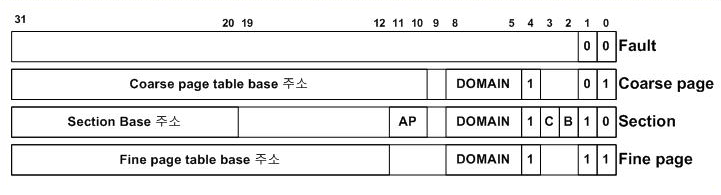

### ARM Processor Features

- Co-processor based additional features
  - Old original ARM cores have only MMU-less fixed point computation engines
  - Additional features including cache memory, MMU, write buffer, and TCM(Tightly-coupled memory) are supported as CO-PROCESSORS
  - All the additional features are configured through **Co-processor 15**

### ARM Core and Memory Architecture

  

- IVA(Virtual) ---- MMU > IPA(Physical)

### ARM Processor Configuration

- CP15 is used for configuration and control
  - Cache, MMU or MPU, Endian
- Co-processor setting
  - Co-processor setting is possible only through MRC or MCR instructions (Transfers data from general registers to CP15 registers)

### Representative CP15 Registers

- Lockdown 이용시 Cache/TLB의 특정 entry 묶어놓기 가능
  - 실시간성 향상

### Cache Memory

- Cache memory fills the speed gap between CPU and Memory
- Cache configurations
  - Direct mapped, set associative, fully associative
  - Cache line size
- Performance factors
  - Cache hit (miss) ratio

#### Direct-Mapped Cache

- 구현이 간단하지만 효율이 떨어짐

#### Set-Associative Cache

- 효율은 올라가지만 구현이 복잡하고 힘들다

#### Write Buffer

- To overcome the speed gap during writing from CPU to memory

- CPU completes writing operation through writing to write buffer before reaching actual main memory

  
  - CPU 입장에서 Write 작업은 Non-Blocking
    - Write Buffer에게 명령하고 다른 작업 가능
  - CPU 입장에서 Read 작업은 Blocking

#### Special Cache Control

- Cache flush
  - Cleans up cache contents to fetch new data from memory
  - Needed at context switch
- Cache lockdown
  - Prevents certain cache lines from being replaced

### Page sizes in ARM

- Section
  - 1 MB page
  - 관리하기 가장 간단함
  - [19:0] 이 offset, [31:20]이 index
    - 1 GB space에 총 4096개의 section($2^{12}$)이 존재
  - 책의 사이즈 = 16 KB (4 small pages) : 책의 정보 저장
    - translation table base address(start address) : register에 기록
    - 해당 register로 접근(MMU에서)
    - user process 별로 테이블이 하나씩 있어야 한다
- Tiny page
  - 1 KB page
- Small page
  - 4 KB range - typical page size
- Large page
  - 64 KB page

#### Address Translation

- 정상적인 경우(Section에 속하는 주소일 경우), Entry의 PFN을 따라가면 원하는 페이지가 나온다
  - 하위 두 비트가 10
- VPN을 따라간 결과 Page Table Entry가 **비어있는 경우**, Page Fault Exception 발생
  - 하위 두 비트가 00
- 위 그림에서 `0x004` entry의 경우 VPN을 따라갔더니 Fine page table base 주소가 나옴
  - 해당 주소를 따라가면, 주소에 해당하는 다른 Page Table로 가진다
  - Fine : 1024 page 짜리 + 하위 두 비트가 11
  - Coarse : 256 page 짜리 + 하위 두 비트가 01

#### Level 1 Descriptor

- Coarse page table : max 256 entries(256 * 4B = 1 KB)
  - Split **1MB space** into 256 x 4KB(small page) or 16 x 64KB(large page)
    - 후자의 경우 16 entry만 사용하기 때문에 large page는 비효율적인 편이다
  - 처음 4096 페이지 -> MSB 12비트 확인하고 coarse page table로 넘어오고
    - 그 다음 MSB 8비트로 어떤 entry인지 확인하고 translation, 남은 12비트는 offset
  - 총 20 비트를 확인해야되는데, 처음부터 20비트를 인덱스로 활용하지 않는 이유는 비효율적이기 때문이다(안 쓴 페이지가 너무 많아질 수 있기 때문) -> On demand(효율적)
- Fine page table : max 1024 entries(1024 * 4B = 4KB)
  - Split **1MB space** into 1024 x 1KB(tiny page)

- Coarse page table base 주소 : 1KB이기때문에 10개 비트가 추가로 필요하다(1MB 중)
- Fine page table base 주소 : 4KB이기 때문에 8개 비트가 추가로 필요하다(1MB 중)

#### Level 2 Descriptor

- LSB 2비트
  - 00 : Page Fault
  - 01 : Large Page(64KB)
  - 10 : Small Page(4KB)
  - 11 : Tiny Page(1KB)

### Caching and Write Buffer Control

- Caching or write buffring can be configrued for each section/page
  - Cacehable bit
  - Bufferable bit
- When a page needs to be configured as NON-CACHEABLE/NON-BUFFERABLE
  - I/O Device

- How to control in page table

  

### First-Level Translation

### Section Translation Sequence

### Small Page Translation

