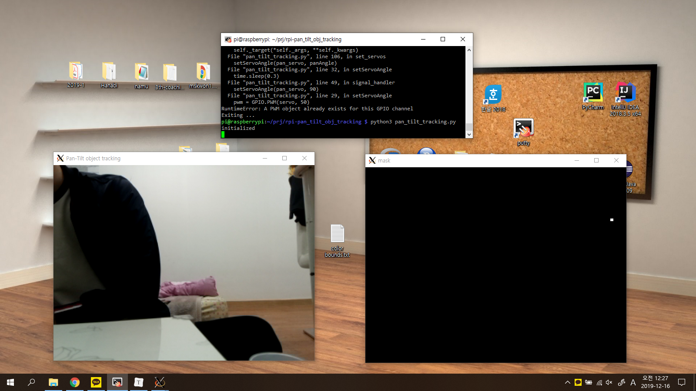
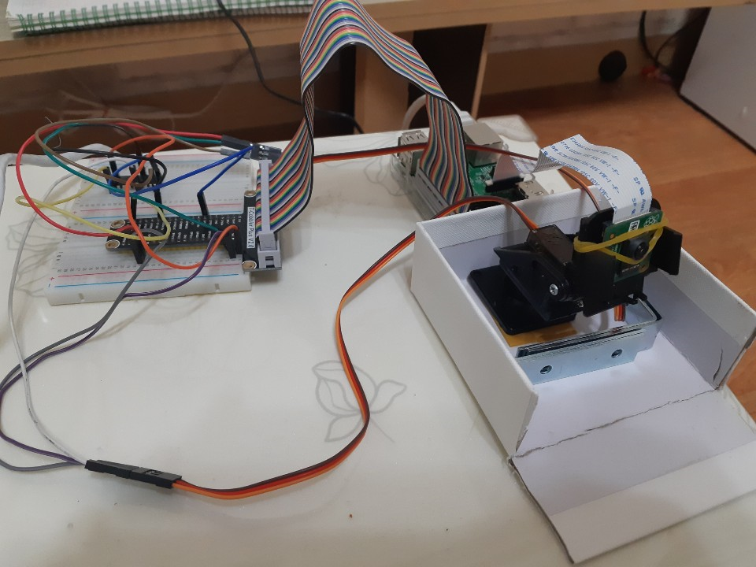

# Object Tracking with RPi

2019-2 Embedded Systems Design Project - 20142697 권민수

### 작품 설명

- 사전에 정해놓은 색깔의 원 모양 오브젝트를 Pan&Tilt Servo를 활용해서 추적합니다

### 회로 NetList

~~~
RPi 5.5V ------ TD62783APG VCC
RPi 5.5V ------ MG-90S(Pan) VCC
RPi 5.5V ------ MG-90S(Tilt) VCC 
RPi GND ------ TD62783APG GND
RPi GND ------ MG-90S(Pan) GND 
RPi GND ------ MG-90S(Tilt) GND 
RPi GPIO5 - TD62783APG I4 - TD62783APG O4 - MG-90S(Pan) PWM input  
RPi GPIO27 - TD62783APG I1 - TD62783APG O1 - MG-90S(Tilt) PWM input  
~~~

### 소스코드

`objcenter.py` 
: 주어진 영상에서 정의된 색깔범위의 원 모양 오브젝트를 검출하고, 중심점과 반지름을 return 한다 

~~~python
import imutils
import cv2

# 검출할 물체의 최소 반지름
MIN_RADIUS = 20
class ObjCenter:

    def __init__(self):
        print("initialized")

    def update(self, frame, frameCenter):
        # 물체 색깔 범위
        colorLower = (50, 100, 0)
        colorUpper = (70, 255, 100)

        hsv = cv2.cvtColor(frame, cv2.COLOR_BGR2HSV)

        mask = cv2.inRange(hsv, colorLower, colorUpper)
        mask = cv2.erode(mask, None, iterations=2)
        mask = cv2.dilate(mask, None, iterations=2)
        # 마스크 영상
        cv2.imshow('mask', mask)

        cnts = cv2.findContours(mask.copy(), cv2.RETR_EXTERNAL, 
                                				cv2.CHAIN_APPROX_SIMPLE)[-2]
        center = None

        # 원이 있으면
        if len(cnts) > 0:
            # 가장 큰 원 검출
            c = max(cnts, key=cv2.contourArea)
            ((x,y), radius) = cv2.minEnclosingCircle(c)
            M = cv2.moments(c)
            center = (int(M["m10"]/M["m00"]), int(M["m01"] / M["m00"]))
			
            # 검출한 원의 반지름 길이 테스트, 통과하면 리턴
            if radius > MIN_RADIUS:
                return ((int(x), int(y)), radius)

        # 원이 없으면 영상 중심, None 반환
        return(frameCenter, None)
~~~

`pid.py`
: pid 컨트롤을 위한 클래스

~~~python
import time

class PID:
    def __init__(self, kP=1, kI=0, kD=0):
        self.kP = kP
        self.kI = kI
        self.kD = kD

    def initialize(self):
        # init current / previous time
        self.currTime = time.time()
        self.prevTime = self.currTime
        
        # init previous error
        self.prevError = 0

        # init term result variables
        self.cP = 0
        self.cI = 0
        self.cD = 0

    def update(self, error, sleep=0.3):
        time.sleep(sleep)
        
        # record current time, calculate delta time
        self.currTime = time.time()
        deltaTime = self.currTime - self.prevTime

        deltaError = error - self.prevError

        # update P, I, D terms
        self.cP = error
        self.cI += error * deltaTime
        self.cD = (deltaError / deltaTime) if deltaTime > 0 else 0

        # record time / error
        self.prevtime = self.currTime
        self.prevError = error

        # sum the terms & return
        return sum([
            self.kP * self.cP,
            self.kI * self.cI,
            self.kD * self.cD])
~~~

`pan_tilt_tracking.py`
: object tracking을 진행하는 main 프로그램

~~~python
from multiprocessing import Manager
from multiprocessing import Process
from imutils.video import VideoStream
from objcenter import ObjCenter
from pid import PID
import argparse
import signal
import time
import sys
import cv2
import imutils
import RPi.GPIO as GPIO

servoRange = (45, 135)
pan_servo = 5
tilt_servo = 27

prev_angle_pan = 90
prev_angle_tilt = 90

GPIO.setwarnings(False)
GPIO.setmode(GPIO.BCM)

# 서보의 angle을 바꿀 함수
def setServoAngle(servo, angle):
    global prev_angle_pan
    global prev_angle_tilt
    
    if servo == pan_servo:
        # servo shaking 현상 방지... 너무 작은 변화는 무시한다
        if abs(prev_angle_pan-angle)>1:
            pwm = GPIO.PWM(servo, 50)
            pwm.start(angle/18 + 3)
            prev_angle_pan = angle
            time.sleep(0.3)
            pwm.stop()
        else:
            time.sleep(0.5)
    if servo == tilt_servo:
        if abs(prev_angle_tilt-angle)>1:
            pwm = GPIO.PWM(servo, 50)
            pwm.start(angle/18 + 3)
            prev_angle_tilt = angle
            time.sleep(0.3)
            pwm.stop()
        else:
            time.sleep(0.5)

# Ctrl+C 에 반응
def signal_handler(sig, frame):
    print("Exiting ...")

    setServoAngle(pan_servo, 90)
    setServoAngle(tilt_servo, 90)

    sys.exit()

# 검출된 원을 보여주는 영상을 출력
def obj_center(objX, objY, centerX, centerY):
    signal.signal(signal.SIGINT, signal_handler)

    vs = VideoStream(usePiCamera=True).start()
    time.sleep(1)

    obj = ObjCenter()

    while True:
        frame = vs.read()
        frame = imutils.resize(frame, width=600)
        frame = cv2.flip(frame,0)

        (H, W) = frame.shape[:2]
        centerX.value = W // 2
        centerY.value = H // 2

        objectLoc = obj.update(frame, (centerX.value, centerY.value))
        ((objX.value, objY.value), radius) = objectLoc

        if radius is not None:
            cv2.circle(frame, (objX.value, objY.value), int(radius), (0,255,255),2)
            cv2.circle(frame, (objX.value, objY.value), 5, (0,0,255), -1)

        cv2.imshow("Pan-Tilt object tracking", frame)
        cv2.waitKey(1)

# PID 값 계산 / 업데이트 
def pid_process(output, p, i, d, objCoord, centerCoord):
    signal.signal(signal.SIGINT, signal_handler)

    p = PID(p.value, i.value, d.value)
    p.initialize()

    while True:
        error = centerCoord.value - objCoord.value
        output.value = p.update(error)

def in_range(val, start, end):
    return (val >= start and val <= end)

# 각각의 servo angle set
def set_servos(pan, tilt):
    signal.signal(signal.SIGINT, signal_handler)

    while True:
        panAngle = 90 - pan.value
        tiltAngle = 90 - tilt.value        
        
        if in_range(panAngle, servoRange[0], servoRange[1]):
            setServoAngle(pan_servo, panAngle)
       
        if in_range(tiltAngle, servoRange[0], servoRange[1]):
            setServoAngle(tilt_servo, tiltAngle)

if __name__ == "__main__":
    with Manager() as manager:
        GPIO.setup(pan_servo, GPIO.OUT)
        GPIO.setup(tilt_servo, GPIO.OUT)

        centerX = manager.Value("i", 0)
        centerY = manager.Value("i", 0)

        objX = manager.Value("i", 0)
        objY = manager.Value("i", 0)

        pan = manager.Value("i", 0)
        tilt = manager.Value("i", 0)

        panP = manager.Value("f", 0.05)
        panI = manager.Value("f", 0.001)
        panD = manager.Value("f", 0.002)

        tiltP = manager.Value("f", 0.05)
        tiltI = manager.Value("f", 0.001)
        tiltD = manager.Value("f", 0.002)

        processObjectCenter = Process(target=obj_center, 
                                      args=(objX, objY, centerX, centerY))
        processPanning = Process(target=pid_process, 
                                 args=(pan, panP, panI, panD, objX, centerX))
        processTilting = Process(target=pid_process, 
                                 args=(tilt, tiltP, tiltI, tiltD, objY, centerY))
        processSetServos = Process(target=set_servos, 
                                   args=(pan,tilt))

        processObjectCenter.start()
        processPanning.start()
        processTilting.start()
        processSetServos.start()

        processObjectCenter.join()
        processPanning.join()
        processTilting.join()
        processSetServos.join()
        
        GPIO.cleanup()
~~~

### 구현결과물 사진

- 노트북 시점

- 라즈베리파이

### 시연 동영상 링크

​	https://youtu.be/zACtpjioETc

### 구현 결과물 공개 동의여부

본인은 2019년도 2학기 임베디드시스템설계 교과목 기말프로젝트 구현 결과물(코드, 시연 동영상 포함)을 다음과 같은 목적으로 공개하는데 동의합니다. (        )   동의하지 않습니다. (    O    )

- 차기 연도 수업 참고자료 & 교안개발 활용
- 소프트웨어학부 수행 교육사업(SW중심대학 사업, 4차산업혁신선도대학 사업 등)의 
  성과 홍보자료 활용