# 영상처리

## 디지털 영상이란?

### 획득과 표현

- 사람의 눈과 카메라 
  
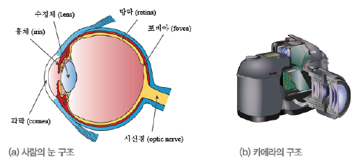
  
  - 수정체가 렌즈, 망막이 CCD 센서(필름)에 해당함
  
- 눈

  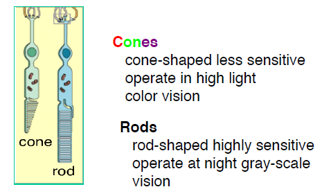

  - Cones : High Light color vision에서 작동
    - 덜 예민함
    - 3가지 종류이 Cone이 있음 : Red Green Blue
      - 특정 종류의 Cone이 없거나 적은사람이 **색맹**
  - Rods : night gray-scale vision에서 작동
    - 많이 예민함
  - 눈으로 모든 빛을 다 볼 수는 없음
    - **가시광선**만 볼 수 있음
    - Human Luminance Sensitivity Function

#### Photon's life cycle

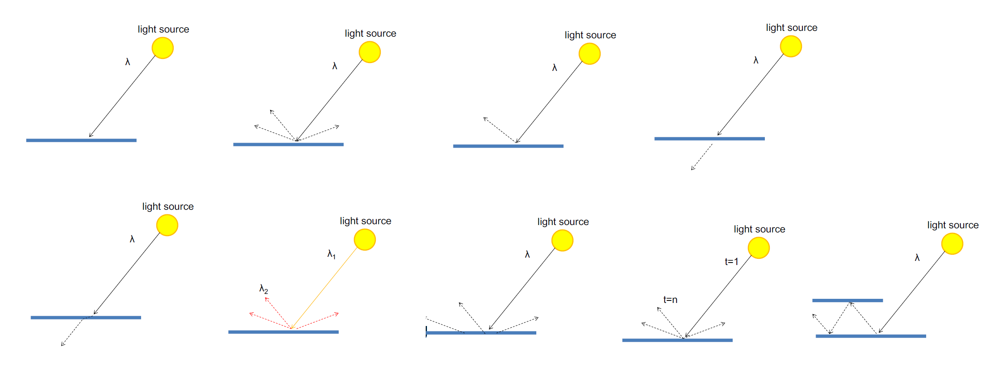

- Absorption(흡수)
- Diffuse Reflection(확산)
- Specular Reflection(**받은만큼** 돌려줌, 카메라)
- Transparency(투명해서 **투과**함, 유리)
- Refraction(투과해서 나가지만, **굴절**이 됨)
- Fluorescence(빛이 **여러 방향**으로 반사되어 나감, 반사 전/후의 **빛의 양이 다름**)
- Subsurface Scattering(여러 방향으로 **흩뿌려짐**)
- Phosphorescence(일정 **시간이 지난 후** 빛이 나옴)
- Interreflection(두 개의 물질이 평행하게 있는 경우 계속 **상호 반사**, **광통신**에서 사용)

#### Image Formation

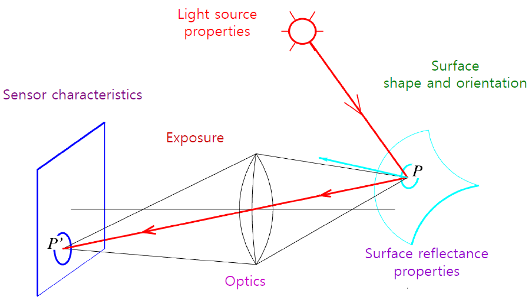

#### Fundamental Radiometic Relation

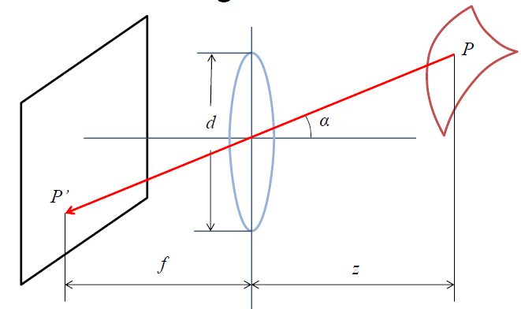

- f : 초점거리, **focal length**

  - **멀면 멀수록** 원하는 데이터를 잘 표현할 수 있음
  - 카메라를 만드는 업체에서 **정할 수 있음**
  - 전문가 카메라가 큰 이유 : f값이 크기 때문에 **사물을 더욱 정확하게 표현할 수 있음**

- d : 렌즈의 **길이**

  - 카메라를 만드는 업체에서 **정할 수 있음**

- z : 카메라 **렌즈로부터 물체까지의 거리**

- L : P에서 P'로 발사되는 **빛의 양**

- E : 렌즈에서 P'로 떨어지는 **방사 조도(Irradiance)**

  - image irradinace is **linearly related to scene radiance**
  - **proportional to the area of the lens** and **inversely proportional to the squared distance between the lens and the image plane**
  - falls off as the **angle between the viewing ray and the optical axis increases**(각도에 반비례)

  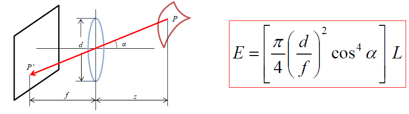

#### From light rays to **pixel values**

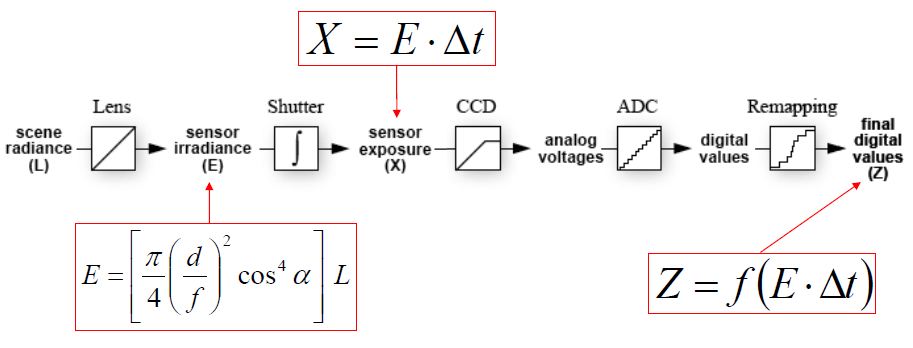

- Camera's response function (irradiance -> pixel values)
  - material properties를 추측할 때 유용
  - high dynamic range 이미지를 만들 수 있게 해줌
- 하나의 **CMOS 센서** : 1바이트 값(0~**255**)을 표현할 수 있도록 돼 있음
  - 원래는 1바이트지만 JPEG / JPG 등의 **압축이 많이 된 형태는 더욱 용량이 작게 저장**

#### Perspective Projection

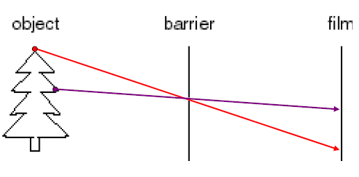

- 3차원에서 2차원으로 옮기는 작업 : **거리감각이 없어지기 때문에 힘듬**

  - 카메라의 단점
  - **평행한 것이 평행하지 않아 보임**
  
- Matrix

  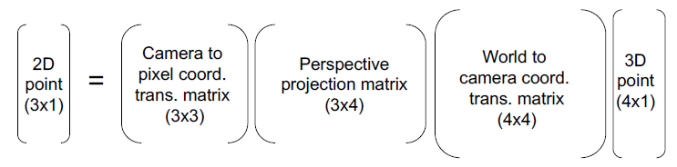

#### Modeling Projection

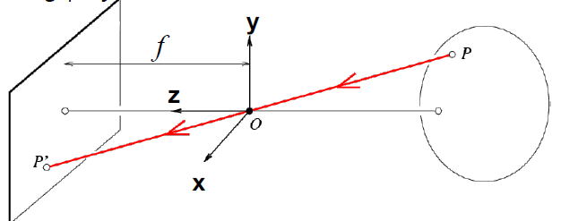

- 3차원 공간에서의 **P** -> 2차원 영상 평명(image plane)에서의 **P'**

- P와 P'의 상관관계

  - O가 3차원 공간상의 원점(**카메라 렌즈의 중심**)

  - Projection Equations

    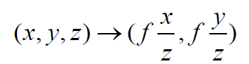
    
    - 사물이 **가까워야 잘 보인다**
    - **f에 비례**하고, **z에 반비례** 한다

- Projection of a line

  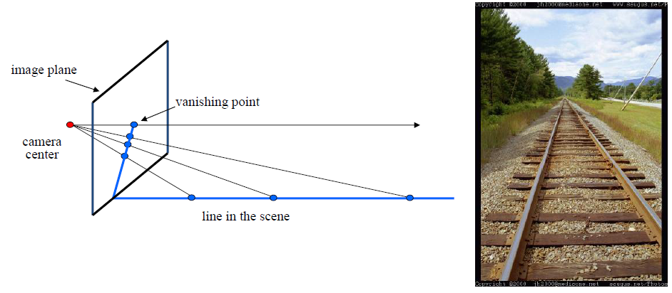

  - 영상 평면을 기준으로 **사선으로 맺히기 때문에(Vanishing Point)**, 
    실제로는 평행하지만 평행하지 않게 보이는 것

- The horizon

  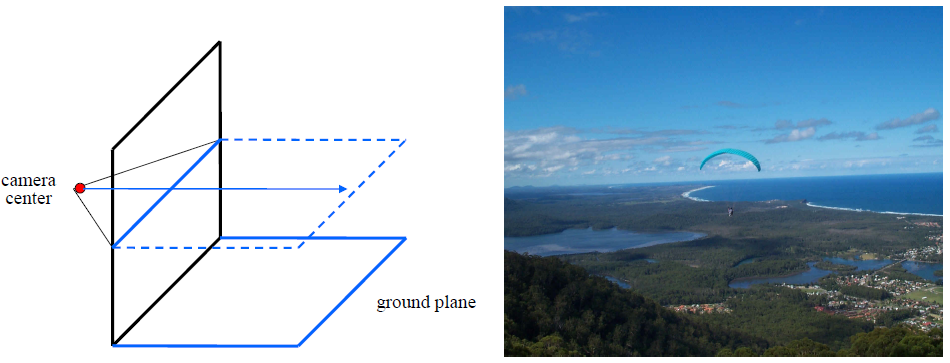

  - 실제의 수직선과 똑같이 **평행**하게 찍으면 **Vanishing Point가 없다**

- The perspective cues

  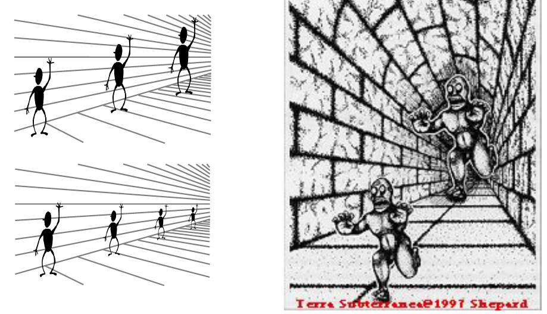

  - Perspective에 대한 정보 때문에, 실제로는 크기가 같지만 뒤의 그림이 더 커보인다(**원근감** 때문) 

#### 샘플링과 양자화

- 2차원 영상 공간을 M(width)*N(height)으로 샘플링 (**M\*N이 '해상도**')
- 명암을 **L 단계**로 양자화 (L이 **명암 단계**, 0~L-1 사이 분포)

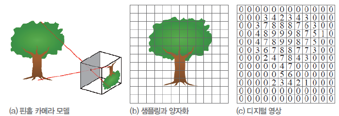

- M = 12, N = 12, L = 10

#### 영상 좌표계

- 화소 **위치는 x = (j,i)** 또는 x = (y,x)로 표기 

- 영상은 f(x) 또는 f(j,i), 0<=j<=M-1, 0<=j<=N-1로 표기

  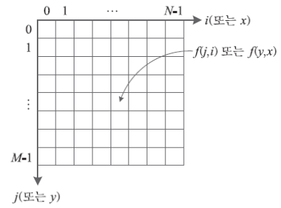

- 컬러 영상은 **fr(x), fg(x), fb(x)**의 세 채널로 구성

- 왼쪽 맨위가 원점인 이유 : **2차원 배열로 표현했을 때를 생각**

#### 영상 표시 방법

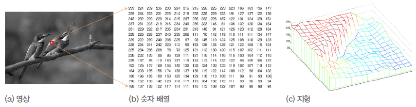

