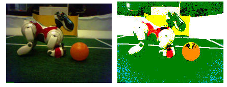

# Color

- Result of interaction between physical light in the environment and our visual system
- Psychological property of our visual experiences when we look at objects and lights, not a physical property of those objects or lights

- Checker Shadow Illusion

  

  - Possible Explanations
    - Simultaneous contrast
    - Reflectance edges **VS** Illumination edges

- There is no simple functional description for 
  the perceived color of all lights under all viewing conditions

  - Helpful Constraint : Consider only physical spectra with normal distributions

    

    

    

    

- The Physics of Light

  - Example of the reflectance spectra of surfaces

    

## The Eye

- Ratio of **L** to **M** to **S** cones : Approx. **10:5:1**
- Almost no S cones in the center of the fovea

## Linear Color Spaces

- How to compute the weights of the primaries to match any spectral signal?

  - Given : A choice of **three primaries** and a **target color signal**

  - Find : **Weights of the primaries** needed to match the color signal

    

- Also need to specify **matching functions**

  - The amount of each primary needed to 
    match a monochromatic(단색의) light source at each wavelength

    

- RGB 모델

  - 길이가 1인 정육면체로 색을 표현

    

  - 영상 표현

    

- HSI 모델

  - 이중 콘으로 색을 표현

    

## Nonlinear Color Spaces : HSV

- Perceptually meaningful dimensions : **H**ue, **S**aturation, **V**alue(Intensity)

- RGB cube on its vertex(꼭지점)

  

## 컬러 영상 처리

- 가장 단순한 방법 : 세 채널을 독립적으로 처리

  

  

## Uses of Color in CV

- Color histograms for **image matching**

  

- Multicolr

  

- Image Segmentation

  

- Skin Detection

  

- Robot Soccer

  

- 　

  