## 스케일에 불변한 특징점 검출

- 거리에 따른 스케일 변화

  - 멀면 작고 윤곽만 어렴풋이 보이다가, 가까워지면 커지면서 세세한 부분 보임

  - 사람은 강인하게 대처하는데, 컴퓨터 비전도 대처 가능한가

    

### Types of Invariance

- Illumination

  

- Scale

  

- Rotation

  

- Affine

  

### SIFT(Scale Invariant Feature Transform)

- An algorithm in computer vision to detect and describe local features in image. The features are invariant to image scaling, rotation, affine, occlusion and illumination. Application include object recognition, image stitching and matching, and video tracking, and so on

  

#### SIFT MATCHING : APPLICATION

- 파노라마 영상 만들기
  
  - image matching 필요
  
- **특징점 매칭**
  
  
  
  - **각각의 영상으로부터 특징점 검출**
  - 영상들 간 **corresponding pairs**를 찾음
  - 영상들을 **align** 시킴
  
- Problem 1

  - 각 영상으로부터 똑같은 특징점을 찾아야 함

    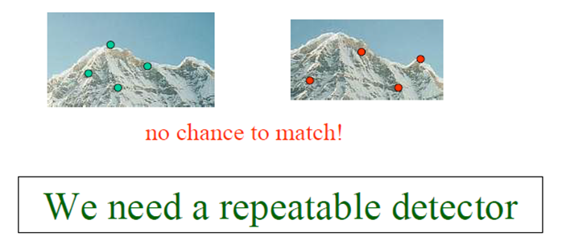

- Problem 2

  - 어떻게 똑같은 특징점들을 비교하여 매칭할 것인가
  
    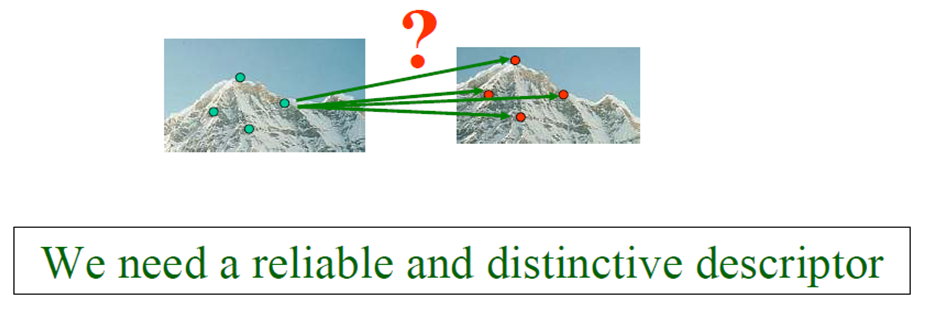

#### SIFT : ALGORITHM

1. Find interest points or **"keypoints"**
2. Find their **dominant orientation**
3. Compute their **descriptor**
4. **Match** them on other images

### 스케일 공간

- 다중 스케일 영상을 구현하는 두 가지 방식

  - 가우시안 스무딩 : 스케일에 해당하는 $\sigma$가 연속 공간에 정의

    - 주변의 명암값과 확실한 차이가 있는 곳이 keypoint

    

  - 피라미드 : $\frac{1}{2}$씩 줄어드므로 이산적인 단점

    - 처리시간이 많이 걸린다

    

- 가우시안 스무딩에 의한 스케일 공간

  - 스케일 축을 추가한 3차원 공간
  - 스무딩을 심하게 해도 잘 남아있는 특징을 찾는다

  
  
- $t$ 축에서 지역 극점 탐색

  - $t$ 축을 따라 **정규 라플라시안** 측정해 보면, 극점 발생함

    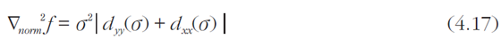

  - 실험에 따르면 $t$축에서 정규 라플라시안이 가장 안정적으로 극점 생성

  - 극점의 $\sigma$값은 물체의 스케일에 해당

  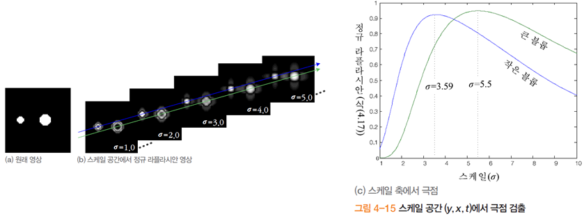

### 해리스 라플라스 특징 검출

- $(y,x,t)$의 3차원 공간에서 어떻게 극점을 찾을 것인가?

  - 그림 4-15는 $(y,x)$를 알고 있는 상황

- 해리스 라플라스의 전략

  - 영상 공간 $(y,x)$과 스케일 축 $t$ 각각에서 잘 작동하는 식을 사용

    - 영상 공간에서는 해리스의 식 (4.9)를 사용
    - 스케일 축에서는 정규 라플라시안(식 (4.17)) 사용

  - 해리스의 식을 다중 스케일로 확장

    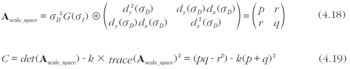

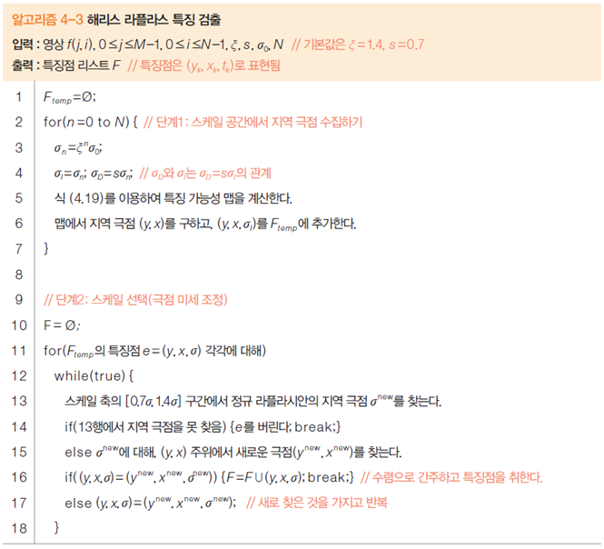

### SIFT 검출

- SIFT의 등장
  - David Lowe 교수의 논문 (1999)
  - 성능이 뛰어나 현재 가장 널리 사용, 다양한 변형 개발

- SIFT의 스케일 공간

  - **피라미드 + 가우시안** 구조
  - 각 층은 여섯 영상의 묶음(옥타브)로 구성
  - 옥타브의 영상은 $\sigma_i$로 스무딩
    - $\sigma_{i+1} = k\sigma _i (\sigma_0 = 1.6, k = 2^{1/3})$

- 정규 라플라시안 맵 구축

  - [Mikolajczik2002a]의 실험 결과에 따르면, 정규 라플라시안이 가장 안정적으로 극점 형성

  - 정규 라플라시안과 유사한 DOG 계산으로 대치

    - DOG는 단지 차영상을 계산하므로 매우 빠름

      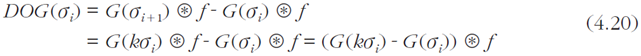

      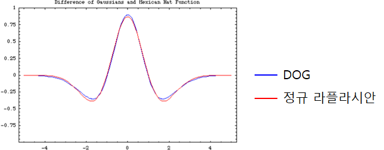

- 특징점 (키포인트) 검출

  - 한 옥타브에는 다섯 장의 DOG 영상
  - 중간에 끼인 세 장의 DOG 맵에서 **극점** 검출
    - 주위 26개 이웃에 대해 최저 또는 최대인 점
  - 검출된 극점을 키포인트라 부름

  

- 위치와 스케일 계산

  - 키포인트는 $<y,x,o,i>$ 정보를 가짐 (옥타브 $o$의 $i$번째 DOG 영상의 $(y,x)$에서 검출)

  - 미세 조정 (부분 화소 정밀도)를 거쳐 $<y',x',o,i'>$로 변환됨

  - 위치와 스케일 계산 식 적용

    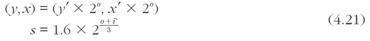

- 공개 소프트웨어

  - David Lowe, Rob Hess, Andrea Vedaldi, OpenCV

#### SIFT : algorithm

- keypoints are taken as maxima/minima of a **DoG pyramid**

  

  - 옥타브 : 영상 크기가 달라짐
  - 가우시안 영상 간 명암차이가 있는 영역들을 뽑아보겠다(Difference of Gaussian)

- Scale selection(T. Lindeberg)

  - In the absence of other evidence, assume that a scale level, at which some (possibly non-linear) combination of normalized derivatives assumes a local maximum over scales, can be treated as reflecting a characteristics length of a corresponding structure in the data

  

- Difference of Gaussian

  - Approximation of Laplcian of Gaussian

    

- DoG pyramid is simple to compute

  

- Scale space images

  

- DoG images

  

  - 밝게 나오는 값 : 위에서 아래로 뺐을때 +값이 나온 것
  - 어둡게 나오는 값 : 위에서 아래로 뺐을때 - 값이 나온 것

- Finding extrema

  - sample point is selected only if it is a minimum or a maximum of these points

    

  - then we just find **neighborhood extrema** in this **3D DoG Space**

    

    - If a pixel is an extrema in its neighboring region he becomes a **candidate keypoint**
    - 스케일의 변화가 있더라도 일정하게 똑같이 결과가 나오는 것들

- Too many keypoints

  

  - remove low contrast

  - remove edges

    

  - 피라미드를 옥타브에 따라 만들고, 옥타브마다 sigma값을 조정한 영상들을 만들어 DoG를 구한다

- Each selected keypoint is assigned to oone or more dominant orientations. 
  This step is important to achieve rotation invariance

  - How? : Using the DoG Pyramid to achieve scale invariance

    - compute image gradient magnitude and orientation

    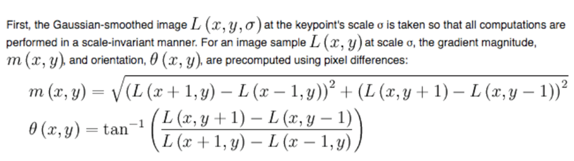

    - build an orientation histogram

    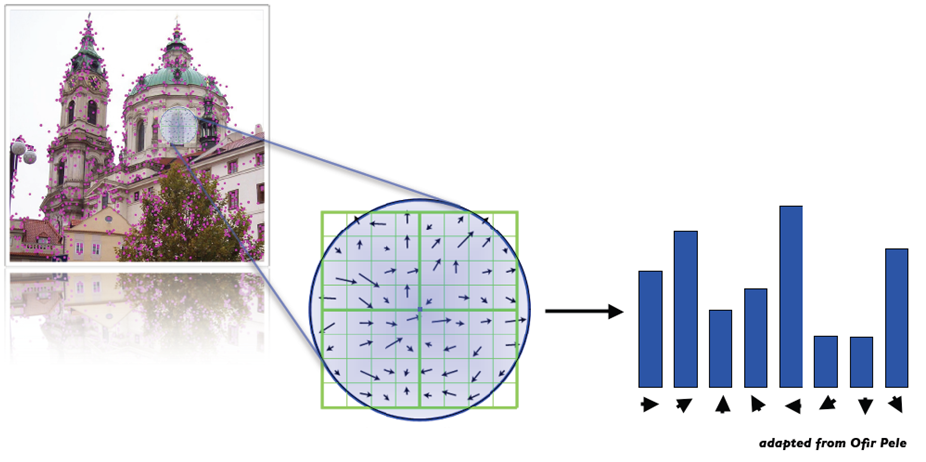

    - keypoint's orientation(s) = peak(s)

    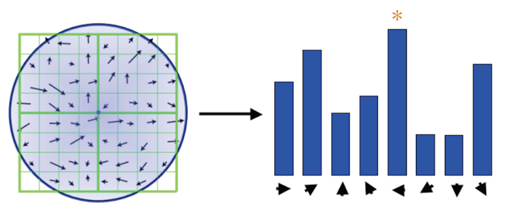

- SIFT descriptor = a set of orientation histograms

  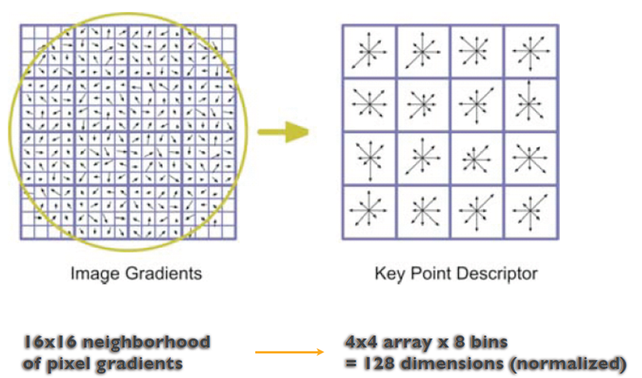

### SURF 검출

- SURF

  - 반복률 희생 없이 SIFT보다 빠른 알고리즘 추구

  - 헤시안의 행렬식 이용

    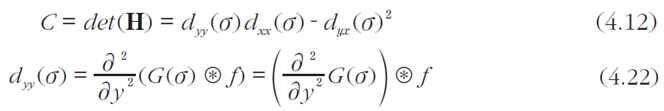

  - 행렬식을 빠르게 계산하기 위해 $d_{yy}, d_{xx}, d_{yx}$를 9*9 마스크로 **근사** 계산

    - 마스크 계산은 적분 영상 이용

    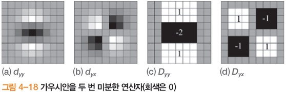

- SURF의 스케일 공간

  - 원본 영상은 그대로 둔 채 다중 스케일 마스크를 적용

    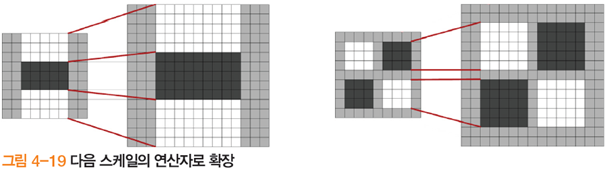

  - 옥타브 구성
    - 첫 번째 옥타브 9*9, 15\*15, 21\*21, 27\*27 마스크 적용 (6씩 증가)
    - 두 번째 옥타브 15\*15, 27\*27, 39\*39, 51*51
      - 첫 번째 옥타브의 두 번째 마스크 15*15에서 시작하고 6의 두 배인 12씩 증가
    - 세 번째 옥타브 27*27, 51\*51, 75\*75, 99\*99
      - 두 번째 옥타브의 두 번째 마스크 27*27에서 시작하고 12의 두 배인 24씩 증가
  - SIFT는 단일 스케일 연산자를 다중 스케일 영상에 적용
    SURF는 단일 스케일 영상에 다중 스케일 연산자를 적용

- 지역 극점 검출

  - 첫 번째 옥타브에서 중간에 끼인 15\*15와 21*21에서 지역 극점 검출
  - 두 번째 옥타브에서 중간에 끼인 27*27과 39\*39에서 지역 극점 검출
  - ...

  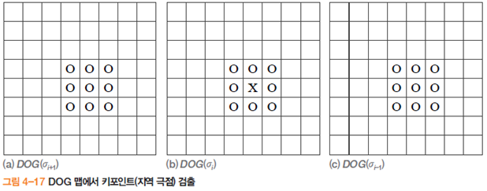