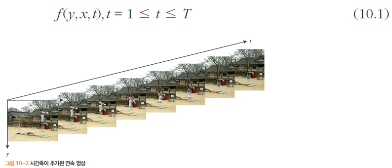

# 모션

- 동적 비전
  - 움직이는 세상에서 획득한 여러 장의 영상을 대상으로 정보를 알아내는 기능
  - 응용 예 : 감시용 카메라, 스포츠 중계, 자율 주행 차량, 로봇 항해, 게임 등

## 움직이는 상황

- 동적 비전이 처리하는 연속 영상(동영상)

  - 시간 축 샘플링 비율

    - 보통 30 프레임 / 초 (30 fps)
    - 특수한 경우, 수천 프레임/초 또는 60 프레임/시

    

- 네 가지 상황

  - 정지 카메라와 정지 장면
    - 정지 영상 한 장이 주어진 상황으로서 앞 장에서 공부한 내용
  - 정지 카메라와 동적 장면
    - 동적 비전에서 다루는 문제 중 가장 단순한 경우로
    - 많은 연구를 수행하여 성공적인 알고리즘이 가장 많은 편
    - 과속 단속 또는 주차 관리용 카메라나 감시용 카메라 등은 대부분 고정되어 있으므로 
      이 상황에 해당
  - 동적 카메라와 정적 장면
    - 불법 주차되어 있는 차량을 찍고 다니는 단속용 차량이 이 경우에 해당

  - 동적 카메라와 동적 장면
    - 가장 복잡한 경우
    - 항해하는 로봇, 자율주행 자동차, 스포츠 중계 등
    - 스스로 방향과 줌을 조절할 수 있는 능동비전 기능을 가진 감시용 카메라 포함

- 알아내야 할 정보

  - 물체가 움직이는 방향과 속도

  - 물체에 대한 행위 인식

    (사람은 의도까지 추론, 언제쯤 컴퓨터 비전이 거기에 도달할 수 있을까?)

- 동적 비전의 기술 난이도

  

- 연속 영상 처리 알고리즘

  - 알고리즘 10-1은 시간 일관성을 이용하지 않아 비효율적

    

- 영상 **일관성**(중요)

  - 공간 일관성 : 이웃 화소, $f(y,x,t)$와 $f(y+\triangle y, x+\triangle x, t)$는 비슷할 가능성이 높음
  - 시간 일관성 : 이웃 프레임, $f(y,x,t)$와 $f(y,x,t+\triangle t)$는 비슷할 가능성 높음

###  차 영상

- 차 영상 : 인접한 영상의 차

  - $t$는 현재 프레임이고 $r$은 기준 프레임

    ($r$은 $t-1$ 또는 물체가 나타나기 이전의 초기 배경 영상)

    

    또는

    

    - 신경 안써도 되는 수식임

    

  - 오차가 있을 수 있다

    - 바람
    - 조명
    - 센서 내부의 노이즈

- 차 영상을 이용한 움직임 추출 알고리즘

  - 배경과 물체의 색상에 큰 변화가 없는 상황에서만 동작

    예) 공장의 벨트 컨베이어, 조명이 고정된 실내 등

    

### 모션 필드

- 3차원 모션 벡터 $v_3$를 복원할 수 있을까?

  - 불가능 <- 수없이 많은 3차원 벡터가 2차원의 동일한 벡터로 투영되는데, 주어진 정보는 2차원

  - 3차원 복원을 위해선 시점이 다른 **여러 대의 카메라**를 사용해야 함

    

- 2차원 모션 벡터 추정

  - 대부분 연구는 두 장의 이웃 영상에서 2차원 모션 벡터를 추정하는 일로 국한

- 모션 필드 추정이 근본적으로 어려운 상황

  

## 광류

- 광류는 모션 필드의 근사 추정치

  - 광류 알고리즘은 모든 화소의 **모션 벡터** $\bold{v}=(v,u)$를 추정해야 함

  - 숫자로 구성된 영상에서 어떻게 모션 벡터를 추정하나?

    

    - 주변에 있는 값들도 같이 움직였다는 가정?

### 광류 추정의 원리

- 어려움

  - 수백 * 수백 이상 크기의 256 명암 영상
  - 여러 기하 변환과 광도 변환, 잡음 발생
  - 움직이는 물체와 정지한 물체가 혼재하고 움직임 도중에 가림도 발생

- 현실을 적절히 표현하는 모델 필요

  - 실제 세계를 훼손하지 않는 범위 내에서 적절한 가정 필요
  - **밝기 향상성** : 물체의 같은 점은 다음 영상에서 같은 (유사한) 명암 값을 가져야 함
    - 현실에 정확히 들어맞지 않지만, 
      실험 결과에 따르면 받아들일 수 있을 정도의 오차 범위 이내

- 테일러 급수에 따르면

  

  - 두 영상 사이의 시간 차이 $dt$가 작다고 가정하고 2차 이상의 항은 무시

  - 밝기 향상성 가정에 따라 $f(y+\triangle y, x + \triangle x, t + \triangle t)$를 대입하면

    

    

- 정리해보면,

  

  - 이 식을 **광류 조건식**(그레이디언트 조건식) 이라 부름
  - 미분을 이용한 광류 추정 알고리즘 (Lucas-Kanade 알고리즘, Horn-Schunck 알고리즘 등)은 대부분 이 식을 이용
  - 그레이디언트를 구성하는 세 항의 값을 알아도 $v$와 $u$를 유일한 값으로 결정 불가능
    - (하나의 방정식에 두 개의 미지수) -> 추가적인 가정 필요

### 광류 추정 알고리즘

- Lucas-Kanade 알고리즘 [Lucas84]

  - **화소 (y,x)를 중심으로 하는 윈도우의 영역 N(y,x)의 광류는 같다**라는 가정

    

  - 식으로 쓰면,

    

  - 행렬 형태로 바꾸어 쓰면

    

    - $\bold{v}$로 정리하면,

      

    - 행렬의 원소가 나타나도록 쓰면,

      

  - 가우시안 스무딩 항을 추가하면

    

    - 행렬의 원소가 나타나도록 풀어 쓰면

      

  

  - 특성

    - 이웃 영역만 보는 지역적 알고리즘
      - 윈도우의 크기 중요
        클수록 큰 움직임을 알아낼 수 있지만 스무딩 효과로 모션 벡터의 정확성 낮아짐
      - 해결책으로 피라미드 활용하는 기법 [Bouguet2000]
    - 명암 변화가 적은 물체 내부에 0인 벡터 발생

    

    - 명압값이 적으면 알아내기 힘들다(Optical Flow가 잘 작동 안함)

- Horn-Schunck 알고리즘 [Horn81]

  - **광류는 부드러워야 한다**는 가정

  - 그림의 상황에서 HS 알고리즘은 왼쪽 선호

    

  - 부드러운 정도를 식으로 쓰면,

    - 값이 작을수록 부드러움

      

  - 두 가지 목적을 동시에 만족

    - 식 (10.6)을 0에 가깝게 하면서 식 (10.11)을 될 수 있는 한 작게 함

      - 두 번째 항은 **정규화 항**
      - 정규화 기법 : 정규화 항을 이용하여 부드러운 해를 구하는 방법

    - $\alpha$는 어느 것에 비중을 둘 지 결정하는 매개변수 ($\alpha$가 클수록 부드러운 광류 맵)

      

  - 식 (10.12)의 최적해를 구하는 반복식

    

    

- 기타 광류 추정 알고리즘

  - Lucas-Kanade는 지역적, Horn-Schunck는 전역적 알고리즘
    - LK는 값이 정해지지 않은 곳이 군데군데 발생 (명암 변화가 적은 데에서 심함)
    - HS는 번복 과정에서 값이 파급되어 밀집된 광류 맵 생성
    - 정확도 면에서는 LK가 뛰어남
  - 두 알고리즘의 장점을 결합한 아이디어 [Bruhn2005]
  - 제곱 항을 절대값으로 대치하여 물체 경계선이 불분명한 단점을 극복 [Zach2007]

- 미분 이외의 방법

  - 다양한 방법 비교분석 
  - MRF
  - 그래프 절단
  - 학습 기반 필터 설계

### 광류의 활용

- 시간이라는 축을 하나 둬서 연속적으로 들어오는 영상에 대해서의 차이를 잘 표현하는 방법 : Optical Flow Algorithm