# Segmentation

- 사람 뇌의 영상 분할

  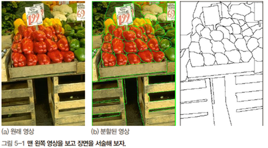

  - 분할과 인식이 동시에 일어남

- 컴퓨터 비전
  - 현재는 분할 후 인식하는 순차 처리(동시 수행을 추구하는 연구도 있으나 초보 단계)
  - 가장 어려운 문제 중 하나

## 영상 분할의 원리

- 분할의 정의

  - 식 (5.1)은 엄밀성보다는 개념적인 정의

    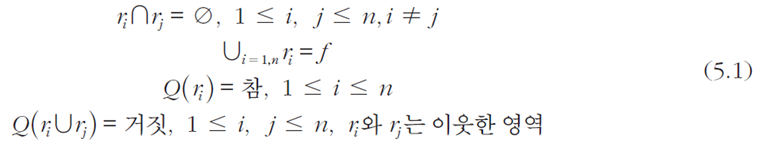

    - 모든 픽셀은 각각의 집합에 속하되, 교집합은 없어야 하며 모든 집합의 합집합이 원래 영상

- 생각해 볼 점

  - 적절한 분할이란?
    - 저분할 : 비교적 크게 쪼개는 것
    - 고분할 : 매우 잘게 쪼개는 것
  - 사람 vs. 컴퓨터
    - 사람은 선택적 주의집중과 능동 비전 기능을 가지며, 분할 과정에서 고급 지식 사용
      -> 물체 모델, 지식, 의도 등
    - 컴퓨터 비전은 그런 수준에 이르지 못함
      -> **분할이 끝나야만 고급 지식을 이용하여 인식을 수행**

- 분할의 어려움

  - 이웃 화소 몇 개를 보고 자신이 영역의 내부인지 경계인지 판단할 수 있을까?
    -> 전역 연산 필요성

    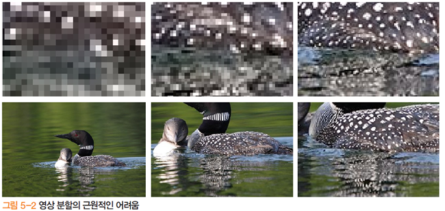

- 에지 VS 영역

  - 개념적으로 에지는 영역의 경계에 해당
  - 하지만 에지 검출로는 한계
    - 거짓 긍정, 거짓 부정 :arrow_forward: 폐곡선을 이루지 못함

- 영역 VS 지역 특징

  - 사람은 지역 특징보다 영역분할에 훨씬 뛰어남
  - 반면 컴퓨터비전은 영역보다 지역 특징으로 문제 해결하는 사례가 많음

## 전통적 방법

- 동작 조건

  - 특수 조건 만족하거나 단순한 영상에서만 작동

    - ex) 공장 자동화, 문서 인식 등

    - 문제가 쉽다면 굳이 복잡한 알고리즘 쓸 필요 없음

  - 자연 영상에서 매우 낮은 성능

### 임계화를 이용한 영역 분할

- 이진화를 이용한 영역 분할

  - 문서 영상의 경우 오츄 이진화는 훌륭한 영상 분할 알고리즘
  - 하지만 명암단계가 둘 이상인 경우는 오작동

- 삼진화로 확장

  - 이중 임계값 사용

    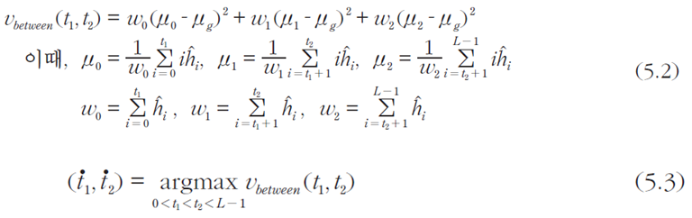

  - 원리는 오츄랑 똑같음 (분산값 이용)

  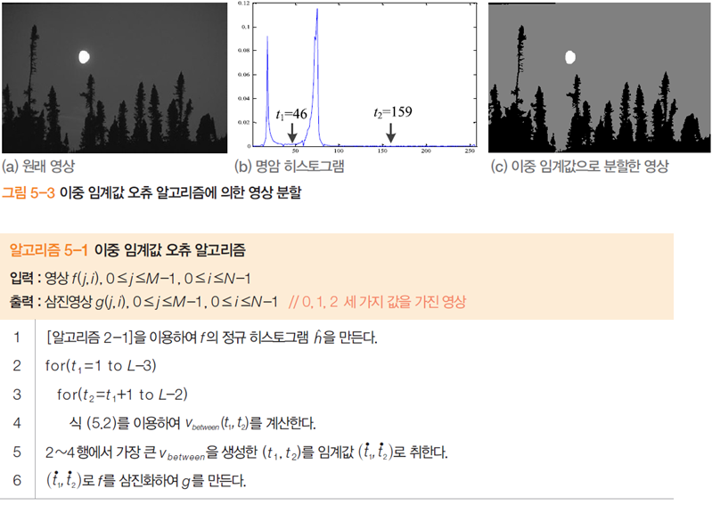

- 적응적 임계화

  - 하나 또는 두 개의 임계값을 영상 전체에 적용하는 전역 방법의 한계

    - 지역적으로 명암 분포가 다른 경우 낮은 분할 품질

      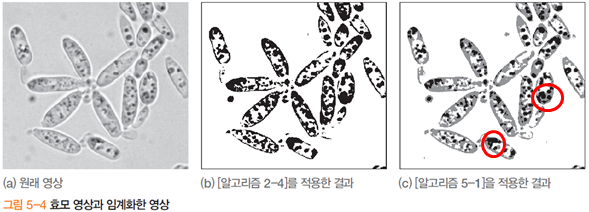

  - 적응적 임계화로 해결 : 지역에 따라 적응적으로 임계값 결정

    - $t(j,i)$를 어떻게 결정할까?

      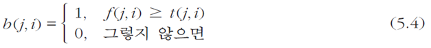

  - 의료 영상 부분에서 많이 쓰인다

### 군집화를 이용한 영역 분할

- K-means(k 개의 cluster로 분할)

  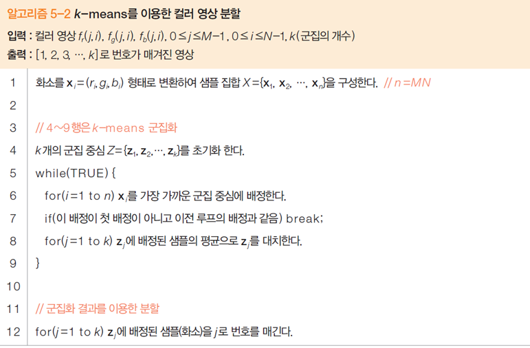

  - 랜덤하게 k 개의 군집중심을 뽑고,
    다른 화소들을 제일 가까운 군집중심으로 배정한 뒤,
    군집별로 평균값을 구하고 중심을 움직이는 과정 반복(군집중심의 변화가 거의 없을때까지)

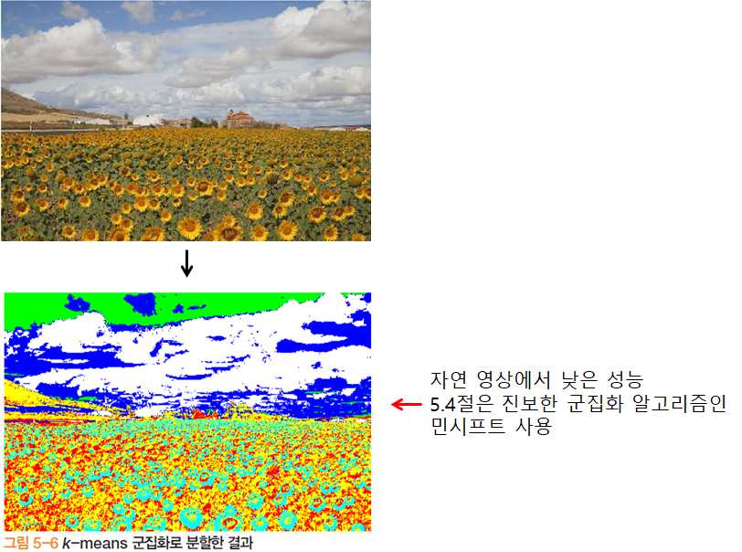

### 분할 합병

- 세그멘테이션 영역을 어떻게 잘 **표현**할 수 있을까? - Divide and Conquer

- 원리

  - 영역의 균일성을 측정하는 $Q(r_i)$를 이용하여 분할과 합병을 반복

    - $Q(r_i)$이 거짓이면 $r_i$를 네 개 영역으로 등분하고 재귀 반복
    - $Q(r_i \cup r_j)$가 참이면 $r_i$과 $r_j$를 합병

  - 분할 결과는 4진 트리로 표현

    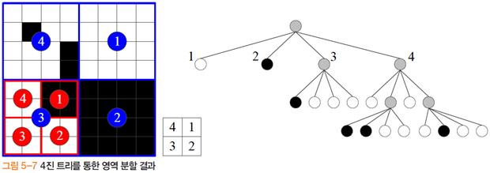

    - 흰색 영역 : 다 흰색
    - 회색 영역 : 흰색 + 검은색 :arrow_forward: 하위 트리로 내려가서 더 분할해야 함
    - 검은색 영역 : 다 검은색

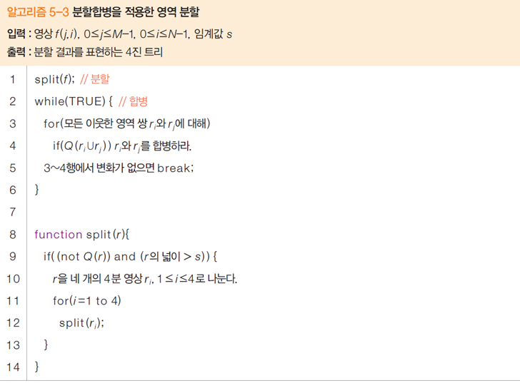

## 그래프 방법

- 가장 많이 쓰이는 방법

- 그래프

  - $G = (V,E)$

  - 노드 집합 $V = \{v_1, v_2, ..., v_n\}$

    - 화소 또는 슈퍼 화소가 노드

  - 에지 집합 $E$

    - 이웃 노드 간에 에지 설정

    - 두 노드 $v_p$와 $v_q$를 연결하는 에지는 가중치 $w_{pq}$를 가짐

    - 가중치는 유사도(같은 정도) 또는 거리(다른 정도)로 측정

      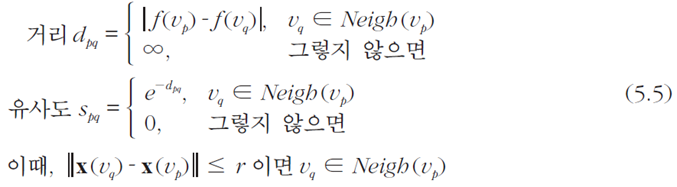

  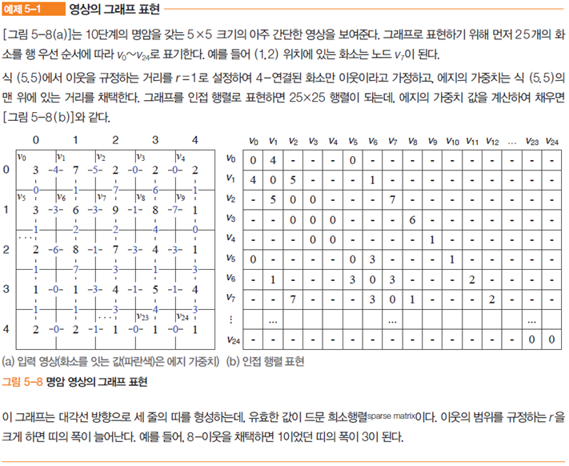

  - 희소 행렬(Sparse Matrix) : 대부분의 값이 NULL

- 원리
  - 유사도가 높은 노드 쌍은 같은 영역(연결요소), 낮은 노드 쌍은 다른 영역에 배치
  - 유사도 낮은 에지가 분할선이 될 가능성 높음
  - '가능성이 높다'라는 표현의 중요성
    - 지역적으로 유사도 낮더라도 전역적 판단에서 
      자르지 말아야 한다면 분할선으로 취하지 않음 -> 전역 최적해 추구
- 전역 최적화 문제의 구현
  1. 어떤 분할의 좋은 정도를 측정하는 목적 함수 -> **분할 품질** 관련
  2. 목적 함수를 최대화/최소화하는 최적해를 찾는 효율적인 탐색 알고리즘 -> **속도** 관련

## 워터셰드

- 워터셰드란?

  - 워터셰드 (분수계) : 빗물이 안쪽과 바깥쪽 중 하나로 흐를 수 있는 점(붉은 선)
  - 유역 : 같은 호수로 빗물이 모이는 점들의 집합

  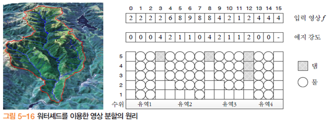

  - 3,8,12는 워터셰드, 1~2, 4~7, 9~11, 13~14는 유역

- 영상 분할에 적용

  - 에지 강도 맵의 워터셰드는 두 영역을 가르는 경계에 해당
  - 에지 강도 맵에서 워터셰드를 어떻게 찾을 것인가

- 댐 건설 방법

  - 영상 분할 = 에지 강도 맵에서 워터셰드를 찾는 과정 -> 댐 건설 방법

  - 댐 = 워터셰드 = 영상 분할 경계면

    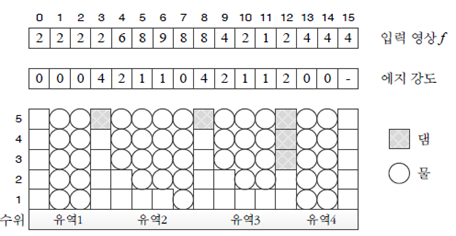

  - 그림[5-16]에서 물을 주입하면 수위1에 물이 고인다 -> 유역 1,2,4에 호수 생성
  - 물을 더 넣어 수위 2까지 채우면 -> 유역 3에 호수 생성
  - 수위가 3이 되면 -> 유역 3과 4가 범람해 합쳐짐 -> 댐이 필요
  - 수위가 5가 되면 -> 유역 1과 2, 유역 2와 3, 유역 3과 4가 범람 -> 각각 댐이 필요
  - 그리고 최고 수위가 되므로 알고리즘 스탑
  - 댐을 많이 세워야 한다 : 구분이 어렵다
  - 댐을 적게 세워도 된다 : 구분이 쉽다

## 알고리즘 선택

- 어떤 알고리즘을 선택해야 하는가
  - 뚜렷한 가이드라인 없음
  - 자신의 응용 환경에서 성능 실험하여 알아냄
- 선택을 도우려는 노력 : 데이터베이스
  - UC 버클리, 바이츠만 연구소
- 선택을 도우려는 노력 : 성능 분석
  - 성능 측정 방법
  - 성능 벤치마킹
- 표준 데이터베이스가 있어 좋지만, 주의할 점도 있다!
  - 데이터베이스에 집착하여 과적합 문제를 야기할 수 있음
  - 즉, 일반화 능력이 낮은 알고리즘을 낳을 수도 있기 때문에 주의해야 함
  - 이러한 문제를 해결하는 한 방법으로 데이터베이스의 크기를 꾸준히 키워나가는 중